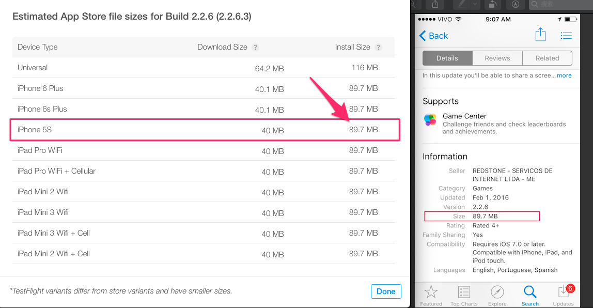
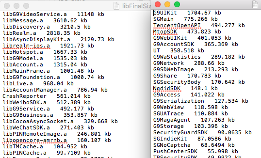
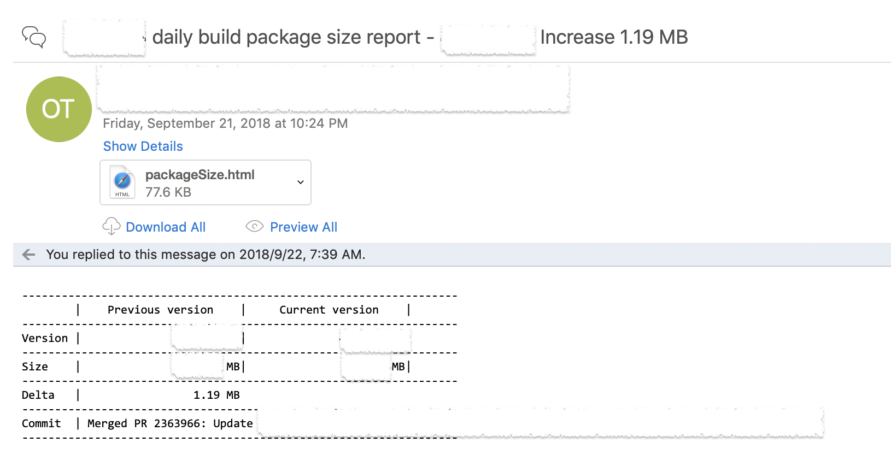

原文链接：[App thinning checklist](https://oldoldb.com/2019/01/09/App-thinning-checklist/)。本文针对该文章，做了部分精简。

1. 语言Swift，故有Swift 8MB问题
2. 使用Pods管理，倾向使用静态库，非动态库

## size过大问题：

1. 非wifi下，appstore规定下载上限为150MB，超过只能在wifi环境中下载。
2. 依据[Google play]( https://medium.com/googleplaydev/shrinking-apks-growing-installs-5d3fcba23ce2)的数据，app包大小每增加6MB，就会降低1%的下载量。

## 测量方法：

###### 1. 大小定义：

1. 下载大小：这是无线下载时app的压缩大小。也是要优化的部分。
2. 安装大小：这是app占用用户设备的磁盘空间大小。也是用户在App Store上看到的大小。

	
	
###### 2. 检测大小：检查ipa文件确认其中的每个条目的压缩大小。

``unzip -lv {app}.ipa``
	
###### 3. 可执行文件检测：通过[Leverage LinkMap](https://github.com/kobe1941/shell)主exe文件的组成

	

###### 4. 监控每日构建app大小的变化

  可以将包大小报告功能集成到CI中，自动生成报告和邮件警报。
	
  
	
	
## 降低方案：

###### 1. 代码分析：

1. 确保Xcode中build setting个别条目配置正确：

	|Key|Value|
	|:--:|:--:|
	|Optimization Level| Fastest, Smallest|
	|Deployment Postprocessing|YES|
	|Strip linked Product|YES|
	|Symbols Hidden by default|YES|
	|Make Strings Read-only|YES|
	
2. [查找并移除不用的类class](https://github.com/tsabend/fus)。
3. [查找并移除不用的代码片段code](https://medium.com/@gabriel_lewis/how-to-easily-find-unused-swift-code-in-xcode-159631961acf)。

###### 2. assets分析：

1. [查找并移除不用的assets](https://github.com/tinymind/LSUnusedResources)
2. [查找并移除重复的文件](https://github.com/adrianlopezroche/fdupes)
3. 移除多余不用动字体文件
4. 将按需资源（ODR）迁移至cloud。
5. 压缩资源：[Image](https://imageoptim.com/mac)，[Video&Audio](https://ffmpeg.org/)等。

###### 3. 依赖项分析

1. [将pods管理的动态库转至静态库](https://recoursive.com/2018/06/06/static_libraries_cocoapods/)
2. 确保依赖项在release下正确构建，确保资源正确的压缩
3. 移除不需要的依赖项。

######  TODO：有一些潜在的优化方法需要更多实践，需评估其可行性

1. 以8bitpng图片替换32bit的。
2. 使用内联代码替换小图像
3. 压缩JS/html资源
4. 移除重复的strings
5. 关闭Xcode中`C++/Object-C异常支持`

