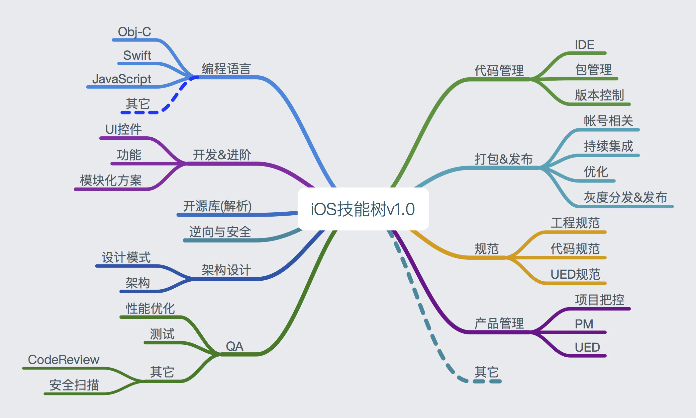

# Mac_iOS_NoteBook
Mac&amp;iOS开发笔记汇总

## 提要
* 倾力构建一套完善的Mac&iOS知识体系，旨在使开发技能的`梳理`和`获取`井然有序，系统化。

## 花名册

| 开发人员 | 站点| 其它 |
|--- | --- | --- |
|[pan zhow]()| IT互联网自习室(公众号)| [github](https://github.com/PanZhow) |
| [GoodbyeCain]() | .|[github](https://github.com/GoodbyeCain) |

## 贡献方式

1. 搜索并添加微信（chowpan），入伙花名册，一起完善该手册。
2. `pull request` 足下高作至[开发笔记Github](https://github.com/PanZhow/Mac_iOS_NoteBook)。

	> 1. Master分支锁定
	> 2. 提交至Dev分支
	> 3. review 、 合并操作 
	
3. 想得到的其它任意途径均可。

## 文章来源及格式

### Ⅰ. 投递来源

1. 自己原创。
2. 技术网站、公众号、简书、各大博客等优质文章均可。

### Ⅱ. 投递格式

1. Markdown格式的文章（推荐）。
	
	> 文章头部标有作者信息（姓名、微信、简书、公众号等）
	
2. 直接以文章外接、或者其它任意方式投递均可。

附：因文章入库格式为markdown，故而推荐。若含有图片等资源，最好以单一文件夹的方式管理。
	

## 手册大纲

## 总目录：

* [概述]()
* [编程语言](编程语言/index.md)
    * [Obj-C](编程语言/Obj-C/index.md)
    * [Swift](编程语言/Swift/index.md)
    * [JavaScript](编程语言/JavaScript/index.md)
    * [其它](编程语言/其它/index.md)

-----
* [开发&进阶](开发&进阶/index.md)
    * [UI控件](开发&进阶/UI控件/index.md)
    * [功能](开发&进阶/功能/index.md)
    * [模块化方案](开发&进阶/模块化方案/index.md)
    * [填坑笔记](开发&进阶/填坑笔记/index.md)

-----
* [开源库](开源库/index.md)

-----
* [逆向与安全](逆向与安全/index.md)
    * [工具](逆向与安全/工具/index.md)

-----
* [架构设计](架构设计/index.md)
    * [设计模式](架构设计/设计模式/index.md)
    * [架构](架构设计/架构/index.md)

-----
* [QA](QA/index.md)
    * [性能优化](QA/性能优化/index.md)
    * [测试](QA/测试/index.md)
    * [其它](QA/其它/index.md)

-----
* [代码管理](代码管理/index.md)
    * [IDE](代码管理/IDE/index.md)
    * [包管理](代码管理/包管理/index.md)
    * [版本控制](代码管理/版本控制/index.md)

-----
* [打包&发布](打包&发布/index.md)
    * [帐号相关](打包&发布/帐号相关/index.md)
    * [持续集成](打包&发布/持续集成/index.md)
    * [优化](打包&发布/优化/index.md)
    * [灰度分发&发布](打包&发布/灰度分发&发布/index.md)
    
-----
* [规范](规范/index.md)
    * [工程规范](规范/工程规范/index.md)
    * [代码规范](规范/代码规范/index.md)
    * [UED规范](规范/UED规范/index.md)
    * [CodeReview规范](规范/CodeReview规范/index.md)

-----
* [产品管理](产品管理/index.md)
    * [项目把控](产品管理/项目把控/index.md)
    * [PM](产品管理/PM/index.md)
    * [UED](产品管理/UED/index.md)

-----
* [其它](其它/index.md)

