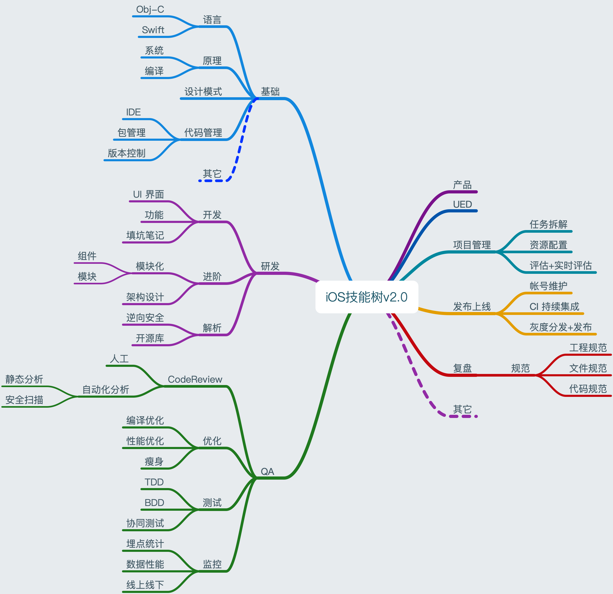

# Mac_iOS_NoteBook
Mac&amp;iOS开发笔记汇总

## 提要 
* 倾力构建一套完善的Mac&iOS知识体系，旨在使开发技能的`梳理`和`获取`井然有序，系统化。

## 花名册

| 开发人员 | 站点| 其它 |
|--- | --- | --- |
|[pan zhow]()| IT互联网自习室(公众号)| [github](https://github.com/PanZhow) |
| [GoodbyeCain]() | .|[github](https://github.com/GoodbyeCain) |

## 贡献方式

1. 搜索并添加微信（chowpan），入伙花名册，一起完善该手册。
2. `pull request` 足下高作至[开发笔记Github](https://github.com/PanZhow/Mac_iOS_NoteBook)。

	> 1. Master分支锁定
	> 2. 提交至Dev分支
	> 3. review 、 合并操作 
	
3. 想得到的其它任意途径均可。

## 文章来源及格式

### Ⅰ. 投递来源

1. 自己原创。
2. 技术网站、公众号、简书、各大博客等优质文章均可。

### Ⅱ. 投递格式

1. Markdown格式的文章（推荐）。
	
	> 文章头部标有作者信息（姓名、微信、简书、公众号等）
	
2. 直接以文章外接、或者其它任意方式投递均可。

附：因文章入库格式为markdown，故而推荐。若含有图片等资源，最好以单一文件夹的方式管理。
	

## 手册大纲

## 总目录：

见上述导图

