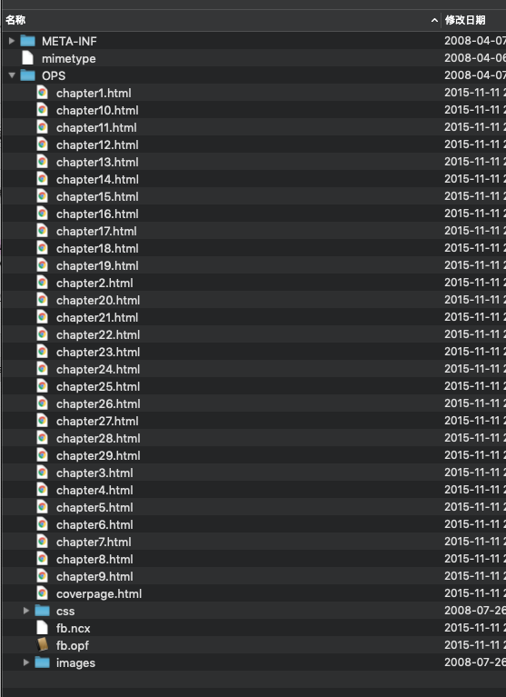
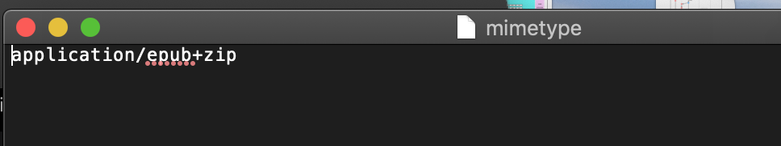
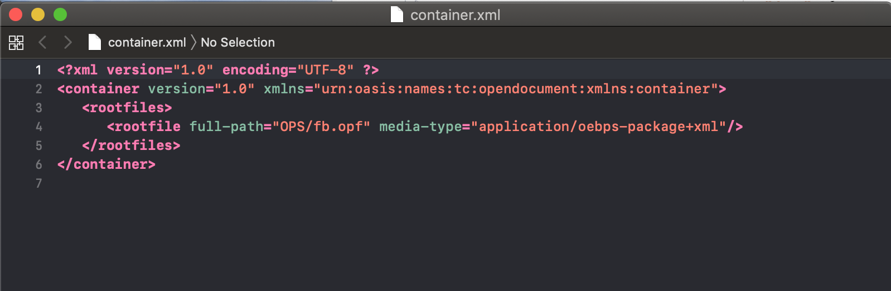
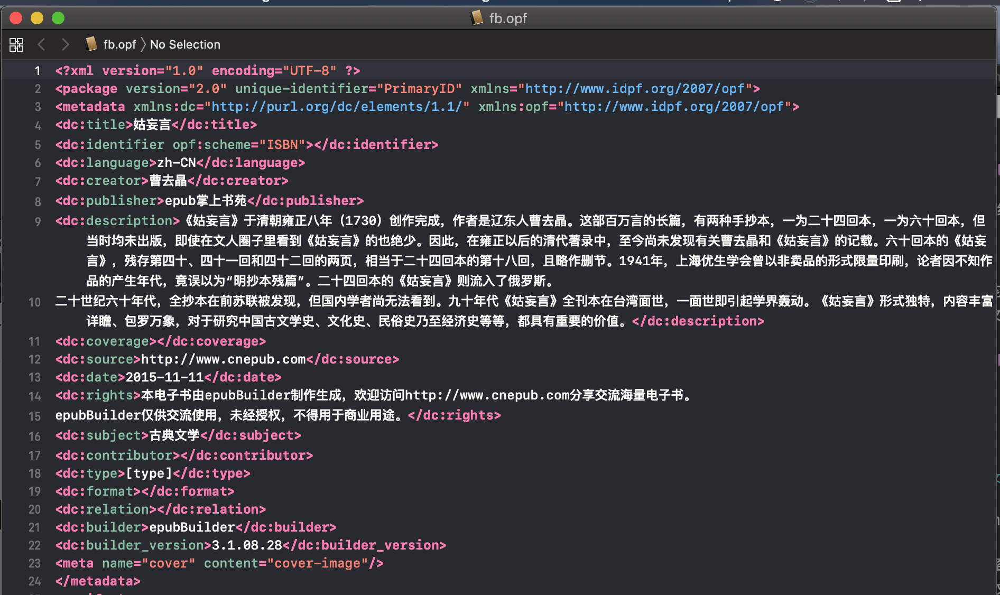
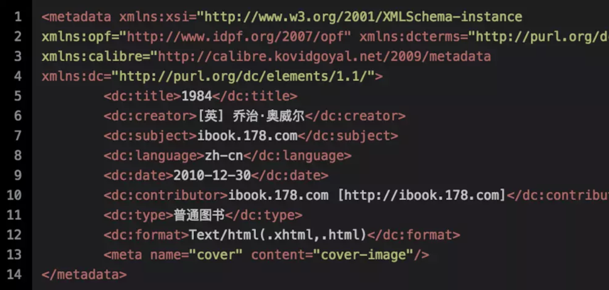
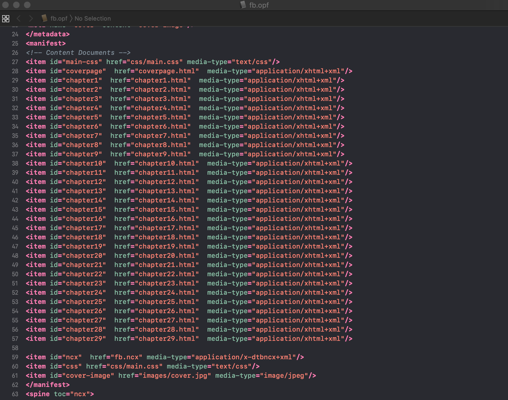
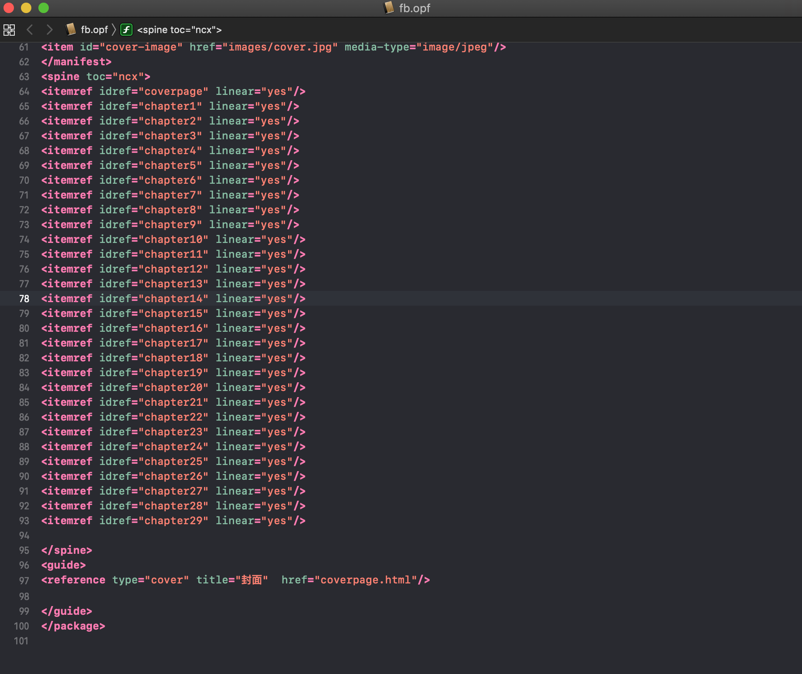
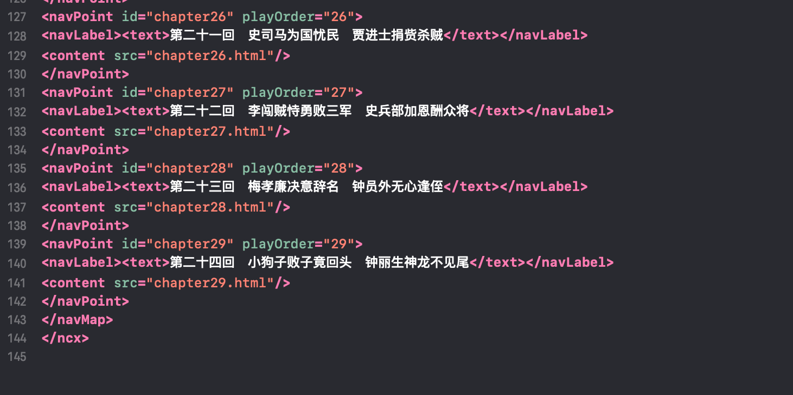

EPUB

## 参考：

1. [EPUB基础](http://www.cnblogs.com/linlf03/archive/2011/12/13/2286218.html)
1. OPF规范：[http://www.idpf.org/2007/opf/OPF_2.0_final_spec.html](http://www.idpf.org/2007/opf/OPF_2.0_final_spec.html)

2. OPS规范：[http://www.idpf.org/2007/ops/OPS_2.0_final_spec.html](http://www.idpf.org/2007/ops/OPS_2.0_final_spec.html)

3. OEBPS规范：[http://www.idpf.org/ocf/ocf1.0/download/ocf10.html](http://www.idpf.org/ocf/ocf1.0/download/ocf10.html)
4. Other:[https://www.w3.org/publishing/groups/epub3-cg/](https://www.w3.org/publishing/groups/epub3-cg/)


epub电子书本身就是一个ZIP文件，我们将epub格式电子书的后缀.epub修改为.zip后，可以通过解压缩软件（例如winrar、winzip）进行浏览或解压处理。

## 文件组成



未加密时，由三部分组成：

###### 1. mimetype

每一个epub电子书均包含一个名为mimtype的文件，且内容不变，用以说明epub的文件格式。文件内容为：




###### 2. META-INF文件夹

包含container.xml文件

META-INF用于存放容器信息，默认情况下该目录包含一个文件，即container.xml，文件内容如下：




container.xml文件：的主要功能用于告诉阅读器，电子书的根文件（rootfile）的路径和打开格式，一般来说，该container.xml文件也不需要任何修改，除非改变了根文件的路径和文件名称。

除了container.xml文件之外，OCF还规定了以下几个文件目录（可选的）：

* manifest.xml 文件列表

* metadata.xml 元数据

* signatures.xml 数字签名

* encryption.xml 加密

* rights.xml 权限管理


###### 3. OEBPS文件夹

包含images文件夹、xhtml文件、*.css文件、content.opf文件

OEPBS目录用于存放OPF文档、CSS文件、NCX文档。

###### # 1. OPF文件：

OPF文档是epub的核心文件，且是一个标准的xml文件，依据OPF规范，此文件的根元素为<package>

内容主要由五部分组成：



###### ## 1. \<metadata>:元数据信息，此信息是书籍的出版信息，由两个子元素组成。

1. dc-metadata:其元素构成采用dubline core(DC)的15项核心元素

	```
	<title>:题名
<creator>：责任者
<subject>：主题词或关键词
<description>：内容描述
<contributor>：贡献者或其它次要责任者
<date>：日期
<type>：类型
<format>：格式
<identifier>：标识符
<source>：来源
<language>：语种
<relation>：相关信息
<coverage>：履盖范围
<rights>：权限描述
	```
	
2. x-metada：扩展元素。如果有些信息在上述元素中无法描述，则在此元素中进行扩展。如：

	
	
###### ## 2. \<mainfest>:

文件列表，列出书籍出版的所有文件，但是不包括：mimetype、container.xml、content.opf:

  
	

由一个子元素构成:``<item id="ncx"  href="fb.ncx" media-type="application/x-dtbncx+xml"/>``

* id:文件id号
* href：文件的相对路径
* media-type:文件媒体类型

###### ## 3. \<spine toc="ncx">：

脊骨，其主要功能是提供书籍的线性阅读次序。由一个子元素构成：



linear 属性表明该项是作为线性阅读顺序中的一项，还是和先后次序无关。有些阅读器可以将spine中linear=no的项作为辅助选项处理，有些阅读器则选择忽略这个属性。例如在下边的实例中，支持辅助选项处理的阅读器会依次列出titlepage、chapter01、chapter05，chapter02、chapter03、chapter04只在点击到（或者其他开启动作）之后才会显示。

但是对于支持打印的阅读器，需要忽略linear=no的属性，保证能够最完全的展示ops中的内容。

好的阅读器需要同时提供两种选择给用户。


* idref：参照manifest列出的id 

###### ## 4. \<guide>：

指南，一次列出电子书的特定页面，例如封面、目录、序言等，属性值指向文件保存地址。一般情况下，epub电子书可以不用该元素。


###### ## 5. \<tour>：

导读，可以根据不同的读者水平或阅读目的，按一定的次序，选择电子书中的部分页面组成导读。一般情况下，epub电子书可以不用该元素。


###### # 2. NCX文件：

NCX文件是epub电子书的又一个核心文件，用于制作电子书的目录，其文件的命名通常为toc.ncx。ncx文件也是一个xml文件。

NCX的 <head> 标记中包含四个 meta 元素：

* uid：      数字图书的惟一 ID。该元素应该和 OPF 文件中的 
* dc:identifier 对应。
* depth：反映目录表中层次的深度。
* totalPageCount 和 maxPageNumber：仅用于纸质图书，保留 0 即可。
* docTitle/text 的内容是图书的标题，和 OPF 中的 dc:title 匹配。


NCX:代表“Navigation Center eXtended”，意思大致就是导航文件，这个文件与目录有直接的关系。

.ncx文件中最主要的节点是navMap。navMap节点是由许多navPoint节点组成的。而navPoint节点则是由navLabel、content两个子节点组成。

nvaPoint节点可以嵌套，就是书籍的目录是层级目录。

* navPoint--playOrder属性：定义当前项在目录中显示的次序。
* navLabel--text节点：定义了每个目录的名字。
* content--src属性：定义了对应每个章节的文件的具体位置。


