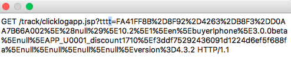
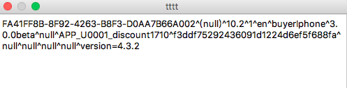

## 一、DHGate用户行为分析

#### 一、现状总结：

1. WAP、PC端：采集js种入cookie数据，通过cookie来判断访问次数、访问深度等信息。
2. APP端：客户端通过数据埋点，实现用户行为数据的上传，供服务端解析并处理。

	> 1. 用户行为数据目前只包括：访问页面埋点和事件行为（如交易）记录
	
3. 后台处理：将前端（wap、app、pc）采集的基础数据，交由专门的分析师（BI）和建模来解析。

	> 1. BI分析：目前主要的维度信息能得到。访问路径深度等信息尚未完善。
	> 2. 关于建模，目前只是计划，还没有真正实施。

4. 硬性要求：

	> 1. 最原始的日志数据必须在我们自己的平台上。
	> 2. 敏感信息均在后台，有的是通过同步生产库获得。

#### 二、后续计划：

1. WAP、PC端：未知，但功能上应该和app端统一。
2. APP端：开发Log SDK

	> 1. 除了支持记录设备信息等基本数据之外，还应实现更为详实的数据记录，诸如用户画像、访问时长，访问深度等更细节化的数据。
	> 2. 上传机制：最好是批量上传，有一定的失败重发机制，现在请求失败，其实行为数据就丢掉了。
	> 3. 其它：可以理解为是友盟、google analytics的功能子集，或者更为完善。
	
3. 后台处理：需要同步实现接收前端发来的细化数据，并具备相应的数据解析能力。

	> 1. 需要更细化的数据输出：如用户购买习惯、购买入口频率等数据的梳理和整合。（见最后思维导图）
	> 2. BI分析：需要完善更多数据的处理。
	> 3. 建模实施
	

## 二、当前方案详情（iOS为例）
1. iOS端（同Android端）目前的用户行为分析也即数据埋点实现，并未借助第三方平台。通过接口上传的方式，上传数据至服务器。

	> * API：https://secure.dhgate.com//track/clicklogapp.jsp?tttt=参数列表

2. 公共参数（默认统一在基类API添加）：

	> * deviceID:uuid;用户ID:userid(or null)
	> * 代理头信息:操作系统版本号;跟踪来源:ios:1&android:2
	> * 用户级别：null;平台:buyerIphone,buyerIpad,buyerAndroid,buyerAndroidPad
	> * 用户触摸屏幕的位置(保留):null；设备屏幕尺寸(保留)：null

3. 定制参数（通过API上传）

	> *  ClientID做为第10个字段；第11个是CategoryID；第12个是ItemCode； 第13个是Field13；第14个Field14。
	> * 第15个Field15:
		* 第15个字段用来存储一个map，里面放Diane's Home的场景参数，和APP2活动的activityid    第15个字段如果存在多个，则用~分开 用~分隔键值对，用=分开键和值，例如：pos=1~type=abc

4. 代码实现(iOS)

	1. API+公共参数：在`AnalysisTool`工具类中实现，同一般API无区别，预留出定制参数入口即可。
	
		```
		+ (void)sendAnalysisRequest:(id)param
		```
	
	2. 定制参数：调用时需注意可选参数的位置和链接符（15字段，以^链接）

		```
		//调用方式：以点击商品详情为例：除了itemcode外，还需添加可选参数
		NSString *cidKV = [NSString stringWithFormat:@"cid=%@",_cid];
    [AnalysisTool sendAnalysisRequest:@[@"APP_U0001_discount1710_tapitem", @"null",item.itemcode, @"null", @"null",cidKV]];
		```
	3. Charles截取数据：

		
		
		
5. 结果分析

	可实现功能
	
	> * ActionTap事件、网络请求成功、订单、再来一单等记录。
	> * 进入页面，记录viewDidLoad、WillAppear等页面行为+事件上传：共同作用实现PV分析。
	
	问题
	
	> * 稳定性：非三方平台，目前未实现重发机制或批量上传数据等方案
	> * 转化分析功能，用户画像、访问时长，访问深度等细节化的数据处理无法实现
	
	
## 三、Analytics拓展

* 通过查阅优秀的三方库，简单总结了Log SDK需要具备的功能点。

#### 一、参考链接
文章链接：

1. [用户行为分析三要点：黏性，活跃，产出](https://www.zhihu.com/question/19686197)
2. [http://www.wangjubao.com/wenzhang/245731909775](http://www.wangjubao.com/wenzhang/245731909775)
3. [http://www.woshipm.com/discuss/37100.html](http://www.woshipm.com/discuss/37100.html)

平台分析：

1. [google analytics](https://analytics.google.com/)
2. [growingio](https://www.growingio.com/)

#### 二、概述

* 通过将Google Analytics和AARRR模型合并，得出一般用户行为分析必备要素。
* 不借助三方平台的情况，即实现服务端数据分析细节，未予列出。如具体转化分析，留存数据图表化展示功能等问题，略。

* 导图
	
	

