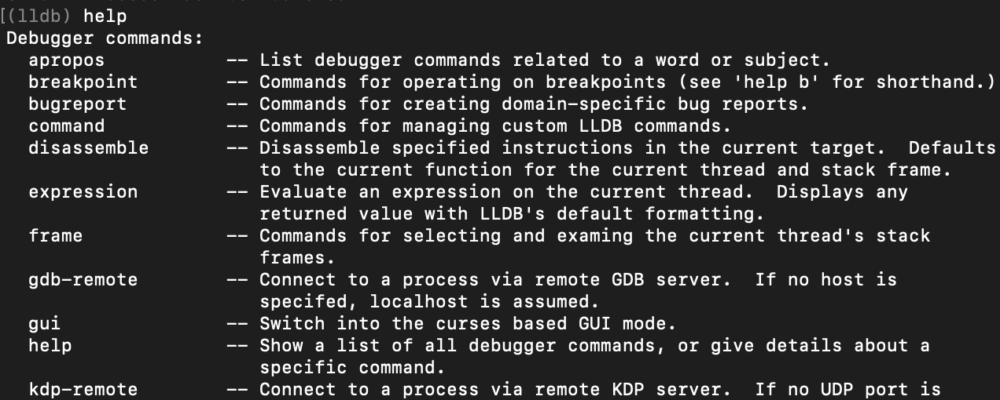
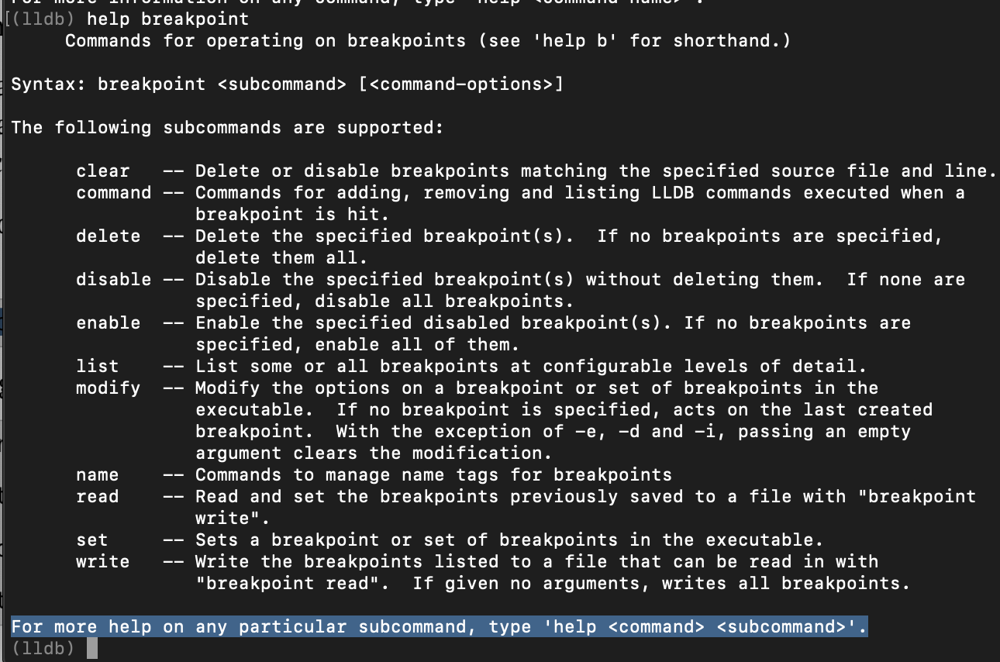
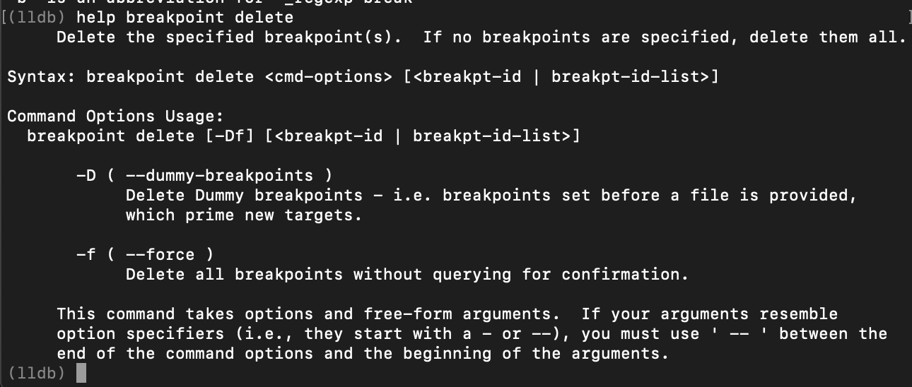
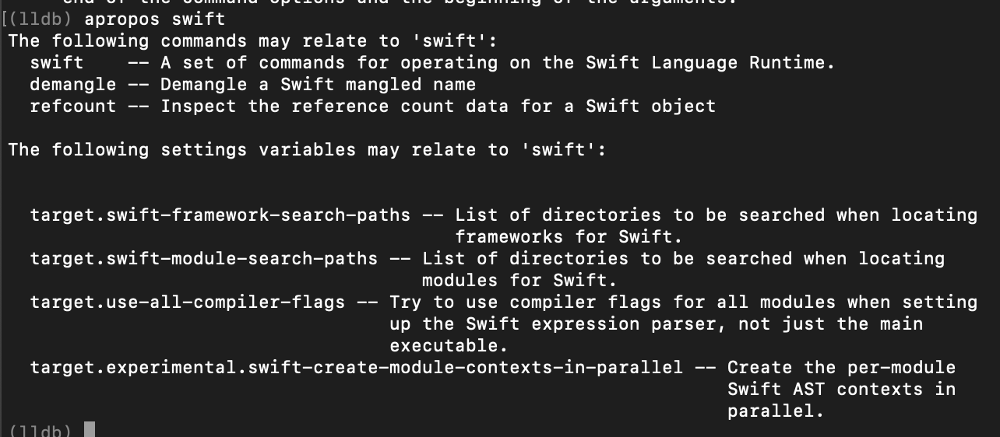

LLDB附带了大量的文档。了解如何浏览此文档（包括一些更模糊的命令标志），对于掌握LLDB至关重要。

## help 命令


```
//汇聚所有命令。包括自定义命令（~/.lldbinit）
(lldb) help
```



很多命令可以直接用于LLDB，也有很多命令含有子命令，子命令可能还有子命令。且子命令也有大量的注释文档。

**以breakpoint为例：查询相应的子命令**

```
 (lldb) help breakpoint
```

输出：


仍可递归查询子命令细节文档：




## apropos 命令


* 无法确切知晓要使用的命令时，可按功能查询。
* `apropos`将根据输入关键字（单词或"短语"）模糊查询LLDB文档，返回任何匹配的结果。

**示例：搜索与swift相关的任何内容**

```
(lldb) apropos "swift"
```


