* 设置断点，调试时，获取有用信息。
* 检查对象的实例变量
* 通过LLDB执行任意代码
* 借助OC的runtime库，可随时声明、初始化、注入代码，帮助理解程序。


使用表达式命令，在调试器中执行任意代码。


## P 和 PO

`po`：可用于OC和Swift。

输出条目类型：对象的实例变量、对象的本地引用、寄存器、含对象的任意内存引用。

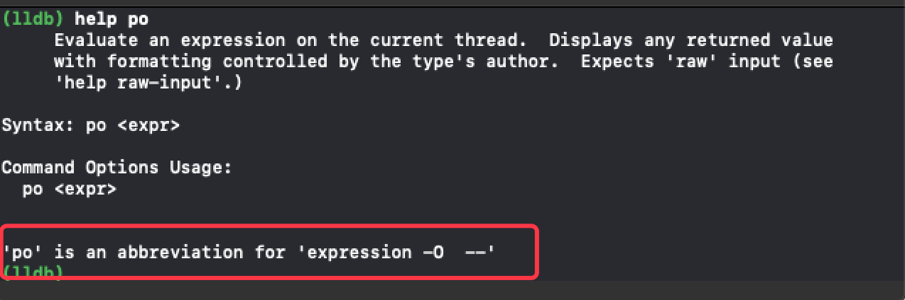


`p`:打印的格式更依赖于LLDB类型系统(LLDB type system)

LLDB的值类型格式有助于确定其输出，并且是完全可自定义的。

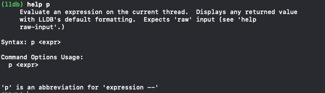


### po 示例：

当类中重写`description`和`debugDescription`时，代码中的print输出和LLDB中的po输出是不同的。

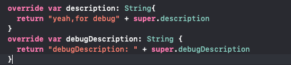

代码``print("\(self)")`` 和 ``(lldb) po self``

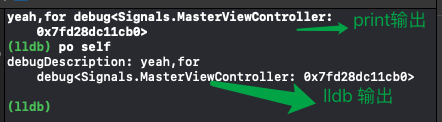


哪些对象会覆盖此类方法？ 

使用`image`智能正则命令查询该类对象。

```
//Obj-C
(lldb) image lookup -rn '\ debugDescription\]'
```

可以看到，无论私有类还是公开类，均有重载该方法。

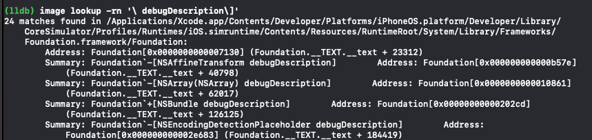
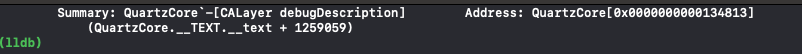

查看`CALayer`中 `description` 和 `debugDescription` 方法细节：

```
(lldb) po self.view!.layer.description
(lldb) po self.view!.layer
(lldb) po self.view!.layer.debugDescription
```

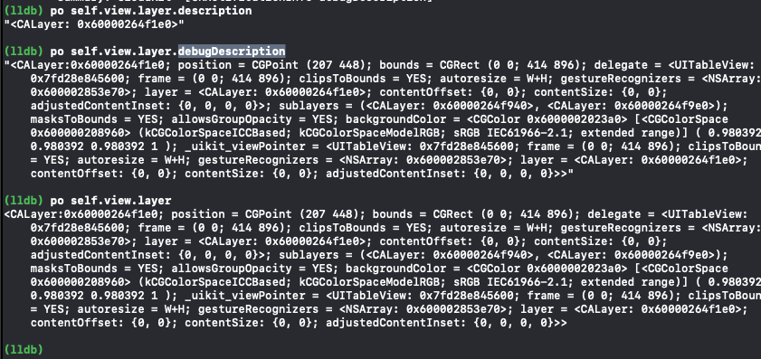


### p 示例


执行：

```
(lldb) p self
```

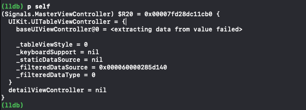

结果：

1. self 类名信息输出：`Signals.MasterViewController`
2. 引用（以及地址），本例中为`$R20`:使用其来引用对象。

	在当前`lldb会话`中，稍后`self`会变更，但仍可通过`$R20`引用此处的对象。
	
	```
	(lldb) p $R20
	```
	
	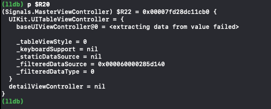
	
3. 特定类相关的信息：此处是superclass信息。
4. 成员实例变量


### 总结

p的输出取决于类型格式（type formatting）

LLDB作者将内部数据结构（用OC、Swift、和其它语言写成）添加到每个数据结构中。


由于类型格式由LLDB持有，故可以更改之：

```
//告知LLDB，打印该类实例时，只返回静态字符
 (lldb) type summary add Signals.MasterViewController --summary-string
"Wahoo!"
```

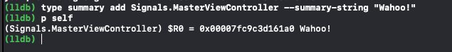

类型格式的修改将在app运行期间持续有效，故删除：

```
(lldb) type summary clear
```

**类型格式化是一个详细主题，后续会进一步探讨，因为它可以极大地帮助调试没有源代码的应用程序**


## Swift 和 Obj-C 调试上下文

1. `非Swift调试上下文`：默认，断点于Obj-C代码时，LLDB启动非Swift（Obj-C）调试上下文。
2. `Swift调试上下文`：断点于Swift代码，LLDB启用Swift调试上下文。


附：若突然停止调试器（手动暂停），LLDB将默认选择Obj-C上下文。

**强制语言：通过-l可选项选择语言。**

但由于`po表达式`被映射到表达式`expression -o --`，故无法使用`po`命令，因提供的参数在`--`之后:

```
//在Swift上下文中，告知LLDB使用OC输出
(lldb) expression -l objc -O -- [UIApplication sharedApplication]
```

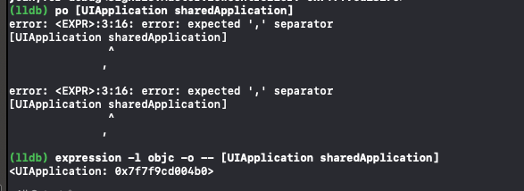

可以用Swift做同样的事（Swift上下文中）：

```
(lldb) po UIApplication.shared
```


## 用户定义的变量

当打印出对象时，LLDB将会自动创建局部变量。当然您也可以创建自己的变量。


**示例：变量创建**

直接创建变量：

```
(lldb) po id test = [NSObject new]
```

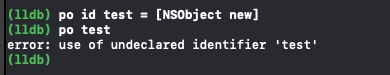


**错误解决：需要在希望LLDB记住的变量前面加上`$`字符。**


```
po id $test = [NSObject new]
```

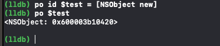


我们使用Swift上下文来访问它，并执行Swift方法时效果：

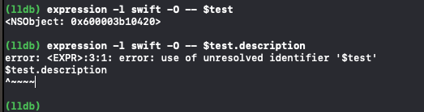

结论：若在Objective-C上下文中创建一个LLDB变量，然后转到Swift上下文，不要期望一切都“正常工作”。这是一个正在开发的领域，假以时日，Objective-C和Swift通过LLDB的桥接可能会有所改进。


### 实际应用：


1. 创建符号断点（symbolic breakpoint ）

	> 
	
2. 编辑该断点:

	> 如断点在方法`viewDidLoad`:`Signals.MasterContainerViewController.viewDidLoad() -> ()`

	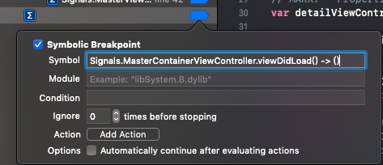
	
3. 运行app，则断点在相关位置，键入：

	> ```(lldb) p self```

	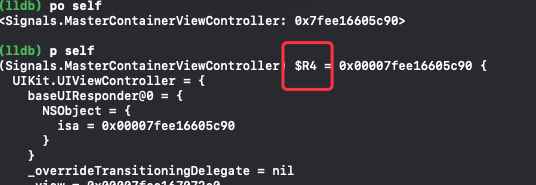


4. 执行3步骤后，LLDB将创建变量`$R4`,键入`continue`继续app的执行。

	> 恢复app后，`self`将无法引用到上述指定类，转入其它`runloop`中。

5. 手动暂停LLDB，可使用`$R4`获取指定类引用。（注意此时为Obj-C上下文）：

	> `` (lldb) expression -l swift -- $R4.title``

	
	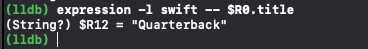


6. **赋值操作：尝试修改LLDB变量**

	``
	(lldb) expression -l swift -- $R0.title = "! ! ! ! ! "
	``

	continue app，查看之，即可出现改动效果。


附：当我们在LLDB中执行指定类的`viewDidLoad()`方法时，无断点响应。

实际上，`viewDidLoad()`是执行的，但**默认情况下，LLDB在执行命令时将忽略任何断点。您可以使用`-i`选项禁用此选项。**

```
//无效果
(lldb) expression -l swift -o -- $R0.viewDidLoad()
```
```
//有效果
(lldb) expression -l swift -O -i 0 -- $R0.viewDidLoad()
```

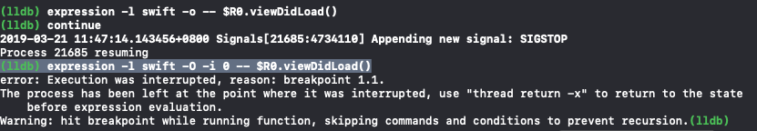


实用场景：LLDB将在先前创建的`viewdidload()`符号断点上中断。

这种策略是检验方法逻辑的一种很好的方法。例如，可以通过给函数提供不同的参数来实现测试驱动的调试，以查看它如何处理不同的输入。


## 类型格式（Type formatting）

LLDB 具有格式化输出基本数据类型的功能。

LLDB是学习编译器如何格式化基本C类型的良好工具。


**示例：将十进制`10`输出为十六进制**

```
(lldb) expression -G x -- 10
```

* `-G`可选项：告知LLDB输出采用的格式。G即GDB格式。
* `x`：采用十六进制。


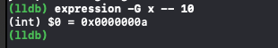


简洁的等价语法输入：

```
(lldb) p/x 10
```

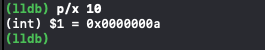


学习C数据类型非常有益：

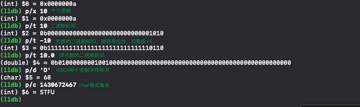


输出格式详细列表参见：[https://sourceware.org/gdb/](https://sourceware.org/gdb/)

|格式|释义|
|:--:|:--:|
|x|十六进制|
|d|十进制|
|u|无符号十进制|
|o|八进制|
|t|二进制|
|a|地址|
|c|字符常量|
|f|浮点数|
|s|字符串|


可以使用LLDB的额外格式化程式，尽管您将无法使用GDB格式化语法。

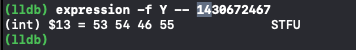

LLDB有如下格式化程式：[http://lldb.llvm.org/varformats.html](http://lldb.llvm.org/varformats.html)

|格式|释义|
|:--:|:--:|
|B|布尔|
|b|二进制|
|y|字节bytes|
|Y|ASCII的字节|
|c|字符|
|C|可打印字符|
|F|complex float|
|s|c-string|
|i|十进制|
|E|枚举|
|x|十六进制|
|f|浮点数|
|o|八进制|
|O|ostype|
|U|unicode16|
|u|无符号十进制|
|p|指针|


## 更多


```
help expression
```


