* LLDB暂停时，如何将调试器移入和移出函数。

* 在输入和退出代码片段时，经常需要检查值随时间的变化。


## 栈

当程序执行时，它将值存储在`栈`和`堆`中。两者各有优点。

作为一个高级调试器，需要理解这些调试程序是如何工作的。

了解堆栈，理解流程执行时`如何跟踪代码和变量`,对于LLDB在代码中导航调试，大有助益。

`栈`（Stack）是一个LIFO（后进先出）的队列，存储当前执行代码的引用

`栈顶指针`始终指向当前栈的顶部，标识着删除或者插入的位置。

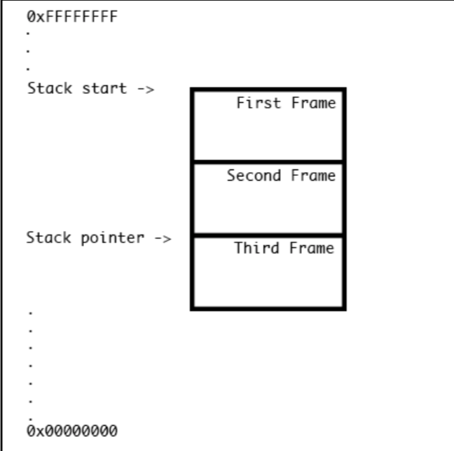

图中高地址显示在顶部（0xFFFFFFFF），低地址显示在底部（0x00000000），栈将向下增长（便于后续偏移地址的计算）。

## 栈框架


本章示例皆用 iOS 模拟器，其产生的汇编代码与真机设备有所不同。

因真机设备使用`ARM架构`，而模拟器使用Mac本机指令集，即`x86_64`(在iPhone 5s及以下编译时为 i386)。


**示例**

开启项目，添加如图所示符号断点：

```
Signals.MasterViewController.viewWillAppear(Swift.Bool) -> ()
```

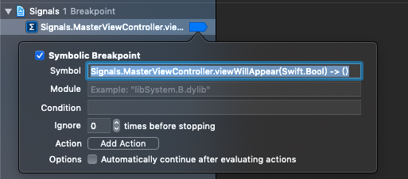

构建并运行app，则会断点至标记处。


在Xcode左侧查看断点时栈的追踪路径（cmd+7）。

确保底部右侧3个按钮均失效：使能它们，则过滤栈中只显示有源码的函数。

**全部失效它们，可以看到栈中所有的追踪路径。**

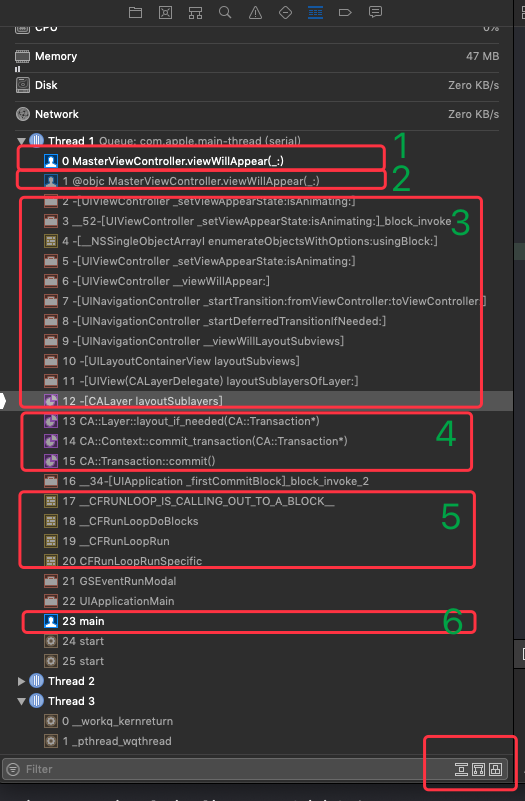


解析上图：依次向下分析栈的结构列表

1. 符号断点函数：`viewWillAppear(_:)`
2. Swift和OC的桥接函数：`@objc MasterViewController.viewWillAppea.....`

	> 该方法属自动生成的，以之`Obj-C`可以访问到`Swift`代码。
3. 之后数行，是一系列来自`UIKit`库的`Obj-C`代码堆栈帧。
4. 再下沉列表，是一系列来自于`CoreAnimation`库的`C++`代码。
5. 接续下沉，是一系列来自`CoreFoundation`库，含`CFRunloop`字符的方法。
6. 最后，是main函数。（**Swift程序仍然有main函数入口，只不过隐藏了。**）


上图堆栈追踪路径仅是LLDB的可打印版本，更多信息可移步LLDB控制台，键入：

```
//(lldb) bt 
(lldb) thread backtrace
```

展示如下：

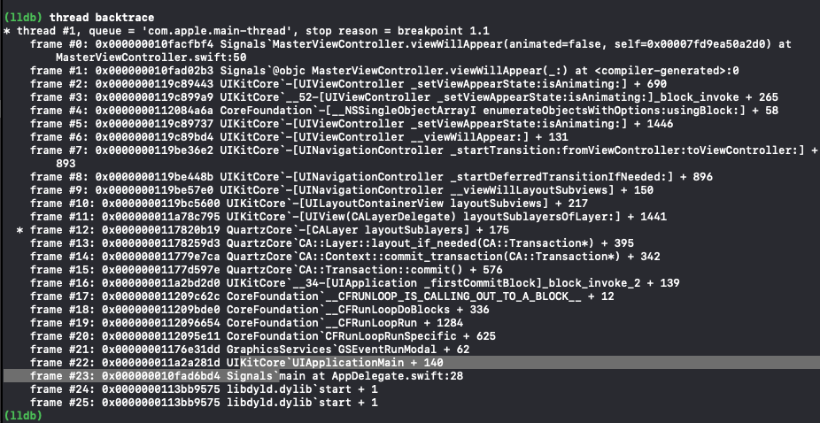

两者之间的区别，通过help获取：


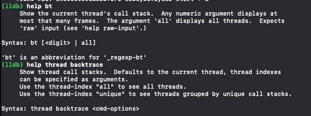


获取左侧选中的组织信息：

```
(lldb) frame info
```

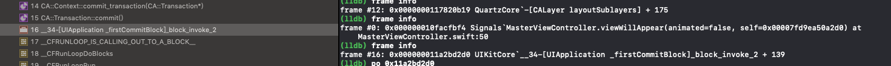


对于后续脚本化查看细粒度信息，比较有用。


**获取某一条组织信息（较为详细）：**

```
(lldb) frame select 1
```

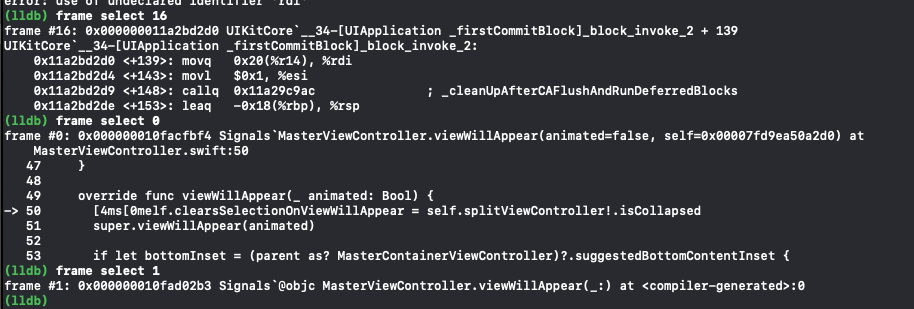


附：@objc桥接方法是什么？

> * 它是由Swift编译器生成的一种与Objective-C的动态特性交互的方法。
> * 在Swift的早期版本（Swift<=3.2）中，任何NSObject都默认生成@objc桥接方法。
> * 使用swift 4中的默认构建设置，即使是Objective-C NSObject也需要有@objc（或@objcmembers）属性，以便swift编译器生成桥接方法。


## Stepping


LLDB暂定程序，针对代码的单步导航操作，有`step over`、`step in`和`step out`三种行为。

以代码块的形式检测代码是如何执行的。


### stepping over

**stepping over**：在暂定的代码上下文中进行单步执行，即下一个代码语句（一般为下一行代码，即便该行代码为另一个函数回调也是如此）。

**代码执行**：

```
(lldb) next
```

**Xcode GUI执行截图**：

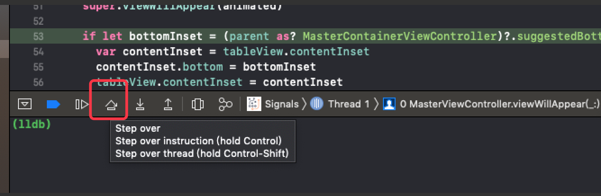


**注意截图中的附加功能，对于并发代码的调试很有用（执行调试程序暂停的线程，而其余线程保持暂停状态。如GCD个别线程的调试）。**

LLDB命令`--run-mode`等价。


附：执行命令run,app将重新启动，但不会重新编译Xcode。

```
(lldb) run
```

### stepping in

**stepping in**：在暂定的代码上下文中进行单步执行，若下一个语句是函数调用，调试器将移动到该函数的开头，然后再次暂停。

**代码执行**：

```
(lldb) step
```

**Xcode GUI执行截图**：

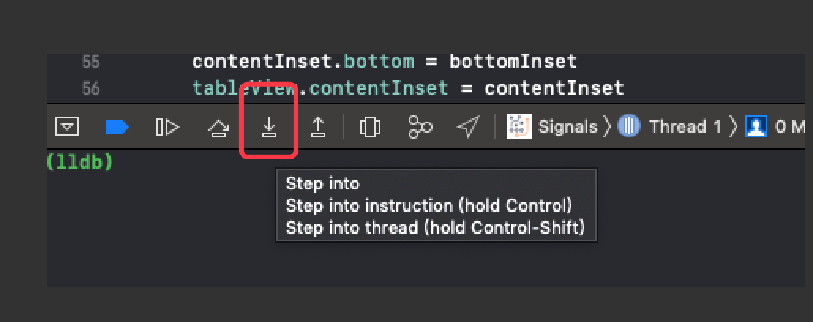


附：当进入不存在调试符号的函数时LLDB的行为设置，查看该设置文件命令：

```
(lldb) settings show target.process.thread.step-in-avoid-nodebug
```

结果为True：上述进入函数调用中时，`stepping in`将充当`stepping over`的效果，后续可以更改该配置，也可以告知LLDB忽略此配置。

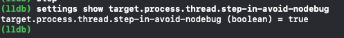

**默认情况下，接入函数内部无`debug 符号`，LLDB将忽略`stepping into`该函数，执行同`stepping over`。**

**接入某一函数内部**：

```
(lldb) step -a0
```

告知LLDB不管您是否有所需的调试符号，都要介入。即接入某一函数内部。


### stepping out

**stepping out**：在暂定的代码上下文中进行单步执行。函数将在其持续时间内继续，然后在返回时停止。从堆栈的角度来看，执行将继续，直到堆栈帧弹出为止。

即从堆栈的角度，每一次执行，都将弹出一帧。

每一次`stepping out`指示LLDB退出当前函数。注意左侧面板中的堆栈追踪路径，因为函数列表元素在逐个消失。

**代码执行**：

```
(lldb) finish
```

**Xcode GUI执行截图**：

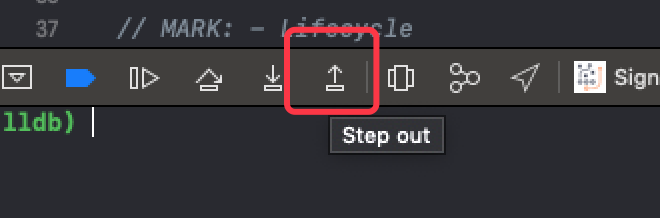


### 检测`堆栈追踪路径`中的数据

**frame variable**子命令：获取可执行文件（executable）头中的调试符号（debug symbol）信息。并为特定的堆栈帧转储信息。

若程序被剥离，则获取DYSM。

基于调试信息，`frame variable`使用适当的选项检出函数中所有变量的范围以及程序中的任何全局变量。


**示例：**

* 代码基于断点悬停后，堆栈追踪路径选中特定的frame（如frame select 0，或缩：f 0）
* 执行代码：

	```
	(lldb) frame variable
	```
	
	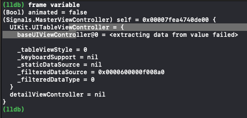
	
	**该命令将转储当前frame和当前代码行可用的变量。若可以，将从当前可用变量中转储所有实例变量，包括public和private。**
	
	
* `frame variable`和变量视图的输出相匹配的。

	**若认真比较，会发现命令模式比视图模式提供更多关于苹果私有API的ivar的信息。**
	
	目前暂未发现。
	
	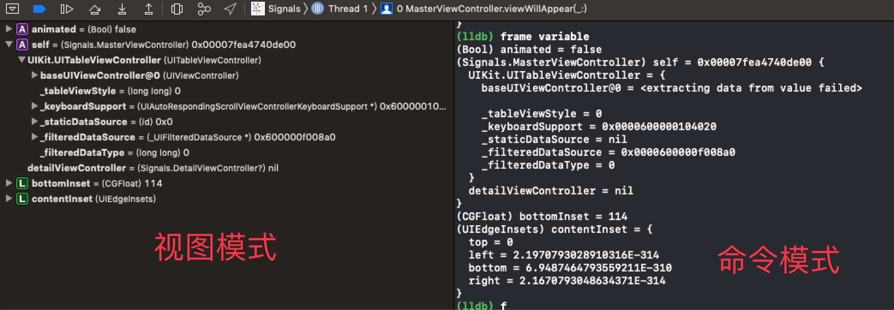
	
	
* `-f`可选项：即`flat`。查看断点悬停类可用的所有私有变量。

	``` 
	//仅打印self相关
	(lldb) frame variable -F self
	```

	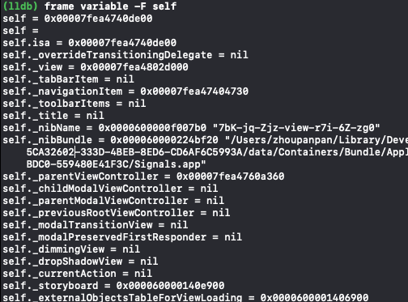
	

	
