往期回顾：

1. 找到并将LLDB附载感兴趣的进程。
2. 利用正则表达式，创建命中范围更广的断点。
3. 导航堆栈追踪路径。
4. 利用`expression`修改变量。


**本章将深入探索`image`命令，通过LLDB，发现特定的代码。**

`image`命令是`target modules`命令的别名。

**`image`命令专门用于查询`模块信息`，即在进程中加载和执行的代码。**

**`image`命令支持查询任何`私有框架及其类`或`头文件中未公开的方法`等信息。**

**模块(modules)**：涵盖较多文件类型，诸如主要的可执行文件（ main executable）、frameworks或plugins。并且这些模块的大多数通常以动态库的形式出现。（如UIKit）


## 模块（modules）

运行项目，悬停项目，执行：


```
(lldb) image list
```

**展示当前项目加载的所有模块。**


* 模块1：主要二进制文件
* 模块2、模块3：动态链接编辑器（dyld）。负责将动态库以及进程中的主要可执行文件加载到内存中。


**过滤，仅查看特定库文件或集合：**

```
 (lldb) image list Foundation
```

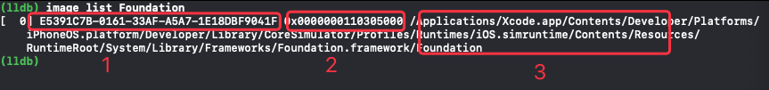

1. 模块的UUID：UUID用于寻找`符号信息`；唯一标识模块。
2. 模块的加载地址：用以在可执行程序的进程空间中，确定该模块被加载的位置。
3. 模块路径：在磁盘中，该模块的完整路径。


**深化探究具体模块：**

```
(lldb) image dump symtab UIKit -s address
```

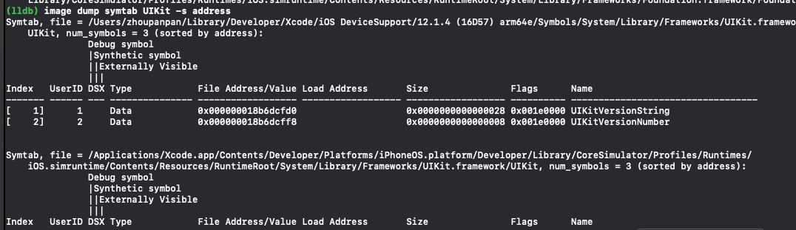


* dump模块UIKit所有可用的符号表信息。
* `-s address`：根据模块中实现函数的地址对输出进行排序。


**`image lookup`命令适用于过滤数据：**

```
(lldb) image lookup -n "-[UIViewController viewDidLoad]"
```

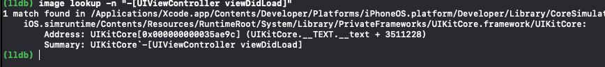

dump `UIViewController`中`viewDidLoad`实例方法相关的信息：该方法的符号名、在模块UIKit中实现的位置。缺点是该命令只能dump具体的案例。


**正则查询：**

```
(lldb) image lookup -rn UIViewController
```

该命令不仅dump所有的`UIViewController`实例方法，也会dump类似`UIViewControllerBuiltinTransitionViewAnimator`中的方法，因为字符串含有`UIViewController `。

为了仅过滤`UIViewController`方法，使用：


```
(lldb) image lookup -rn '\[UIViewController\ '
 
```

使用`\s`元字符指示空格，这样就不必转义实际的空格并用引号将其括起来,等价命令：

```
(lldb) image lookup -rn \[UIViewController\s
```


附件扩展，即搜索所有扩展方法。键入：

```
(lldb) image lookup -rn '\[UIViewController\(\w+\)\ '
```

* 开头的`\`标识转义的`[`。
* 文本`UIViewController`。
* 然后`(`后跟字母数字下划线字符（用`\w+`表示），然后`)`。
* 后跟空格。


**运用正则表达式，有利于查询加载到二进制文件中的任何模块中的任何公开、私有代码。当然还会提示方法是否从父类中重写。**


### 逐鹿代码

了解代码是如何生成的，有利于定位感兴趣的代码并创建断点。

示例：探索Obj-C block中的方法签名

搜索Objective-C block的方法签名的最佳方法是什么？由于不知道从哪里开始搜索，**一个好的开始方法是在block中放置一个断点，然后从那里进行检查。**

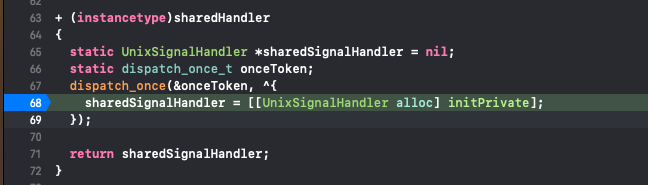

其堆栈追踪路径：

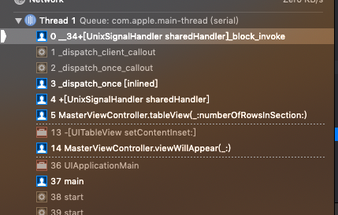

执行``frame info``:

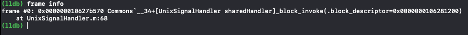

**可得该函数全名为：`__34+[UnixSignalHandler sharedHandler]_block_invoke`。**

`_block_invoke`:可能是在Objective-C中唯一标识block的模式。

在该项目范围内搜索含有`_block_invok`字符的代码：

```
(lldb) image lookup -rn _block_invoke Signals
```

无任何输入时，检测类是否是因为编译Target不对。


执行：

```
 (lldb) image lookup -rn _block_invoke Commons
```

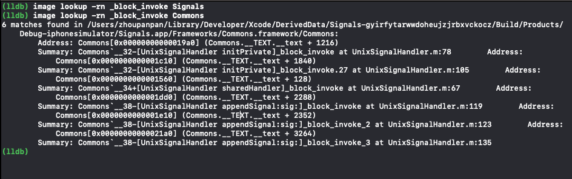


**如上，在`Commons`模块中，打印输出所有的`Obj-C block`信息。**


创建断点，定位于上述`block`块的某子集中：

```

  (lldb) rb appendSignal.*_block_invoke -s Commons
```

**这个断点将命中·AppendSignal·方法中的任意block。**

> 注：在模块中搜索代码和在模块中断点代码之间有微小差别，注意`-s`参数和空格。

终端执行如下命令，将命中断点：

```
pkill -SIGIO Signals
```

一个函数fun_name中有多个block时，命名规则如：

* `[class fun_name]_block_invoke`
* `[class fun_name]_block_invoke_2`
* `[class fun_name]_block_invoke_3`
* `[class fun_name]_block_invoke_n`


**`frame variable`具有打印特定函数中已知局部变量实例功能。**

在命中某block时，尝试打印出特定函数中的局部变量：


```
(lldb) frame variable
```

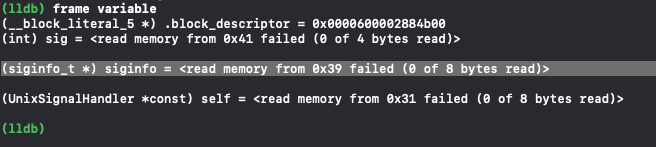

上述在`block`起始处读取内存失败，尝试执行命令`next`(Step over单步),并再次执行`frame variable`

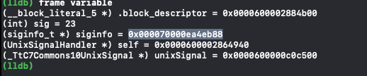

执行单步操作后，block会执行某些初始逻辑来设置函数，故称为函数序言。

函数序言与汇编相关，后续详解。

该函数中含有正在被调用的`__block_literal_5`类型的block对象，还有`sig`和`siginfo`参数也被传入函数中。

**这些参数是如何被传入block中的？**

当创建一个block时，编译器智能判断它需要哪些参数，然后block内部创建一个函数，并涵盖需要的参数集。当调用block时，相应的也会调用该函数，并传入参数集。

结构查看：

```
(lldb) image lookup -t  __block_literal_5
```

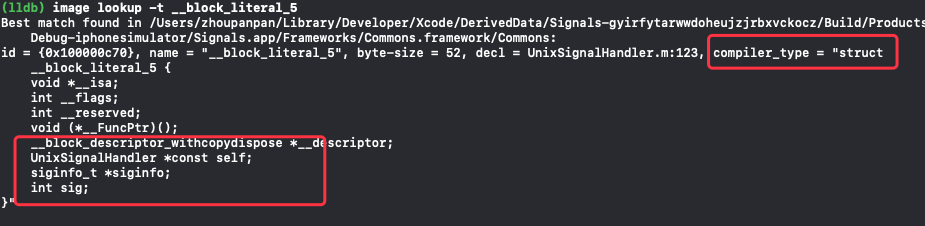

block对象被定义为了结构体类型。

将内存中的引用强制转换为类型`__block_literal_5`，则可以轻松打印出该block引用的所有变量：

```
po ((__block_literal_5 *)0x0000600002884b00)
```

及打印结构体中的成员变量：

```
//dump block的函数指针位置
(lldb) p/x ((__block_literal_5 *)0x0000600002884b00)->__FuncPtr
```

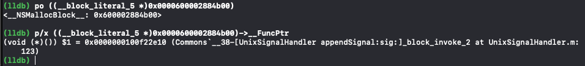


block的函数指针即指向调用该block的函数。目前执行的函数即是block的函数。验证：

```
//-a:给定地址
(lldb) image lookup -a 0x0000000100f22e10
```

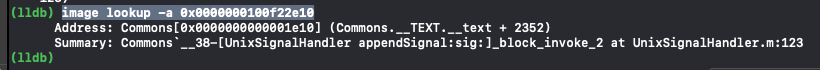


其它参数打印输出：

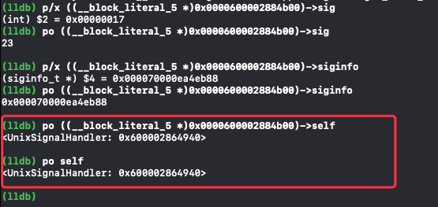


附：结合模块使用`image dump symfile`命令是了解某个未知数据类型如何工作的好方法。也是理解编译器如何为源代码生成代码的好工具。


## 四处窥探

上述已经掌握**如何以静态方式检查私有类的实例变量。**

但是块内存地址太诱人了，却无法单独使用。**尝试打印出来并使用动态分析进行探索。**

打印block对象：

```
(lldb) po 0x0000600002884b00
```

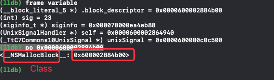

类名为`__NSMallocBlock__`,dump出所有该类实现的私有和公有方法：

```
 (lldb) image lookup -rn __NSMallocBlock__
```

**上述无输出，意味着该类没有重写父类的任何方法，具体实现均在父类中。**

找出父类并执行方法dump：

```
 (lldb) po [__NSMallocBlock__ superclass]
```

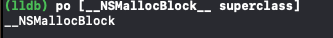
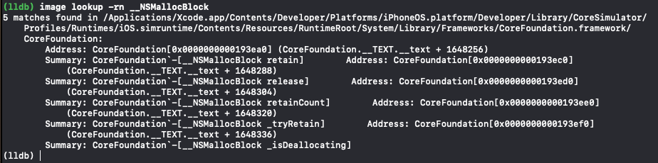

可以看到父类`__NSMallocBlock`负责内存管理，因为它实现了诸如`retain`和`release`之类的方法。

再次执行父类查找和方法查询：

```
(lldb) po [__NSMallocBlock superclass]
(lldb) image lookup -rn 'NSBlock\ '
```

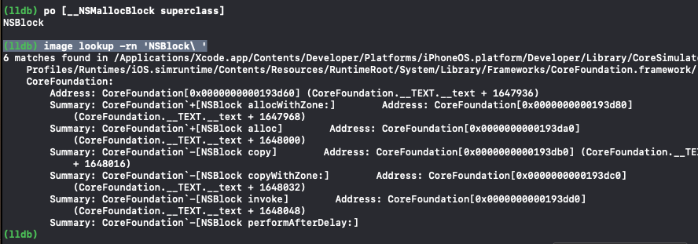

使用`\`和空格查找，是为了避免另外含有NSBlock字串的类中靶。导致更多的方法输出。

**注意输出结果中`-[NSBlock invoke]`。**

尝试在block上调用此方法。注意block在保留其引用时释放，从而降低计数，并可能取消分配块。


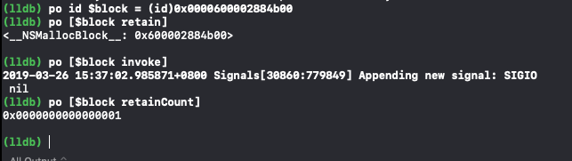

**block正确的被调用，因为所有的设置已就绪，且断点在block处。**

**上述这种探索公有类和私有类的方式，并进而dump类所实现的方法。是了解程序冰山之下的较好的方法。稍后，对方法使用相同的发现过程，然后分析这些方法执行的汇编，从而对原始方法的源代码进行非常深层的分析。**


## 私有Debug方法


`image lookup`命令在搜索私有方法和公有方法时卓有成效。然而还有一些**隐藏方法**在调试项目代码时非诚有用。


例如，以`_`开头的方法往往代表为私有方法。

搜索以`_`起始并含有`description`字符的Obj-C方法：

```
(lldb) image lookup -rn (?i)\ _\w+description\]
```

* `(?i)`字符集：该搜索不区分大小写。
* `\ `:空格后有`_`
* `\w+`:在`description`字符前有一个或多个`字母数字下划线`
* `]`：最后有一个`]`符号
* `\`标识的字符即为文本字符，而非其正则表达的意思，叫`escaping`。

* `\w`:中靶字符数字下划线（即 `_`、`a-z`、`A-Z`、`0-9`）
* 更多信息：[https://docs.python.org/2/library/re.html](https://docs.python.org/2/library/re.html)


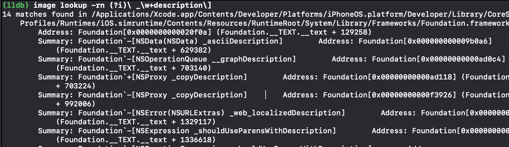


上述输出中找到`IvarDescription`输出，执行更小范围的搜索：

```
 (lldb) image lookup -rn NSObject\(IvarDescription\)
```

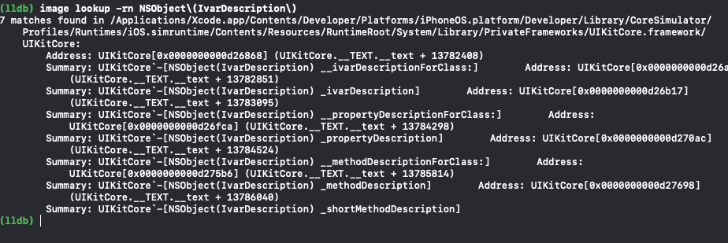

dump搜索该扩展实现的方法，其中有几个比较有意思的：

```
_ivarDescription
_propertyDescription
_methodDescription
_shortMethodDescription
```

执行针对`UIApplication` OC类执行`_ivarDescription`方法:

```
(lldb) po [[UIApplication sharedApplication] _ivarDescription]
```


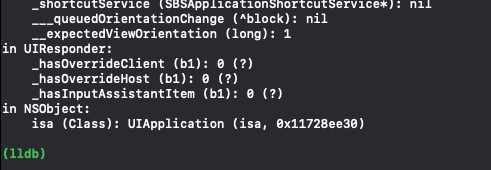

* `UIApplication`内部有许多实例变量，包含私有类的。
* 其父类信息也展示出来

上述有私有实例`_statusBar`,查询其set方法(或其它方法以及其父类方法)：

```
(lldb) image lookup -rn '\[UIStatusBar\ set'
```

获取该实例：

```
(lldb) po [[UIApplication sharedApplication] statusBar]
```

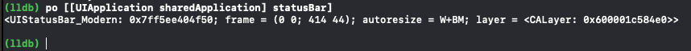


利用其地址，执行设置操作：

```
(lldb) po [0x7ff5ee404f50 setBackgroundColor:[UIColor purpleColor]]
```

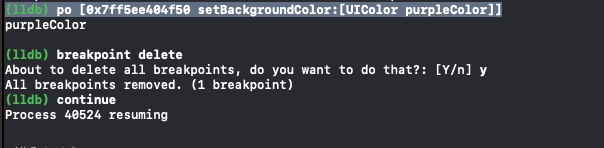

效果：


