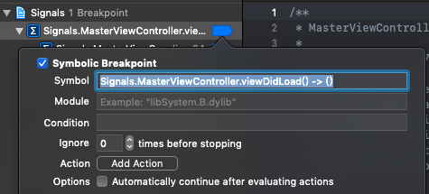
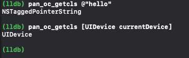
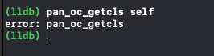
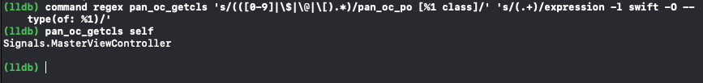
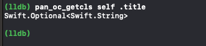
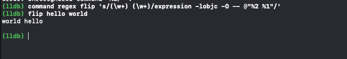

存在`lldbinit`文件中的`命令别名`执行静态命令时非常有效，但它也存在缺陷，即无法基于输入来获取输出。

命令别名的本质即执行时以实际命令替换较短的别名。

但如果在命令的中间提供输入，如何做？

如`获取给定对象的类`，对象作为输入参数。

针对上述问题，有高雅的解决方案，即：正则命令。

## 正则命令

**正则命令(command regex)**：与别名类似。但支持正则表达式作为输入参数，且该表达式被解析并应用于命令的操作部分。


正则命令语法：

```
s/<regex>/<subst>/
```

是一个普通的正则表达式：

* `s/`:以之开头，指定使用替换命令的流编辑器输入
* `<regex>`:指定被替换内容的位
* `<subst> `:指定用什么来替换前者

> 该语法派生自`sed`终端命令，了解高级使用模式，参考其文档。


**实例：**

运行app，并悬停，键入：

```
(lldb) command regex rlook 's/(.+)/image lookup -rn %1/'
```

该命令将使`image正则搜索`更加方便。

* 创建新命令`rlook`。
* rlook将承载任意字符，并附加在前缀`image lookup -rn`之后。
* `(.+)`：匹配一个或多个字符的匹配器（圆括号）来执行通配，并用`%1`替换整个内容
* `%1`: 指定前者匹配器的内容


执行：

```
(lldb) rl viewDidLoad Signals
```

等价于：

```
image lookup -rn viewDidLoad Signals
```

找出`Signals `模块中所有`viewDidLoad`的实现。


经过n次程序运行的声明，发现一个正则命令比较有效，则可以考虑添加至`.lldbinit`文件了。

**将正则命令写入`~/.lldbinit`文件：**

```
command regex rlook 's/(.+)/image lookup -rn %1/'
```

## 执行复杂逻辑

正则命令升级。

使用`正则命令`可以实现执行单个`别名命令`多次。

悬停app，键入：


```
(lldb) command regex -- tv 's/(.+)/expression -l objc -o -- @import QuartzCore; [%1 setHidden:!(BOOL)[%1 isHidden]]; (void)[CATransaction flush];/'
```

**创建命令`tv`(toggle view):执行`view`的隐藏显示。**

1. `@import QuartzCore;`:导入模块至调试器地址空间中

	> 如不导入，调试器无法理解后续执行的来自于该模块的代码


2. `[%1 setHidden:!(BOOL)[%1 isHidden]];`:依赖上一状态，执行view的显示隐藏。

	> 注意`isHidden `不能理解其返回类型，需手动添加


3. `[CATransaction flush];`:刷新`CATransaction`队列，即LLDB不需`continue`的情况下更新屏幕。


附：由于输入参数的限制，不允许指定多行输入，因此必须将所有命令连接到一行。也是创建正则命令时是必要的。

循环执行命令：

```
(lldb) tv [[[UIApp keyWindow] rootViewController] view]
```

看到模拟器黑屏显示循环。


也可将此命令添加至`.lldbinit`文件中，长期使用。

```
 command regex -- tv 's/(.+)/expression -l objc -O -- @import QuartzCore;
[%1 setHidden:!(BOOL)[%1 isHidden]]; (void)[CATransaction flush];/'
```

## 链式正则输入

**使用正则命令时，为何选择怪异的流编辑器输入：该格式可以为同一命令指定多个操作。**

当给定多个命令时，`regex`将尝试匹配每个输入。若输入匹配，则特定的`<subst>`应用于命令;若输入与特定流不匹配，则它将转入下一个命令，查看regex是否可以该输入匹配。

**在处理内存和寄存器中的对象时，通常需要使用`Objective-C`上下文。此外，以`[`或`@`字符开头的任何内容（可能）都是`Objective-C`。**

这是因为`Swift`使处理内存变得困难，而且它不会让您访问寄存器，`Swift`表达式通常也不会以`[`或`@`字符开头。


可以使用此信息自动检测需要用于给定输入的上下文。


如何构建一个命令从一个对象中获取类信息:

* 在Obj-C中，`[obj class]`
* 在Swift中，`type(of: obj)` 


在swift类中创建符号断点：



运行app，等待悬停。

创建新命令：

```
(lldb) command regex pan_oc_getcls 's/(([0-9]|\$|\@|\[).*)/pan_oc_po [%1 class]/'
```

首先，内部分组，表示可以使用以下字符来匹配开头：

* `[0-9]`:可使用`0-9`之间的数字
* `\$`:表示文字字符`$`将会被匹配
* `\@`:表示文字字符`@`将会被匹配
* `\[`:表示文字字符`[`将会被匹配

`%1`:替换为`regex`中的第一个匹配器。在本例中，它是整个命令。内部匹配器（匹配数字，`$`等）将为`%2`。

**以上开头的任何字符都将生成匹配项。后面是`.*`意味着零个或多个字符将产生匹配。**
	
总结：以`数字`、`$`、`@`、`[`开头并跟以任意字符均会实现命令匹配，并执行`pan_oc_po [%1 class]`。


执行效果：




该命令只处理在`Objective-C`上下文中有意义的引用，并且与命令匹配。如执行：

```
(lldb) pan_oc_getcls self
```

会因为不匹配而出错：




**这是因为您提供的输入没有匹配的`regex`。让我们添加一个捕获其他形式的输入到`pan_oc_getcls`的函数。


```
(lldb) command regex pan_oc_getcls 's/(([0-9]|\$|\@|\[).*)/pan_oc_po [%1 class]/' 's/
(.+)/expression -l swift -O -- type(of: %1)/'
```

在最后添加了一条新的`regex`，是一个捕获所有语句(catch all),即简单的将输入作为参数调用`type(of:)`函数。

执行效果：






有空格也没关系，因为已告知Swift的上下文，除了换行符，什么都可以。

同样的，该命令也可添加至`.lldbinit`文件中。


## 多参数应用


上述命令：

```
(lldb) command regex rlook 's/(.+)/image lookup -rn %1/'
```

`(.+)`括号限制了`捕获组`，而最右边`%1`作为被前者替代的标识。

总结：该表达式即后者(image lookup -rn)追加在`捕获组`的前面。

那么**使用多个捕获范围，便可以实现多参数。**


**简单示例：旋转字符串**

```
 (lldb) command regex flip 's/(\w+) (\w+)/expression -lobjc -O -- @"%2
%1"/'
```

```
 (lldb) flip hello world
```




加强：需要使用正则`\s`匹配中间任意的`空格`和`空行`

```
 (lldb) command regex flip 's/(\w+)\s+(\w+)/expression -lobjc -O -- @"%2 %1"/'
```

通过联合多个捕获组链，可以实现更为复杂输入参数的regex命令，但会不易读。


针对上述命令添加`syntax`和`help`，查看他们的详细文档。


