上一章中学习了 x64 调用约定的黑暗艺术。当调用函数时，知道了如何将参数传递给函数，以及函数如何返回值。

接下来学习当代码加载到内存中时是如何执行的。

在本章中，将探讨程序是如何执行的。您将看到一个特殊的寄存器，它用来告诉处理器应该从何处读取下一条指令，以及不同大小和内存分组如何产生不同的结果。

|64-bit|32-bit|16-bit|8-bit|
|:--:|:--:|:--:|:--:|
|rax|eax|ax|al|
|rbx|ebx|bx|bl|
|rcx|ecx|cx|cl|
|rdx|edx|dx|dl|
|rsi|esi|si|sil|
|rdi|edi|di|dil|
|rbp|ebp|bp|bpl|
|rsp|esp|sp|spl|
|r8|r8d|r8w|r8l|
|r9|r9d|r9w|r9l|
|r10|r10d|r10w|r10l|
|r11|r11d|r11w|r11l|
|r12|r12d|r12w|r12l|
|r13|r13d|r13w|r13l|
|r14|r14d|r14w|r14l|
|r15|r15d|r15w|r15l|


## Intel 式汇编

上章阐明，有 2 种汇编。其一为`AT&T`,LLDB 默认汇编集。

`AT&T`操作格式：

```
opcode source destination
```

如：将十六进制值 0x78 移到 RAX 寄存器中

```
movq $0x78 %rax
```

虽然这种汇编风格很好，但从现在开始，您将使用 Intel 风格。

> 附：汇编风格的选择有论战意味——请看 stackoverflow 中的讨论：[https://stackoverflow.com/questions/972602/att-vs- intel-syntax-and-limitations](https://stackoverflow.com/questions/972602/att-vs- intel-syntax-and-limitations)。
>
> 选择 Intel 风格是基于一个公认的松散共识：即 Intel 更适合阅读，但有时极不适合写作。由于您正在学习调试，因此大多数时间您将阅读程序集而不是编写它。


追加如下 2 行至 `~/.lldb.init`文件：

```
settings set target.x86-disassembly-flavor intel
settings set target.skip-prologue false
```

第 1 行：告知 LLDB 以 Intel 风格展示 x86 汇编 （32b 和 64b）

第 2 行：告知 LLDB 不要跳过函数序言。您在本书的前面就遇到了这个问题，从现在开始，不要跳过序言是明智的，因为您将从函数的第一条指令开始检查汇编。

> 附：编辑`~/.lldbinit`文件时，请确保不要使用类似`TextEdit`的程序，因为它会在文件中添加不必要的字符，这可能导致 LLDB 无法正确分析文件。一种简单（尽管危险）的添加方法是通过一个终端命令，如:
> 
> ``echo "settings set target.x86-disassembly-flavor intel" >> ~/.lldbinit.``
> 
> 确保其中有两个`>>`，否则改动将覆盖`~/.lldbinit`文件中以前的所有内容。如果你对终端不满意，像`nano`这样的编辑器（你之前使用过）是你最好的选择。

Intel 风格将交换 source 值和 destination 值，删除`%`和`$`字符以及进行了许多其他更改。因为您不会使用`AT&T`语法，所以最好不解释这两种汇编风格之间的全部差异，而只学习 Intel 格式。

看看前面的例子，现在以 Intel 风格显示，看看它看起来有多干净：(将十六进制值 0x78 移到 RAX 寄存器中)

```
mov rax, 0x78
```

与`AT&T`风格相比，Intel 风格交换了源操作数和目标操作数次序。现在目标操作数位于源操作数之前。使用汇编时，务必始终保持正确的风格，因为如果不清楚使用的是哪种风格，可能会发生不同的操作。

从现在开始，将坚持 Intel 风格。如果您之前看到以`$`字符开头的十六进制数字常量，或以`%`开头的寄存器，那么便需要调整风格。


## 创建 cpx 命令


首先，您将创建自己的 LLDB 命令以在稍后提供帮助。

在合适的文本编辑器（vim?）中再次打开`~/.lldbinit`。然后追加命令至文件底部：

```
 command alias -H "Print value in ObjC context in hexadecimal" -h "Print in hex" -- pan_cpx expression -f x -l objc --
```

创建了一个快捷命令：`pan_cpx`。使用 Obj-C 上下文，并以十六进制格式打印出一些内容。这在打印寄存器内容时很有用。

**注：寄存器在 Swift 上下文中不可用，故代之以 Obj-C 上下文。**


## 位、字节、其它术语

探索内存之前，需要了解一下关于内存如何组织的词汇表。

**位：**包含`1`或`0`的值。在 64 位体系架构中，可以说每个地址有64 位。很简单。

**字节：**当 8 个`位`组织在一起，则称为字节。一个字节可以容纳多少个唯一值？通过计算 `2^8 == 256`来确定，它将是256个值，即`0`到`255`。

许多信息是以字节的形式来表示的。例如，C 函数`sizeof()`以字节为单位返回对象的大小。

如果您熟悉 ASCII 字符编码，您会记得所有的 ASCII 字符都可以保存在一个字节中。


实训：

打开 Registers macos 项目，您可以在本章的参考资料文件夹中找到它。接下来，构建并运行。一旦运行，悬停程序并呈现 LLDB 控制台。这将导致使用非 Swift 调试上下文，因为将应用程序悬停为蓝色将默认呈现为非 Swift 上下文。

在 LLDB 中键入以下内容：

```
 (lldb) p sizeof('A')
```

这将打印出组成`A`字符所需的字节数。


键入：

```
(lldb) p/t 'A'
```

将打印输出字符`A`在 ASCII 码中的二进制表示。

另一种更常见的显示信息字节的方法是使用十六进制值。**一个信息字节需要 2 个十六进制数字表示。**

打印`A`的十六进制表示：

```
p/x 'A'
```

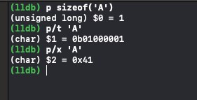

十六进制对于查看内存非常有用，因为 1 个十六进制数字正好代表 4位。所以如果你有 2 个十六进制数字，你就有 1 个字节。如果您有8 个十六进制数字，那么您有 4 个字节。等等。

在接下来的章节中，您将看到更多有用的术语：

* Nybble（半字节）: 4 位，1 个十六进制数值
* Half word（半字）：16 位，或 2 个字节
* Word（字）：32 位， 或 4 个字节
* Double word、Giant word（双字）：64 位，或 8 个字节

## RIP 寄存器

当程序执行时，将要执行的代码会加载到内存中。

**程序中下一个要执行的代码位置由一个非常重要的寄存器决定：RIP 或 指令指针 寄存器。**

打开 Registers 项目并导航到`AppDelegate.swift`文件。修改文件，使其包含以下:

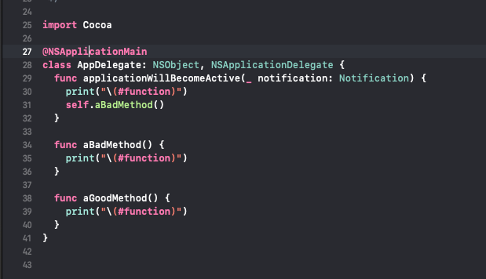

构建并运行。程序会执行输出，即执行了`applicationWillBecomeActive`和`aBadMethod` 2个函数：

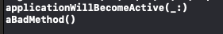


在`aBadMethod`函数名上创建断点，再次构建并运行。

代码悬停后，导航至`Debug\Debug Workflow\Always Show Disassembly`。

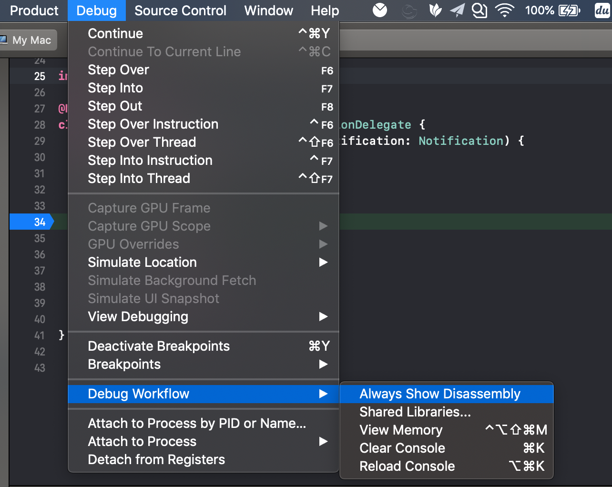


将展示实际的汇编代码：

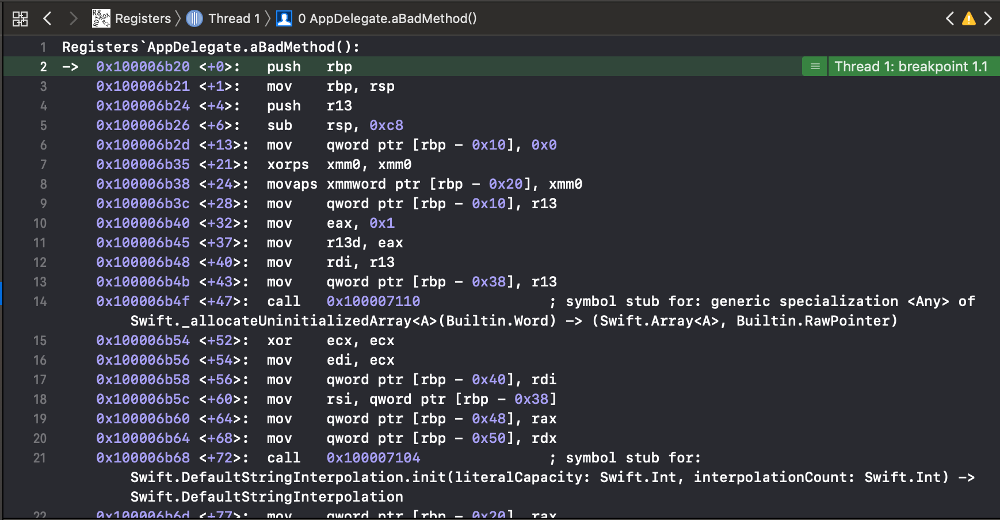


键入 LLDB 以下命令，打印 RIP 寄存器：

```
(lldb) pan_cpx $rip
```

注意到输出 LLDB 的信息与上图绿色突出显示的地址相匹配。

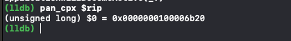

在 LLDB 中输入以下：

```
(lldb) image lookup -vrn ^Registers.*aGoodMethod
```

这是一个 `image lookup `命令，其中包含典型的正则表达式参数和一个附加参数`-v`，它将 dump 详细的输出。

你会得到相当多的信息。直接（cmd+F）搜索内容`range = [`。如图红色部分是我们要的内容。

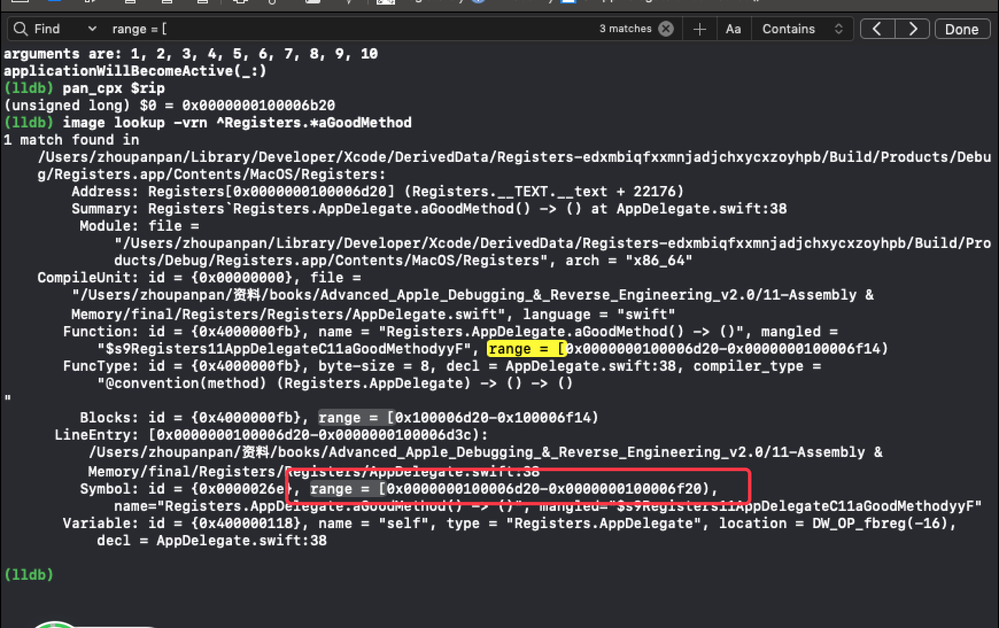


**此地址称为加载地址。即是该函数在内存中的实际物理地址。**

这与`image lookup`命令中常规的输出不同，它只显示函数相对于可执行文件的偏移量，也称为实现偏移量（implementation offset）。在查找函数的地址时，必须区分`加载地址`和可执行文件中的`实现偏移量`，因为它们不同。

copy 这个新地址。对于该示例，`aGoodMethod`的加载地址位于`0x0000000100006d20`。现在，将其写入 RIP 寄存器。

```
(lldb) register write rip 0x0000000100006d20
```

在 Xcode 中点击 continue 按钮（LLDB 中 continue命令此处有bug。实际测试：两者都会无限循环下去）。

查看输出，可以看到`aBadMethod()`函数没有被执行，而`aGoodMethod()`被执行。

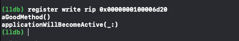

> 附：修改 RIP 寄存器实际上有点危险。您需要确保在 RIP 寄存器中保存的原有数据，其它寄存器不会将其应用于新的函数，否则会对寄存器做出错误的假设。由于`aGoodMethod`和`aBadMethod`在功能上非常相似，而且在开始时就停止了，由于没有对 Registers 项目执行任何优化，所以不存在上述问题。


## 寄存器 和 分解 bits

x64 有16个通用寄存器：RDI、RSI、RAX、RDX、RBP、RSP、RCX、RDX、R8、R9、R10、R11、R12、R13、R14和R15。

为了保持与以前的体系架构（如 i386 的 32 位体系架构）的兼容性，寄存器可以分成 32、16 或 8 位值。

对于历史悠久跨不同体系架构的寄存器，寄存器名称中最前面的字符决定了其大小。

例如，RIP 寄存器以 R 开头，表示 64 位。如果你想要对应的 32 位 RIP 寄存器，你可以用一个 E 替换掉 R 字符，得到 EIP 寄存器。

|64-bit|32-bit|16-bit|8-bit|
|:--:|:--:|:--:|:--:|
|rax|eax|ax|al|
|rbx|ebx|bx|bl|
|rcx|ecx|cx|cl|
|rdx|edx|dx|dl|
|rsi|esi|si|sil|
|rdi|edi|di|dil|
|rbp|ebp|bp|bpl|
|rsp|esp|sp|spl|
|r8|r8d|r8w|r8l|
|r9|r9d|r9w|r9l|
|r10|r10d|r10w|r10l|
|r11|r11d|r11w|r11l|
|r12|r12d|r12w|r12l|
|r13|r13d|r13w|r13l|
|r14|r14d|r14w|r14l|
|r15|r15d|r15w|r15l|


作用：使用寄存器时，有时传递到寄存器的值不需要使用所有的 64 位。

例如，Bool 数据类型：只需要 1 或 0 来标识 true 或 false即可（尽管在实践中，布尔值将占用寄存器大小中的一个字节）。基于语言特性和约束，编译器知道这一点，有时只会将信息写入寄存器的某些部分。

实践：

构建运行 Registers 项目，悬停。

执行命令，写入 RDX 寄存器 1 个十六进制值：

```
(lldb) register write rdx 0x0123456789ABCDEF
(lldb) p/x $rdx
```

静待片刻。警告：您应该注意，写入寄存器值可能会导致程序 crash，特别是当写入的寄存器中预期含有某种类型的数据时。

因为是 64 bit 程序，将获得 双字 即 64-bit，8 字节，16 个十六进制数值。

打印 EDX 寄存器：

```
(lldb) p/x $edx
```

EDX 寄存器是 RDX 寄存器中最低位的一半。所以只会看到双字中的低位，即一个字。

打印 DX 寄存器，即输出 EDX 寄存器最低位的一半。即半个字。

```
(lldb) p/x $dx
```

打印 DL 寄存器，即输出 DX 寄存器最低位的一半。即 1 个字节。

```
(lldb) p/x $dl
```

**打印 DH 寄存器，即输出 DX 寄存器最高位的一半。**

```
(lldb) p/x $dh
```

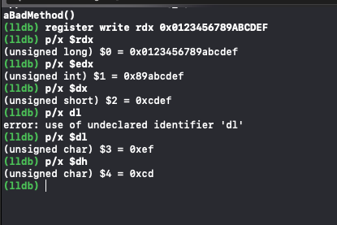

**探索汇编时，注意不同尺寸的寄存器。**寄存器的大小可以提供其中相关值的线索。

例如，您可以通过 AL 寄存器轻松查找到返回 Bool 值的函数，因为布尔值将使用 8 个字节，而 AL 是 64 位`返回值寄存器` RAX 的8 位部分。


## R8 ~ R15 寄存器

由于 R8 ~ R15系列寄存器仅为 64 位体系架构而创建，因此它们使用完全不同的格式来表示较小的对应寄存器。

构建运行 Registers 项目，悬停。将十六进制数值写入 R9 寄存器：

```
(lldb) register write $r9 0x0123456789abcdef
(lldb) p/x $r9
(lldb) p/x $r9d
(lldb) p/x $r9w
(lldb) p/x $r9l
```

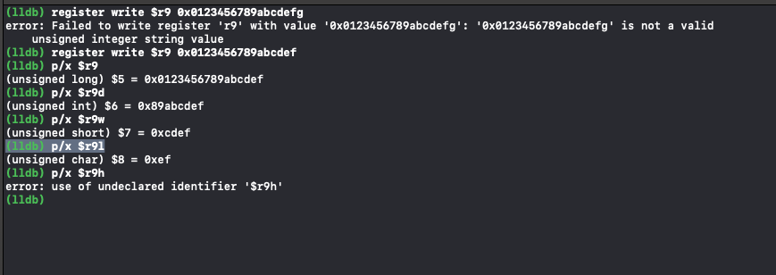


## 分解内存


顾名思义，指令指针实际上是一个指针。它不执行存储在 RIP 寄存器中的指令——它执行的是 RIP 寄存器中指向的指令。

打开 Registers 项目中的`AppDelegate.swift`文件，在`aBadMethod()`方法上设置断点，构建并运行。

代码悬停后，满屏都是操作码和寄存器。**RIP 寄存器的位置，它应该指向函数的最开始。**

对于这次特定的项目构建，`aBadMethod()`的起始地址从`0x0000000100006b20`开始。

打印出 指令指针寄存器 的内容:

```
(lldb) pan_cpx $rip
```

RIP 寄存器指向内存中的一个值。它指向什么？

键入以下命令，注意将地址替换为`aBadMethod()`的起始地址：

```
(lldb) memory read -fi -c1 0x0000000100006b20
```

`memory read`命令接受一个内存地址值并读取该地址所指向的内容。

`-f`命令是一个格式化参数。在本例中，它是汇编指令格式（instruction）。

`-c1`:用`count`或`-c`参数打印一条汇编指令。


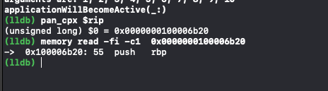

其中 55 代表 0x55，即汇编指令以及操作码，会以十六进制（0x55）提供，负责`push rbp`操作。

重点关注下输出中的`55`。这是针对整个指令的编码，即指令`push rbp`。验证：

```
(lldb) expression -f i -l objc -- 0x55
```

即将`0x55`解释为 x64 操作码指令。

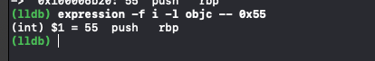


这个命令有点长，但这是因为如果在 Swift 调试上下文中，那么需要切换到 Objective-C 上下文。但是，如果转到 Objective-C 调试上下文，可以使用一个更短的便捷表达式。

尝试单击`Xcode`左侧面板中的另一帧，进入不包含 Swift 或 Obj-C/Swift 桥接代码的 Obj-C 上下文。单击目标是 Obj-C 函数的任何帧：

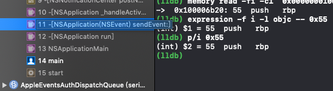

键入便捷命令：

```
(lldb) p/i 0x55
```

回到手头的应用程序。在lldb中键入以下内容，替换

再次使用`aBadMethod()`函数起始寻址：

```
(lldb) memory read -fi -c10  0x0000000100006b20
```

10倍输出：

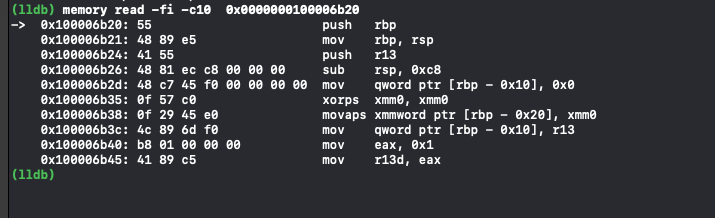

汇编指令可以有可变的长度。

查看第一条指令，第一条指令的长度为 1 字节，用 0x55 表示。下一指令的长度为 3 个字节。

在 Obj-C 上下文中，尝试打印出此指令的操作码。它有 3 个字节，串联即可：

```
(lldb) p/i 0x4889e5

```

但却得到一个与``mov  rbp, rsp``无关的指令。


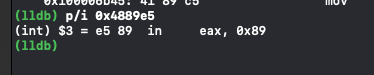

引出下文，即 字节顺序（endianness）


## 字节序列

x64 和 ARM 系列体系架构设备都使用小字节序列（little-endian），这意味着存储在内存中的数据，优先使用低位字节。

如果要将数字 0xabcd 存储在内存中，则优先存储 0xcd 字节，然后存储 0xab 字节。

上一节中，指令 0x4889e5 在内存中的存储方式为：优先存储 0xe5，后跟 0x89，后跟 0x48。

反转字节后，键入命令：

```
(lldb) p/i 0xe58948
```

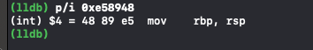


关于字节序列的另一示例：

```
(lldb) memory read -s1 -c20 -fx 0x0000000100006b20
```

读取自 `0x0000000100006b20 `起始地址的内存信息。

-s1:读取1个字节的大小块

-c20：读取20个块

当更改可选项时，内存值组合在一起，由于使用了小字节序列，它们是反转的。

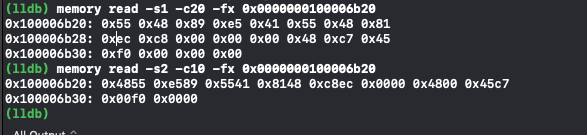


内存的大小不仅会带来一个可能不正确的答案，还会有顺序上的问题。


