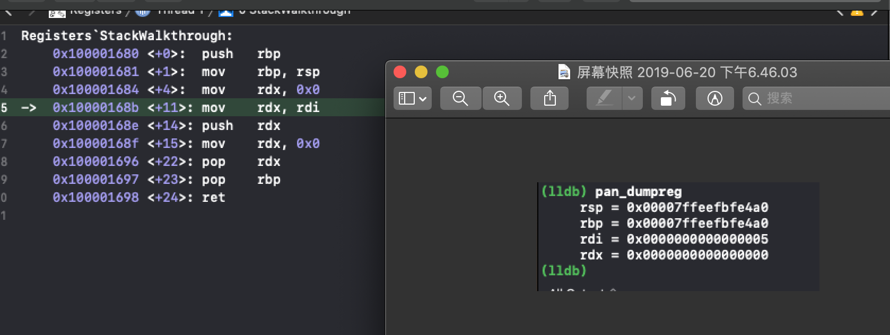

当有 6 个以上的参数传递到给函数时，多余的参数将通过栈传递（在某些情况下，这并非完全正确）。**通过栈传递**是什么意思？本章将从汇编的角度深入调研函数被调用时会发生什么，即调研与栈相关的寄存器以及栈中的内容。

逆向工程程序时，了解堆栈的工作方式非常有用。因为当没有调试符号可用时，可以帮助推断在某函数中操作了哪些参数。

在后续章节，您将使用本章中的知识在 LLDB 中构建一个命令，该命令将遍历内存中的函数，以查找可能感兴趣的类。

## 栈

在`线程、帧和步进`章节中已有所论述。

当程序执行时，内存被布局:栈从`高地址`开始向下增长，朝着较低的地址；也即，朝着堆（heap）。

> 附：在某些体系架构中，栈向上增长。但对于 x64 和 iOS设备的 ARM，均是向下扩展 栈 的。


栈 自`高地址`向 `低地址` 增长的图示：


栈从一个`高地址`开始。具体有多高，由操作系统的内核决定。

内核为每个正在运行的程序（确切来讲，每个线程）提供栈空间。

栈的大小是有限的，并且会随着内存地址空间的向下增长而增大。当栈上的空间用完时，指向栈顶`top`的指针从最高地址向下移动到最低地址。

一旦栈达到内核给定的有限大小，或者如果它越过了堆的边界，就称栈溢出。这是一个致命的错误，通常被称为栈溢出（ stack overflow）。

## 栈指针 & 基指针寄存器

两个重要的寄存器是 RSP 和 RBP。

**RSP：**栈指针寄存器。指向特定线程里的栈头部。

> 栈头将向下增长，因此当数据项添加到栈时，RSP 将递减。
> 
> RSP将始终指向栈的头部。


图示中，栈指针如下：

1. 栈指针当前指向 frame3
2. 指令指针寄存器指向的代码调用了一个新函数。栈指针被更新为指向一个新的帧（frame4），该帧可能是负责从指令指针寄存器调用的这个新函数内部的空间和数据。
3. 执行完 frame4，控制流程恢复至 frame3。栈指针从先前对 frame4 的引用 pop 并重新指向 frame3。

**RBP：**基指针寄存器。

> 在执行一个函数的过程中有多种用途。
> 
> * 程序执行在方法/函数内部时，使用 RBP 中的偏移量访问局部变量或函数参数。这是因为函数序言中函数开始处 RBP 设置为 RSP 寄存器的值。
> 
> * RBP 先前的内容在设置为 RSP 寄存器的值之前存储在栈上。这也是函数序言中发生的第一件事。
> 
> * 因为 RBP 值保存在栈上，并设置在当前的栈指针上，所以只需知道 RBP (先前)的值，就可以遍历栈了。当调试器向您显示堆栈跟踪时，它会执行此操作。

图表阐释：


当函数序言设置完成后，RBP 的内容将指向前一个 RBP 的栈帧下方。

> 附：通过单击 Xcode 中的帧或使用 LLDB 跳转到不同的栈帧时，RBP 和 RSP 寄存器 都将更改值以对应新帧！因为函数的局部变量使用 RBP 的偏移量来获取它们的值。
>
> 如果 RBP 没有改变，您将无法打印该函数的局部变量，程序甚至可能崩溃。


**验证方案：**

在选择每个 frame 时，分别打印 RSP 和 RBP

```
(lldb) pan_cpx $rsp
(lldb) pan_cpx $rbp
```

当 debug 程序时，调试信息能引用来自 RBP 的偏移值以获取变量。这些偏移量会给定名称，与源代码中为变量指定的名称相同。

当编译一个程序并为发布而优化时，打包到二进制文件中的调试信息将被删除。尽管删除了这些变量和参数的引用名称，但仍然可以使用栈指针和基指针的偏移量来查找存储这些引用的位置。

## 与栈相关的操作码

目前已学习 调用约定 和 内存布局，接下来介绍操作码在 x64 汇编中实际执行的操作。

#### push 操作码

当需要将 `int`、`Obj-C 对象实例`、`Swift 类`或`引用`等内容保存到栈中时，将使用`push`操作码。

push 减小栈指针（栈向下增长），然后存储至 RSP 新值指向的内存地址的值中。

执行 push 指令后，最近 push 的值将位于 RSP 指向的地址处。前一个值将是 RSP + 最近 push 值的大小——对于64位体系结构，通常是8个字节。


示例：

```
push 0x5

```
操作将减小 RSP，并将 0x5 存储至 RSP 指向的内存地址中。

c的伪代码：

```
RSP = RSP - 0x8
*rsp = 0x5
```


#### pop 操作码

pop 操作码与 push 操作码完全相反。pop 从 RSP 寄存器中获取值并将其存储到 destination 中。然后，RSP 增加了 0x8，即栈变小，增长到更高的地址。

示例：

```
pop rdx
```

将 RSP 指向的内容储存至 RDX 寄存器，增加 RSP 地址，伪代码：

```
RDX = *RSP
RSP = RSP + 0x8
```


#### call 操作码

call 操作码负责执行函数。

call 首先 push 一个地址，然后跳至该函数去执行。（该地址是被调函数执行完成后，返回的地址。）

示例：存在函数 `func`，在内存中地址是`0x7fffb34df410`，如下：

```
0x7fffb34de913 <+227>: call   0x7fffb34df410
0x7fffb34de918 <+232>: mov    edx, eax
```

* 指令执行时，RIP 寄存器首先递增,然后执行指令。
* 因此，当 call 指令执行前时，RIP 寄存器将增加到`0x7fffb34de918`，然后执行`0x7fffb34de913`指向的 call 指令。
* 因为这是 call 指令，所以 RIP 寄存器会被 push 到栈上，然后将 RIP 寄存器设置为值`0x7fffb34df410`，即要执行的函数的地址。


伪代码：

```
RIP = 0x7fffb34de918
RSP = RSP - 0x8
*RSP = RIP
RIP = 0x7fffb34df410
```

至此，在位置`0x7fffb34df410`处继续执行。


#### ret 操作码

ret 操作码与 call 操作码相反，它从栈中弹出顶值（即 call 操作码 push 的返回地址，前提是汇编代码中 pop 和 push 相匹配），然后将 任IP 寄存器设置为此地址。因此，执行返回到调用函数的位置处。


push 操作码与 pop 操作码数目相匹配非常重要。否则栈将失去同步。

例如，如果一个 push 没有对应的 pop，那么在在函数的末尾 ret 发生时，错误的值将被弹出。执行结果将返回到某个随机位置，甚至可能不是程序中的有效位置。

幸运的是，编译器将负责同步 push 和 pop 操作码。

## 实战：监听 RBP & RSP

实战：RBP 和 RSP 寄存器，以及操作栈的 4 个操作码

在 Registers 项目中有函数`StackWalkthrough(int)`。
该函数有一个整型参数，并以汇编写就（AT&T 风格）。


源码解析：

```
      push  %rbp	;1. 保存 RBP 内容存至栈中(*RSP=RBP,RSP减少)
      movq  %rsp, %rbp  ;2. RBP = RSP
      movq  $0x0, %rdx	 ; RDX = 0
      movq  %rdi, %rdx	 ; 3. RDX = RDI
      push  %rdx    ; 4. 将 RDX 内容存至栈中(*RSP = RDX,RSP减少)
      movq  $0x0, %rdx ; RDX = 0
      pop   %rdx		;5. 栈顶数据 pop 到 RDX 中(RDX=*RSP,RSP增加)
      pop   %rbp   ;6. 栈顶数据 pop 到 RBP 中(RBP =*RSP,RSP增加)
      ret  ;7. 自函数返回(RIP =*RSP,RSP增加)
```

此函数通过桥接文件`Registers-Bridging- Header.h`，使之可以从 Swift 中调用此方法。

调用：

```
override func awakeFromNib() {
  super.awakeFromNib()
  StackWalkthrough(5)
}
```

调用函数`stackwalkthrough `并传参数为 5。5 只是用于
显示栈工作方式的简单值。

在函数`stackwalkthrough `上创建符号断点，构建并运行。


这个函数接受传递给它的整型参数（第一个参数在 RDI 中传递），将其存储到 RDX 寄存器中，并将这个参数 push 到栈上。然后将 RDX设置为 0x0，然后从栈中 pop 出值存储回 RDX 寄存器。


在 LLDB 中研究寄存器。

保持符号断点，并再添加调用处断点：


构建运行，悬停后，执行`Debug\Debug Workflow\Always Show Disassembly`,将看到 Intel 风格汇编：


call 即将进入`StackWalkthrough`函数。

现在，逐步追踪每个汇编指令，同时打印出四个感兴趣的寄存器：`RBP, RSP, RDI 和 RDX`。创建便捷指令,dump 4 个寄存器：

```
(lldb) command alias pan_dumpreg register read rsp rbp rdi rdx
```


对于本节，pan_dumpreg 的输出将覆盖在每个汇编指令上，以准确显示每个寄存器在每个指令期间发生的变化。


综合 2 者，视图如下：


一旦跳转到函数调用中，密切关注 RSP 寄存器，因为一旦 RIP 跳转到`StackWalkthrough()`的开头，它就会发生变化。

RDI 寄存器将包含第一个参数的值，在本例中为 0x5。

执行 单步 操作,执行下一条指令，并悬停：

```
(lldb) si
# or (lldb) thread step-inst
```

进入了`StackWalkthrough`函数中:


注意 RSP 寄存器的差异。RSP 指向的值现在将包含上一个函数的返回地址。对于这个特定的示例，RSP 目前指向`0x00007ffeefbfe4b0`，指向的内存地址是`0x0000000100002dd0 `，即在`awakeFromNib`中紧跟 call 后的地址。

验证内存地址：

```
(lldb) x/gx $rsp
```

* x: memory read 指令的缩写
* /gx:giant word(8 字节)

 


继续执行 si


RBP 中的值被 push 到栈中，这意味着以下两个命令将产生相同的输出。执行这两个命令进行验证。

```
(lldb) x/gx $rsp
```

查看 RBP 中的值：

```
(lldb) p/x $rbp
```

继续 si：将 RSP 的值传递给 RBP，验证其相等性：

```
(lldb) p (BOOL)($rbp == $rsp)
```


继续 si，RDX 置为 0



继续 si ，将 RDI 值 传递给 RDX：


继续 si ，将 RDX 值存至栈中，意味着 RSP 减小，此时 RSP **指向的内容**将**指向**值 RDX 的值(0x5)：

```
(lldb) p/x $rsp  ;指向的内容
(lldb) x/gx $rsp ;指向的内容 再次指向的栈内容
```


继续 si ，直至执行了 `pop rdx` 操作：即将 RSP 指向地址指向的内容(0x5)传递给 RDX，RSP + 0x8：


继续 si 


RBP 将从栈中 pop，并重新分配回输入此函数时的原始值。调用约定指定 RBP 应在函数调用之间保持一致。也就是说，当 RBP 离开函数时，不能更改原始值，即要恢复原来的值。

执行 ret 操作码。注意 RSP 值是否会改变。

执行 si：


返回地址被从栈中取出并设置到 RIP 寄存器；流程控制重新在`awakeFromNib`中恢复，


## 栈 和 7+ 参数

x86_64 的调用约定规定，函数参数使用`RDI, RSI, RDX, RCX, R8, R9` 6 个寄存器，当参数＞6时，则需要用栈。

> 附：当向函数传递大型结构时，也可能需要使用栈。每个参数寄存器只能容纳 8 个字节（64 位体系架构），因此如果结构需要 8 个以上的字节，那么它也需要在栈上传递。在调用约定中，有严格的规则来定义工作机制，所有编译器都必须遵守这些规则。


在项目中打开`ViewController.swift`可以看到多参数函数`executeLotsOfArguments(one:two:three:four:five:six:seven:eight:nine:ten:)`，断点调用处，构建运行，悬停查看汇编代码。


call 负责函数的执行。由于在 RIP 所在的位置和 `viewDidLoad`的末尾之间只有一个 call 操作码，意味着此 call 便是负责调用`executeLotsOfArguments(one:two:three:four:five:six:seven: eight:nine:ten:)`函数的。

call 该函数之前，其余指令作用为设置栈以传递附加参数。

从`mov ecx，0x1`开始，将前 6 个参数放入相应的寄存器中(红框1)。

但第 7 个参数及以上需要在栈上传递。这是通过 红框 2 完成的。


包含`rsi`和可选值的括号表示获取引用，就像 C 编程中的`*`一样。上面红框 2 的第一行表示`将 0xa 放入 rsi+0x18 指向的内存地址`，第二行表示`将 0x9 放入 rsi+0x10 指向的内存地址`，依此类推。

这是将值放入栈。但要注意，这些值不是显式使用 push 指令（rsp 减小）的。为什么？

**释：**在 call 指令期间，返回地址被 push 到栈上。然后，在函数序言中，将基指针 push 到栈上，然后将基指针设置为栈指针。

编译器实际上会在栈上腾出空间。也就是说，编译器根据需要为函数中的局部变量在栈上分配空间。

通过在函数序言中使用`sub rsp，value`指令，可以很容易地确定是否为栈帧分配了额外的空间。

例如，单击`viewDidLoad`栈帧并滚动到顶部。观察创造了多少空间


编译器在这里有所优化；它知道它已经为自己在栈上分配了一些空间，并在函数调用传递额外参数之前填充了值，而不是进行大量的 push。单个 push 指令将涉及更多的 RSP 写入，这将降低效率。

## 栈和调试信息

栈不仅在调用函数时使用，而且还用作函数局部变量的临时空间。

创建符号断点，并构建运行悬停。


观察信息：


为什么`one`引用一个看似随机的值？

答案在嵌入到项目中的`DWARF Debugging Information`里。dump 这些信息，以了解内存中`one`变量所引用的内容。

```
(lldb) image dump symfile Registers
```

在大批输出中，搜索(cmd+F)：`one`，获取主要信息如下：


根据输出，名为`one`的变量类型为`Swift.Int`，在`executeLotsOfArguments`函数中，其位置在`DW_OP_fbreg(-32)`中。即基指针减去 40，即`rbp - 32`。或者十六进制，`rbp-0x20`。

这是重要信息。它告诉调试器称为`one`的变量总是可以在这个内存地址中找到。(变量有效,作用域内)

为什么它不能只是 RDI?

因为它是传递给函数的值，也是第一个参数。RDI 稍后可能需要在函数中重用，因此使用栈是存储的一个更安全的选择。

接下来查找汇编代码。


在其上创建断点，执行。并持续查看内容。

记住，RDI 将包含传递给函数的第一个参数。因此，为了使调试器能够看到`one`的值，需要将 RDI 写入存储`one`的地址。即`rbp - 0x20`。


`one`改变时`rbp - 0x20`也需要改变。这就是为什么调试版本比发布版本慢得多。


## 探索 栈

汇总：

如在一个函数中，并且该函数已经完成了函数序言的执行，那么以下各项将对 x64 汇编有效：

* RBP 将指向此函数栈帧的开始。

* *RBP 将包含上一栈帧开始的地址。（在LLDB中`x/gx $rbp`查看）。

* *(rbp + 0x8)将指向栈追踪中上一个函数的返回地址。（` x/gx '$rbp + 0x8'`）。

* *(rbp + 0x10)将指向第7个参数（如果有）。

* *(rbp + 0x18)将指向第8个参数（如果有）。
* *(rbp + 0x20)将指向第9个参数（如果有）。
* *(rbp + 0x28)将指向第10个参数（如果有）。
* RBP - X:其中 X 是 0x8 的倍数，将引用该函数的局部变量。


## 实战


将 LLDB 连接到程序（任何程序、有源码或无源码），并仅使用 RBP寄存器遍历栈帧。

在容易触发的方法上创建断点。一个很好的例子是`-[NSView hitTest:]`，如果您附加到 MacOS 应用程序（如 Xcode），单击一个视图。

确保添加的断点不是 Swift 函数。因为要检查寄存器（Swift 上下文不支持）

触发断点，确保在第 0 帧。

选择帧：

```
(lldb) f 0

```

应当在函数顶部看到 2 个指令：

```
push   rbp
mov    rbp, rsp
```

这些指令构成函数序言的开头，将 rbp push 到栈上，然后将 rbp设置为 rsp。

使用 si 跳过这 2 个指令。

现在为这个栈帧设置了基指针，通过检查基准指针可以遍历栈帧了。

```
(lldb) p uintptr_t $Previous_RBP = *(uintptr_t *)$rsp
```

现在`$Previous_RBP`等于老的 RBP，即从调用这个函数的函数开始的栈帧。


回想一下栈帧上的第一件事是函数的返回地址。因此，可以找到上一个函数将返回的位置。因此，便可定位调试器将在第 2 帧中停止的位置。

验证：

```
 (lldb) x/gx '$Previous_RBP + 0x8'
```

输出的返回地址：

```
0x7fff5fbfd718: 0x00007fffa83ed11b
```

跳转第 2 帧：

```
(lldb) f 2
```

可以看到 地址相等。


