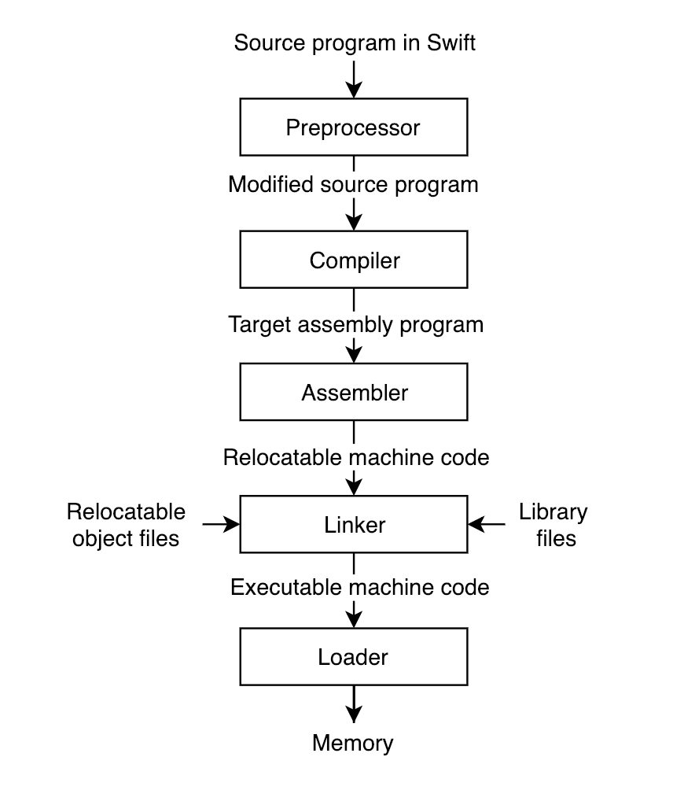
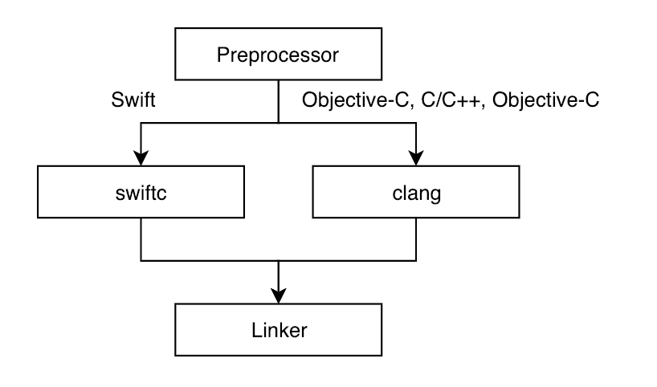

本文翻译自原文：[Understanding Xcode Build System](http://www.vadimbulavin.com/xcode-build-system/)，并做部分精简。

每个 Swift 程序在成功运行到真机之前，需经过一系列的转换。该处理过程一般由 Xcode 编译系统管理。在本文中我们将了解 Xcode 编译系统的每个部分。

## 问题陈述

任何计算机系统都由两部分组成：硬件和软件。

**硬件**是计算机的物理组成部分，如显示器或键盘。硬件通常由软件控制，即一组命令集合指导着硬件做具体的工作。**软件**负责协调处理过程，硬件负责具体的执行工作，因此它们相辅相成。

作为软件工程师，我们主要应聚焦于软件部分。然而，硬件并不能直接理解 Swift 代码，它只接受 2 种类型的电荷形式的指令：`逻辑 0`和`逻辑 1`。

接下来的问题是：`如何将 Swift 代码转换为硬件可以识别的形式？` 答案是语言处理系统（language processing system）。

## 语言处理系统

**语言处理系统**是一组程序集合。它可以将任意源语言编写的指令集生成可执行程序。它允许程序员使用更高级语言而非直接编写机器代码，这大大降低了编程的复杂性。

在 iOS 和 MacOS 开发中，我们每天使用的语言处理系统即为**Xcode 编译系统（Xcode Build System）**。

## Xcode 编译系统

**Xcode 编译系统**的主要目标是协调各执行任务，并最终产生一个可执行程序。

Xcode 运行一系列工具，并在其中传递许多参数，协调他们的执行顺序，并行性等。毫无疑问，在编写下一个 Swift 项目时，这一系列工作肯定不是你想手动处理的。

大多数语言处理系统，包括 Xcode 编译系统，由5个部分组成：

1. 预处理器 （Preprocessor）
2. 编译器	（Compiler）
3. 汇编器	（Assembler）
4. 链接器	（Linker）
5. 加载器	（Loader）

组成部件以下图所示方式协调工作：

让我们深入探究每个步骤：

###### 1. 预处理

预处理的目的是将程序转换为可供编译器识别并可处理的中间态。使用真实语句替换宏定义，检查依赖关系并解析预处理指令。

考虑到 Swift 编译器没有预处理器，我们不允许在 Swift 项目中执行宏定义。尽管如此，**Xcode 编译系统**通过在 项目构建设置（build settings）中设置 `Active Compilation Conditions` 使能预处理，也算是部分的补偿了该流程。

Xcode 通过低级编译系统 `llbuild` 解析依赖关系。它是开源的，了解更多：[swift-llbuild Github page](https://github.com/apple/swift-llbuild)。

###### 2. 编译器

编译器是一种程序。可将`源程序`（ A 语言）映射为语义等效的`目标程序`（ B 语言）。

换句话说，它将 Swift，Objective-C 和 C/C ++ 代码转换为机器代码，并不会失去前者的功能含义。

Xcode 使用两种不同的编译器：

1. `clang`：是 Apple 的官方编译器，用于 C 语言系列（Obj-C、Obj-C++、c/c++等）。开源：[swift-clang](https://github.com/apple/swift-clang)
2. `swiftc`：Swift 编译器exe文件。用于编译运行 Swift 源码。[Swift language repository](https://github.com/apple/swift)，你应至少浏览过该链接一次。

编译过程如下图所示：

编译器由 2 个主要部分组成：`前端`和`后端`。

1. `前端`：将源程序拆分为一系列单独部件，其中不含任何语义或类型信息，并在它们上强制使用语法结构。

	* 然后编译器使用此结构来生成源程序的**中间表示态**。

	* 创建和管理符号表：收集有源程序相关信息。
	* 符号表：保存变量、函数、类的名字，即为映射到每个数据片段的符号。

	> 符号(Symbol):是`代码片段`或`数据片段`的名称。

	
	在 Swift 编译器中，中间表示态命名为 **Swift 中级语言（SIL）**。它用于进一步分析和优化代码，此时不能直接从 SIL 生成机器代码，因此 SIL 需再次进行 **LLVM 中间表示态** 的转换。
	
2. `后端`：在该阶段，**中间表示态**转换为**汇编代码**。

###### 3. 汇编器

汇编器：即为汇编程序。将人类可读的**汇编代码**转换为可重定位的**机器代码**。它生成 `Mach-O` 文件，此类文件基本上是代码和数据的集合。

下面进一步详述机器代码和 Mach-O 文件：

1. `机器代码`：是一种数字语言，表示可由CPU直接执行的**一组指令集**。它被命名为可重定位，因为目标文件无论在地址空间中的哪个位置，指令集都将相对于该空间执行。
2. `Mach-O`文件：表示目标文件、可执行文件、库文件。是 iOS 和 MacOS 系统的特有文件格式。它是以一些有意义的块分组成的**字节流**，可以在 ARM 处理器（iOS）或 Intel 处理器（Mac）上运行。

###### 4. 链接器

`链接器`：计算机程序。它将各`目标文件`和`库`合并在一起，生成一个 `Mach-O可执行文件`，以在 iOS 或 macOS 系统上运行。

输入文件类型：

1. 目标文件：生成自汇编阶段
2. 库文件：各种类型的库文件，如`.dylib`、`.tbd`、`.a`等。

输出文件类型：Mach-O可执行文件

细心的读者可能已经注意到，汇编器和链接器都会生成Mach-O文件作为其最终输出。它们之间一定有一些区别，right ？

在汇编阶段产出的目标文件并不完整。在引用其他目标文件或库的地方存在部分的功能缺失。比如在代码中使用了`printf`函数，那么链接器的作用即是：将`printf`符号和实现了`printf`功能的`libc`库粘合在一起，同时它也使用了在编译阶段创建的`符号表`来解析跨不同目标文件和库的引用。

> 在 Xcode 中构建具有上述特性的 Swift 项目时，您可能已经偶然发现了“未定义的符号”错误。

###### 5. 加载器

`加载器`：操作系统一部分,将程序带入内存并执行它。

`加载器`分配运行程序所需的内存空间并初始化各寄存器。

 
## 总结

不可低估`语言处理系统（ language processing systems）`在软件工程中的重要性。我们可以自由选择几乎任何的高级编程语言（Swift、Obj-C），而非编写硬件理解的 1 和 0 的二进制代码。
语言处理系统将完成剩下的工作，以生成可在 iPhone ，Mac 或任何其他终端设备上运行的`可执行程序`。

作为一名 iOS/MacOS 开发者，我们使用 Xcode 编译系统处理日常事务。它的主要组成：预处理器、编译器、汇编器、链接器、加载器。针对不同的开发语言 Swift 和 Obj-C，Xcode 使用了不同的汇编器 即`swiftc` 和 `clang`。

了解 Xcode 的编译过程属于基础知识范畴，并且与初学者和经验丰富的开发人员高度相关。

