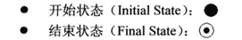
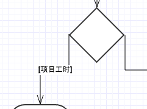

# UML之活动图

## 概念
1. 结构建模：表达静态内容；（类图）
2. 行为建模：表达动态内容；（活动图、顺序图、状态机图）
3. 活动图（Activity Diagram）：表达流程的常用UML图
4. 针对行为建模，流程可能是某一个角色通过多个动作来完成某项工作，也可能是多个角色参与，历经多个动作步骤，并完成某项工作。

## 图详解
1. 开始状态和结束状态（一个开始态、一个或多个结束态）

	
2. 一个活动（Activity即一个步骤）：圆角矩形+主谓宾描述语

	
3. 条件判断：分支菱形（每条分支上使用[条件]阐述条件）

	
4. 合并分支：合并分支菱形（前面若有分支线路，后面可能合并）

	
5. 综合上述，给出一个完整示例图解：

	
6. 泳道分区（Swimlanes）：更好的表达Activity的发起者

	
7. 并行分支：有分支，必须有会合（黑短棒）

	

## 文详解

1. 对象流：工作产品的表达

	> 活动图中的矩形框，文字带下划线的即为对象
	
2. 连接件：活动图的组织

	> 左边：指向另一张图
	>
	> 右边：从此处开始继续活动图
	>
	> 
	
3. 活动的粒度问题

	> 活动和动作：活动最终可细分n个动作；动作是不可再分的步骤。
	>
	> 
	
## 示例
1. 一个活动图只表示一个事件的流程
2. 一个活动图：目的、角色参与、先绘主干再分支、适当注解
	
	
## 结语

1. 活动图语法

	
2. 对象流

	
	
3. 步骤

	> 1. 明确流程的目的
	> 2. 流程的角色参与
	> 3. 先主干，逐渐添加必要的分支（适当注释）
	