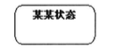
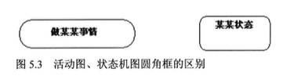
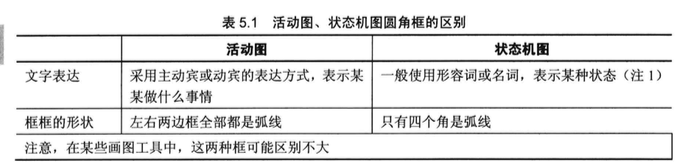
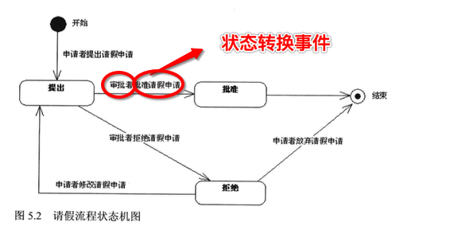
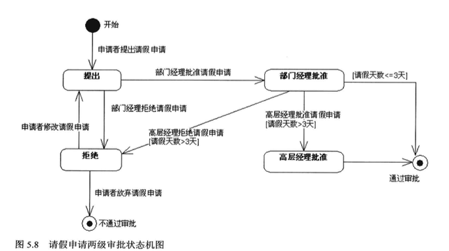
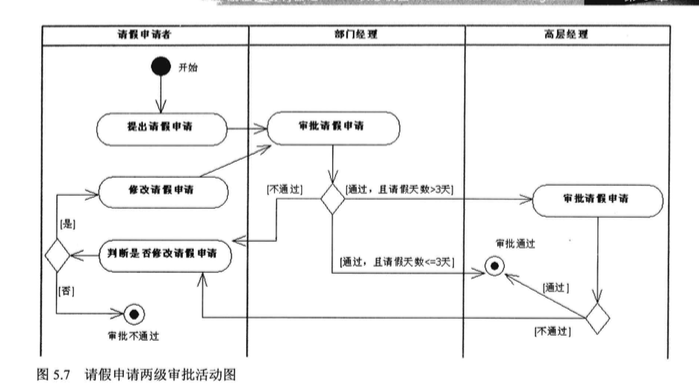

# UML之状态机图

## 概念
1. 状态机图：针对某个事务的状态变化来展示流程

	> 活动图：通过活动先后顺序来展示流程

2. 一个开始状态、1个或多个结束态

	> 1. 开始结束状态图
	>
	> 
	>
	> 2. 圆角矩形表示状态
	>
	> 
	
3. 活动图和状态机图的(圆角矩形)区分

	
	
4. 区别对比

	
	
## 实例
1. 请假流程

	
2. 增强版

	> 1. 状态的确定精确与否，是衡量状态机图好坏的标准。
	> 2. 多级审批情况
	
	
	
3. 对应的活动图：

	

## 总结
1. 流程的目的
2. 角色参与确定
3. 围绕的事务确定、以及其状态确定
4. 精简状态，转换
