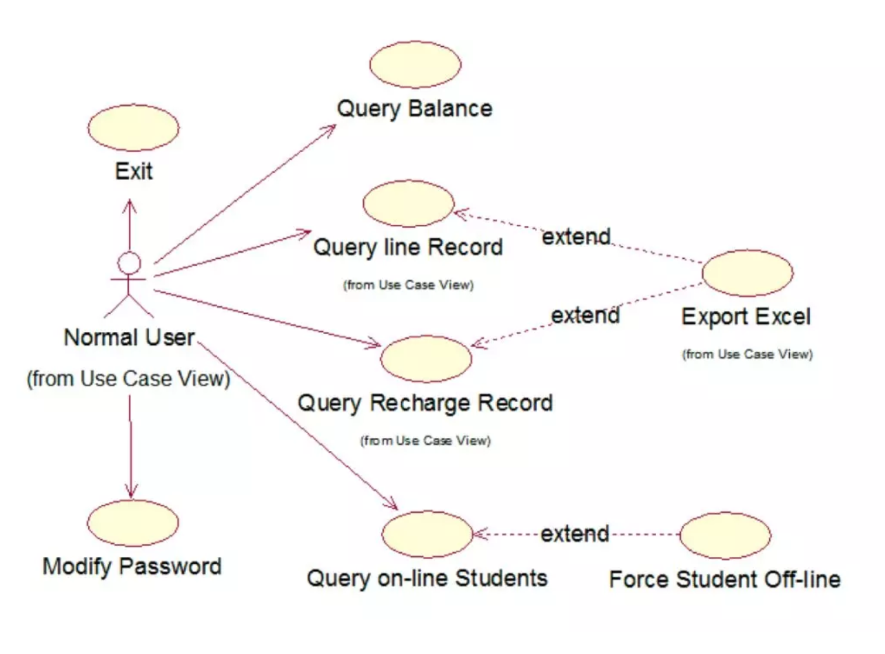
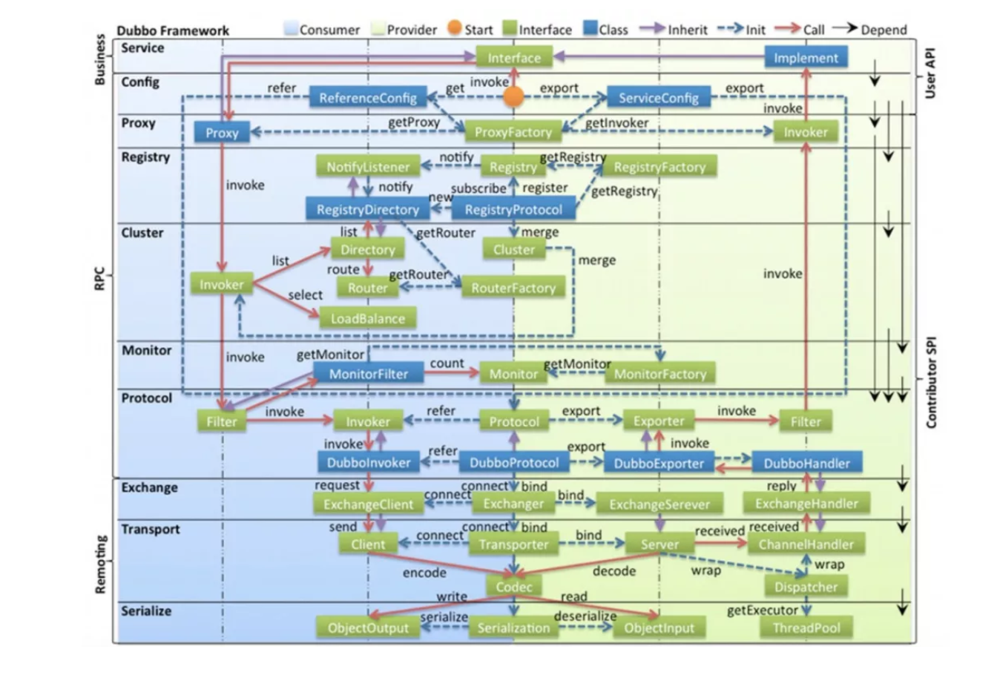
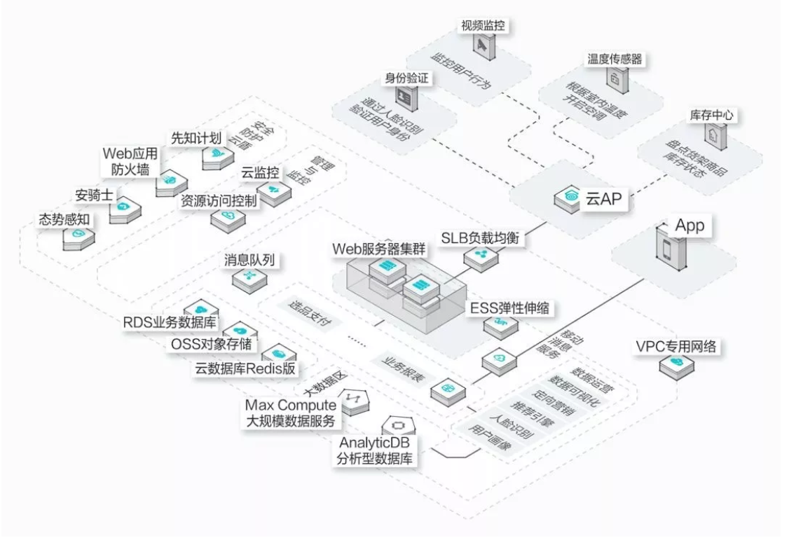
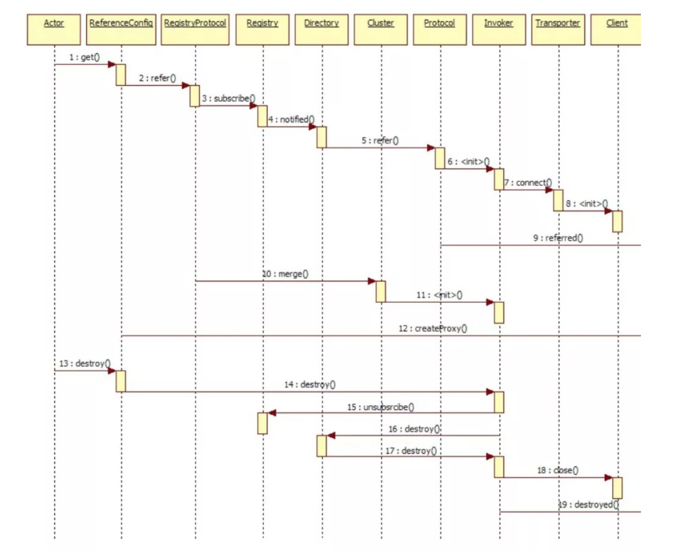
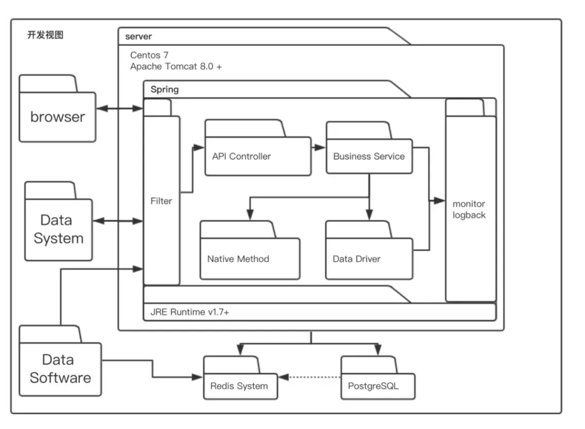
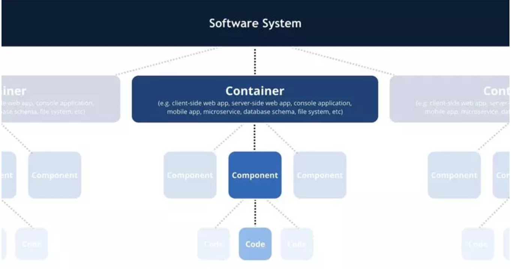
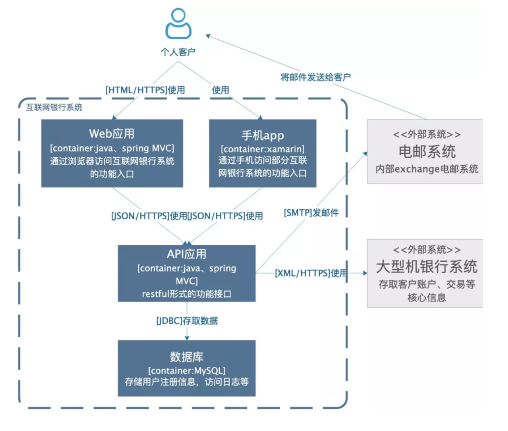
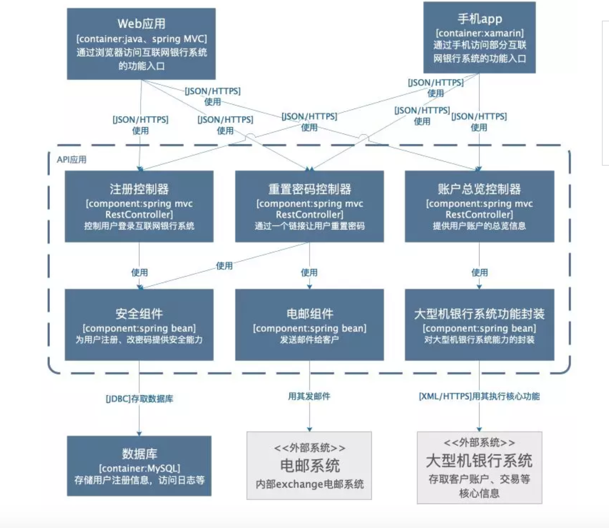
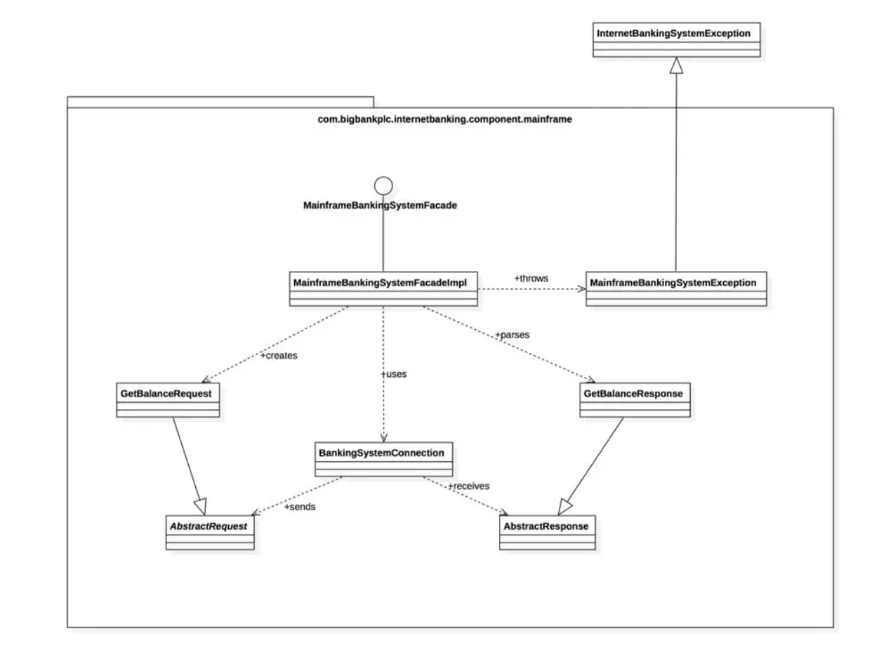

## 参考

1. 如何画出一张合格的技术架构图：[https://mp.weixin.qq.com/s/1hPZacqJuUeElyHiMxa9rw](https://mp.weixin.qq.com/s/1hPZacqJuUeElyHiMxa9rw)
2. 书籍：《程序员必读之软件架构》
3. C4官网：[https://c4model.com/](https://c4model.com)

## 概念

1. ``架构``： 系统中的**实体**及**实体之间的关系**的抽象描述，是一系列的决策。
2. ``架构图``：抽象描述 各组件之间的**相互关系**和**约束边界**，以及软件系统的**整体轮廓**、**物理部署**、**演进方向** 的整体视图。

## 架构图作用

1. 解决沟通问题，减少歧义：一图胜千言，清晰明了。
2. 让干系人遵循架构决策，有效的信息载体。

## 优秀架构图标准

* 明确的受众群体
* 针对受众群体，是否准确的传达了信息
* 自描述的，不需额外的解释
* 具备一致性和准确性，可与代码相呼应

即 

* 非技术层面：受众有没有准确的接收到想传递的信息。
* 技术层面：自描述，与代码呼应，含义一致。

## 分类

流行分类：`4+1`视图：

`4`：场景视图、逻辑视图、物理视图、处理流程视图

`1`： 开发视图

#### `4-1`：场景视图

* 用于描述 系统的**参与者**与**功能用例**间的关系
* 反应系统的最终需求和交互设计。
* 通常由`用例图`表示。

 

#### `4-2`：逻辑视图

* 用于描述 系统软件功能拆解后的**组件关系**、**组件约束**、**边界**
* 反应系统**整体组成**、系统如何**构建的过程**
* 通常由UML的`组件图`、`类图`来表示

#### `4-3`：物理视图

* 用于描述 系统软件到物理硬件的**映射关系**
* 反应系统的组件是**如何部署**到一组计算机节点上的
* 用于**指导** 软件系统的 **部署实施**过程

#### `4-4`：处理流程视图

* 用于描述系统软件 组件之间的**通信时序**、数据的**输入输出**
* 反应系统的`功能流程`和`数据流程`
* 通常由 `时序图`和`流程图` 表示

#### `1`：开发视图

* 用于描述系统的 **模块划分和组成**、细化到内部包的**组成设计**
* 服务于`开发人员`
* 反应系统`开发实施过程`

## C4模型画图

##### C4模型使用 语境上下文、容器、组件、代码 来描述一个软件系统的静态结构。

> 1. 语境上下文：(System) Context 语境图
> 2. 容器：Container 容器图。应用程序，数据存储、微服务等
> 3. 组件：Component 组件图
> 4. 代码：Code  类图

##### 1. 语境图

###### 1. 怎么画：

**中间是自己的系统**，周围是用户和其它与之相互作用的系统。

> 绘制示例架构图的关键就是梳理清楚待建设系统的用户和高层次的依赖，梳理清楚了画下来只需要几分钟时间。

###### 2. 用途：

* 要构建的系统是什么
* 它的用户是谁
* 如何融入已有的IT环境（相互作用）
* 受众：开发团队技术人员、外部技术人员、非技术人员

###### 3. 示例：

这是一个想象的待建设的互联网银行系统，它使用外部的大型机银行系统存取客户账户、交易信息，通过外部电邮系统给客户发邮件。可以看到，非常简单、清晰，相信不需要解释，都看的明白，里面包含了需要建设的系统本身，系统的客户，和这个系统有交互的周边系统。

##### 2. 容器图

即将 语境图 中的核心系统（待建设系统）做一个展开。

###### 1. 怎么画：

用一个框图来表示，内部可能包括：

1. 名称
2. 技术选择
3. 职责
4. 各框图之间的交互
5. 明确边界（若涉及到外部系统）

###### 2. 用途：

* 软件系统的整体形态展示
* 高层次技术决策体现
* 系统中的职责分布、容器间如何交互
* 告知开发者在哪里写代码
* 受众：团队内部开发人员、外部开发人员、运维人员

###### 3. 示例：

除了用户和外围系统，要建设的系统包括：

1. 一个基于java\spring mvc的web应用提供系统的功能入口
2. 基于xamarin架构的手机app提供手机端的功能入口
3. 一个基于java的api应用提供服务
4. 一个mysql数据库用于存储

各个应用之间的交互都在箭头线上写明了。

##### 3. 组件图

是把某个容器展开，描述其内部的模块。

###### 1. 怎么画：

###### 2. 用途：

* 描述了系统由哪些 组件/服务 组成
* 厘清组件之间的 关系 和 依赖
* 为软件开发如何分解交付 提供了矿建
* 受众：内部开发人员，便于做代码的组织和构建

###### 3. 示例：

##### 4. 类图（代码）

###### 1. 怎么画：

###### 2. 用途：

* 受众：技术人员

###### 3. 示例：

注意事项：

1. 随意使用方框或者其它形状可能会引起混淆。
2. 随意使用线条或者箭头可能会引起误会。
3. 架构是一项复杂的工作，只使用单个图表来表示架构很容易造成莫名其妙的语义混乱。

 

