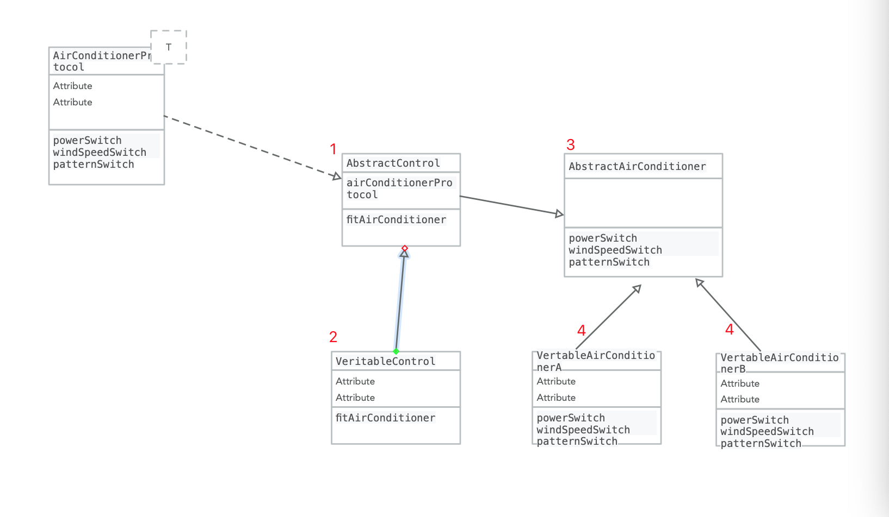

# 创建型（5种）

## 1&2. 工厂模式

###### 简单工厂模式：

```
 Factory *factory = [[Factory alloc]init];
 [factory ProductCommodity:ProductA];
```

```
-(void)ProductCommodity:(ProductType)ProductType{
    switch (ProductType) {
        case ProductA:
            [self ProductA];
            break;
        case ProductB:
            [self ProductB];

            break;
        case ProductC:
            [self ProductC];
            break;

        default:
            break;
    }
}
```

* 作用：一个工厂生产多种产品，如果，还要生产其他的商品我们就得去改变生产的代码逻辑，如果生产的商品很多的话，我们就需要不断的去加生产不同商品的逻辑。
* 缺点：违背了“开放-封闭原则”，一旦需要新的产品类型，我们就不得不去修改工厂类的原有的逻辑。


###### 工厂模式：改良版简单工程模式

```
@implementation FactoryA
-(void)ProductA{
    NSLog(@"生产了A原料");
}
@end
```

```
@implementation FactoryB
-(void)ProductB{
    NSLog(@"生产了B原料");
}
@end
```

* 优点：符合“开放-封闭原则”，符合“单一职责原则”，工厂之间互不干涉。

* 缺点：每新添加一种产品就需要新开一个工厂，这样造成需要管理的每个工厂的类很多，没有一个集体的管理类。

###### 抽象工厂模式：即工厂模式+一个集体的管理类（只负责调度，不负责具体的生产细节）


```
@implementation FactoryRawMaterialA
-(void)productRawMaterialA{
    NSLog(@"生产A产品");
}
```


```
@implementation FactoryBottleA
-(void)productBottleA{
    NSLog(@"生产了A包装");
}
@end
```


```
//抽象管理类
-(void)productCommodityForA{
    //A产品
    FactoryRawMaterialA *factoryRawMaterialA = [[FactoryRawMaterialA alloc]init];
    [factoryRawMaterialA productRawMaterialA];

  //A包装
    FactoryBottleA *factoryBottleA = [[FactoryBottleA alloc] init];
    [factoryBottleA productBottleA];

}
@end
```


* 优点：符合我们的“开放-封闭原则”，单一职责原则，产品生产有单独的类，组装整合有抽象类完成。


## 3. 单例模式

1. GCD声明
2. 加锁方式


```
+(SimpleFeedBack*)singleton {
    static SimpleFeedBack* singleton;
    @synchronized(self) {
        if (!singleton) {
            singleton = [[SimpleFeedBack alloc] init];
        }
        return singleton;
    }
    return nil;
}
```
## 4. 建造者模式


将一个复杂对象的构建与它的表示分离，使得同样的构建过程可以创建不同的表示。


组合：

* Builder：为创建一个产品对象的各个部件指定抽象接口。
* Product：表示被构造的复杂对象。
* oncreteBuilder：实现Builder的接口以构造和装配该产品的各个部件，定义并明确它所创建的表示，并 提供一个检索产品的接口。
* Director：构造一个使用Builders接口的对象。 


```
//每个结构部件的builder
@interface BuilderCPU : NSObject
@property (nonatomic,copy)NSString *CPU;
@end

@interface BuilderMainboard : NSObject
@property(nonatomic,copy)NSString *mainboard;
@end

......
```

```
//含各个部件的Product
@interface ProductComputer : NSObject
@end
```

```
//具体操作者：oncreteBuilder
@interface ConcreteBuilderPeople : NSObject
/*   组装电脑
 *  cpuType --- CPU的类型
 *  mainBoard --- 主板，类型
 ......
 */
-(ProductComputer *)assembleComputer:(CPUType)cpuType andMainBoard:(MainboardType)mainBoard andScreen:(ScreenType)screenType andMemoryType:(MemoryType)memoryType;

@end
```

```
//Director：需求制定者，分析对象，调用具体的实施者。
@implementation DirectorPeople
-(ProductComputer *)gainComPuter{
    ConcreteBuilderPeople *concreteBuilderPeople = [[ConcreteBuilderPeople alloc]init];
   return  [concreteBuilderPeople assembleComputer:IntelCPU andMainBoard:AsustekMainboard andScreen:DaleScreen andMemoryType:KingstonMemory];
}
@end
```

* 优点：符合依赖倒转原则：可以商品和商品创建的过程分开。符合开发-封闭原则：易于扩展，新增加新的商品。
* 缺点：这种模式只能使用于有很多共同点的商品。


## 5. 原型模式

* 用原型实例指定创建对象的种类，并且通过拷贝这些原型创建新的对象。
* 也就是说如果要实现拷贝，就需要实现NSCopying协议和copyWithZone:的方法。如果是可变的要实现NSMutableCopying协议和copyWithZone:方法。

> * 浅拷贝：只是复制了指针的地址，并没有复制该指针指向的地址。
> * 深拷贝：不但复制了指针的地址，还复制了指针地址指向的值。


```
-(id)copyWithZone:(NSZone *)zone{
    PrototypePerson *prototypePerson = [[[self class] allocWithZone:zone]initWithName:_name];
    prototypePerson.bookArray = [_bookArray mutableCopy];
    return prototypePerson;

}
```

# 结构型（7种）

## 1. 适配器模式（包装模式）：不统一的接口，通过适配器转换成统一的接口。

* 类适配器：主要是通过继承来适配两个接口。主要是使用多重继承的方式，但是OC不支持多继承，只支持单继承，所以在iOS中我们使用继承和协议的方式来实现类的适配。 
* 对象适配器：组合一个被适配类的引用，不是采用继承被适配的类的方式。

* 优点： 解耦合，让数据类和视图类不产生耦合 
* 缺点： 使用的类太多，可读性差。


## 2. 装饰器模式

* 装饰模式指的是在不必改变原类文件和使用继承的情况下，动态地扩展一个对象的功能。
* 设计原则是： 多用组合，少用继承。

> * 通过子类实现装饰模式
> * 通过分类来实现装饰模式


* 优点：通过一些装饰类组合成很多不同的功能，适合组件化编程，通过分类的实现装饰模式，减少了继承关系。 
* 缺点：可能生出更多的类，增加程序的复杂性。

## 3. 代理模式

## 4. 外观模式：定义一个更高层次的接口，这个接口使得这一子系统更加容易使用。

* 子系统：底层的子系统，定义了自己的相关的功能和接口 
* 外观类：整合底部子系统的接口供给外部调用者调用 
* 外部调用者：调用外观类的接口或者子系统的接口，和底层子系统进行通信


* 优点：实现了子系统与客户端之间的松耦合关系


## 5. 桥接模式：将抽象部分与它的实现部分分离，使它们都可以独立地变化。


1. 抽象化(Abstraction)角色：抽象化给出的定义，并保存一个对实现化对象的引用。 
2. 修正抽象化(Refined Abstraction)角色：扩展抽象化角色，改变和修正父类对抽象化的定义。 
3. 实现化(Implementor)角色：这个角色给出实现化角色的接口，但不给出具体的实现。必须指出的是，这个接口不一定和抽象化角色的接口定义相同，实际上，这两个接口可以非常不一样。实现化角色应当只给出底层操作，而抽象化角色应当只给出基于底层操作的更高一层的操作。 
4. 具体实现化(Concrete Implementor)角色：这个角色给出实现化角色接口的具体实现。


图示：



######## 桥接模式和适配模式的区别

相同点： 

桥接模式和适配器模式都是让两个接口配合的工作 

不同点： 

桥接模式：把实现和抽象都分离开了，可以让两者的接口可以不一样。主要的目的是把他们分离开了。桥接模式是先有桥在有2端的接口，这个就好像，我们控制空调的一些指令，他就想一个桥一样，把我们一些通过遥控器传递给给空调，让空调工作。 

适配器模式：适配器模式是，先有2端的东西以后，为了让2端的东西更好的相容，才有的适配器。就好像我们的国家电网，和我们平常使用的电器设备，他们是已经存在的2个接口，我们只是在中间做了一个转换。让他们配合着一起工作。


https://blog.csdn.net/jason0539/article/details/44956775