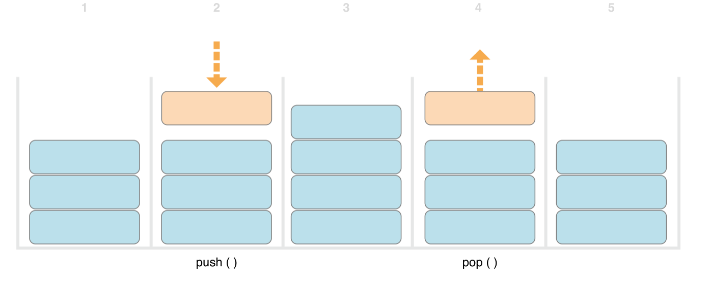
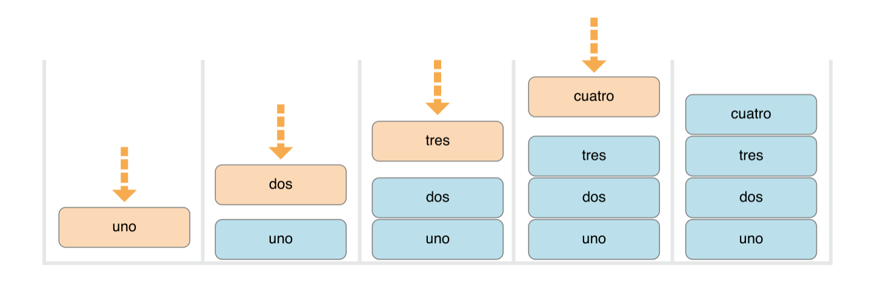
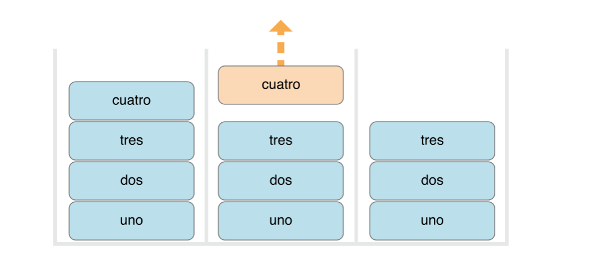
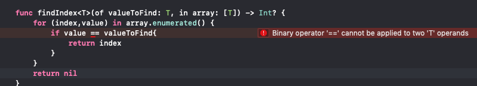

本文翻译自：[https://docs.swift.org/swift-book/LanguageGuide/Generics.html](https://docs.swift.org/swift-book/LanguageGuide/Generics.html)

## 泛型

**通用代码**使您能够根据定义的需求编写灵活、可重用的函数和类型，这些函数和类型可以与任何类型一起使用。你可以编写出避免重复的代码，并以一种清晰、抽象的方式表达其需求意图。

**泛型**是 `Swift` 最强大的特性之一，并且 `Swift` 标准库的大部分均由通用代码构建而成。实际上，在整个`语言指南`中，你一直在使用泛型，即使你没有意识到这点。例如：`Swift` 的 `Array` 和 `Dictionary` 类型都是泛型集合。你可以创建一个存储 `Int` 元素的 `Array` 或存储 `String` 元素的 `Array`，或存储任何其它 `Swift` 可创建的类型元素。与之类似，你可以创建 `Dictionary` 存储任意指定类型的值，类型无限制。


## 泛型可解决的问题


这是一个标准的，非泛型的函数：`swapTwoInts(_:_:)`,即交换两个 Int 类型的值：

```
func swapTwoInts(_ a: inout Int, _ b: inout Int) {
    let temporaryA = a
    a = b
    b = temporaryA
}
```

该函数使用了 `in-out` 参数交换 a 和 b 的值，详细参见[In-Out参数](https://docs.swift.org/swift-book/LanguageGuide/Functions.html#ID173)。

函数 `swapTwoInts(_:_:)` 交换 `b` 的原始值至 `a`，`a` 的原始值至 `b`。调用该函数，并置换两个 `Int` 变量的值：

```
var someInt = 3
var anotherInt = 107
swapTwoInts(&someInt, &anotherInt)
print("someInt is now \(someInt), and anotherInt is now \(anotherInt)")
// Prints "someInt is now 107, and anotherInt is now 3"
```

`swapTwoInts(_:_:)`函数是有效的，但仅可用于 Int 类型，若您想要交换两个 String 类型的值，或者两个 Double 类型的值，那您不得不创建更多的函数实现，如下面展示的` swapTwoStrings(_:_:)`和`swapTwoDoubles(_:_:)`函数：

```
func swapTwoStrings(_ a: inout String, _ b: inout String) {
    let temporaryA = a
    a = b
    b = temporaryA
}

func swapTwoDoubles(_ a: inout Double, _ b: inout Double) {
    let temporaryA = a
    a = b
    b = temporaryA
}
```


您可能已注意到`swapTwoInts(_:_:)`、`swapTwoStrings(_:_:)`以及`swapTwoDoubles(_:_:)`他们的函数体是相同的。唯一的区别则是它们接收的参数类型不同(`Int`、`String`、`Double`)。

编写一个函数，并支持交换两个任意类型的参数值，是更有用，更为灵活的方案。**通用代码可以使您编写出此种类型的函数。**

> 上述三种函数，`a` 和 `b` 的类型必须相同。否则，不可能实现它们的值交换。`Swift` 是类型安全语言，不允许(例如) `String` 类型的变量和 `Double` 类型的变量执行值互换，否则会导致编译时错误。


## 泛型函数

泛型函数可作用于任意参数类型，基于上述`swapTwoInts(_:_:)`函数，以下是其泛型函数的一个版本`swapTwoValues(_:_:)`：

```
func swapTwoValues<T>(_ a: inout T, _ b: inout T) {
    let temporaryA = a
    a = b
    b = temporaryA
}
```

`swapTwoValues(_:_:)`函数体与`swapTwoInts(_:_:)`的函数体相同。但第一行函数之间有细微不同，以下是对比：

```
func swapTwoInts(_ a: inout Int, _ b: inout Int)
func swapTwoValues<T>(_ a: inout T, _ b: inout T)
```

泛型函数使用占位符类型名(本例中命名为 `T`)，而不是实际的类型名(如 `Int`、`String`、`Double`)。占位符类型名没有标明 `T` 必须是什么类型，但它标明了参数 `a` 和 `b` 必须为同一类型 `T`，不论 `T` 实际代表什么类型。**每次调用`swapTwoValues(_:_:)`函数时，T 代表的实际类型才会得到确认。**


泛型函数和非泛型函数之间的另一个不同点是：泛型函数名后紧跟一个占位符类型名(`<T>`)。尖括号告知 `Swift` `T`是函数内部定义的占位符类型名。因为 `T` 是占位符，所以 `Swift` 并不去查询名为 `T` 的实际类型。

现在，可以像调用`swapTwoInts`函数那样来调用` swapTwoValues(_:_:)`函数了。但它可以接收任意类型的两个参数，只要同时传入的参数类型相同即可。每次调用`swapTwoValues(_:_:)`函数时，通过传入的参数类型，推断出 `T` 代表的实际类型。

以下两个示例中， `T` 分别被推断为 `Int` 和 `String` 实际类型:

```
var someInt = 3
var anotherInt = 107
swapTwoValues(&someInt, &anotherInt)
// someInt is now 107, and anotherInt is now 3

var someString = "hello"
var anotherString = "world"
swapTwoValues(&someString, &anotherString)
// someString is now "world", and anotherString is now "hello"
```


> 上述定义的`swapTwoValues(_:_:)`函数是受到泛型函数`swap`的启发。而泛型函数`swap`是存在于 Swift 标准库中的，且在您的app开发中是可用的。在您自己编写的代码中若要用到` swapTwoValues(_:_:)`的行为，可以直接使用 Swift 存在的函数`wap(_:_:)`，而非自己实现。


## 类型参数

在上述示例`swapTwoValues(_:_:)`函数中，占位符类型 `T` 是类型参数的一个示例。**类型参数指定和命名一个占位符类型，并书写在函数名后，尖括号之间(如 `<T>`)。**

一旦您指定了一个类型参数，便可以使用它来定义函数参数的类型(如上述函数中的 `a` 和 `b` 参数)、或作为函数的返回类型、或作为函数体中的一个类型注解。上述的各场景，只要调用函数，参数类型就会被实际类型所替代(上述示例函数被调用两次，`T` 分别被替代为 `Int` 和 `String`)。


**在`<>`内部书写更多的类型参数名，并以`,`分割。通过这种方式提供更多的类型参数。**

## 类型参数命名

**多数场景下，类型参数具有描述性的命名。**如 `Dictionary<Key,Value>`中的 `Key` 和 `Value` ，`Array<Element>` 中的 `Element` 一样,以此告知读者`类型参数`和`使用它的泛型类型（或函数）`之间的关系。当然，当它们之间无明显意义的关系时，一般使用单个字母如 `T`、`U`、`V` 来命名。

> 始终以`大驼峰拼写`方式命名类型参数（如 T、MyTypeParameter），以标识它们为类型的占位符，而非真实的类型。

## 泛型类型


除了泛型函数，`Swift`还支持你定义自己的泛型类型。类似于 `Array` 和 `Dictionary`，这些定制的类、结构体、枚举均可作用于任意类型。

本部分给你展示如何写一个泛型集合类型 `Stack`。`Stack` 是一个有序集合，类似于 `Array`，但与之相比，`Stack` 的操作有更多限制。`Array` 允许插入新的元素和删除任意位置的元素，但 `Stack`，仅可在末端插入新元素（`push`），仅可在末端删除元素（`pop`）。

> `Stack` 理念使用的场景如：`UINavigationController`类，即在它的导航层级中组织`viewControllers`。通过调用该类的`pushViewController(_:animated:)`方法添加（`push`）一个`controller`至导航栈中，`popViewControllerAnimated(_:)`方法从导航栈中移除（`pop`）一个`controller`。**当你需要严格按照 后进先出 方式操作集合时，`Stack`集合模型是最佳首选。**


下图展示了`stack`的`push`和`pop`操作：



1. 在stack中，共有3个元素
2. 第四个元素被push至栈的顶部
3. 目前stack共4个元素，顶部为最近压入的元素
4. 顶部元素被弹出（pop）
5. 弹出一个顶部元素后，stack再次恢复为3个元素


非泛型版本的`Stack`编码，元素类型为 `Int`：

```
struct IntStack {
    var items = [Int]()
    mutating func push(_ item: Int) {
        items.append(item)
    }
    mutating func pop() -> Int {
        return items.removeLast()
    }
}
```

* `Stack` 结构体使用属性数组 `items` 储存栈内元素。

* `Stack` 提供2个方法：`push` 和 `pop`，实现栈内顶部元素的压入和弹出。

> 方法被标记为 `mutating`，因它们需要修改（或变异）结构体中 `items` 数组。


上述 IntStack类型只能应用于 Int 元素，**所以定义一个泛型的Stack类，更加有益，因为它可以管理任意类型的元素。**

泛型版本的 `Stack` 编码方式：

```
struct Stack<Element> {
    var items = [Element]()
    mutating func push(_ item: Element) {
        items.append(item)
    }
    mutating func pop() -> Element {
        return items.removeLast()
    }
}
```

注意到泛型编码版本本质上与非泛型编码版本相同，只是以类型参数 `Element` 代替了真实的类型 `Int`。该类型参数书写方式：在结构体名后添加尖括号包裹`<Element>`。

`Element` 为后续提供的真实类型，定义了一个占位符名称。这种真实类型可以在结构体定义中的任何地方以`Element`作为引用。在本例中， Element 作为占位符应用于以下三处：

* 属性数组 `items` 的创建，初始化时（空数组）以 `Element` 作为元素类型。
* 指定 `push` 函数有一个参数item，其类型为 `Element`。
* 指定 `pop` 函数返回值，其类型为 `Element`。


因为 `Element` 是泛型类型，故结构体 `Stack` 可用于创建任意 `Swift` 支持的真实类型的 `Stack` 实例。方式类似 `Array` 和 `Dictionary`。

创建新的 `Stack` 实例时，在尖括号中写入其要存储的真实类型。例如，创建一个存放 `String` 的 实例，可以书写为`Stack<String>()`:

```
var stackOfStrings = Stack<String>()
stackOfStrings.push("uno")
stackOfStrings.push("dos")
stackOfStrings.push("tres")
stackOfStrings.push("cuatro")
// the stack now contains 4 strings
```

在 stackOfStrings 执行上述四次压入操作之后的状态：




对该栈执行弹出操作，即删除并返回顶部元素的值 `cuatro `:

```
let fromTheTop = stackOfStrings.pop()
// fromTheTop is equal to "cuatro", and the stack now contains 3 strings
```


在弹出顶部元素之后的栈：





## 扩展一个泛型类型


当你扩展一个泛型类型时，不需要提供一个类型参数列表作为该扩展定义的一部分。相反，原始类型定义中的类型参数列表，在整个扩展体中均是可用的，原始类型参数名用于引用原始定义中的类型参数。

下面例子扩展了泛型类型 `Stack`，添加了一个只读的计算属性 `topItem`，用于返回栈中顶部元素，而不需弹出操作：

```
extension Stack {
    var topItem: Element? {
        return items.isEmpty ? nil : items[items.count - 1]
    }
}
```

属性 `topItem` 返回一个 `Element` 类型的可选值。即栈为空，返回 `nil`，否则返回最后一个元素。

注意该扩展并没有定一个类型参数列表。相反，在 `Stack` 中存在的类型参数名 `Element`，应用在扩展体内，并标识了 `topItem` 计算属性的可选类型。

现在，`topItem` 计算属性可用于任何 `stack` 实例，访问并查询顶部元素，而不需弹出它：

```
if let topItem = stackOfStrings.topItem {
    print("The top item on the stack is \(topItem).")
}
// Prints "The top item on the stack is tres."
```


为了获取新功能，泛型扩展也需要其实例满足一些要求，具体谈论参见后面介绍[ Extensions with a Generic Where Clause]()。

## 类型约束

`swapTwoValues(_:_:)`函数和Stack类型均可作用于任意类型。但是，在泛型函数和泛型类型上强制使用某些类型约束有时是大有裨益的。类型约束指定类型参数必须继承自某个特定的类，或实现某个特定的协议或协议组。

例如，`Swift` 的 `Dictionary` 类型关于 `key` 的可用类型就指定了一个限制。如 [Dictionaries](https://docs.swift.org/swift-book/LanguageGuide/CollectionTypes.html#ID113)描述，它的 `key` 类型必须是可哈希的。也就是说，它必须提供一种使自己具有唯一性标识的方法。之所以使 `key` 具备可哈希特点，是为了检测是否其已存在特定 `key` 对应的 `value` 内容。若无此要求，针对特定的 key，Dictionary 便无法决定是否执行插入操作还是替换操作，当然也就无法根据具体的key，查询相关的 value 了。

Dictionary 中 key 类型的要求是以类型约束的方式强制添加的，即 key 必须实现可哈希协议（Hashble：Swift 标准库定义）。默认情况下，所有的 Swift 基础类型（String、Int、Double、Bool等），均是可哈希的。


创建自定义泛型类型时，你可以定义自己的类型约束。这些约束提供给泛型编程更加强大的功能。像hashable 这样的抽象概念是根据类型的概念特征来定义的，而非根据具体类型。


#### 类型约束语法

书写类型约束的方式：在类型参数名后面，添加一个类或者协议约束，两者以`:`分隔开。由此作为类型参数列表的一部分。

泛型函数中使用类型约束的基本语法如下（尽管与泛型类型的语法相同）：

```
unc someFunction<T: SomeClass, U: SomeProtocol>(someT: T, someU: U) {
    // function body goes here
}
```

上述设定的函数具有两个类型参数。

第一个类型参数T：具有一个类型约束，即要求T必须是的 SomeClass 的子类。

第二个类型参数U：也具有一个类型约束，即要求必须满足 SomeProtocol 协议。


#### 类型约束行为


非泛型函数 `findIndex(ofString:in:)`：在参数 array 中查找参数 valueToFind 字符，并返回第一个匹配该字符的位置(可选类型 `Int？`)，若无此字符，则返回 nil。

```
func findIndex(ofString valueToFind: String, in array: [String]) -> Int? {
    for (index, value) in array.enumerated() {
        if value == valueToFind {
            return index
        }
    }
    return nil
}
```

该函数可用于在字符串数组中查询特定字符串：

```
let strings = ["cat", "dog", "llama", "parakeet", "terrapin"]
if let foundIndex = findIndex(ofString: "llama", in: strings) {
    print("The index of llama is \(foundIndex)")
}
// Prints "The index of llama is 2"
```

上述函数仅可用于字符串，其它类型均不可用。

但是，你可以编码同样功能的泛型函数，以 T 代替 String 类型。

下面为泛型版本函数`findIndex(of:in:)`，注意返回值仍是 `Int?`，因为范围的是位置，而非数组中的具体值。

但是注意，此函数无法编译，原因稍后分解：

```
func findIndex<T>(of valueToFind: T, in array:[T]) -> Int? {
    for (index, value) in array.enumerated() {
        if value == valueToFind {
            return index
        }
    }
    return nil
}
```

以上述写法，该函数无法通过编译。问题在于`if value == valueToFind`等式检测语法。并非所有 Swift 类型都可以用 == 比较。假如你创建了自己的类或结构体，并且以之实现负责的数据模型，那么该类或结构体的`==`的意思并不是 Swift 能猜测到的。基于此，上述代码并不能保证所有可能类型 T 起作用。所以试图编译上述代码时，会出现一条相关的错误提示。




所幸，Swift 标准库定义了一个协议： Equatable，要求执行该协议的类型，必须实现 `==` 和 `!=` 操作,即比较给定类型的两个值。所有 Swift 标准类型默认都实现了该协议 Equatable。

实现了 Equatable 协议的任意类型均可在函数 `findIndex(of:in:)`中安全使用，因为该协议保证了类型是支持相等操作的。实现方式， Equatable 协议作为类型约束添加至类型参数列表中，并作为其定义的一部分：

```
func findIndex<T: Equatable>(of valueToFind: T, in array:[T]) -> Int? {
    for (index, value) in array.enumerated() {
        if value == valueToFind {
            return index
        }
    }
    return nil
}
```

函数`findIndex(of:in:)`中单一类型参数 T 书写为 `T: Equatable`标识 实现了 Equatable 协议的任意类型T。

现在函数可以正常编译，并可用于实现了 Equatable 协议的任意类型，如 Double 或 String：

```
let doubleIndex = findIndex(of: 9.3, in: [3.14159, 0.1, 0.25])
// doubleIndex is an optional Int with no value, because 9.3 isn't in the array
let stringIndex = findIndex(of: "Andrea", in: ["Mike", "Malcolm", "Andrea"])
// stringIndex is an optional Int containing a value of 2
```


## 关联类型


当定义一个协议时，声明一个或多个关联类型作为其定义的一部分，有时非常有用。**关联类型提供一个占位符名称，该名称标识协议中使用到的类型。**在协议被使用前，关联类型所标识的真实类型均不是确定的。关联类型以 associatedtype 关键字标识。

#### 行为中的关联类型

协议示例： Container，其中声明了一个关联类型 Item：


```
protocol Container {
    associatedtype Item
    mutating func append(_ item: Item)
    var count: Int { get }
    subscript(i: Int) -> Item { get }
}
```

Container 协议定义了三个功能，需要实现实体必须提供：

* 必须可以使用`append(:)`方法将新条目添加到 container 中。
* 必须可以使用只读 count 属性获取 container 中总的条目数。
* 必须可以使用下标 i 获取 container 中每个条目。

协议并未指明 container 中的条目如何存储，也未指明条目类型。协议仅指明实现实体作为一个 container 所必须具备的三个功能。实现实体类型可以提供额外的功能，只要能够满足这三个要求即可。

任何实现 Container 协议的类型，都必须能够指定存储的值类型。特别需要强调的是，它必须确保只有正确的条目类型才可被添加至 container 中，并且通过下标返回的条目类型必须是清晰明了的。

为了定义上述功能， 在不知道特定 container类型时，Container 协议需要通过某种方式引用 container 持有的元素类型。Container 协议指定 `append(_:)` 传入参数类型必须和 container 元素类型相同，同样通过 container 下标返回的值类型也必须和 container 元素类型相同。


为实现这一点，Container 协议声明了一个关联类型 item，即 `associatedtype item` 。 协议并未定义 Item - 具体类型等信息由任意实现类型来提供。尽管如此，在 Container 中，Item 别名提供了一种方法来引用容器中元素的类型，并定义一种类型，以便与 `append(_:)`方法和下标一起使用，以确保强制执行任何容器实体的预期行为。


脱胎于上述泛型版本的非泛型版本 IntStack，但实现了 Container协议：

```
struct IntStack: Container {
    // IntStack 自身原有的实现
    var items = [Int]()
    mutating func push(_ item: Int) {
        items.append(item)
    }
    mutating func pop() -> Int {
        return items.removeLast()
    }
    // 实现协议
    typealias Item = Int
    mutating func append(_ item: Int) {
        self.push(item)
    }
    var count: Int {
        return items.count
    }
    subscript(i: Int) -> Int {
        return items[i]
    }
}
```

IntStack 类型实现了 Container协议所规范的三个要求，并且每个要求都以封装已有的部分功能来实现了。

此外，IntStack指定了在本次协议实现中，Item 使用的类型：Int。即定义语句`typealias Item = Int` 使抽象类型 Item 确定为了具象的类型Int。

感谢 Swift 的类型推断，在 IntStack定义中，你并不需要非得显式声明 Item 为具象类型 Int。因为 IntStack 实现了所有 Container 协议要求，Swift 可以推断适合的 Item 类型，通过`append(_:) `方法的 item 参数和下标返回类型均可简单的做出推断。确切来讲，如果删除`typealias Item = Int`语句，该代码依然工作正常，因为 Swift 清楚 Item需使用何种类型。


你也可以创建实现 Container 协议的泛型类型 Stack：

```
struct Stack<Element>: Container {
    // original Stack<Element> implementation
    var items = [Element]()
    mutating func push(_ item: Element) {
        items.append(item)
    }
    mutating func pop() -> Element {
        return items.removeLast()
    }
    // 实现 Container 协议
    mutating func append(_ item: Element) {
        self.push(item)
    }
    var count: Int {
        return items.count
    }
    subscript(i: Int) -> Element {
        return items[i]
    }
}
```


这次，类型参数 Element 作为`append(_:)`方法中 item 类型和下标返回类型来使用。Swift 因而可推断 Element 是本次container中 Item 的合适类型。

#### 扩展已有类型以指定关联类型

你可以扩展现有类型，来添加协议的一致性，如[ Adding Protocol Conformance with an Extension.](https://docs.swift.org/swift-book/LanguageGuide/Protocols.html#ID277)所述。包含含有关联类型的协议。

Swift 的 Array 类型已有`append(_:)`、 count 属性、下标（以 Int 为指数，返回元素），这三个功能符合 container协议的要求。意味着你可以扩展 Array 来实现 Container 协议，即简单的声明实现该协议即可。如[Declaring Protocol Adoption with an Extension](https://docs.swift.org/swift-book/LanguageGuide/Protocols.html#ID278)描述，一个空白扩展：

```
extension Array: Container {}
```

Array 已有的`append(_:)`方法和下标使 Swift 推断 Item 合适的类型，如上泛型 Stack 类型。上述扩展定义之后，你便可以将任何 Array 作为 Container来使用了。


#### 关联类型添加约束

在协议中，你可以在关联类型上添加类型约束，以此要求实现时满足这些约束条件。
如下面一个 COntainer 版本，要求 Item 之间具有等价操作：

```
protocol Container {
    associatedtype Item: Equatable
    mutating func append(_ item: Item)
    var count: Int { get }
    subscript(i: Int) -> Item { get }
}
```

实现此协议的实体，需保证 Item 实现了 Equatable 协议。

#### 在关联类型约束中使用协议

协议可以作为自身要求的一部分出现。例如，一个协议细化了 Container 协议，即添加了新方法`suffix(_:)`。该方法根据参数大小，返回一定量的元素集合，并保存在一个 Suffix 类型的实例中。

```
protocol SuffixableContainer: Container {
    associatedtype Suffix: SuffixableContainer where Suffix.Item == Item
    func suffix(_ size: Int) -> Suffix
}
```

在此协议中，Suffix 是关联类型，如 Container 协议中的 Item。Suffix 有两个约束：它必须实现 SuffixableContainer 协议（当前协议）；它的 Item 类型必须和 Container 实现实体中的 Item 类型相同，此约束使用 where 语句，详情稍后陈述。

下面是 Stack 扩展，向 SuffixableContainer 协议添加一致性：

```
extension Stack: SuffixableContainer {
    func suffix(_ size: Int) -> Stack {
        var result = Stack()
        for index in (count-size)..<count {
            result.append(self[index])
        }
        return result
    }
    // 推断 Suffix 为 Stack.
}
var stackOfInts = Stack<Int>()
stackOfInts.append(10)
stackOfInts.append(20)
stackOfInts.append(30)
let suffix = stackOfInts.suffix(2)
// suffix contains 20 and 30
```

上述示例中，Stack 的关联类型仍是 Stack，所以 `suffix(_ :)` 操作返回的仍是 Stack 类型。另外，实现 SuffixableContainer 协议的类型可以有一个 Suffix 类型，并且与自身类型类型不同--即`suffix(_ :)`可以返回不同的类型。如下面一个非泛型示例 IntStack 类型，添加协议实现，并使用 Stack<Int>作为它的 suffix 类型而非自身 IntStack类型：

```
extension IntStack: SuffixableContainer {
    func suffix(_ size: Int) -> Stack<Int> {
        var result = Stack<Int>()
        for index in (count-size)..<count {
            result.append(self[index])
        }
        return result
    }
    // 推断 Suffix类型 为 Stack<Int>。
}
```


## 泛型 where 语句

类型约束,使您能够定义与泛型函数、下标或类型相关联的类型参数的要求。

在定义关联类型的要求时，它也同样有用。泛型 where 语句可以实现该功能。泛型 where 语句可以为你规范关联类型必须符合某个协议，或特定类型参数和关联类型必须相同。一个 泛型 where 语句以关键字 where 开始，后跟关联类型的约束，或类型和关联类型的等价关系。在类型或函数体的左大括号之前编写一个泛型 where 语句。

下面示例将创建一个泛型函数 allItemsMatch，用以检测两个 Container 实例中是否包含相同且同序的 items。若相同，函数返回 true，否则返回 false。

被检测的两个 container 不必须具有相同的类型（尽管它们可以同类型），但是它们的 items 必须具有相同的类型。这个要求通过一个含类型约束和泛型 where 语句的组合表示出来。


```
func allItemsMatch<C1: Container, C2: Container>
    (_ someContainer: C1, _ anotherContainer: C2) -> Bool
    where C1.Item == C2.Item, C1.Item: Equatable {

        // Check that both containers contain the same number of items.
        if someContainer.count != anotherContainer.count {
            return false
        }

        // Check each pair of items to see if they're equivalent.
        for i in 0..<someContainer.count {
            if someContainer[i] != anotherContainer[i] {
                return false
            }
        }

        // All items match, so return true.
        return true
}
```


函数有两个参数： someContainer 和 anotherContainer。 前者为 C1 类型，后者为 C2 类型。C1 和 C2类型属于参数类型 Container，函数被调用时，才会被具体指定。

对函数的两个类型参数有以下要求：

* C1 必须实现 Container 协议（C1: Container）
* C2 也必须实现 Container 协议（C2: Container）
* C1 的 Item 与 C2 的 Item 必须相同（C1.Item == C2.Item）
* C1 的 Item 必须实现 Equatalbe 协议（C1.Item: Equatable）


第一和第二个要求定义在函数类型参数列表中。第三和第四个要求定义在函数的 泛型 where 语句中。

要求详细阐述：

* someContainer 属于 C1 container 类型
* anotherContainer 属于 C2 container 类型
* someContainer 和 anotherContainer 含有同样类型的 items
* someContainer 中的 items 可以使用等价符号 判定是否相等

第三和第四个要求合并起来的意义是：anotherContainer 中的 items 也可以使用等价操作符，因为它的 items 和 someContainer 中的 items 属于同一类型。


`allItemsMatch(_:_:)`函数开始两个 container 是否含有同等数量的 items 元素。如数量不同，则返 false。

接着，函数使用 `for-in`（半开区间`..<`）遍历 someContainer 中 items 元素,针对每个元素，函数均检查与 anotherContainer 中对应的元素是否相等。若任一对比不相等，则 containers 不对等，即返回 false。

如果遍历结束，仍未发现不相等元素，则意味着 containers 匹配。函数返回 true。

该函数行为：

```
var stackOfStrings = Stack<String>()
stackOfStrings.push("uno")
stackOfStrings.push("dos")
stackOfStrings.push("tres")

var arrayOfStrings = ["uno", "dos", "tres"]

if allItemsMatch(stackOfStrings, arrayOfStrings) {
    print("All items match.")
} else {
    print("Not all items match.")
}
// Prints "All items match."
```


创建一个储存 string 元素的 Stack 实例，压栈三个 string。再创建一个数组实例，并以三个同 Stack 相同的 string 元素初始化。尽管 stack 和 array分属不同的类型，但它们都实现了 Container 协议，且都包含同类型的值。因此可以调用`allItemsMatch(_:_:)`,并将两者作为其入参。上述示例中，函数将返回 true，即入参具有相同的 items。

## 含 泛型 where 语句的扩展

你也可以将泛型where语句作为扩展的一部分。下述示例扩展了泛型 Stack 结构体类型，添加了方法`isTop(_:)`:

```
extension Stack where Element: Equatable {
    func isTop(_ item: Element) -> Bool {
        guard let topItem = items.last else {
            return false
        }
        return topItem == item
    }
}
```

该方法首先检测 stack 是否为空，继而才将顶部元素同入参做比较。如果无开头的泛型where语句，将会出现错误：`The implementation of isTop(_:) uses the == operator, but the definition of Stack doesn’t require its items to be equatable`，所以使用等价操作符会导致编译时错误。添加泛型 where语句即在扩展中添加了一个要求，该要求可在`isTop(_:)`方法中使 items 具有等价操作性。

具体行为：

```
if stackOfStrings.isTop("tres") {
    print("Top element is tres.")
} else {
    print("Top element is something else.")
}
// Prints "Top element is tres."
```

如果在一个 stack 中，其元素没有实现 equatable，则会收到编译时错误。

```
struct NotEquatable { }
var notEquatableStack = Stack<NotEquatable>()
let notEquatableValue = NotEquatable()
notEquatableStack.push(notEquatableValue)
notEquatableStack.isTop(notEquatableValue)  // Error
```

您可以通过泛型 where 语句来扩展协议。示例如下，扩展 Container 协议，添加方法`startsWith(_:)`:

```
extension Container where Item: Equatable {
    func startsWith(_ item: Item) -> Bool {
        return count >= 1 && self[0] == item
    }
}
```

方法首先确认 container 至少有一个 item，然后检测第一个元素是否与入参相等。该新方法可用于任何实现了 Container 协议的类型，如上述讲到的 stacks 和 arrays，但其内部 items 必须实现 Equatable。

```
if [9, 9, 9].startsWith(42) {
    print("Starts with 42.")
} else {
    print("Starts with something else.")
}
// Prints "Starts with something else."
```

上述泛型 where 语句要求 Item 实现一个协议，但你也可以使用 泛型 where 语句指定 Item 为某一特定类型，如：

```
extension Container where Item == Double {
    func average() -> Double {
        var sum = 0.0
        for index in 0..<count {
            sum += self[index]
        }
        return sum / Double(count)
    }
}
print([1260.0, 1200.0, 98.6, 37.0].average())
// Prints "648.9"
``` 


针对 container 中 Item 类型为 Double，方法`average()`实现了平均值获取。其中显式将 Int 类型 count 转化为 Double，作为浮点除数。

在扩展中，你可在泛型 where 语句中涵盖多个要求。每个要求以`,`分隔。


## 含 泛型 where 语句的关联类型
 
 
在关联类型中，可以加入泛型 where 语句。例如，设想你想创建一个含有 iterator 的 Container 版本，如标准库中使用 Sequence 协议。

```
protocol Container {
    associatedtype Item
    mutating func append(_ item: Item)
    var count: Int { get }
    subscript(i: Int) -> Item { get }

    associatedtype Iterator: IteratorProtocol where Iterator.Element == Item
    func makeIterator() -> Iterator
}
```

在 关联类型 Iterator 上的泛型 where 语句要求 Iterator 中 Element 必须与 Item 类型相同，而无需关注 Iterator 的类型。 `MakeInterator()`函数提供了访问 container 的 Iterator 的功能。

对于一个继承其它协议的协议，可以在协议声明时，以泛型 where 语句给继承而来的关联类型追加约束。例如，ComparableContainer 协议声明中，要求 Item 实现 Comparable ：

```
protocol ComparableContainer: Container where Item: Comparable { }
```


## 泛型下标

下标可以泛型化，也可包含泛型 where 语句。 通过在 subscript 关键字后，在尖括号中你可以书写占位符类型名称，并且也可在 subscript 结构体左花括号之前书写泛型 where 语句。如：

```
extension Container {
    subscript<Indices: Sequence>(indices: Indices) -> [Item]
        where Indices.Iterator.Element == Int {
            var result = [Item]()
            for index in indices {
                result.append(self[index])
            }
            return result
    }
}
```


Container 的扩展添加了一个下标：以指数序列作为输入，返回含有 Item 类型元素的数组。该泛型下标有限制约束如下：

* 尖括号中的 indices 泛型参数类型需实现标准库中的 Sequence 协议
* 下标有单一的参数 indices，属于 Indices 类型的实例
* 泛型 where 语句要求指数序列的 iterator 中 Element 必须为 Int 类型。以保证 指数序列中的 indices 与 container 中使用的 indices 属同一类型。

综合起来，这些约束条件确定了 indices 参数中的值是 Int 型的序列。

 


