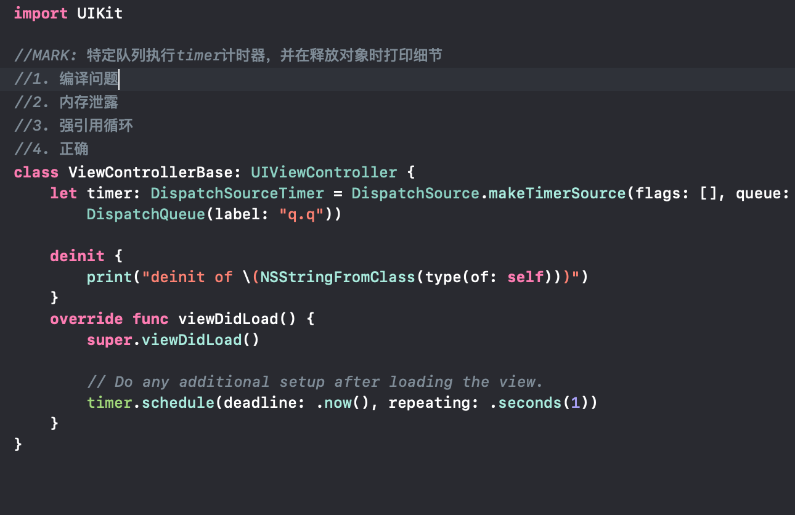
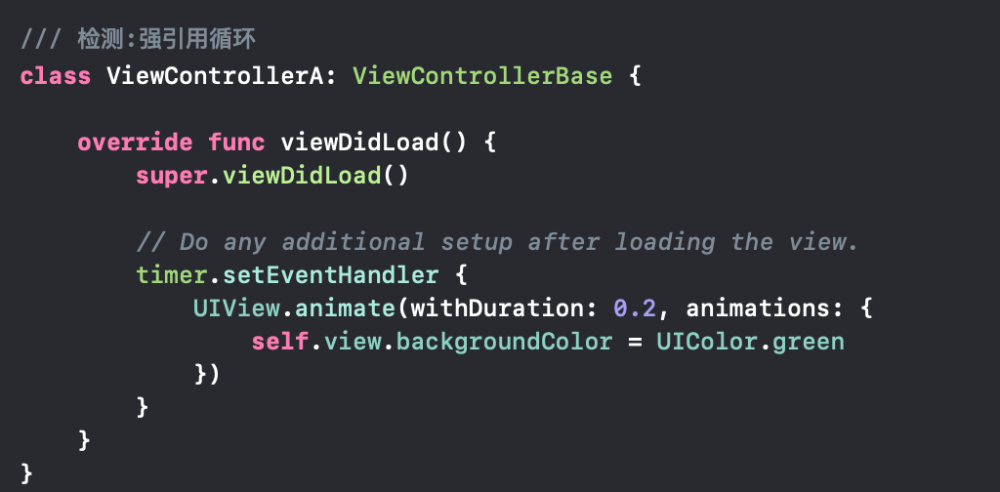
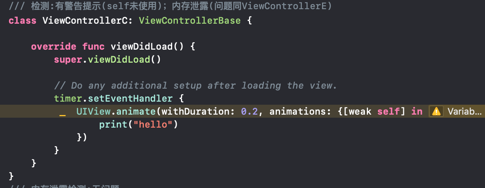
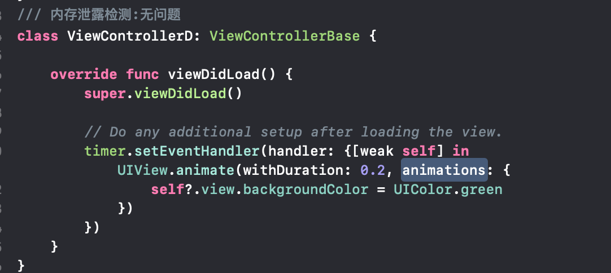
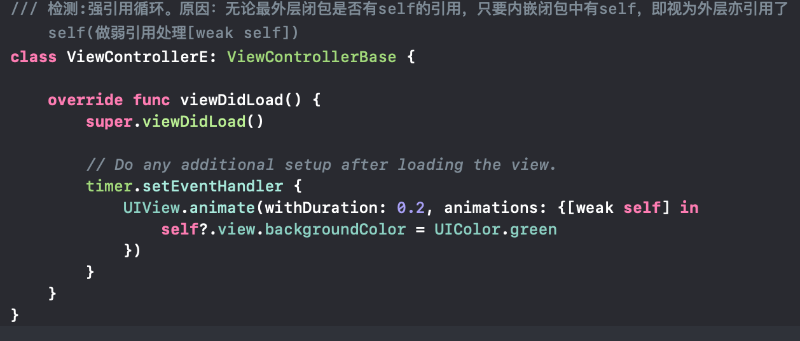

原文链接：[Swift: memory leak gotcha with [weak self]](https://blog.haloneuro.com/swift-memory-leak-gotcha-with-weak-self-67293d5bc060)

在app中，每个对象实例均有父类和子类连接的情况下。普遍做法是父类strong强持有子类，每个子类weak弱引用父类（若需要）。以此父类可以防止子类释放。

上述做法大部分情况下没问题，但是还是有可能导致强引用出现的。

1. 示例说明：

	
	
2. 使用范例1：

	
	
3. 使用范例2：

	
	
4. 使用范例3：

	
	
5. 使用范例4：

	
	
6. 使用范例5：

	