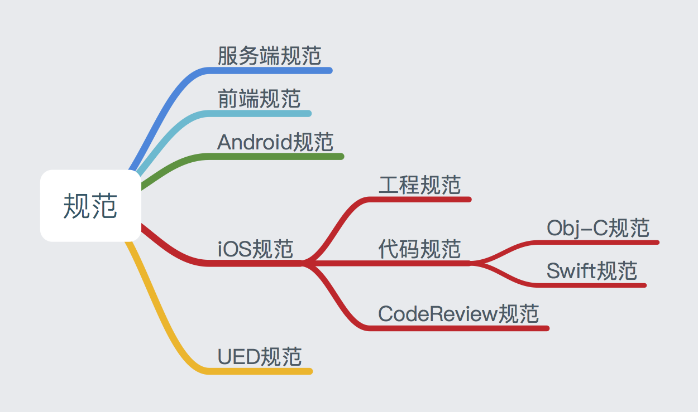

## 提要
1. 所有规范（试行）基于苹果官方[编码准则](https://developer.apple.com/library/mac/documentation/Cocoa/Conceptual/CodingGuidelines/CodingGuidelines.html)。若有冲突之处，以官方为主。
2. 严禁在命名的时候使用非常规的单词缩写。（可接受缩写可见苹果的文档 [Acceptable Abbreviations and Acronyms](https://developer.apple.com/library/mac/documentation/Cocoa/Conceptual/CodingGuidelines/Articles/APIAbbreviations.html#//apple_ref/doc/uid/20001285-BCIHCGAE)）
3. 图片等资源文件的命名同代码准则，苹果也定义了一些特殊的规则，[App-Related Resources](https://developer.apple.com/library/ios/documentation/iphone/conceptual/iphoneosprogrammingguide/App-RelatedResources/App-RelatedResources.html)

## 目录

Ⅰ、[代码规范](#Ⅰ)

Ⅱ、[文件规范](#Ⅱ)

Ⅲ、[TODO:](#Ⅲ)


# Ⅰ、<span id = "Ⅰ">代码规范</span>

## 一、命名规范

* **变量和属性:**遵循小驼峰规则，且`*`紧跟变量

	> 1. NSString *userName;
	> 2. @property (nonatimic, strong) NSString *nickName;
	> 3. 临时变量禁止使用下划线开头！因为Default Synthesis生成的成员变量就是下划线打头的，避免可能存在的冲突！
	> 4. 关于NSString的定义：明显预知的类型可以不加后缀，如userName可以预判是String类型；但不可预判的必须加，如URL string和URL对象需要添加后缀。
	> 5. 关于全局类的属性，变量。定义时需要无歧义描述，如数组定义：cells，cellArray。

* **属性的访问:**需使用点语法执行
	> self.userName = @"john";
	
* **方法的访问:**需使用方括号访问

	> count = [self.userName length];
	
* **类名:**遵循大驼峰式命名法，需要带上前缀。

	> @interface UITextView
	>
	> 视图类：`**View`；控制器类：`**Controller`；实体模型：`**Model`或者`**Entity`。依此类推之。
	>
	> 类似的，对于Protocol、Struct、const命名规则，与之相同。
	
* **方法名:**的每一部分都必须遵循小驼峰命名法；若参数过长，则每个参数占用一行且以`:`对齐。（依据Xcode提示即可）

	> \- (NSRange)rangeOfString:(NSString *)aString options:(NSStringCompareOptions)mask;
	> 
	> 方法名详细参考:[Cocoa Style for Objective-C: Part II](http://cocoadevcentral.com/articles/000083.php)
	>
	> 特例：方法名以特殊大写字母开头。如PDFXXX、TIFFXX等。
	>
	> 行为方法：以动词开头，宜使用诸如`can`、`should`、`will`等情态动词，避免使用`do`、`does`。
	>
	> 返回值方法：避免使用`get`开头。
* **构造方法:**返回实例类型为`instancetype`而不再是`id`类型。

	> 便于编译器正确推断结果类型

* **函数:**其实就是所谓的C全局函数，一般采用`前缀+名字`的方式来命名,其中名字部分采用大驼峰式命名法。

	> 1. NSString *NSHomeDirectory(void);
	> 2. NSString *NSHomeDirectoryForUser(NSString *userName);
	
* **常量:**使用静态变量的方式来定义数值或者字符串常量，而不要使用预编译的方式。好处是前者存在类型检查，而后者只是简单的文本替换。

	> NSString * const kMyConstVar = @"myConstVar";

* **枚举:**使用苹果提供的宏来定义枚举,NS\_ENUM用来定义普通的枚举，NS\_OPTIONS用来定义bitmask。

	```
	typedef NS_ENUM(NSInteger, UIViewAnimationTransition) {
 	   UIViewAnimationTransitionNone,
 	   UIViewAnimationTransitionFlipFromLeft,
 	   ...
	};

	```
	```
	typedef NS_OPTIONS(NSUInteger, UIViewAutoresizing) {
	    UIViewAutoresizingNone                 = 0,
	    UIViewAutoresizingFlexibleLeftMargin   = 1 << 0,
	    UIViewAutoresizingFlexibleWidth        = 1 << 1,
	    ...
	};
	```
* **Notification:**通知必须以字符串常量的方式存在。
命名遵循如下组成结构
`[Name of associated class] + [Did | Will] + [UniquePartOfName] + Notification`。

	``` 
//TBHDXXX.h
	//如果通知名在外部需要使用，则需要在头文件中进行extern声明
	extern NSString * const TBHDXXXDidReceivedNotification;
	```
	```
	//TBHDXXX.m
	NSString * const TBHDXXXDidReceivedNotification = @"TBHDXXXDidReceivedNotification";
	```
	
* **Exceptions:**和上面的通知的命令方式很相似，遵循以下模式:   
`[Prefix] + [UniquePartOfName] + Exception`   
	> 1. NSRangeException
	> 2. NSInternalInconsistencyException
	
* **其它常量变量:**遵循`[Prefix] + [UniquePartOfName]`的命名准则。
	> FOUNDATION_EXPORT NSString * const NSURLErrorDomain;
	
* **UserDefaults:**中的key值命名。
* 关于警告的处理：工具类、方法不使用的，可以使用注释或者``DEPRECATED``等宏定义做警告处理，后续逐步丢弃掉。
* 关于常量相关的区分细节：

	> 1. \#define PI @"3.14":宏定义。预处理器文本替换，无类型检查；占用代码段地址，大量宏会导致二进制文件过大。
	> 2. NSString *PI = @"3.14":变量。共享内存空间；编译阶段进行类型检查。
	> 3. static const NSString *PI = @"3.14":局部常量。共享内存空间；用static修饰后，不能提供外界访问。
	> 4. const NSString *PI = @"3.14":全局常量1。共享内存空间；"\* PI"不能被修改， "PI"能被修改；无论定义在哪个文件夹，外部均能访问。（需要调用时声明extern NSString \*PI）
	> 5. NSString const *PI = @"3.14":全局常量2。共享内存空间；"\* PI"不能被修改， "PI"能被修改，同全局常量1。
	> 6. NSString * const *PI = @"3.14":全局常量3。共享内存空间；"PI"不能被修改，"\* PI"能被修改。
	


## 二、格式规范

* **空格:**合理使用空格，增加代码的可读性。

	> 1. `NSArray *names = @[@"a", @"b"];` ✓ 
	> 2. `NSArray *names = @[@"a",@"b"];` ✗  
	> 3. Dictionary
	> `NSDictionary *errorCodeMap = @{@"0": @"网络错误"};`✓   
	> `NSDictionary *errorCodeMap = @{@"0":@"网络错误"};`✗
	> 4. 二元/三元运算符(Dot运算符例外,一元运算符以及强制类型转换无需空格)  
	> `if(a && b) {}` ✓
	> `if(a&&b) {}` ✗
	> 5. for循环中也应使用空格隔开
	> `for (unsigned int i = 0; i < 10; i++)...`✓ 
	> `for (unsigned int i = 0;i < 10;i++)...`✗
	> 6. 方法声明中的 “－”和“＋”后面必须留空格
	> `- (id)initWithCoder:(NSCoder *)aDecoder;` ✓  
	> `-(id)initWithCoder:(NSCoder *)aDecoder;` ✗
	> 7. 方法调用的时候，receiver和method之间必须要有空格 
	> `[[NSUserDefaults standardUserDefaults] synchronize];`✓    
	> `[[NSUserDefaults standardUserDefaults]synchronize];`✗
	> 8. 代码块的起始的`{`前要留一空格，else 前和`}`也要留一空格
	> `if {..} else {..} `
	> 9. 注释内容和注释标志要有一个空格:
	> `// momo`
	> 10. 逻辑比较复杂的功能修改，需要添加注释：时间，详细内容等。
* **回车换行**：
	> 1. 代码之间不需要多余的回车，不超过2行回车。
	> 2. 不同方法体添加一行回车即可。
	> 3. 方法体内不同逻辑块之间加一行回车即可。
	
* **{}大括号:**左大括号不要另起一行，右大括号必须新起一行。即使只有一条语句。

	```
	if(ok) {
		return success;
	}
	```
	
* **?:条件运算符:**严禁嵌套使用，否则代码的可读性会下降。

	> 1. `a ? a : b`(此种情况也可写成`a ?: b`)✓   
	> 2. `a ? (b > c ? b : c) : d` ✗
	
* **注释:**注释本身也存在其相关语法，可以参考苹果的[HeaderDoc User Guide](https://developer.apple.com/library/mac/documentation/developertools/Conceptual/HeaderDoc/intro/intro.html)。

	> 1. 不要进行大片的代码注释，直接删除它们。

* **函数注释:**针对文件或者函数进行详细解释格式。

	> 基本涵盖：名称、描述、入参、出参、返回值
	
* **Option + command + /**：函数注释   以及h文件中类的注释。方法体、函数体内部业务逻辑较复杂的需要单独添加注释。
		
## 三、语法规范

* ``NSArray，NSDictionary， NSNumber``能够使用新的文法的地方就使用新的文法:

	> 1. `NSNumber *price = @1000;`  
	> 2. `NSArray *names = @[@"a", @"b"];` 
	> 3. `NSDictionary *errorCodeMap = @{@"0": @"网络错误", @"1": @"连接超时"}; `
	
* **CGRect函数:**使用[CGRect函数](http://developer.apple.com/library/ios/#documentation/graphicsimaging/reference/CGGeometry/Reference/reference.html)来获取CGRect结构体中的数据,因为CGRect函数在计算结果前会对变量进行检查，比如对长宽进行检查，是否为正。

	> `CGFloat height = CGRectGetHeight(frame);` ✓
	> `CGFloat height = frame.size.height;` ✗
	
* **单例模式:**统一使用`dispatch_once`的方式，这种方式简单，性能好，线程安全。

	```
	+ (MyClass *)sharedInstance{
    	//  Static local predicate must be initialized to 0
    	static MyClass *sharedInstance = nil;
    	static dispatch_once_t onceToken;
    	dispatch_once(&onceToken, ^{
      	  sharedInstance = [[MyClass alloc] init];
        	// Do any other initialisation stuff here
    	});
    	return sharedInstance;
	}
	```
	

# <span id = "Ⅱ">Ⅱ、文件规范</span>

## 文件
* **Utility和Helper:**一些工具或者辅助类文件名的后缀。

	> `Utility`或 `Util`: 一般在使用的时候无需实例化，直接使用其类方法，是无状的。（因为属于Common类文件，所以不推荐使用）
	> 
	> `Helper`或`Builder`: 可以实例化，有状态的

* **导入:**头文件中能够不import（使用class声明即可）的时候就严谨import。
* **h文件:**布局方案详细

	> 1. 头文件{}外，空1行书写属性，如果需要分类区别，各类别之间空1行
	> 2. 属性下面空1行开始写方法，如果需要分类区别，各类别之间空1行
	> 3. 方法完成后，空1行@end
	> 4. 如果需要声明protocol，空2行接着写。通常protocol写在@end后面，但是声明在  @interface之前

* **m文件:**布局方案详细
	> 1. 文件说明与头文件包含(#import)之间空1行
	> 2. 头文件包含(#import)之间，如果需要分类区别，各类别之间空1行
	
	> 3. 方法与方法之间空1行
	
	
## 结构
* **代码行数:**一行最大为100列

* **函数分组:**使用类似`#pragma mark --- <* text *>--- `方式进行分组

#### 分组详情:

* **该分组模式业已提交code snippet，便于统一处理文件。**

	> * 具体导入使用方法参考Github地址中`README说明`。
	> * github地址：[snippets_tools](https://github.com/PanZhow/snippets_tools)


**根据``函数分组``方案，文件内部组织形式为：**

1. ``- (void)dealloc{}``
2. `#pragma mark --- public --- `

	> 对外公开的方法，即在h文件中声明的方法
	
3. `#pragma mark --- life cycle --- `

	> `- (void)viewDidLoad{}`
	>
	> 一系列声明周期方法集合
	
	
4. `#pragma mark --- delegate --- `

	> 一系列``自定义/系统``代理方法
	> 

5. `#pragma mark --- event --- `

	> 如UIbutton点击事件
	
6. `#pragma mark --- private --- `

	> 相对`public`而言，只在m文件中使用的自定义方法
	
7. `#pragma mark --- getter & setter --- `

	> 一系列``属性``定义方法
	> 

	
## 代码布局

* 不想暴露于头文件的属性，可以使用类扩展(Class Extension，也即匿名Category)的方式进行声明。

	```
	//PZMyClass.m文件中
	@interface PZMyClass ()
	
	@property (nonatomic, strong) UIView *myView;

	@end
	```

	
# Ⅲ、<span id = "Ⅲ">TODO：</span>
后续需要继续完善的部分（红色分支）：

