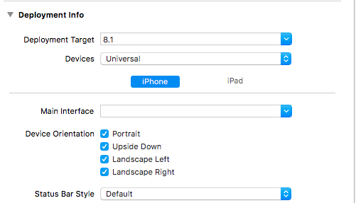

## 一、总结

* 因项目需求，需要老项目在iPad上支持横竖屏切换，本文即为调研过程。

1. AutoLayout：同一类型设备，不同屏幕尺寸下，使用约束来规范元素的布局。
2. Size Classes:适配不同设备。忽略尺寸，将屏幕进行分类处理。
3. 横竖屏切换：通过Size Classes给予的回调，刷新控件布局。

## 二、iPad、iPhone设备判定

1. 使用UIDevice类提供的方案：UI\_USER\_INTERFACE\_IDIOM()

	```
	if (UI_USER_INTERFACE_IDIOM() == UIUserInterfaceIdiomPad) {
	// iPad setting
	}else{
	//UIUserInterfaceIdiomPhone or others
	}
	```
	

## 三、iPad横竖屏切换

#### 一、全局设置：

1. 若项目中有任一界面需要横竖屏切换，均要使能项目的横竖屏效果。(如图，可以针对iPhone、iPad分别处理)

	
	
2. 在APPDelegate中设置与1中效果一致：

	> \- (UIInterfaceOrientationMask)application:(UIApplication *)application supportedInterfaceOrientationsForWindow:(nullable UIWindow *)window 

#### 二、UIViewController视图控制器

* 主要由3个方法来实现UI`自动旋转`、`屏幕朝向`的功能。

1. 自动旋转控制

	> 1. \- (BOOL)shouldAutorotate
	
2. 屏幕朝向:在顶级模态视图和根视图(导航)中，设定支持的朝向

	> 1. \- (UIInterfaceOrientationMask)supportedInterfaceOrientations
	> 2. 注：仅仅作用于`顶级模态视图和根视图中`，并且`1中自动旋转开启的情况下`，才起作用。

3. 模态模式下的优选方向：

	> 1. \- (UIInterfaceOrientation)preferredInterfaceOrientationForPresentation
	
4. 项目调研：

	1. 在以导航控制器为根视图时的方案：（导航控制器：即UINavigationContrller或其子类）

		> 解决方案：
		>
		> 1. 通过在导航控制器下重写上述3个方法，使能屏幕设置；但具体的实现者还是导航栈中每个控制器。
		> 2. 在具体操作时，若大多数控制器有相同的配置，则可以整合默认配置，不必要每个控制器都重写3个方法。

		```
		//1. 控制自动旋转方向
		- (BOOL)shouldAutorotate
 		{  
    	//判定self.viewControllers中元素，来决定其是否使能自动旋转  
		//......
		} 
		// 2. 屏幕朝向控制
		#if __IPHONE_OS_VERSION_MAX_ALLOWED < 	__IPHONE_9_0  
	- (NSUInteger)supportedInterfaceOrientations  
	#else  
	- (UIInterfaceOrientationMask)supportedInterfaceOrientations  
	#endif  
	{  
     return [[self.viewControllers lastObject] supportedInterfaceOrientations];  
	}  
	//3. 模态模式下的处理
	- (UIInterfaceOrientation)preferredInterfaceOrientationForPresentation {  
 	   //......  
	}
		```
		```
		//4. 在具体的控制器中重写上述3个方法，直接控制屏幕朝向
		//略
		```
	
  2. 根视图为UITabbarController的解决方案：略

#### 三、翻转适配
* 使能屏幕翻转功能后，界面在横竖屏切换时，界面元素需要刷新布局以适应新的屏幕大小。在>=iOS8系统之后，使用技术为`Size Classes `

1. `UITraitCollection`：获取当前UI的Size信息，用以确定界面布局

	> * UI基础类实现`UITraitEnvironment `接口，访问`traitCollection `
	> * UI基础类：包括 UIScreen，UIWindow，UIViewController 和 UIView

2. traitCollection响应顺序：View层级自上而下传递traitCollection。即UI无响应时，会传递至父节点。

3. 关于界面控件刷新布局

	> * 在UIView中有`layoutIfNeeded`、`setNeedsLayout`等方法触发`layoutSubviews`，进行界面的重布局。
	> * 在UIController控制器中有`updateViewConstraints`方法触发`updateViewConstraints`，进行界面的重布局。还有`viewDidLayoutSubviews `
	
4. 方法举例：

	```
//自身size变更时，调用此方法获取信息，一般在该方法中进行布局刷新
- (void) traitCollectionDidChange: (UITraitCollection *) previousTraitCollection {
    [super traitCollectionDidChange: previousTraitCollection];
    if ((self.traitCollection.verticalSizeClass != previousTraitCollection.verticalSizeClass)
        || (self.traitCollection.horizontalSizeClass != previousTraitCollection.horizontalSizeClass)) {
        // your custom implementation here
    }
}
//存在Content层级关系时(亦可由此做转场动画)：
- (void)viewWillTransitionToSize:(CGSize)size withTransitionCoordinator:(id <UIViewControllerTransitionCoordinator>)coordinator
- (void)willTransitionToTraitCollection:(UITraitCollection *)newCollection
              withTransitionCoordinator:(id <UIViewControllerTransitionCoordinator>)coordinator
//更多配置请参见源文件
	```
	


#### 四、** app支持iPad横竖屏的问题

1. 可以在通用设置中分别配置iPhone、iPad，支持与否。
2. 上述设置是全局性的，建议最好在根视图中精细化处理

	> * 目前iPad支持横竖屏后，存在切换翻转时布局错乱的问题，此问题需要精细化处理。
	> * 建议后续更改为约束模式，且复杂变换的界面，建议约束书写在规定的方法体内，便于实时更新。（见横竖屏切换）
	

## 参考：

1. https://onevcat.com/2014/07/ios-ui-unique/
2. http://www.jianshu.com/p/650ba0ff626b

