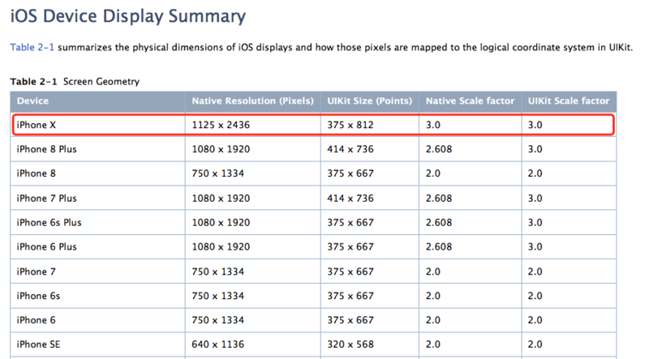
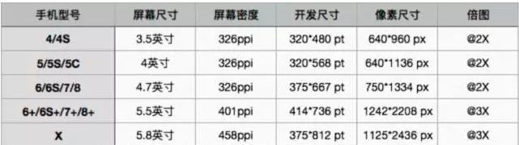

## 一、参考链接

1. [https://developer.apple.com/cn/ios/update-apps-for-iphone-x/](https://developer.apple.com/cn/ios/update-apps-for-iphone-x/)
2. 链接：[WWDC__Designing for iPhoneX ](https://developer.apple.com/videos/play/fall2017/801/)
3. 链接：[Building Apps for iPhone X](https://developer.apple.com/videos/play/fall2017/201/)
4. 链接：[Safe Area](https://developer.apple.com/documentation/uikit/uiview/positioning_content_relative_to_the_safe_area)

## 二、概述

1. 使原有项目支持iphone-x：启动画面若是Launch Image，需要添加针对iphone-x的启动画面，才能保证在模拟器或在真机上以iphone-x的屏幕大小运行。（Launch Storyboard设置正确，应该不会有问题）

	> UIScreen的大小是在初始化是根据我们进入的第一个页面去进行参数化的。故更改启动图来适配不同的屏幕大小。
	
2. 所有UIs检测：元素错位、重叠、缩放错误、切割等各种问题

	> 解决方案：Safe Area Guides、边距布局
	
3. 在实际适配中，发现使用约束情况下比非约束情况更好适配。

	> 主要原因：相对布局，改动较少；内部subViews的布局很少以全局UIScreen的高度和宽度计算，基本上self.view的布局正确就Ok了。
	
## 三、方案详情

#### 1. Safe Area ：

1. 全页面

	> * iOS 11.0-:topLayoutGuide、bottomLayoutGuide
	> * iOS 11.0+:safeAreaInsets（非约束情况）、safeAreaLayoutGuide（使用约束时）
	> * 苹果官方的设计指导是使用以safeArea为框，以layoutMargin为间距来进行UI布局。
	> * 其它：扩展Safe Area，如additionalSafeAreaInsets定制Safe Area
	
3. 状态栏、导航栏、TabBar、底部屏幕指示器
	
	> * statusBar+naviBar = 64.0常量修正。
	> * iOS 11以前，导航栏的高度是64，其中状态栏statusBar的高度是20，底部tabbar的高度是49。
	> * iOS 11之后，iPhoneX的导航栏的高度是88，其中状态栏的statusBar的高度变成了44， 底部的tabbar变成了83（添加了虚拟Home区）。
	
3. 内容元素如按钮避开屏幕角落和传感器槽，防止被切割。
5. 屏幕边缘手势
6. 适应不同的屏幕宽高比（横向、纵向）
7. 其中针对SafeArea，目前做了工具[IMXSafeAreaKit](https://github.com/PanZhow/IMXUIsCpt/tree/master/IMXUIsCpt/Utils/IMXSafeAreaKit):实现了safearea的获取，本地保存等定制功能。

#### 2. 相册访问权限变更

* 即默认读权限，增强了写权限。
* [www.jianshu.com/p/cd0f814a7ce9](www.jianshu.com/p/cd0f814a7ce9)

#### 3. iOS11适配UITableView

* [http://www.jianshu.com/p/73394f7518c8](http://www.jianshu.com/p/73394f7518c8)
* UITableView偏移问题

	> iOS 11.0+,automaticallyAdjustsScrollViewInsets废弃，新增contentInsetAdjustmentBehavior。
	
* 在iOS11.0+：cell.contentview会和cell自身大小有变化，做了切割。


## 四、code snippets

1. API添加判断支持iOS11+：

	```
	if (@available(iOS 11.0, *)) {
	// 版本适配
	}
	```
	
2. 屏幕大小判断（尽量不用此类定量方式）
	
	```
		#definekStatusBarHeight[[UIApplicationsharedApplication] statusBarFrame].size.height
		#define kNavBarHeight 44.0

		#define kTabBarHeight ([[UIApplication sharedApplication] statusBarFrame].size.height>20?83:49)//tabBar高

		#define kTopHeight(kStatusBarHeight + kNavBarHeight)//导航栏高

		//判断iPhoneX

		#define isiPhone (UI_USER_INTERFACE_IDIOM() == UIUserInterfaceIdiomPhone)

		#define iPhoneX [[UIScreenmainScreen] bounds].size.width >= 375.0f && [[UIScreen mainScreen] bounds].size.height >= 812.0f && isiPhone
	```
	
3. UItableView偏移问题：

	```
	if (@available(iOS 11.0, *)) {
	self.tableView.contentInsetAdjustmentBehavior = 	UIScrollViewContentInsetAdjustmentNever;
	} else {
	self.automaticallyAdjustsScrollViewInsets = NO;
	}
	```
	
4. 适配时机（在ViewController中）

	```
	- (void)viewDidLayoutSubviews{
    [super viewDidLayoutSubviews];
    //约束、frame布局设置
    //......
    }
	```
	
## 五、UI细节

1. 屏幕大小（注：iPhonex与iphone6等宽，却需要@3x的图片）

	
	
2. 资源图片：

	
	