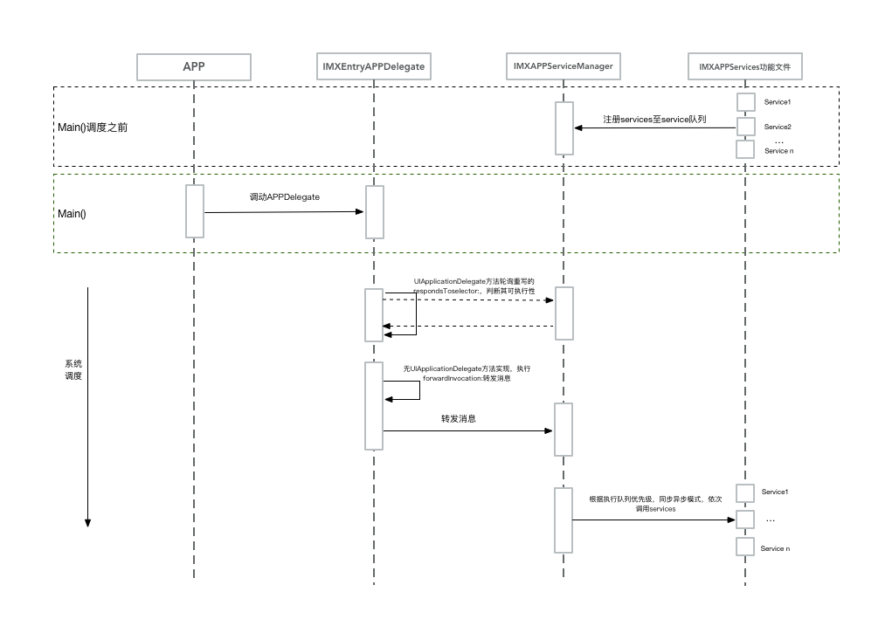

## 一、功能概述

* APP启动组件开发，也即APP初始化整合方案。

	> 功能：将初始化文件`APPDelegate`中的功能拆分至多个实现文件中。实施单一功能原则，使每个文件只负责一个功能，使之服务化、定制化。如启动UIs、远程推送、Scheme跳转逻辑。
	
## 二、原理

#### 一、文件职能

1. APP入口定制：定制的`IMXEntryAPPDelegate`，从`main()`调动此文件。

	> 该文件并不执行具体的功能逻辑，只负责接收`UIApplicationDelegate`协议事件并转发给`IMXAPPServiceManager`文件。
	
2. 文件管理器：`IMXAPPServiceManager`主要负责功能文件管理。

	> * 功能文件的注册、分发执行
	> * 优先级分发策略具体实现、同步异步处理（TODO）
	
3. 启动文件协议：启动文件规范化、功能统一化：方便文件管理、执行。

	> * 协议除了继承`UIApplicationDelegate`外，自增了关于文件命名、优先级定义、模式（同步异步）定义。
	
	
#### 二、技术点
1. 单一功能文件的执行：利用Obj-C中Runtime，实现多个文件的职能拆分。

	> 1. 单一功能文件中的`+(void)load`:实现本文件负责的服务注册，只有注册至管理器中，才能被执行
	> 2. 在`IMXEntryAPPDelegate`中实现`respondsToSelector:`和`forwardInvocation:`方法，完成消息的转发；在`IMXAPPServiceManager`文件中，将转发进来的方法，批量交由`功能文件`来执行。
	> 3. 附：使用`NSProxy`技术，同样可以实现服务分发功能。
	
2. 单一功能文件执行的优先级：目前使用Low、Default、High三种优先级来定义文件执行的顺序。

	> 1. 三个优先级队列，分别存放相应级别的启动文件。
	> 2. 队列优先级不同，执行过程则分别依次执行。
	
3. 同步异步执行：本功能未实现，后续验证是否需要该功能。

## 三、流程图

* 项目启动图：

	> 自main()函数之后，便调用AppDelegate文件，进行APP初始化、事件监听等操作。本组件主要涵盖下图所示的`Your Code`块，并根据功能不同拆分为多个单一功能的文件。

	

* 执行流程图：

	

## 四、参考链接：

1. http://www.qingpingshan.com/rjbc/ios/119485.html
2. http://southpeak.github.io/2015/01/31/cocoa-foundation-nsobject-class/
