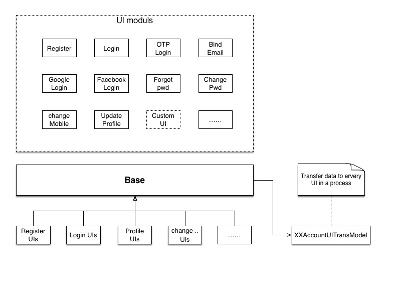
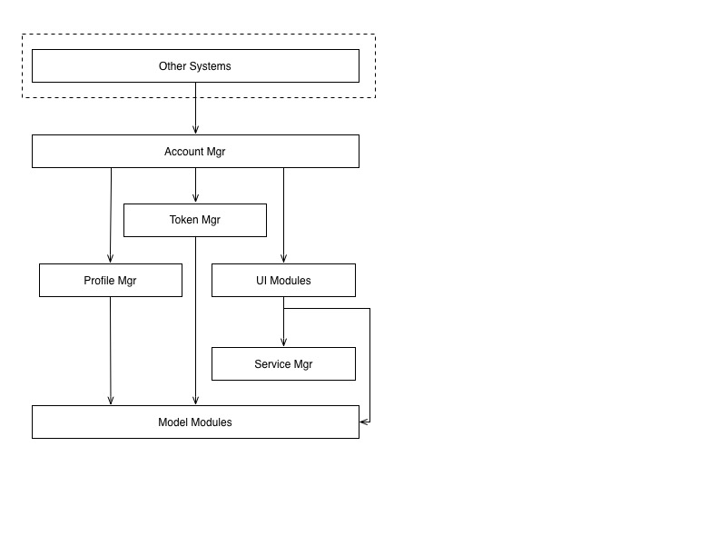
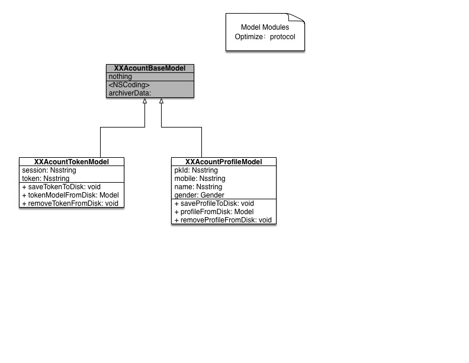
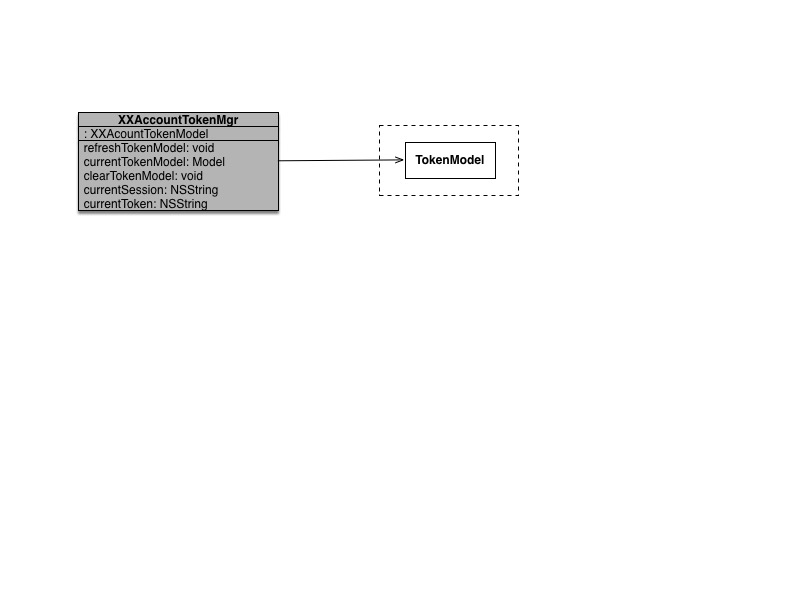
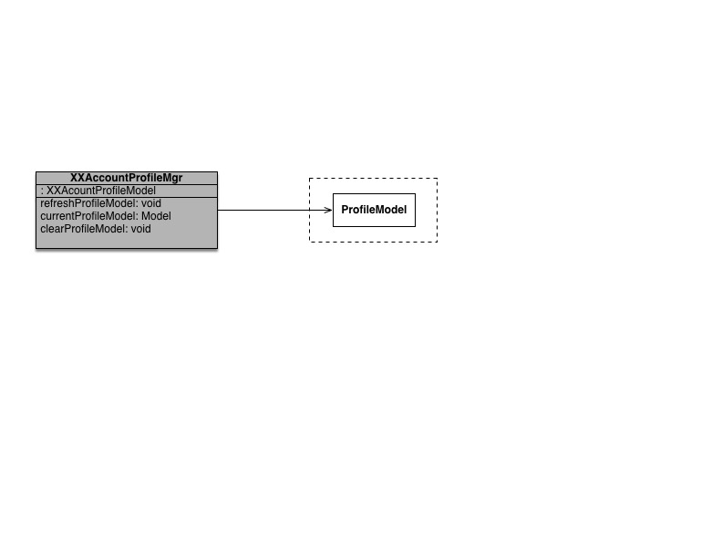
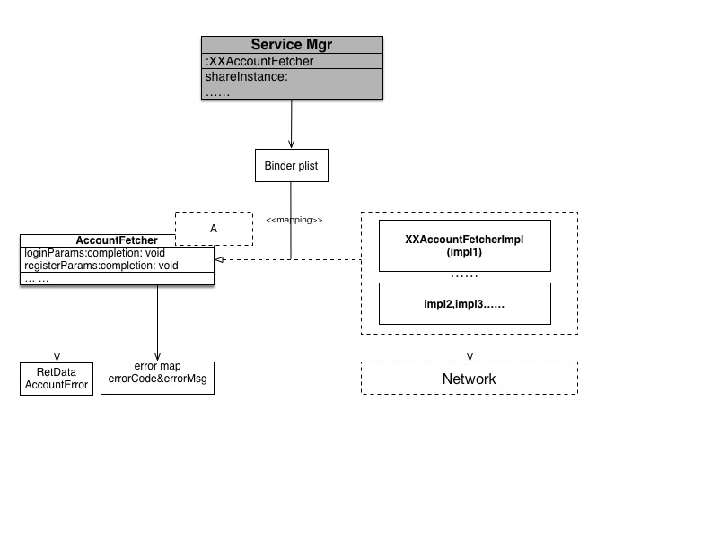
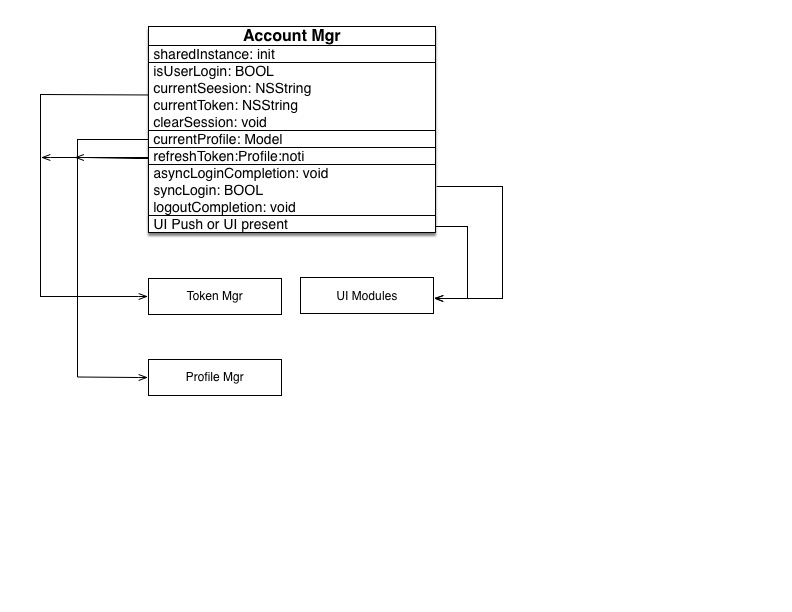
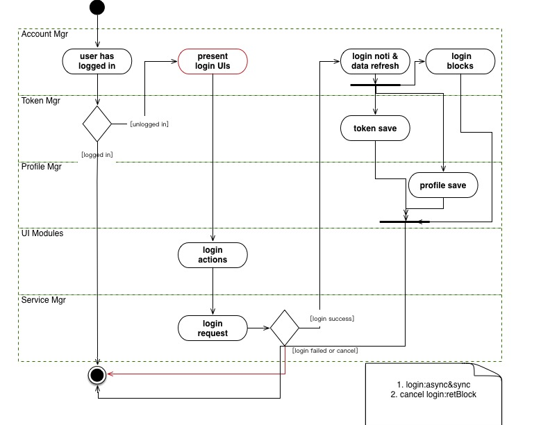
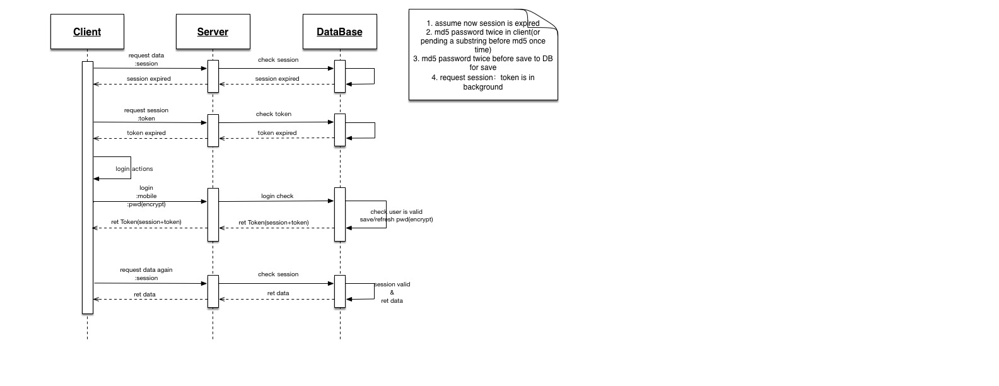

## 账户体系

### 一、简介
1. 在TiketNew项目中主要负责关于账户体系的开发。
2. 因为账户体系比较繁杂，故在开发前做了一定的调研，产出了一个较为初级的账户体系架构
3. 随着后期的开发和不断深入，在一定程度上完善了该体系，并总结为文档，记录于此。
4. 以下介绍的有部分没有在TN一期中使用到

### 二、架构

#### 1. 概览
1. 在app中，帐号的作用应该有2种：

	> 1）购买订单时需要验证用户合法性。
	>
	> 2）提供用户留存手段（签到、积分等）（TN项目无此功能）
	
2. 其它模块调用账户体系时表现形式：

	> 1)如订单提交时未登录，弹出登录界面
	>
	> 2)用户手动调出登录界面
	
3. 登录体系目前细分如下：

	> 1. Model Modules：TokenModel和Profile Model集合，负责保存用户登录信息和用户属性
	> 2. Token Mgr：管理用户登录的Token Model：更新、删除以及同步（mem和Disk中均有一份完整的model）
	> 3. Profile Mgr:管理用户属性集Profile Model：更新、删除以及同步
	> 4. Service Mgr:网络请求优化。具体的数据请求和账户体系中所需数据隔离
	> 5. UI Modules:登录、注册等具体界面集合
	> 6. Account Mgr:帐号管理器，对外模块接口
	

4. 下面给出各个模块间的关系图

	> 1. 模块间的关系图
	
	
	> 2. Model Modules类图：其中待优化点为使用协议规范Model的各api
		
	
	> 3. Token Mgr和Profile Mgr 类图
	
	
	> 4. Service Mgr类图
	
	> 5. Account Mgr类图
	
	
	
#### 2. 账户体系协作流程
1. 在`1.概览`中介绍了各子模块间的结构和相互关联， 本小节将给出一个完整的登录事件。
2. 其它模块调用登录，有2种方式：

	> 1. API需要登录时，使用异步调用登录方式：同步方式，即异步线程下只允许一次登录
	> 2. 人工登录，并获取回调：登录成功时，回调block集合
	
3. 下图中，当用户在登录界面点击cancel取消登录时，会有响应block激活，图中未标明

#### 3. 一次完整的网络请求时序图
1. 附：

	> 1. 假定当前 `reqeust data` 需要登录
	> 2. 当前`session`过期
	> 3. 密码登录时密码字段需要2次md5编码（也可以pwd+pedding子串，执行一次md5），登录成功后，保存DB前仍需要2次MD5编码（安全性考虑）
	> 4. session过期后，client会用Token静默（后台）请求一次，如果token未过期，则此时可以在用户无感知情况下正常登录的。
	
2. 上图

### 三、其它
#### 1. 关于登录注册中的Token和Session

1. request detail

	> 1. request param：user、pwd（MD5 or Encrypt）
	> 2. response：userProfile 、 Token 、 Session
	> 3. HTTPS protocol

2. Session

	> 1. 需要登录的请求，添加至header中或者参数中
	> 2. expire过期时间较短（如24h）
	> 3. 在24h(expire)之内，若被劫持，则仍有安全问题；但仍提高了安全性.
3. Token

  	> 1. 长期存在本地DB。
	> 2. 当Session过期，则以Token入参，请求新的session（针对用户透明,后台静默请求即可）。
	> 3. expire时间较长（2~3Month，过期时，需用户重登录）
	
	
### 四、番外

##### 骨感的现实：目前由于与TN现有架构的冲突，做法妥协处：

1. `AccountMgr`:主要负责实现管理`TokenMgr`和`ProfileMgr`；登录注册等界面弹出消失,......。
	
	> 目前实现同等功能的是`TNAccountService`协议，实现为`TNAccountServiceImpl`
2. 架构设计中`ServiceMgr`协议负责统一接口请求格式，具体实现可以由不同的IMPL文件来处理。

	> 目前处理方案：`TNAccountFacade`实现接口请求，未能做到接口的统一处理。