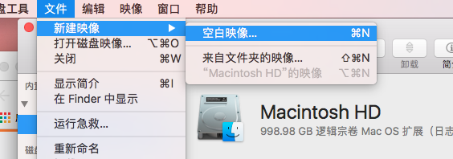
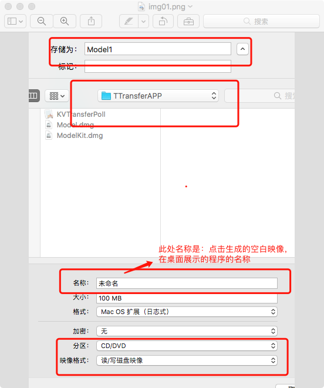
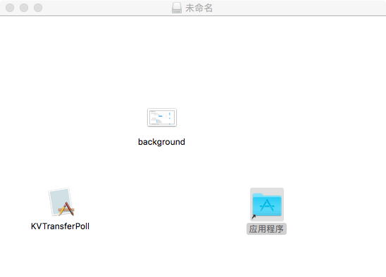
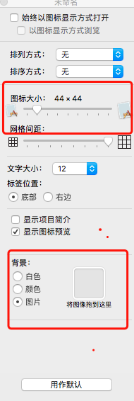
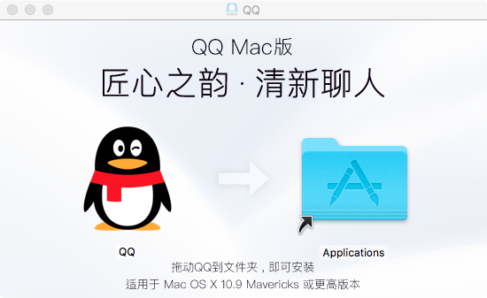
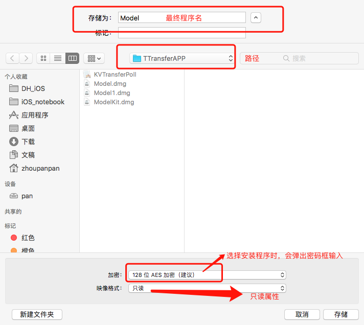

## 一、可视化导出DMG文件

#### 步骤：

1. 打开`磁盘工具`，并新建一空白映像，如图所示

	
	
2. 在弹出的选项框中：命名文件并保存目录、分区改为CD/DVD模式,读写磁盘映像，其它默认即可。
	
	
	
3. 点击上图所示的`Model1.dmg`，会在桌面展示`未命名`程序，点击之后显示空白。将项目生成的`*.app`拖拽至内部、添加`应用程序`文件夹路径、添加背景图片，并设置如下：

	
	
	
4. 最终呈现效果大致如下（QQ示例）：

	
	
5. 设置完成后，再次打开`磁盘工具`，选择`映像`->`转换`,选择要转换并且已修改好的`Model1.dmg`，配置如下图，然后导出新的DMG文件。

	
	
#### 注意问题

1. 使用的`*.app`注意需是release版本。
2. 背景图片资源隐藏配置：`mv background.jpg .background.jpg.jpg`
3. 添加`应用程序`文件夹替身：

	``ln -s /Applications /Volumes/Model1/Applications``

4. 添加<软件许可协议>，参考：

	> 1. http://www.owsiak.org/adding-license-to-a-dmg-file-in-5-minutes-or-less/
	> 2. https://justinyan.me/post/1715

	
## 二、 脚本化方式导出DMG文件

* 待添加

