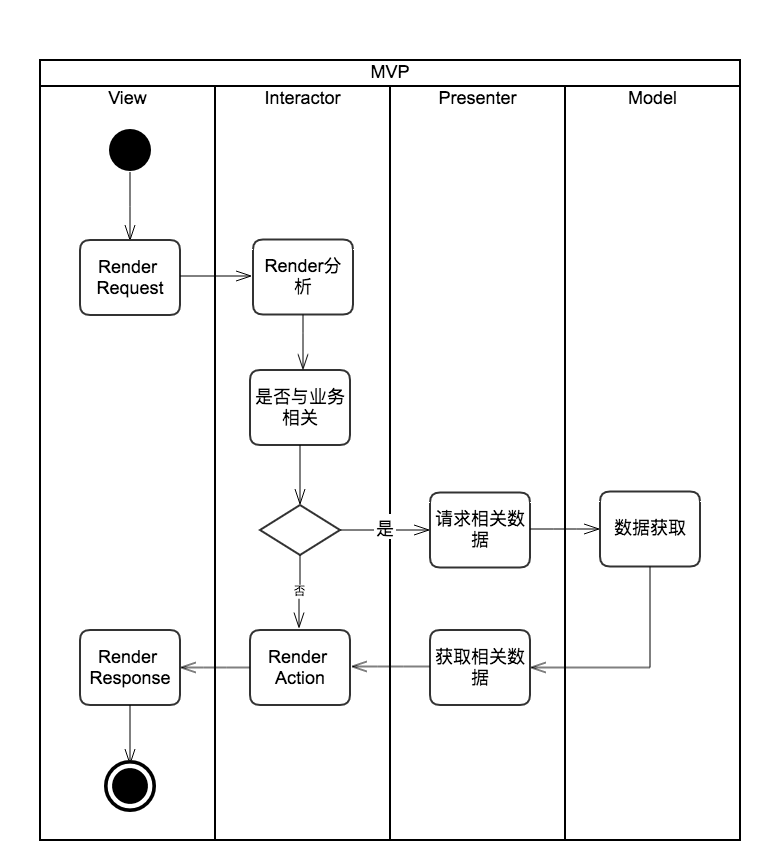
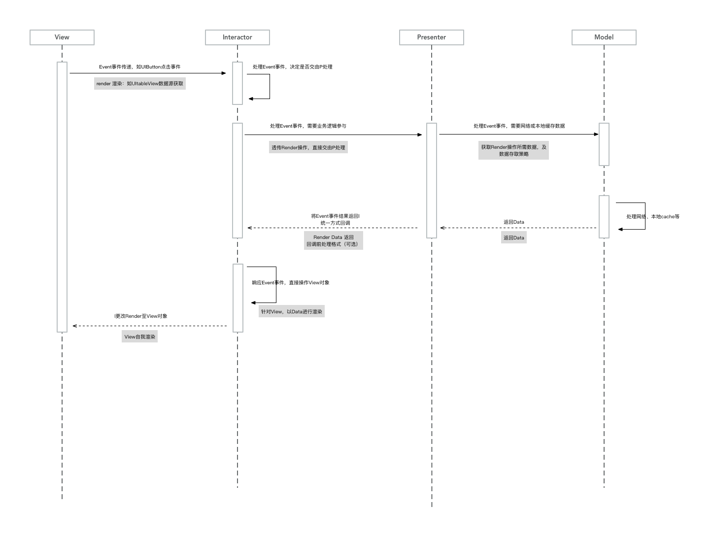
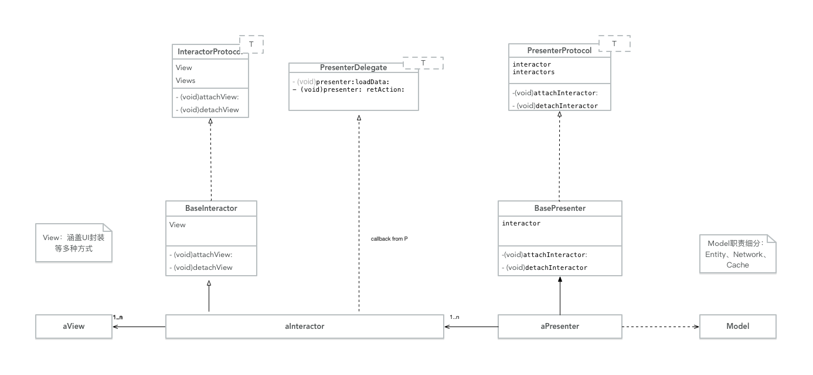

# MVIP模式

## 0、提要

* MVIP模式属于MVP的一种尝试。即在View和Presenter之间添加了一个交互层（Interactor），主要来处理它们之间的绑定操作。
* 源码Demo请移步:[https://github.com/PanZhow/MVIP](https://github.com/PanZhow/MVIP)
* 理论性的东西请参考上一篇文章[MVP模式](MVP模式.md)

	> MVP详解中的Demo可以忽略，与本文的实现有改动。即增加了中间层Interactor。
	
* TODO：关于MVP、MVIP，目前问题还是在View和Model之间的数据绑定上，即双向绑定问题未完全解决，未能做最简化联动处理。

	> * 后续需要改进的也在于此处。

# 一、功能详解

## 1.0 流程图解

1. 活动图

	
	
2. 时序流程图

	

## 1.1、View

### 1. Render View

具体视图Render：如UIButton、UITextView、UITableView（含协议实现）添加

### 2. Order 外放
Action、render data具体实现交于Interactor：如UIButton Action、UITableView数据获取等。

## 1.2、Interactor

### Order：action + render data

1. action：如UIButton的Action具体实现、UITableView的点击事件
2. render data：与Data+View相关，如UITextView的占位符、UITableView的数据回执

## 1.3、Presenter

### 响应Interactor

1. action：需要集合业务逻辑的功能
2. ret data：具体的数据请求工作

	> 数据来源：Model层

## 1.4、Model

* 涵盖Entity、Net、Cache等功能

----

# 二、功能实现

## 2.0 类图

## 2.1、View
1. 创建Interactor，并执行初始化
2. Interactor挂载View，即弱引用View
3. Action、Render data行为注入。

	> 具体行为实现在Interactor中
	
## 2.2、Interactor

1. 初始化：创建Presenter，并初始化之
2. Presenter挂载Interactor，即弱引用Interactor。
3. Presenter实现代理
3. action、render data实现：响应View

	> 是否需要业务逻辑部分协助，是具体情况而定。如render data一般获取需要Presenter协助。
	
4. Presenter通过业务处理，将结果回执。

	> 1. 通过委托方式返回。
	> 2. 回执结果，可能进一步展示在View上，此时可能会调动View。
	
	
## 2.3、Presenter

1. 初始化工作.
2. 业务逻辑执行，响应自Interactor的事件。
3. 回执结果（代理方式、Block）

## 2.4、Model

* 主要分为Entity、Net文件、Cache文件。

	> * Entity:可能会继承某些json解析的基类，或继承其协议
	> * Net文件：基于不同的网络库，可能形式不同
	> * Cache文件：若网络库含有cache功能，可能和Net文件一体；也可以单独设置cache策略
	
	
