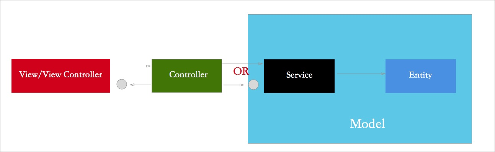

# MVP详解

* MVP模式增强版请见文档：[MVIP模式](MVIP模式.md)。
	
	> * MVIP模式基于MVP模式的基础上，增加了Interactor层，细化了Presenter和View之间的联动，即细化Data和UI之间的绑定处理。
	> * 本文理论部分和MVIP模式一致，可以作为参考。
	
	
## 前情提要

目前iOS架构级别的设计模式，常见于文章的大致有：MVC、MVCS、MVP、MVVM，VIPER这几种。但常用的主要是MVC、MVP和MVVM。

1. 关于MVC，Xcode默认创建一个界面模块时，即为该模式。躲都躲不掉的亲密模式，所以即便要使用MVP或者MVVM模式的项目，肯定是以MVC作为入口的。

2. 其次是MVVM，目前不使用它主要囿于3个原因：
>
> 其一：它主要是将MVC中C的代码全量到VM中了，并没有真正做到解耦和[单一功能原则](https://en.wikipedia.org/wiki/Single_responsibility_principle)。
> 
> 其二：VM中双向绑定的使用技术，如RC、RxSwifte是需要学习成本的；对于团队协作来讲亦然。
> 
> 其三：Uh，还没想出来第三点。

3. 	主角登场：MVP。
	
>	详见下文，主要从结构构成和功能两大块来讲述。

	
## 结构
### 整体俯瞰
1. 入口：在Xcode新建一个MVC界面，在**ViewController中添加MVP架构的模块。

	> 前面讲到MVC是Xcode固有的架构，所有入口没办法只能以此为准。
	> 此处的ViewController负责View Container周期、其它V（MVP）的接入，并监听与MVP相关的事件。
2. 以View为中心：MVP中，以View为交互中心，Model和Presenter辅之。

	> 1. 以View为中心，将其添加于MVC中。
	> 2. 初始化**所属**Presenter，获取**相关**Model
	> 3. Presenter**间接**更新View
	> 
	> 类似于NativeScript，加载XML(View)时，会查询同名的js和css文件(逻辑和布局文件)，然后加载之。
	>
	> 个人认为以View为中心，结构明朗，另外尽量在Presenter中不涉及View模块。
3. 图示（注意图示中箭头对应上述黑体`所属`、`相关`、`间接`）
	

### 模块详解

#### 一、Model层

1. 由Entity实体、Service网络请求、cache缓存机制组成

	> 1. Entity:即单独的数据模型,负责模块化网络、缓存中的数据。
	>
	> 2. Service:可选。通过网络层获取数据的服务。（具体网络请求由底层模块负责，此处只需实现请求响应即可）
	> 
	> 3. Cache:可选。完善的缓存机制，如memory、File System、FMDB等。往往和网络请求配合使用。（具体的缓存机制由底层缓存模块负责，此处只需实现功能即可）
2. Code组织：Entity由Model类组织，而网络请求和缓存可以使用对应的category实现。（缓存可以在网络请求失败时使用，请求成功时保存）

	```
	//model示例
	struct DemoModel {
    let firstName: String
    let lastName: String
    let email: String
    let age: String
}
	```
	```
	extension DemoModel {
    static func requestUsers(block:@escaping ([DemoModel]?, _ error: Error?) -> Void) {
    //网络请求实现+缓存运用
    //回调
    block(models,nil)
   }
}
	```


#### 二、View层

1. 由View和ViewController组成。

	> 1. View:简单的View控件；ViewController：视图以及视图逻辑，所以都属于View层的一部分
	> 2. View层直接持有一个Presenter层负责业务逻辑
	
2. 负责用户Action响应和Data展示

	> 1. Action响应:直接调用所属Presenter，执行对应业务逻辑。如数据请求、按钮事件等。
	> 2. Data展示：在Presenter层含有View层的间接引用，获取Model后，会调用View层，执行data渲染。而最为重要的：执行具体View层渲染的，是View自身。
	>
	> 	关于View层的render，会涉及到Model元素的一一对应问题，这和MVP模式中View层和Model层不直接通讯的理念有点出入，但没办法。而且两者并没有实质的逻辑联动，只是视图展示。
	>
	> 	在Swift中可以做View层的扩展，将此视图逻辑与view隔离开；OC中使用category实现renderView，作为View层和Model层一次暧昧的接触。
	>
	> 附：Data展示这块，其实有两种方案，一种如上所述。另一种则是在Presenter层实施具体的渲染工作：优点是View层减轻了负重，业务逻辑和View&Model绑定都放在了Presenter层；缺点是Presenter成了ViewModel，变得臃肿了，而且前面也提到了**尽量不要在Presenter层导入UIKit模块。**

3. code组织：即系统或者自定义View；UIViewController子类
	> 
	> 1. 继承`PZViewProtocol`协议，实现View渲染的协议或者block
	> 2. 定义所属Presenter，负责业务逻辑
	>
	> 3. 部分示例：
	
	> ```
		class ViewController: UIViewController, PZViewProtocol{
		var demoPresenter: DemoPresenter?
		//实例化Presenter
		}
	```
	
	>	```
	//通过delegate实现渲染；也可使用回调方案
	extension ViewController{
    func renderView(model: Any) -> Void{
        let retModel = model as! Array<Any>
        demoPresenter?.demoModels = retModel;
        tableView?.reloadData()
    	}  
  	}
	

#### 三、Presenter层
1. 弱引用或者间接引用View层，直接引用Model层（service、Cache或者Model）

	> 1. View层传输Action事件，P予以响应
	> 
	> 2. P通过Model层得到的数据，通知View层，渲染之。
	
2. Code组织：P主要做的事情有2件，一个是承`View`启`Model`；另一个则是处理业务逻辑。

	```
	//业务逻辑
	 func requestModels() -> Void {
        viewDelegate?.loading!()
        DemoModel.requestUsers { (response,error) in
            if let ret = response{
                self.viewDelegate?.finishLoading!()
                self.viewDelegate?.renderView!(model: ret)
            }else{
                self.viewDelegate?.endLoading!(error: error!)
            }
        }
    }
	```

## 功能总结

行文至此，下面总结下我所理解的MVP：

1. Model层：

	> 1. 由Service、Cache与Entity组成。Service&Cache为P层提供网络与本地数据服务，即处理网络请求、数据库、文件等操作。Entity为实体类，负责定义数据的模型。
	
	> 2. Presenter直接引用Model层
	


2. View层：

	> 1. 包括View、ViewController（含视图逻辑）两个模块。
	
	> 2. View层是MVP的中心，P和M均为其服务。
	
	> 3. View层直接引用所属Presenter层，执行Action和渲染逻辑。View将界面的响应处理移交给Presenter，而Presenter调用Model进行处理，最后Presenter将Model处理完毕的数据通过Interface的形式递交给View做相应的改变。
	> 4. View层不与Model层交互，但在Data展示时需要做一下引用，非逻辑处理。（可以使用delegate形式，将Model绑定隔离开；也可以使用block形式，但隔离性略有降低）
	
3. Presenter层：

	> 1. 负责业务逻辑，关联View层和Model层（可根据项目特点选择直接/接口引用）

	> 2. P间接引用View的方式，通知View层的变更：可以是delegate，也可以是block形式
	


## 实例代码：
代码请移步[github](https://github.com/PanZhow/MVPDemo)

附：诚如课本中的课后习题一样，其复杂度和示例完全不是一个量级。所以demo只是简单的讲解，后续随着开发使用的深入，逐步丰富使用方案。

## 参考
1. https://medium.com/ios-os-x-development/ios-architecture-patterns-ecba4c38de52#.h8i2v6evy
2. http://catchzeng.com/2016/01/26/iOS%E7%94%A8%E8%A2%AB%E8%AF%AF%E8%A7%A3%E7%9A%84MVC%E9%87%8D%E6%9E%84%E4%BB%A3%E7%A0%81/
3. https://martinfowler.com/eaaDev/uiArchs.html 
