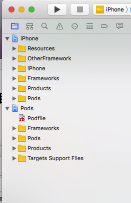
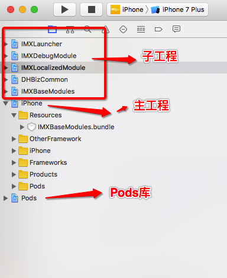
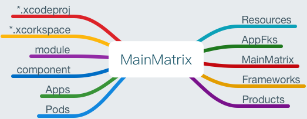
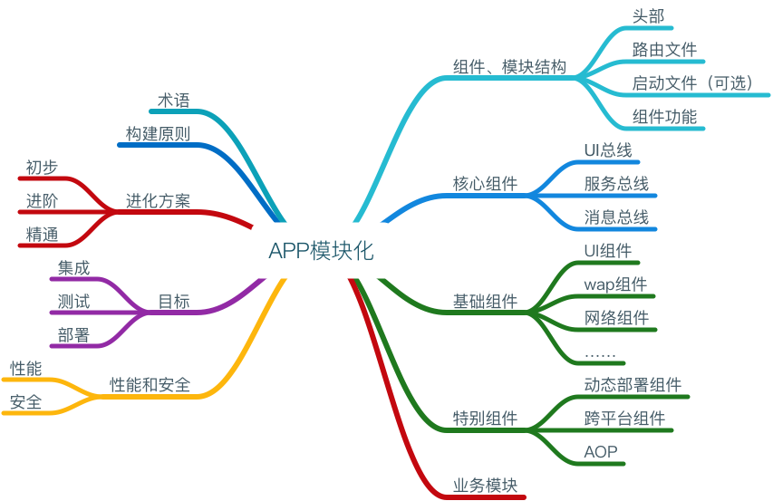

#目录

* 提要

	1. [往期项目]()
	2. [iOS模块化项目]()
	
* 简介

	1. [子工程模板]()
	2. [模块化开发]()
	3. [项目部署]()

* 组件开发细节

# 提要

## 一、往期项目

* 结构图

	

* 说明

	1. 对应的黄色文件即为逻辑分组，逻辑清晰。

		> * Group实际路径可以有同名的物理文件隔离，也可以无单一文件隔离。
	2. cocapods管理+逻辑分组实现一个项目的开发，即便模块化开发也可以实现。

* 缺点

	1. 逻辑分组无物理隔离性，模块化开发中，后期很容易造成文件分散，功能划分混乱。

		> * 主要原因有：开发人员增加、项目体积骤增、开发工期紧张等
		

## 二、iOS模块化项目

**模块化项目是什么样子的？**

* 结构图（初步方案）

	
	
* 说明

	1. 项目以`cocoaPods公共库管理`+`子工程`+`主工程`相结合的方式实现。

		> * 下文`子工程模板`会做概要介绍
		
* 优势

	1. 各组件、模块物理隔离，完美解决往期项目中逻辑分组的缺点。

	2. 子工程各司其职，单一独立。甚至包括相互间引用也有独立的路由组件实现，便于后期提取编译为组件、模块库，进而以Pods分发管理等。

		> * 后期具体完善方案请参见：[APP模块化开发详情](iOS模块化开发详情/iOS模块化开发详情.md)中`进化方案`说明。
		
* 缺点

	1. 开发阶段，编译速度慢

		> * 多个子工程编译、链接耗时
		

# 实现

## 一、子工程模板

**一个模块里面都有什么？**

* **即涵盖脚手架结构、子工程自动化生成、链接主工程实施方案等**

	> 工程配置细节，参考文档：[iOS子工程模板搭建](子工程模板搭建/iOS子工程模板搭建.md)
	
* 主工程目录：
	
	
* 子工程目录：
	
	
	
## 二、模块化开发

**组件、模块都有哪些？后期规划是什么？**

* 开发图谱

	
	
	
* 最终目标：单一组件、模块，单一产出；优化测试；实现权限管理(GitLab私有化)、实现分支管理；编译集成均实现可视化等。

	> 详情参考文档：[iOS模块化开发详情](iOS模块化开发详情/iOS模块化开发详情.md)

## 三、项目部署

**这是一个项目周期**

* APP结构图（初稿）

	
	
	* 消息组件不应当承担其它的组件通讯工作。
	* 路由组件承担`业务<->组件`、`业务<->业务`、`组件<->组件`之间的路由寻址功能。
	
* 项目图谱

	
	
* 详情参考文档:[项目部署](项目部署/项目部署.md)

## 略

1. MVIP模式:后续文档

##TODO：

1. 后续业务开发前以及开发中，实施架构文档内容，逐步丰富完善​组件

