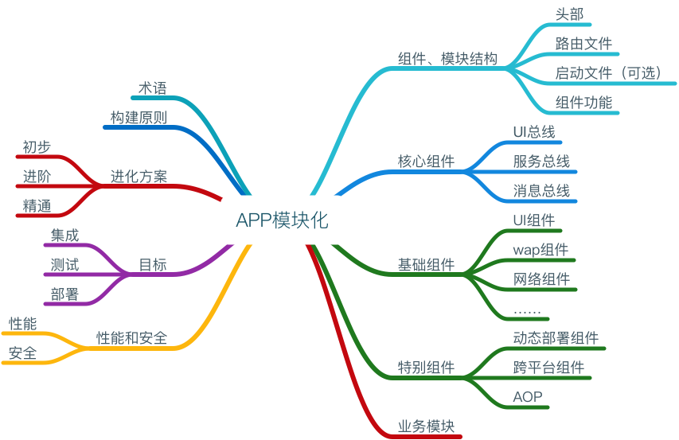

# iOS模块化开发详情（初稿）

# 理论

* 本文涉及的大多数组件尚在开发中，该文档中只是粗略带过。
* 后续完善功能后，将以单独的组件开发文档体现出来。

## 图谱梗概

## 目录

**理论**

1. [术语](#术语)
2. [构建原则](#构建原则)
3. [进化方案](#进化方案)
4. [目标](#目标)

**实践**

1. [组件、模块结构](#组件、模块结构)
2. [核心组件](#核心组件)
3. [基础组件](#基础组件)
4. [特别组件](#特别组件)
5. [业务模块](#业务模块)

## 一、术语

1. 一切功能皆组件、一切业务皆模块

	> * 组件：功能块，于业务无关。即公共基础设施；组件之间无依赖，严格隔离，依靠路由互通。
	> * 模块：业务块，具体项目具体不同；通过路由策略，串接多个业务模块，形成一个完整的业务线。
	
## 二、构建原则

1. 代码整洁：工程(子工程)依据工程规范、文件依据文件规范、代码细节依据代码规范

	> TODO:文件级别代码片段完善
	
2. 单一功能，单一组件；单一业务，单一模块。

	> * 后续参考着重SOLID原则，提高抽离高度
	> * 组件模块分解粒度务必最细化，利于后期扩展
	> * 组件模块中无`Common、Core`集合（后期细化困难）,无集中化的管理模块，即去中心化
	> * TODO:目前子工程有组件集合，后期进行细化提取时，注意依赖、规范问题

3. 关于细分和依赖问题（基于iOS考量）

	> * 主工程：一般通用三方库，多个组件、模块调用。使用cocoapods或carthage管理较为合适
	> * 组件细分：单一组件使用到的库手工引入该组件即可。
	> * 模块细分：基于组件或依赖于其它模块，依赖UI总线（路由策略）进行通信。若不得已使用组件具体功能，可从主工程进行分发。（详见子工程模板创建文档）

2. 业务基于组件
	
	> * 重点开发组件，拼接健壮基础架构层，然后打造业务模块
	> * 不同业务，依赖组件集或有差异。故在进行业务模块开发时，会逐步丰富组件和新增依赖业务模块
	> * 杜绝横向依赖，不跨层访问组件模块
	

## 三、进化方案
1. 初步：物理式隔离各功能块、各业务块。即组件化、模块化开发。

	> * 工程结构：主工程、子工程、Pods管理、子framework管理
	
2. 进阶：脚手架创建，模板生成，组件、模块生成，均实现脚本自动化。
	> * 工程结构：主工程、子工程、Pods管理、子framework管理
	>
	> * 组件、模块进行打包编译，形成可被初步管理的库文件。如使用Cocapods管理的.a库文件。
	
	
3. 精通：组件、模块实现权限管理(GitLab私有化)、实现分支管理；编译集成均实现可视化

	> * 工程结构：主工程、Pods管理（含子工程)
	>
	> * TODO:iBiu参考，iBiuL可视化配置，通过组件配置表：组件版本、责任人、格式是否二进制、依赖等，自动组装业务流，进而生成APP
	> * 以Pods搭建私有库、创建模板。如IOSMatrix模板
	> * Pods管理组件、模板：源码或以二进制包呈现，依据权限不同而定
	> * 可视化方案：包括进阶中的功能
	
	
## 四、目标
**简化集成；重测试组件模块、轻测试集成封装；部署自动化**
### 1. 集成
1. 标准化产出：单一组件、模块的源码库产出、二进制库文件产出
2. 依据三大总线组件进行集成组装

### 2. 测试
1. 优化测试，便于开发中的业务回归
2. 对组件、模块独立执行性能测试，进行定量优化

### 3. 部署
1. 实现并行开发，独立调试，易于集成。

---

# 实践

**提要：目前模块化开发处于初步阶段，一些基础组件暂由通用基础模块整合在一起，后续还需拆解细化**

> * 基础组件目前简单，未进行单独拆分
> * 时间关系

## 一、组件、模块结构

### 1. 主要包括：
1. 头部信息
2. 路由文件
3. 启动文件(可选)
4. 组件、模块功能文件

### 2. 细节

1. 头部信息

	| 信息 | 功能 | demo |
	| :----: | :----: | :----: |
	| 版本号 | 后续完善更新匹配策略，如不匹配warning | v1.0 |
	| 依赖信息 | 所依赖的组件、模块信息 | 组件一般无依赖 |
	| 其它 | 诸如组件负责人，建立时间、功能梗概信息 | 无 |

2. 路由文件

	| 信息 | 功能 | demo |
	| :----: | :----: | :----: |
	| Target_XX文件 | 组件、模块路由文件| 无 |
	| CTMediator + category | 待完善| 无 |

3. 启动文件

	| 信息 | 功能 | demo |
	| :----: | :----: | :----: |
	| XXAppLauncher | 组件、模块初始化操作文件 | 无 |
	
4. 组件、模块功能文件

	> 为组件、模块的主要功能，具体分析，此处略
	
## 二、核心组件

### 1. UI总线：路由策略组件

**组件模块之间建立统一的交流规范，是打造模块化工程中最基础的组件设施。**

#### 功能汇总
1. 跨平台URI寻址方案
2. 降级方案：组件模块若无对应URI，自动以Web容器加载资源（TODO）
3. 分发策略：中心化或者去中心化选择

#### iOS实现

1. 实现组件：CTMediator

	> * APP间跳转
	> * APP内部页面跳转
	> * 组件、模块间通信、跳转，组织功能实现
	> * 中心化分发机制
	
2.  需要组件、模块单独开辟路由文件：调用和响应（input、output）
3. 功能待完善

	> * 跨进程安全问题：需要确认

### 2. 服务总线：初始化启动策略

**模块化内核管理组件。依据主程启动策略，完成工程中组件、模块集的初始化事务**

#### 功能汇总
1. 可跨进程，可同步/异步执行
2. 主要事务：容器启动、类加载、核心中间件初始化
3. 全局服务类，诸如：LBS、路由文件加载（与现有路由策略做对比分析，得出最优方案）、App更新服务、Push、埋点，timeAsync等

#### iOS实现

1. 实现组件：APPLauncher
2. 实现初始启动服务

	> * 调度中心：LauncherMgr
	> * 子类化IMXBaseLauncher，若有服务和其共同存在，则子类化同时实现service协议
2. 通过service服务模板，执行启动事务时，加入了诸如顺序、优先级、同异步等各方面考量
3. 需要组件、模块单独开辟启动文件
4. 具体实现后续会有单独的文档呈现
5. 注：因为`+(void)load`方法在main函数之前执行，故只允许挂载组件名称，禁止其它耗时行为。

	> * 此处若不进行处理，那么在appDidfinshiLoad时同样要处理初始化操作，所以都会在app启动之前耗时。
	> * 故后续需要多次验证此类情景。

### 3. 消息总线
**业务模块间消息通道**

#### 功能汇总

1. TODO：

#### iOS实现
1. 依据Android的`EventBus`消息机制，制定iOS端消息模块。

	> TODO：

## 三、基础组件

### (1) UI组件

#### 功能汇总
1. 文件级别，制定并遵守文件规范

	> * 规范各功能代码放置顺序。如IDE中定义代码片段实现

2. MVC架构分层：M：数据层、V：展示层、C：业务层。

	> * 所有其它架构模式均是基于MVC的细化
	> * MVC架构为主，其它派生模式为辅

3. 基类Ctrl定义方案
	> * 尽量不使用继承，使用AOP等方案补充
	> * 规范约定
	
#### iOS实现
1. 代码片段定义

	> * code snippet主要是方便统一输出代码块，此处添加了文件级别的代码注释块，便于实现file规范。
	> * 具体说明见Obj-C规范，code snippet地址：[snippets_tools](https://github.com/PanZhow/snippets_tools)
2. 架构模式：MVC架构作为基本架构，MVIP架构模式引导开发

	> * MVIP:增强版的MVP模式，后续会有相关文档
	
3. UI组件使用基类Ctrl

	> * 基类主要做通用的独立于项目的设置：如样式等
	> * 使用AOP+category替代基类效果：如数据收集、导航定义等
	> * 功能拆分为独立的扩展文件
	
4. 空页面和等待层

	> * TODO:
	

### (2) Wap容器组件

#### 功能汇总

1. 导航效果：手势、动画等

	> * iOS使用最新WKWebView控件，原生实现
	
2. JS交互功能：需要各端统一方案

3. 路由降级策略

	> * 即无具体页面路由，可视为wap内容：如错误页面展示
	
4. 缓存策略、离线机制
5. 安全：交于安全组件

	> * SPDY、DNS旁路解析等
	
6. 数据采集、性能监控：交于采集组件、性能组件执行
	
#### iOS实现

1. JavascriptBridge三方库实现JS交互功能

	> 待完善：注入的JS定义，需三端统一协商
	

### (3) 网络组件

#### 功能汇总

1. 离散型网络架构

	> * 每个网络请求单独处理

2. 图片加载
3. 数据解析

4. 安全：可交于单独的安全组件处理

	> * 数据安全校验：如签名
	> * 网络传输安全
	
5. 网络可达性实时检测等
	
#### iOS实现

1. 目前使用现有组件
2. 后续会使用YTK网络组件库

	> 待完善
	
### (4) Debug组件

#### 功能汇总
1. 性能分析
2. UI检测

#### iOS实现

1. FLEX实现：UI相关检测
2. CPU、内存检测
3. 内存分析(测试)

	> * 目前使用facebook开源库：FBMemoryProfiler
	> * 未完善
	
4. Log工具

	> * 依据不同环境，控制NSLog功能开关
	
5. 其它

### (5) 数据收集组件（Data Collector）

#### 功能汇总

1. 导入方式：AOP横向切入，业务无感知
2. 具有高隔离性，可以支持多个平台无缝接入

#### iOS实现

1. TODO：

### (6) 持久化组件（Data Persitence）

#### 功能汇总

1. 存储方案实现以及选择
2. 组件架构
3. 性能考量

#### iOS实现

1. TODO：

### (7) 安全组件

#### 功能汇总

1. 网络安全
2. Wap安全

#### iOS实现

1. TODO：

### (8) 扫描组件

1. TODO：

### (9) IM组件

1. 详见 IM 架构文件。

### (10) push组件

1. TODO：

### (11) 分享组件

1. TODO：

### (12)设备信息组件

1. TODO：

### (13) 国际化组件
1. TODO：

### (14) 用户体系组件

1. TODO：

### (15) AB test组件

1. TODO：

### (16) Style Kit组件

* 参见demo示例:[IMXStyleKit](https://github.com/PanZhow/IMXStyleKit)

### (17) 扩展组件

* **主要涵盖UI、功能对象扩展功能(如Array,Map安全写入等)**

#### 功能汇总

1. 安全写入问题

#### iOS实现

1. 该部分功能未细化
2. 暂时放置在baseModule组件中
3. TODO：

#### iOS实现

1. TODO：

## 四、特别组件

### (1) 动态部署组件

#### 功能汇总

1. 业务不经过审核，即可从server端动态下发

#### iOS实现

1. 热更新方案：apple暂时搁浅
2. 可以着重考虑使用跨平台方案替代之

### (2) 跨平台组件（weex组件或RN组件）

**tag：特别组件**

#### 功能汇总

1. 一次开发，多端共用

#### iOS实现

1. weex、RN组件使用

	> * TODO：将其进行组件化
	
### (3) AOP组件

### 功能汇总
1. TODO：

### iOS实现

1. 简单实现：Aspect三方库

## 五、业务模块

#### 略，详见工程开发相关文档