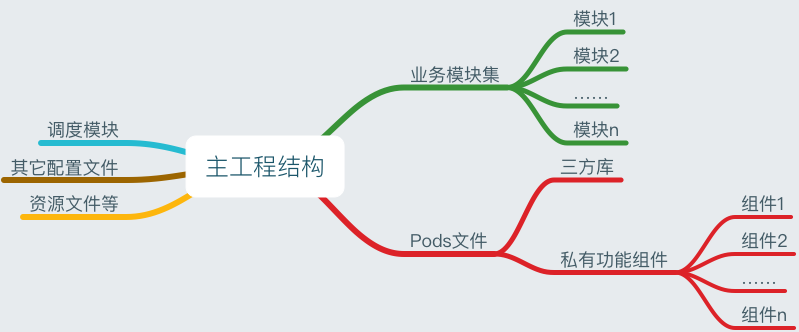
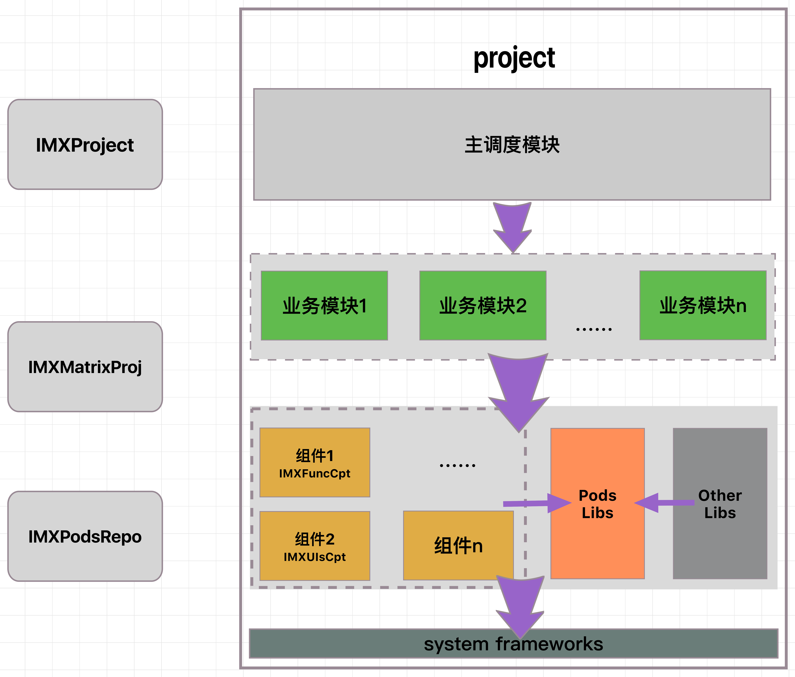

## 提要

前面有几篇文章已经详细介绍了iOS模块化开发。

#### 为了实现iOS模块化开发，已经完善了以下必不可少的前置条件（试行）：

1. 子工程和主工程的模板定制，也即脚手架的定义。

	> 比如对文件组织形式进行了统一的规范；添加pch等一系列通用文件，避免了后续子工程和主工程创建中一些不必要的重复工作量。
	> 
	> * 具体详情可参考文章：
	> 
	> * [iOS子工程模板搭建]()。（其中也包含了主工程的配置细节）
	> 
	
2. 实现单个组件、模块的之间隔离：利用单一功能原则，每一个功能都独立于其它的功能存在，业务模块亦然。

	> * 组件即功能组件；模块即业务模块。
	> 
	> * 在[iOS模块化开发详情]()中不仅详细定义了组件、模块，也对如何部署做了严格的规范。

3. 代码规范：在文件维度和代码维度上做了代码规范。

	> * 在文件内部的代码组织上做了规范。
	>
	> * 在遵循Apple代码规范的前提下，做了部分代码优化的总结。
	> * 详情见[Obj-C代码规范]()。关于Swift代码规范，目前正在整理中。
	
	
#### 进阶方案

在[iOS模块化开发详情]()中有提到进行模块化开发的三个进阶方案：

> 1. 初步:物理式隔离各功能块、各业务块。即组件化、模块化开发。
> 2. 进阶:脚手架创建，模板集成，组件、模块集成，均实现脚本自动化。
> 3. 精通:组件、模块实现权限管理(Github、GitLab)、实现分支管理;编译集成均实现可视化。

目前业已实现初步方案。但也有明显的缺点，如子工程分发执行时，需要更多的重新编译操作，不仅耗时，而且项目集成也不方便。

进阶2实现脚本自动化虽然可提高效率，但相对初步方案来讲，不是目前最大的问题。

**所以利用Github、GitLab实现子工程的集成、权限管理，对于提高开发效率，解决初步方案中存在的弊端，个人感觉其优先级比进阶2要高的。**

## cocoaPods管理子工程功能组件

Obj-C项目开发中，我们引入和使用三方库，使用技术最多的便是cocoaPods集中式管理。

> 关于Swift项目开发，可以考虑Carthage技术管理子工程，比cocoaPods更为简单些，后续追加。

使用Pods我们不仅可以开发和使用开源的三方库。而且还支持开发和使用私有库，并且通过配置Podspec文件，还能解决私有库开发过程中复杂的依赖问题以及其它预配置操作。

相较于方案1，我们不用自己重复编译子工程和配置依赖等问题。

> 1. 我们只要创建私有子工程，并配置好podsepc文件，像使用其它开源三方库使用我们自己的子工程就可以了。
> 2. 本文子工程管理只考虑功能组件。关于业务模块方面，使用私有GitLb库配置，或者使用Git子模块方案也可以。但考虑目前项目开发人员较少，并且没有跨地域开发等问题，所以业务模块直接嵌入在子工程中即可。

#### 1. 图谱预览：

   
   

* 针对图谱2中所示的资源，均放置于Github中，列出如下：
  
  1. [IMXProject](https://github.com/PanZhow/IMXProject):Object-C主工程模板项目，基于其上派生实用项目。（修改项目名即可）
 	> * git clone之后，需要重置git关联、修改项目名，完善主调度模块等步骤，便完成了一个新的空项目project的初始化。
  	
  2. [IMXMatrixProj](https://github.com/PanZhow/IMXMatrixProj):Object-C子工程脚手架。基于其上派生功能组件、业务模块。
	> * 通过内置脚本生成子工程、修改子工程的若干配置，即可完成初始化配置。
	> * 配置组件，完善功能后，则交由cocoaPods来管理，这也是本文主要讲述的内容。
	> * 配置模块，完善功能后，使用Git submodule子模块来管理较为合适，后续完善。
	
  3. [IMXPodsRepo](https://github.com/PanZhow/IMXPodsRepo):私有Repo版本库。
  	> * CocoaPods配置文件：主要记录私有Pods组件。
  	> * 若后续进行Swift项目开发，则使用Carthage或swift package manager技术，该部分会有不同。
  4. [IMXFuncCpt](https://github.com/PanZhow/IMXFuncCpt):基础功能组件，即一系列通用功能的组合。
  5. [IMXUIsCpt](https://github.com/PanZhow/IMXUIsCpt):控件类组件集合，即包含UIs工具、以及UIs控件。
  6. DebugModule组件。（图谱未提及）
  7. 待添加……

	
	

#### 2. Pods子工程创建

创建Pods管理的子工程，本文以IMXUIsCpt组件为例。我们需要完成以下功能：

> 1. 完成Repo版本库创建。
> 2. 以子工程模板组件开发IMXUIsCpt，并提交Github。
> 3. Repo版本库和子工程库关联。
> 4. 附加操作（可选）：Pods子模块、Framework生成。
> 5. 使用案例展示


###### 1. 完成Repo版本库创建：

> pods私有库开发只要创建一份Repo版本库即可。如之前创建了Repo库，此步骤可以忽略。

1. 创建CocoaPods repo 私有版本仓库：

	> * 在Github上创建一公开仓库，按步骤生成即可。
	> * 举例：https://github.com/PanZhow/IMXPodsRepo.git

2. 将私有版本库添加至本地Repo：

	> * pod repo add IMXRepo git@github.com:PanZhow/IMXPodsRepo.git
	> * 检测Finder中repo库，是否新增repo记录成功：~/.cocoapods/repos，会看到`IMXRepo`文件夹，即添加成功。
	
###### 2. 以子工程模板组件开发IMXUIsCpt例，并提交Github。

1.  创建私有代码库：

	> * 在Github、GitLab或者私有Git server上创建一仓库：IMXUIsCpt，按步骤生成即可。（https://github.com/PanZhow/IMXFuncCpt.git）
	> * git clone置本地后，通过github上子工程模板`IMXMatrixProj` ，创建IMXUIsCpt子工程项目。并copy置该仓库中。
	
2. 处理子工程相关配置：具体参考[iOS子工程模板搭建]()。
3. pods文件.swift-version生成和配置

	> 1. touch .swift-version
	> 2. open .swift-version
	> 3. 输入：echo "3.0" > .swift-version
	

4. pods文件podspec生成和配置：

	> * cd 项目目录，执行：pod spec create IMXFuncCptPodspec
	> * .podspec详细配置：见[官网](http://guides.cocoapods.org/syntax/podspec.html)或附录1,并以此修改此文件。
	> * 检测：pod lib lint；pod lib lint --private；pod lib lint --allow-warnings；pod spec lint（推荐：本地和远程验证）
	> * 提示`IMXUIsCpt passed validation`时，表明通过。
	
5. 添加功能代码，资源文件等。并提交Github远程。
 
###### 3. Repo版本库和子工程库关联：

1. 代码库push至远程git库：注意tag和版本一致。
2. 描述文件podspec同步至Repo版本库中：

	> * pod repo push IMXRepo IMXFuncCpt.podspec
	> * Repo版本库push至远程仓库。（pods自动上传）
	
3. 验证：

	> 在终端键入：pod search IMXFuncCpt ，搜索之。
	
###### 4. Pods子模块、Framework模块生成:

1. Pods子模块创建原因：

	> 1. 由于很多功能组件体积较小，功能较简单，故可以将多个组件组织在一起，形成一个大的功能组件集合。（如IMXUIsCpt中的IMXStyleKit）
	> 2. 由于功能组件尚在开发中，还不成熟，故可以临时先放置在一个功能组件集合中。后续开发成熟，可以抽离出去，形成一个独立的pods私有库。（如IMXUIsCpt中的IMXTabBarKit）
	
	> 3. 步骤简述：模块化分组->配置podspec，添加子模块(public&private TARGET配置)->继续添加子模块……
	> 4. 检测可用性-> 提交代码至远程仓库-> 同步Repo库
	
2. Framework子模块创建原因：

	> 1. 某些组件不打算公开源码，仅以h头文件+framework呈现。
	> 2. 业务组件使用该模式管理，仅以h头文件+framework呈现。
	> 3. 步骤：见[Pods私有库framework创建和使用]()。
	> 4. 检测可用性-> 提交代码至远程仓库-> 同步Repo库
	
###### 5. 使用案例展示

1. 私有pods库使用，需要在Podfile中添加私有repo库：

	> source ‘https://github.com/PanZhow/IMXPodsRepo.git’
	
2. 使用。如其它pods公共三方库资源。


## 附录：

1. 附录1：podspec部分字段诠释

	```
	Pod::Spec.new do |s|
  s.name         = "IMXUIsCpt" # 项目名称
  s.version      = "0.0.1"        # 版本号 与 你仓库的 标签号 对应
  s.license      = "MIT"          # 开源证书
  s.summary      = "私人pod代码" # 项目简介

  s.homepage     = "https://github.com/PanZhow/IMXPodsRepo.git" # 仓库的主页
  s.source       = { :git => "https://github.com/PanZhow/IMXPodsRepo.git", :tag => "#{s.version}" }#你的仓库地址，不能用SSH地址
  s.source_files = "MyAdditions/*.{h,m}" # 你代码的位置， BYPhoneNumTF/*.{h,m} 表示 BYPhoneNumTF 文件夹下所有的.h和.m文件
  s.requires_arc = true # 是否启用ARC
  s.platform     = :ios, "7.0" #平台及支持的最低版本
  # s.frameworks   = "UIKit", "Foundation" #支持的框架
  # s.dependency   = "AFNetworking" # 依赖库
  
  # User
  s.author             = { "BY" => "2331838272@qq.com" } # 作者信息
  s.social_media_url   = "http://****" # 个人主页

	end
	```

2. 附录2：Pods子模块创建创建

	```
	# Launcher Cpt
  s.subspec 'Launcher' do |lcr|
    lcr.source_files  = 'IMXFuncCpt/Libs/2nd/Launcher/*.{h,m}'
    lcr.public_header_files = [
      'IMXFuncCpt/Libs/2nd/Launcher/*.{h}'
    ]
  end
	```
	
3. 附录3：Pods子模块创建时注意事项

	 当私有库中引用了私有库依赖的情况，那么在验证和push repo时均要如下指明source，否则pod会默认从官方repo查询：

	> 1. pod lib lint --sources='https://github.com/PanZhow/IMXPodsRepo.git,https://github.com/CocoaPods/Specs'

	> 2. pod repo push 本地repo名 podspec名 --sources='私有仓库repo地址,https://github.com/CocoaPods/Specs'
	
	
4. 附录4：关于repo的相关命令

	> 1. repo展示：pod repo list
	> 2. repo删除：pod repo remove **
	
5. 附录5：出现警告问题的处理

	若出现警告问题，最好不要使用`pod lib lint --allow-warnings`忽略警告，解决方案：

	> 1. 发生警告的代码片段以```#pragma clang diagnostic push
#pragma clang diagnostic ignored "**"`和`#pragma clang diagnostic pop```包裹起来。
	> 2. 在podspec中将该模块设置为`s.compiler_flags = '**'`即可。

## TODO：
1. Pods库多个子模块中含有尚未成熟的子项目，后续需要单独抽离，并作为独立的pods库来管理，甚至开源为公开pods库。


## 参考链接：

1. [cocoapods系列教程---模块化设计](https://www.jianshu.com/p/1c986ba7af41)
2. [Cocoapods使用私有库中遇到的坑](https://www.jianshu.com/p/1e5927eeb341)
3. [pods私有仓库创建](https://www.jianshu.com/p/7878f1a1770d)
4. [pods公共仓库创建方法](http://qiubaiying.top/2017/03/08/CocoaPods%E5%85%AC%E6%9C%89%E4%BB%93%E5%BA%93%E7%9A%84%E5%88%9B%E5%BB%BA/)