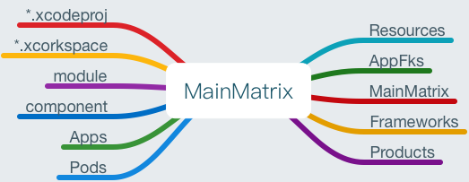
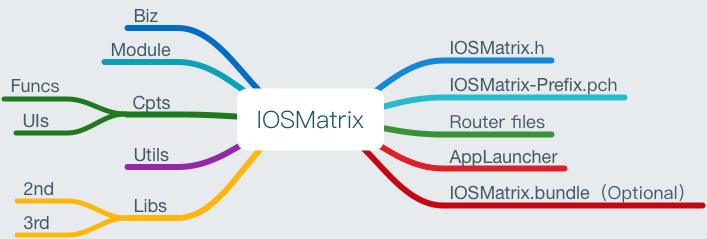

# iOS子工程模板搭建

## 一、子工程

1. 创建子工程模板，命名为命名为`IOSMatrix.xcodeproj`。

	> 1. 工程内部添加通用的文件组（见`三、Ⅱ 子工程框架`）
	> 2. 添加通用Target Aggregate，命名为`IOSMatrixAgg`。
		并添加复制脚本。
	
	
## 二、 主工程

* **以新工程为例，老工程重构的话逐步替代即可**

### Ⅰ 设置
1. 创建新工程，如命名为`MainMatrix.xcodeproj`

	> 1. Pods配置文件初始化。
	> 3. 创建`APPFks`文件夹，涵盖子工程复制脚本添加进来的静态库，供主工程使用。
	> 4. 创建`Resources`文件夹，涵盖自子工程复制添加进来的静bundle资源文件（脚本未支持，需手动链接：不需复制，资源文件仍在子工程静态库中），供主工程使用。也涵盖主工程的资源文件。
	> 5. 将子工程模块置入``MainMatrix.xcodeproj``中，并在主工程目录中引入脚本`createapp.sh`。
	> 2. 工程目录设计（见`三、Ⅰ 主工程框架`）。
		
2. 依据子工程模板+脚本，生成具体子工程，并引入主工程（**.xcworkspace)。

	> 1. 在终端键入`sh createapp.sh **name`即可生成子工程。
	> 2. 拖动子工程`**name.xcodeproj`到`**.xcworkspace`中。
	> 3. 子工程同名头文件手动更改内容。
	
3. 编译子工程

	> 1. 在`Target-Build Phases`中，将其中需要暴露的文件置入`Public`选项下。
	> 2. 选择Scheme：子项目-Generic iOS Device，`⌘+B`执行编译，得到framework库。
	> 3. 选择Scheme：子项目Target-Generic iOS Device，`⌘+B`执行编译，得到Apps-framework库。（首次生成，需手工导入工程中）
	> 4. bundle文件需copy至framwork中(若有)，主工程链接即可。 资源文件仍在子工程静态库中。
	>
	
### Ⅱ 开发

1. 子工程的开发可以在主项目中开发，也可自己做测试平台单独开发。

	> 该部分属于项目开发范畴，后续会有完整方案
	
## 三、框架

### Ⅰ 主工程框架

**主工程：属于子工程的调度中心，除了一些必要的初始化工作，应不直接参与各种业务、功能的处理**

#### 图谱



	
#### 说明

* 右边分支为主工程目录集合；左边分支为其它目录集合。
* 说明顺序自左至右，自上而下。
* 图谱做了路径简化，部分路径、文件做了简化处理。

1. *.xcodeproj:主工程文件

	>  * 内部含有子工程模板:由于脚本路径问题，暂时将模板置于此处

2. *.xcworkspace:pods管理下的项目启动文件
3. module：功能组件（含有多个）
4. component：业务模块（含有多个）
5. Apps：组件、模块生成的静态库
6. Pods：三方库文件集合
7. Resources:自身资源文件、链接组件模块中的bundle资源文件
8. AppFks:链接组件模块生成的静态库（即Apps中库文件）
9. MainMatrix:main.m文件，主工程文件集合
10. frameworks:系统库文件链接
11. 其它：如pch文件、Products文件夹等
 


### Ⅱ 子工程框架

#### 图谱



#### 说明

* 右边分支为具体文件；左边分支为目录集合。
* 自上至下，自右及左说明

1. 与工程同名的h头文件，需要修改宏定义设置。
	> * import所有需要公开暴露的文件，便于外部引用
	> * 若不添加该文件，会出现警告`no umbrella header`,故添加之，若使用，需要取消注释。
	> * 版本信息：
	```
		FOUNDATION_EXPORT double IOSMAtrixVersionNumber;
		```
		```
    FOUNDATION_EXPORT const unsigned char IOSMAtrixVersionString[];
    ```

2. pch文件设置

	> * 设置：进入`Target->Build Settings`:`Precompile Prefix Header`=`YES`；`Prefix Header`=`$(SRCROOT)/$(PROJECT)/$(PROJECT)-Prefix.pch`即可。
	> * 功能：子工程内部需要引入的文件、公用宏定义等。

3. Router files：路由文件,需配合路由组件

	> * URI寻址方式获取该子工程中任一文件路由，包括弹出方式、参数传递、回调等功能
	> * 具体路由文件形式根据路由组件不同而有所区别，但功能一致。
	> * 详细使用方法见Router组件使用说明。
	
4. AppLauncher：启动文件，需配合服务组件

	> * 功能一：hook App启动流程。实现在主工程启动初期，子工程需要初始化的情况。如推送服务。
	> * 功能二：Service服务。服务化各组件，便于获取和使用。
	> * 详细使用方法见AppLauncher组件使用说明。
5. IOSMatrix.bundle（可选）: 资源文件集合

	> * 放置图片、音频等多媒体文件
	> * 子工程资源文件若只在内部使用，一般使用Asert(图片)或者Resources文件夹即可。
	> * 资源文件若被外部调用，则需打包成bundle文件，编译会随着framework暴露出去。
	
6. Biz：具体的业务模块集合

	> * 子工程为功能组件时，Biz为空
	> * MVC+MVIP设计模式运用
	
7. Module：功能组件集合

	> * 子工程为业务模块时，此为空
	
8. Cpts：业务模块集合。

	> * 被多个子工程公用，但尚未或者不足以组件化。
	> * Funcs：功能型模块
	> * UIs:视图型模块
	
9. Utils：子工程内部公用的一些工具类文件
10. Libs：子工程内使用的库文件

	> * 2nd:二方库
	> * 3rd:三方库
	> * 若需导入系统库，则直接添加至`Build Phases`即可。
	> * 若某三方库其它子工程也在使用，则作为公共库在主工程使用Pods管理即可。
	
	> 附：若子工程需要使用pod对应的库，需在target-build settings中设置Header Search Pths：../Pods/Headers/Public（recursive）即可。
	>
	> 	在Frame search Paths下置../Apps(non-)、../Pods(recu)


## 四、脚本（需细化）

* **以上各部分需要使用完善的脚本来实现自动化，此部分也是后期主要优化点**

	> 参考淘票票脚本实现，在此感谢曾经共事的大神。
* 诸如权限管理、可视化操作等

	> 参考京东模块化方案

## 注:

1. 发布环境更改时，注意测试子工程库文件是否是arm架构。

	> *  子工程目前要求支持armv7 arm64，可使用 lipo -info **.framework检测