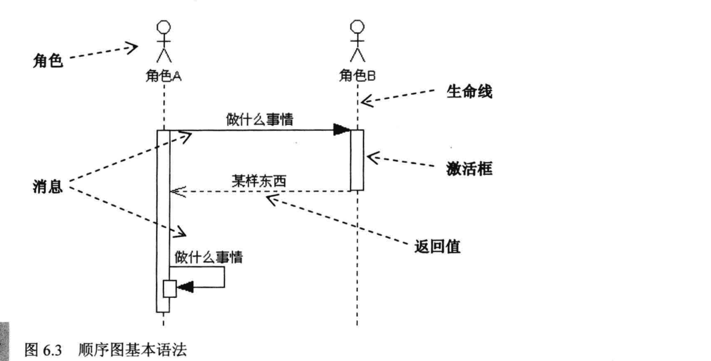
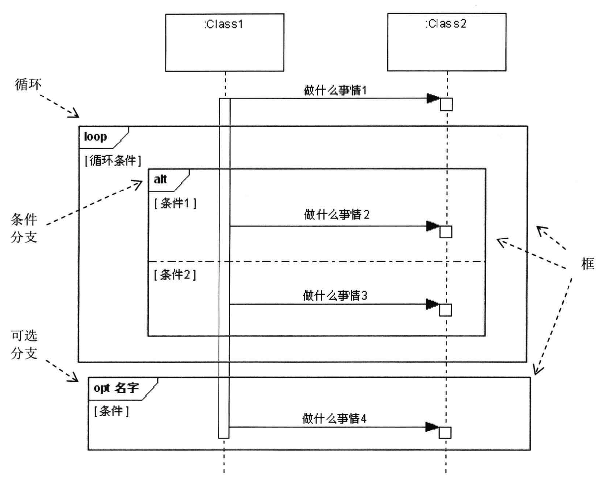
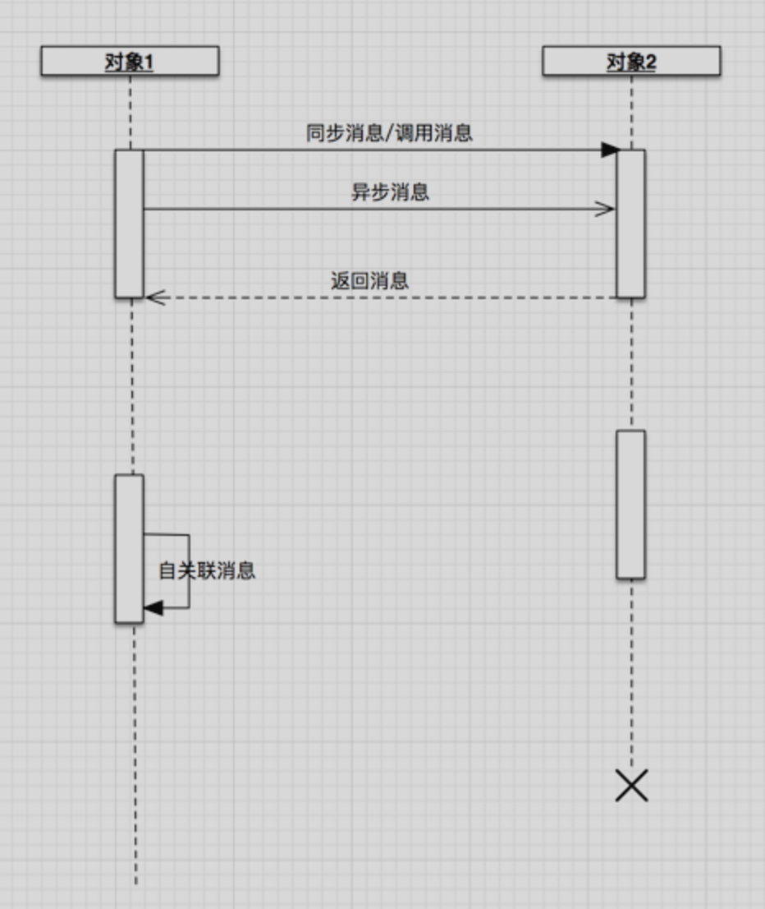

# UML之时序图

## 提要
UML烂笔头之二

## 图解

1. 正常版(顺序图基本语法)

	
	
2. 循环、条件、可选分支

	
	
	
3. 含自关联

	
	
## 实践建议

1. 流程中提取分解一个一个的子流程
2. 子流程参与角色
3. 两两角色之间的交互组织

## 详解
1. 定义：显示对象以及对象之间交互的顺序。
2. 建模元素

	> 1. 角色（Actor）：人、系统或者子系统等
	> 2. 对象（Object）：
	> 3. 生命线（LifeLine）：从对象图标向下延伸的一条虚线，表示对象存在的时间
	> 4. 控制焦点（Focus of Control）：表示时间段的符号，在该时间段内对象将执行某些操作，用小矩形表示
	> 5. 消息：一般分同步消息（syn）、异步消息（Asyn）、返回消息（return）。
	> 6. 自关联消息：表示方法的自身调用以及一个对象内的一个方法调用另外一个方法。