# UML之类图

## 前情提要：

之前做账户体系总结时，需要用到UML来绘制图谱结构，所以在阅读相关书籍和网站时，将相谱做了简要记录，下次忘记时可以快速参阅，毕竟好记性不如烂笔头~~

### 概念
1. 需求中涉及到的业务概念、人物等都可以抽象为类。
2. 提炼类图元素：识别出类、提炼类的关键属性和操作、描绘类之间关系

### 属性
1. 类图即一个矩形方框：类的名字、中间为属性、下面为操作。

	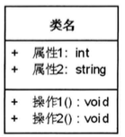
	
## 关系
类之间的关系（简化类图，只需给出类名就可以了）

### 直线关联

1. 关联关系：AB之间有关系，但又不确定具体是什么关系

	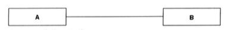
	
2. 一对一关系：一个C对应一个D的关系

	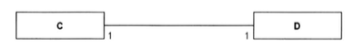
	
3. 一对多关系：一个E对应0至多个F。（*表示0到多个）

	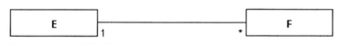
	
4. 一对n关系：一个G对应0到n个H。（0..3：0到3个）

	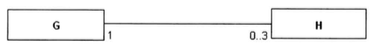
	
5. 角色关系：（+：public属性）

	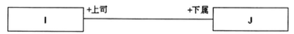
	
### 带箭头关联

1. 导航关系：A可找到B（如A有属性保存B的引用;1:A含有B的引用;2:A可追溯到B）

	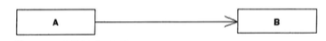
	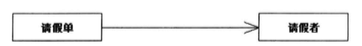
	
### 包含关系
1. 空心菱形：弱包含（聚合），（部门没有了，员工可以继续存在；员工可以有多个部门）

	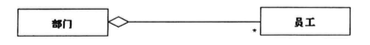
	
2. 实心菱形：强包含（组合），（部门没有了，员工不存在；员工只有一个部门对应）

	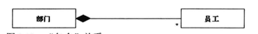	
	
### 继承关系
1. A继承B（泛化）：A中具有了B的所有特点

	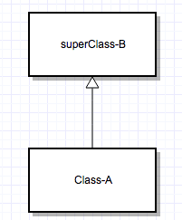
	
2. 实现关系用一条带空心箭头的虚线表示（B继承自A：A是接口，无具体实现的抽象类。即继承抽象类）

	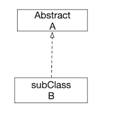

### 依赖关系

1. A依赖于B，也可理解为A需要依赖B的完成才能完成

	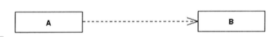
	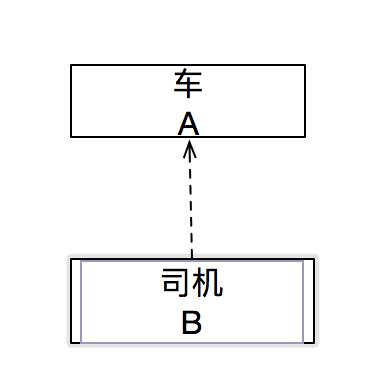

### 类的递归关系
1. 自包含递归关系：常用于树形的业务结构（自关联关系同样适用)

	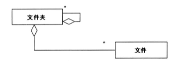
	
2. 三角关系（关联类）：如表示公司和雇员关系的直线上，拉出一条虚线，另一端连接合同类，合同类即为关联类。

	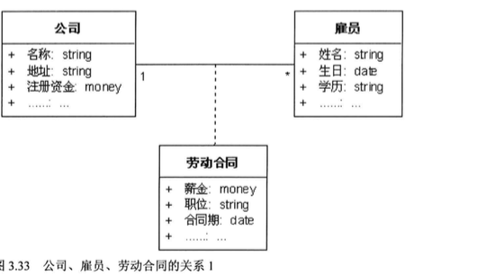
	
## 实战

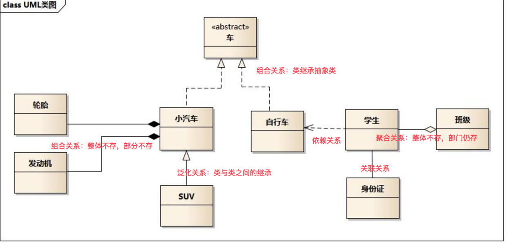

## 总结：

 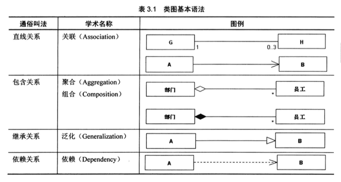
 
## 类图分析需求步骤：
1. 识别出类
2. 识别出类的属性操作
3. 描绘类的关系（直接关系）
4. 对各类进行分析、抽象、整理
	