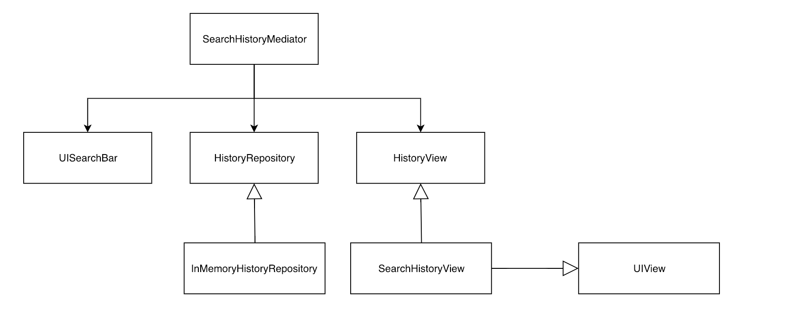

本文翻译自原文：[Mediator Pattern Case Study](http://www.vadimbulavin.com/mediator-pattern-case-study/)，并有所简化。


程序员一遍又一遍地遇到同样的问题。这些问题的通用解决方案，需具有通用性和可重复使用性，足以使用数百万次，也即称为**设计模式**。本文将探究一下经常被忽视的中介模式。


## 概览

如前所述，设计模式是解决软件工程问题的通用方案。它既非代码本身也不能直接转换为代码，设计模式即是一个描述如何解决问题的模板。

中介模式有助于解决如下问题：

* 紧密耦合且直接相互操作的对象
* 交互逻辑分布在一组对象中，且不能重用
* 交互逻辑很难测试
* 交互逻辑不能单独更改

**Mediator 对象以隐藏和不受约束的方式封装交互策略。**
由 Mediator 操纵的对象不知道它的存在，它于幕后实施其逻辑。


## 示例研习

一个真实的文字示例可以最好地演示中介模式。下面的代码取自该[示例项目](https://github.com/V8tr/SearchHistoryMediator)

想象一下，在现有搜索界面下，添加搜索历史功能。以下为实现用例：

1. 展示最近搜索条目列表
2. 添加功能：搜索条目添加至该里列表
3. 当app关掉时保存搜索条目


下图展示了组件构成：



`HistoryRepository `是 [存储设计模式](https://msdn.microsoft.com/en-us/library/ff649690.aspx)示例，它抽象出了搜索历史如何持久化的细节。

```
protocol HistoryRepository {
    var history: [String] { get }
    func addSearchTerm(_ term: String)
}
```

`HistoryView`是一个简单的接口，它删除了`SearchHistoryMediator `和`UIView`之间的耦合部分。


```
protocol HistoryView {
    var isHidden: Bool { get set }
    func setHistory(_ history: [String])
}
```

`SearchHistoryMediator `在初始化时注入依赖项，它立即订阅UISearchBar 事件并为`HistoryView`设置初始状态。

若对基于 block 的 KVO 不熟悉，建议阅读 WWDC Session [What’s New in Cocoa Touch](https://developer.apple.com/videos/play/wwdc2017/201/)


```
class SearchHistoryMediator: NSObject {
    private let searchBar: UISearchBar
    private var historyView: HistoryView
    private var observasion: NSKeyValueObservation?
    private let historyRepository: HistoryRepository

    init(searchBar: UISearchBar, historyView: HistoryView, historyRepository: HistoryRepository) {
        self.searchBar = searchBar
        self.historyView = historyView
        self.historyRepository = historyRepository
        super.init()

        self.historyView.isHidden = true
        self.historyView.setHistory(historyRepository.history)

        searchBar.delegate = self
        observasion = searchBar.observe(\.text) { [weak self] (searchBar, _) in
            self?.historyView.isHidden = searchBar.text?.isEmpty ?? false
        }
    }
}
```

其余的交互逻辑在`UISearchBarDelegate`方法中执行:

```
extension SearchHistoryMediator: UISearchBarDelegate {

    func searchBarTextDidBeginEditing(_ searchBar: UISearchBar) {
        historyView.isHidden = false
    }

    func searchBarTextDidEndEditing(_ searchBar: UISearchBar) {
        historyView.isHidden = true
    }

    func searchBarSearchButtonClicked(_ searchBar: UISearchBar) {
        historyView.isHidden = true
        if let text = searchBar.text, !text.isEmpty {
            historyRepository.addSearchTerm(text)
            historyView.setHistory(historyRepository.history)
            searchBar.text = nil
        }
        searchBar.resignFirstResponder()
    }

    func searchBarCancelButtonClicked(_ searchBar: UISearchBar) {
        historyView.isHidden = true
        searchBar.resignFirstResponder()
    }
}
```

以下是来自`SampleViewController`的几行引用代码，显示了将Mediator 附加到现有搜索对象上的简单方法：

```
private(set) lazy var mediator: SearchHistoryMediator = {
    return SearchHistoryMediator(searchBar: searchBar, historyView: historyView, historyRepository: historyRepository)
}()

override func viewDidLoad() {
    super.viewDidLoad()
    _ = mediator
}
```

## 总结

在上述例子中， Mediator 处理 `UIsearchBar`事件并相应的设置`HistoryView `和`HistoryRepository `的状态。

Mediator 确保组件间松散耦合，并且不会明确地相互调用操作。

以下场景满足时考虑使用中介模式：

1. 一组对象之间的**交互**很明确且复杂
2. 需要有一组对象的**共同控制点**


尽管中介模式众所周知，但却没能广泛运用。只要透彻了解了中介模式，它就会成为您的重要工具。


