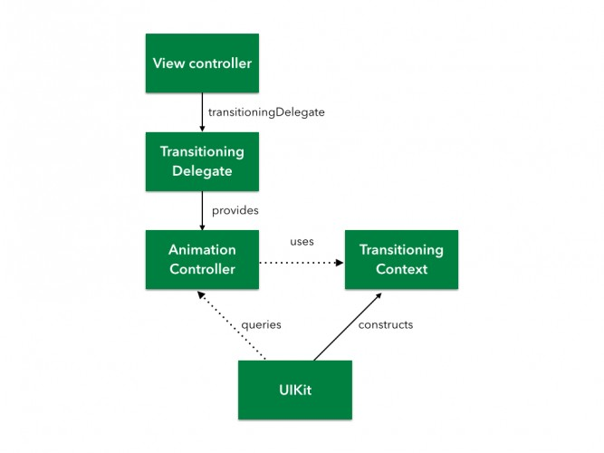
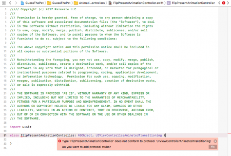
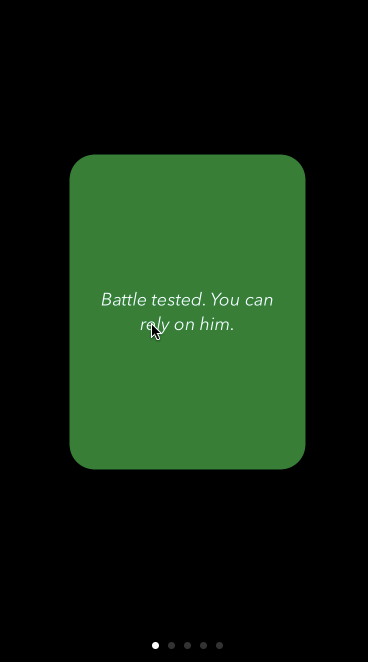

## 自定义UIViewController transitions:入门

> 原文链接：[https://www.raywenderlich.com/170144/custom-uiviewcontroller-transitions-getting-started](https://www.raywenderlich.com/170144/custom-uiviewcontroller-transitions-getting-started)
> 
> 更新说明：本教程已由Richard Critz更新到iOS 11和Swift 4。 原始教程由JózsefVesza编写。


iOS提供了一些不错的UIViewController过渡转换效果 - push，pop，垂直覆盖 - 免费，但定制自己的过渡效果将更有趣。 自定义UIViewController transitions可以显着增强用户体验，并将您的app与该包的其余部分区分开来。 如果你因为定制过程看起来似乎太艰巨，而免于动手。否则，你会发现它并不像你想象的那么困难。

在本教程中，您将向一个小猜谜游戏app添加一些自定义的UIViewController transitions。 当你完成时，你会了解到：

* 过渡转换的API的结构如何。
* 如何使用自定义的过渡转换来present和dismiss视图控制器。
* 如何构建交互式过渡转换效果。

> 注意：本教程中显示的过渡转换使用的是UIView animations，因此您需要具备其基本的知识点。 如果您需要帮助，请查看我们的[iOS动画教程](https://www.raywenderlich.com/146603/)，以便快速了解该主题。


## 入门

下载[初始项目](https://koenig-media.raywenderlich.com/uploads/2017/10/GuessThePet-starter-1.zip)。 构建并运行;你会看到下面的猜谜游戏：


该应用程序在页面视图控制器中显示若干卡片。 每张卡片都会显示宠物的描述，然后点击卡片可以看到它描述的宠物。

你的工作是猜测宠物！ 它是猫，狗还是鱼？ 与应用程序一起玩，看看你做得如何。


导航逻辑已经就绪，但该应用程序目前感觉非常平淡。 您将通过定制转场动画为其增强效果。

## 探索过渡转换动画API

转换API是一组协议。这使您可以为您的app提供最佳的实现方案选择：使用现有对象还是创建专用对象来管理过渡转换效果。 在本节的最后，您将了解到每个协议的作用以及它们之间的关系。 下图显示了该组API的主要组件：




#### 图表解析

虽然图表看起来很复杂，但一旦你了解了各个部分是如何协同工作的，就会感觉非常简单。

###### 1. Transitioning Delegate：转换委托

每个视图控制器都可以有一个transitioningDelegate，一个实现`UIViewControllerTransitioningDelegate`协议的对象。

无论您何时present或dismiss一个视图控制器，UIKit都会询问其transitioningDelegate对象以供动画控制器使用。 要用您自己定制的动画替换默认动画，您必须实现一个transitioning delegate并让它返回相应的动画控制器。

###### 2. Animation Controller：动画控制器

由Transitioning Delegate返回的动画控制器是一个实现`UIViewControllerAnimatedTransitioning`协议的对象。 它实现了动画过渡的“繁重工作”。

###### 3. Transitioning Context：转换上下文

转换上下文对象实现了`UIViewControllerContextTransitioning`，并在转换动画过程中发挥着至关重要的作用：它封装了有关转换动画中涉及的视图和视图控制器的信息。

正如你在图中看到的那样，你不需要自己实现这个协议。 UIKit为您创建和配置转换上下文，并在每次发生转换动画时将其传递给动画控制器。


#### 转换动画流程

以下是`presentation`过渡动画中涉及的相关步骤：

1. 您可以以`编程方式`或`segue `方式，触发过渡转换动画。
2. UIKit向`to view controller（最终展示的控制器）`请求`Transitioning Delegate`对象。如果它没有，UIKIt使用标准的内置转换委托对象。
3. UIKit然后向`Transitioning Delegate`请求`动画控制器`。若返回nil，将使用默认动画。

	> 请求语句：``animationController(forPresented:presenting:source:)``

4. UIKit构造`转换上下文`。
5. UIKit通过调用`transitionDuration(using:)`语句来询问获取动画控制器的`动画持续时间`。
6. UIKit在动画控制器上调用`animateTransition(using:) `来执行过渡转换的动画。
7. 最后，`动画控制器`在`转换上下文`中调用`completeTransition（_ :)`以指示动画已完成。


备注：`dismissing `过渡动画的步骤几乎完全相同。在这种情况下，UIKit会向转换委托请求`to view controller（最终消失的控制器）`。转换委托通过`animationController（forDismissed :)`获取相应的动画控制器。


## 定制一个`Presentation`转换动画

是时候把你新发现的知识付诸实践了！ 你的目标是实现以下动画：

* 当用户点击一张卡片时，它会翻转显示缩小到卡片大小的第二个视图。
* 翻转后，视图缩放以填充整个屏幕。


#### 创建动画

您将从创建`动画控制器`开始。

从菜单中选择`File \ New \ File ...`，选择`iOS \ Source \ Cocoa Touch Class`，然后单击下一步。 命名文件为`FlipPresentAnimationController`，使其成为`NSObject`的子类并将语言设置为`Swift`。 单击下一步并将`Group`设置为` Animation Controllers`。 点击创建。

动画控制器必须实现`UIViewControllerAnimatedTransitioning`协议。 打开`FlipPresentAnimationController.swift`并更新相应地类声明。

```
class FlipPresentAnimationController: NSObject, UIViewControllerAnimatedTransitioning {

}
```

Xcode会引发一个错误，抱怨`FlipPresentAnimationController`没有实现`UIViewControllerAnimatedTransitioning`委托方法。 单击`Fix`以添加必要的存根例程(委托方法)。



您将使用点击卡片的frame作为动画的起点。在该类的主体中，添加以下代码以存储此信息。

```
private let originFrame: CGRect

init(originFrame: CGRect) {
  self.originFrame = originFrame
}
```

接下来，您必须填写您添加的两个委托方法的代码。 更新`transitionDuration(using:) `如下：

```
func transitionDuration(using transitionContext: UIViewControllerContextTransitioning?) -> TimeInterval {
  return 2.0
}
```

顾名思义，这个方法指定了你转换动画的持续时间。将它设置为2s将在开发过程中证明是有用的，因为使之留下了足够的时间来观察动画。

将以下内容添加到animateTransition（using:)：

```
// 1
guard let fromVC = transitionContext.viewController(forKey: .from),
  let toVC = transitionContext.viewController(forKey: .to),
  let snapshot = toVC.view.snapshotView(afterScreenUpdates: true)
  else {
    return
}

// 2
let containerView = transitionContext.containerView
let finalFrame = transitionContext.finalFrame(for: toVC)

// 3
snapshot.frame = originFrame
snapshot.layer.cornerRadius = CardViewController.cardCornerRadius
snapshot.layer.masksToBounds = true
```

代码解析：

1. 提取`正在替换的`视图控制器和`正在呈现的`视图控制器引用。对转换动画结束后的屏幕外观做一个快照。
2. UIKit将整个转换动画封装在容器视图中，以简化对视图层次结构管理和动画管理。获取对容器视图的引用并确定新视图的最终frame大小。
3. 配置快照的frame和其它属性，使其完全匹配并覆盖`from视图`中的卡片。

继续添加代码至`animateTransition(using:)`主体中：

```
// 1
containerView.addSubview(toVC.view)
containerView.addSubview(snapshot)
toVC.view.isHidden = true

// 2
AnimationHelper.perspectiveTransform(for: containerView)
snapshot.layer.transform = AnimationHelper.yRotation(.pi / 2)
// 3
let duration = transitionDuration(using: transitionContext)
```

容器视图由UIKit创建，目前仅包含`from视图`。您必须将其他参与转换动画的视图全部添加进来。 请务必记住，以`addSubview（_ :)`语句实现：将新视图置于视图层次结构中所有其他视图的前面，因此添加子视图的顺序非常重要。

1. 将新的`to视图`添加到视图层次并隐藏它。 将快照放在它的前面。
2. 将快照绕其y轴旋转90度来作为动画的开始状态。 这导致它在观看者的边缘，因此在动画开始时不可见。
3. 获取动画的持续时间。

> 注：`AnimationHelper`是一个小的工具类，作用是将透视和旋转变换的功能添加到视图中。可随时查看实现细节。 如果您对`perspectiveTransform(for:)`的魔力感到好奇，请在完成本教程后尝试发表评论。

你现在已经设置了一切; 时间动画！通过追加以下内容完成该方法。

```
// 1
UIView.animateKeyframes(
  withDuration: duration,
  delay: 0,
  options: .calculationModeCubic,
  animations: {
    // 2
    UIView.addKeyframe(withRelativeStartTime: 0.0, relativeDuration: 1/3) {
      fromVC.view.layer.transform = AnimationHelper.yRotation(-.pi / 2)
    }
    
    // 3
    UIView.addKeyframe(withRelativeStartTime: 1/3, relativeDuration: 1/3) {
      snapshot.layer.transform = AnimationHelper.yRotation(0.0)
    }
    
    // 4
    UIView.addKeyframe(withRelativeStartTime: 2/3, relativeDuration: 1/3) {
      snapshot.frame = finalFrame
      snapshot.layer.cornerRadius = 0
    }
},
  // 5
  completion: { _ in
    toVC.view.isHidden = false
    snapshot.removeFromSuperview()
    fromVC.view.layer.transform = CATransform3DIdentity
    transitionContext.completeTransition(!transitionContext.transitionWasCancelled)
})
```

以下是您的动画播放细节：

1. 您使用标准的UIView关键帧动画。 动画的持续时间必须与转换的长度完全一致。
2. 首先将`from视图`围绕其y轴旋转90˚以将其隐藏起来。
3. 接下来，将快照从上面设置的边缘开启状态旋转出来，并显示之。
4. 设置快照的框架以填满屏幕。
5. 快照现在完全匹配`to 视图`，因此最终可以安全地显示真正的`to 视图`。 由于不再需要快照，从视图层次结构中删除；接下来，将`from 视图`恢复到其原始状态; 否则，在动画返回时它将被隐藏。 调用completeTransition（_ :)通知UIKit动画已完成。 它将确保最终状态是一致的，并从容器中删除`from 视图`。

您的动画控制器现在可以使用！

## 连接动画

UIKit期望转换委托为动画控制器发起转换动画。 要做到这一点，你必须首先提供一个实现`UIViewControllerTransitioningDelegate`协议的对象。 在这个例子中，CardViewController将作为转换委托。

打开CardViewController.swift并在文件底部添加以下扩展名。

```
extension CardViewController: UIViewControllerTransitioningDelegate {
  func animationController(forPresented presented: UIViewController,
                           presenting: UIViewController,
                           source: UIViewController)
    -> UIViewControllerAnimatedTransitioning? {
    return FlipPresentAnimationController(originFrame: cardView.frame)
  }
}
```


在这里，将返回您定制的动画控制器的一个实例，并使用当前card的frame进行初始化。

最后一步是将`CardViewController`标记为转换委托。 视图控制器均含有属性`transitioningDelegate`，UIKit将依靠它查询其是否应使用自定义转换动画。

将以下内容添加到`prepare(for:sender:)`尾部：

```
destinationViewController.transitioningDelegate = self
```

需要注意的是，视图控制器被要求presented，被要求提供一个转换委托，而不是视图控制器执行呈现！

构建并运行你的项目。 点击一张卡片，你应该看到以下内容：



而且你拥有了 - 你的第一个定制转换动画！


## Dismissing 视图控制器

