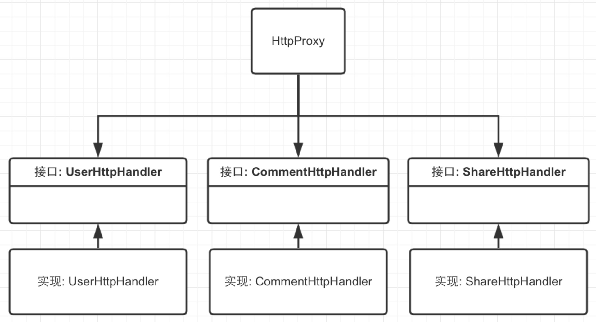

# AOP

面向切面编程就是通过预编译和运行期动态代理实现给程序动态统一添加功能的一种技术。

利用AOP可以对业务逻辑的各个部分进行隔离，从而使得业务逻辑各部分之间的耦合度降低，提高程序的可重用性，同时提高了开发的效率

主要的意图是：将日志记录，性能统计，安全控制，事务处理，异常处理等代码从业务逻辑代码中划分出来，通过对这些行为的分离，我们希望可以将它们独立到非指导业务逻辑的方法中，进而改 变这些行为的时候不影响业务逻辑的代码

可以通过预编译方式和运行期动态代理实现在不修改源代码的情况下给程序动态统一添加功能的一种技术。AOP实际是GoF设计模式的延续，设计模式孜孜不倦追求的是调用者和被调用者之间的解耦，AOP可以说也是这种目标的一种实现。

假设把应用程序想成一个立体结构的话，OOP的利刃是纵向切入系统，把系统划分为很多个模块（如：用户模块，文章模块等等），而AOP的利刃是横向切入系统，提取各个模块可能都要重复操作的部分（如：权限检查，日志记录等等）。由此可见，AOP是OOP的一个有效补充。

凡是符合AOP思想的技术，都可以看成是AOP的实现

在 Objective-C 的世界里，这句话意思就是利用 Runtime 特性给指定的方法添加自定义代码。有很多方式可以实现 AOP ，Method Swizzling 就是其中之一。

iOS的AOP：

Method Swizzling :

1. 适合的场景-log功能，Authentication，Caching等类似事务
2. NSMutableArray的元素处理如safeAddObject等
3. Aspects库
4. PV统计、事件统计

runtime 这里就不多多说了（swift里面已经对这个概念的说法从心转变成了 Reflection<反射>），objective c中每个方法的名字(SEL)跟函数的实现(IMP)是一一对应的，Swizzle的原理只是在这个地方做下手脚，将原来方法名与实现的指向交叉处理，就能达到一个新的效果。


实例：

1. runtime中method swizzle：实现在每个ctrl的viewDidLoad中添加统计代码。（也可以用继承实现，但增加了耦合度）
2. 自定义一个选择列表，并实现其一个类别，添加点击响应(方法体为空)

总结：关键点在于事件的响应操作在类的扩展中实现，并且是空方法体。然后在使用处使用hook技术来挂载具体的响应
```
@implementation DLMenuView (Aspects)

- (void)dlMenuView:(DLMenuView *)menuView atIndex:(NSInteger)atIndex
{
}

@end
```
然后在使用时hook：

```
[menuView aspect_hookSelector:@selector(dlMenuView:atIndex:) withOptions:AspectPositionAfter usingBlock:^(id<AspectInfo> aspects, DLMenuView *menuView, NSInteger index)
{
     NSLog(@"按钮点击了 %ld",index);
} error:nil];
```


---

这个方法是干净并且非侵入性的：

这个 view controller 不会被不属于它的代码污染
为所有加入到我们代码的切面定义一个 SPOC 文件 (single point of customization)提供了可能
SPOC 应该在 App 刚开始启动的时候就加入切面
公司负责统计的团队通常会提供统计文档，罗列出需要追踪的事件。这个文档可以很容易映射到一个 SPOC 文件。
追踪逻辑抽象化之后，扩展到很多其他统计框架会很方便
对于屏幕视图，对于需要定义 selector 的方法，只需要在 SPOC 文件修改相关的类（相关的切面会加入到 viewDidAppear: 方法）。如果要同时发送屏幕视图和时间，一个追踪的 label 和其他元信息来提供额外数据（取决于统计提供方）

http://wiki.jikexueyuan.com/project/objc-zen-book/aop.html

NSProxy：
网络接口层的模块化设计：

1. 需求：

	所有网络接口都从统一的类调用，如HttpProxy
	
	网络接口的具体实现，按照业务划分到不同的类中，如“UserHttpHandler”、“CommentHttpHandler”
	
	其实，按照面向对象的原则，就是接口代理类HttpProxy拥有若干个按照业务划分的接口（Interface），这些接口的所有方法组成了网络层的不同的Http请求。
	
	
	//实际调用的是UserHttpHandler类的方法
[[HttpProxy sharedInstance] getUserWithID:@100];
//实际调用的是CommentHttpHandler类的方法
[[HttpProxy sharedInstance] getCommentsWithDate:date];

2. 原理：

	1. NSProxy没有父类，是顶级类(根类)，跟NSObject同等地位
	2. NSProxy和NSObject都实现了“NSObject Protocol”
	3. NSProxy设计时就是以“抽象类”设计的，专门为转发消息而生

3. 实现要求：

	1. 继承NSProxy的子类要实现自己的初始化方法，如“init”、“initWith”。
	2. 重写- forwardInvocation:和- methodSignatureForSelector:方法，完成消息转发


AOP一般都是需要有一个拦截器，然后在每一个切片运行之前和运行之后（或者任何你希望的地方），通过调用拦截器的方法来把这个jointpoint扔到外面，在外面获得这个jointpoint的时候，执行相应的代码。

在iOS开发领域，objective-C的runtime有提供了一系列的方法，能够让我们拦截到某个方法的调用，来实现拦截器的功能，这种手段我们称为Method Swizzling。Aspects通过这个手段实现了针对某个类和某个实例中方法的拦截。

另外，也可以使用protocol的方式来实现拦截器的功能，具体实现方案就是这样：

```
@protocol RTAPIManagerInterceptor <NSObject>

@optional
- (void)manager:(RTAPIBaseManager *)manager beforePerformSuccessWithResponse:(AIFURLResponse *)response;
- (void)manager:(RTAPIBaseManager *)manager afterPerformSuccessWithResponse:(AIFURLResponse *)response;

- (void)manager:(RTAPIBaseManager *)manager beforePerformFailWithResponse:(AIFURLResponse *)response;
- (void)manager:(RTAPIBaseManager *)manager afterPerformFailWithResponse:(AIFURLResponse *)response;

- (BOOL)manager:(RTAPIBaseManager *)manager shouldCallAPIWithParams:(NSDictionary *)params;
- (void)manager:(RTAPIBaseManager *)manager afterCallingAPIWithParams:(NSDictionary *)params;

@end

@interface RTAPIBaseManager : NSObject

@property (nonatomic, weak) id<RTAPIManagerInterceptor> interceptor;

@end

```

这么做对比Method Swizzling有个额外好处就是，你可以通过拦截器来给拦截器的实现者提供更多的信息，便于外部实现更加了解当前切片的情况。另外，你还可以更精细地对切片进行划分。Method Swizzling的切片粒度是函数粒度的，自己实现的拦截器的切片粒度可以比函数更小，更加精细。

缺点就是，你得自己在每一个插入点把调用拦截器方法的代码写上（笑），通过Aspects（本质上就是Mehtod Swizzling）来实现的AOP，就能轻松一些。

---


1. http://www.tanhao.me/code/160702.html/
2. http://tutuge.me/2015/02/16/%E5%88%A9%E7%94%A8NSProxy%E5%AE%9E%E7%8E%B0%E6%B6%88%E6%81%AF%E8%BD%AC%E5%8F%91-%E6%A8%A1%E5%9D%97%E5%8C%96%E7%9A%84%E7%BD%91%E7%BB%9C%E6%8E%A5%E5%8F%A3%E5%B1%82%E8%AE%BE%E8%AE%A1-%E5%8E%9F%E5%88%9B/

###### 
