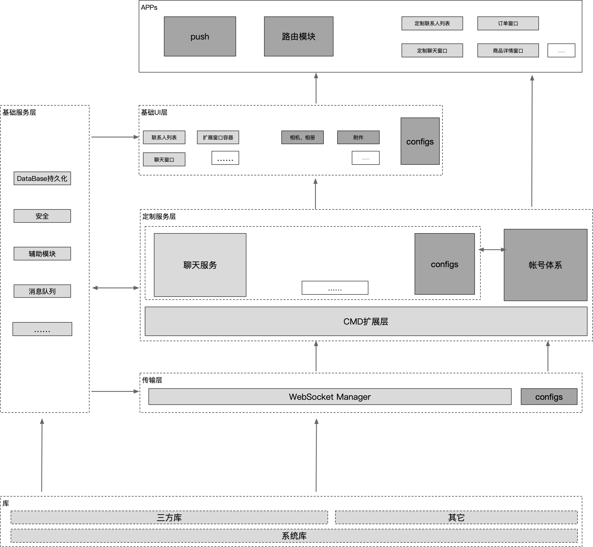
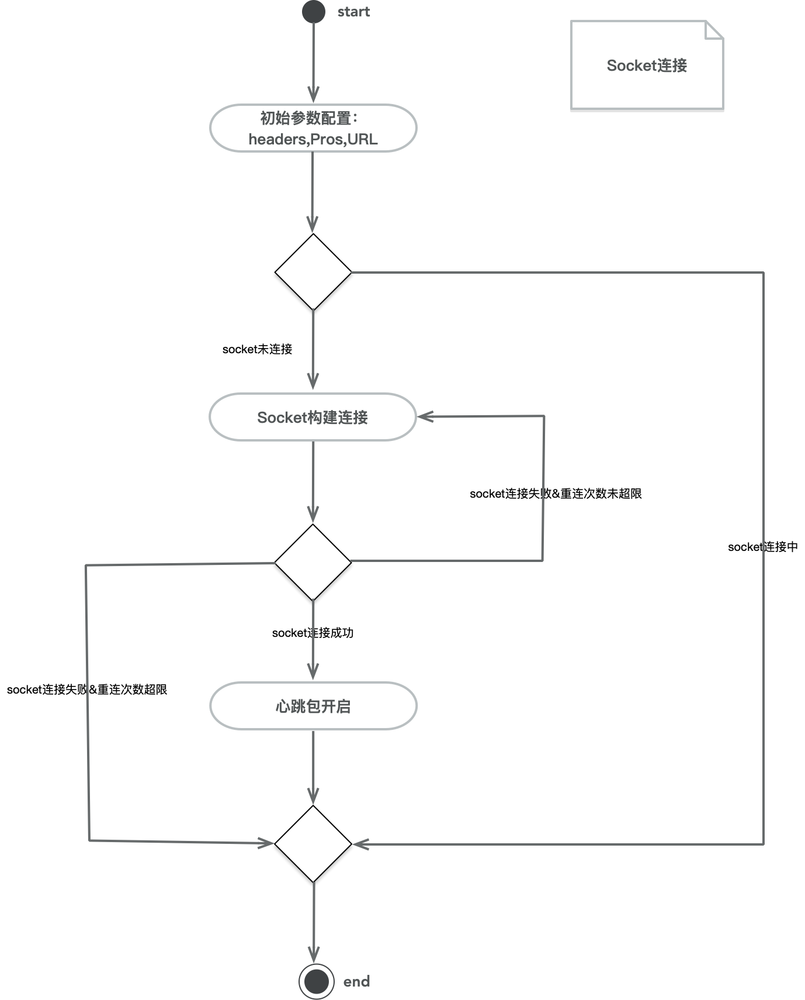
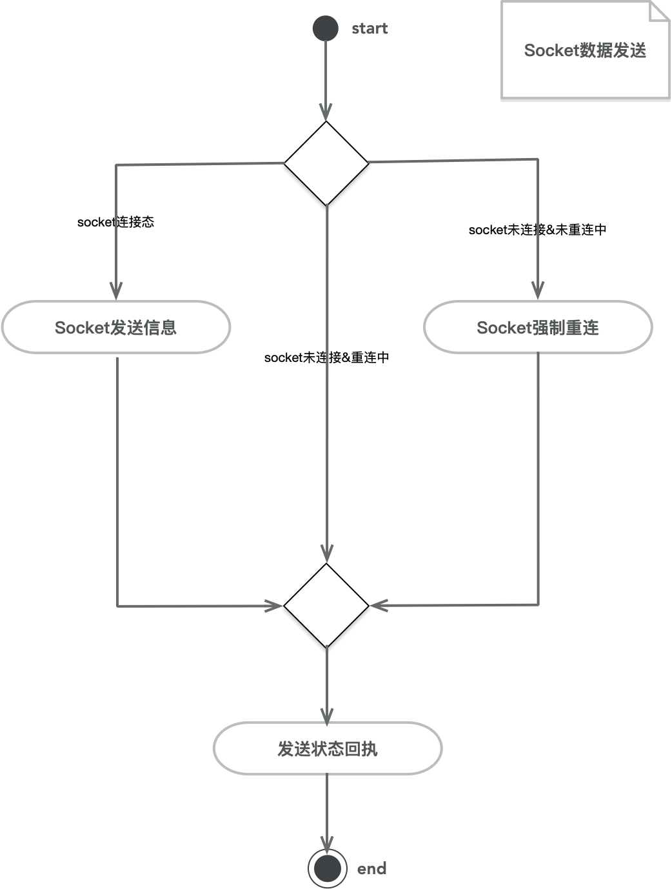
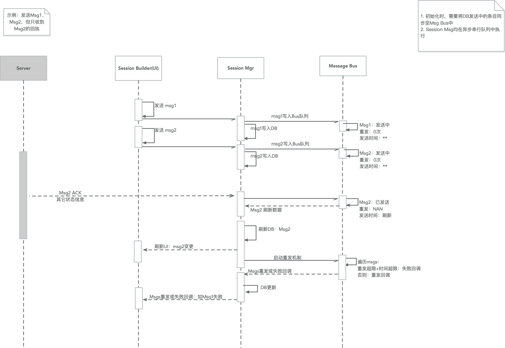
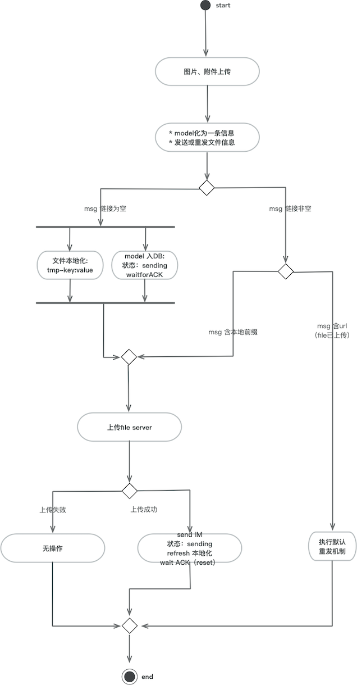

**架构自下至上进行阐述：**

* 原则：

	1. 每层对外暴露的接口尽量在public中，外部对其它文件无感知。
	2. 每层用到的库文件尽量以pods来管理，避免后续冲突。
	3. 模块化、组件化（自下而上隔离：层级化，去中心）
	2. 安全性：传输安全、代码安全
	3. 可扩展性
	4. 性能

* 项目管理：
	
	目前IM核心模块在gitLab上，以私有库方式存在，主要目的是方便协同开发。项目稳定后，可移除。

**整体架构图：**

# 一、IMSDK
## 1. 库

###### 一、 三方库：以CocoaPods管理

1. SocketRocket：FB出品，WebSocket库。用于IM通讯。
2. Protobuf：IM数据传输的编码协议。
3. FMDB：sqlite数据库操作封装，处理消息的持久化存储。
4. M80AttributedLabel：UI层，文本展示。支持图文混排，富文本展示等。
5. TZImagePickerController：UI层，相册操作功能，支持图片多选。

###### 二、其它：尚无。

尽量不手动引入库文件，避免与导入IM的主项目冲突。

## 2. 基础服务层（BaseServices）

支持IM的功能组件，非业务模块。

| 序列|组件|功能|
|:--:|:--:|:--:|
|1| AssistModule/ext|扩展：实现安全赋值|
|2| AssistModule/Date|时间工具：格式化时间对象|
|3| AssistModule/Forks |通用工具：唯一ID、键盘事件管理等|
|4|DataPersistence|持久化工具：数据库FMDB封装、归档、简单文件存储等|
|5|NetCheck|网络工具：网络可达性封装|
|6|SafeModule|安全工具：DES、URLEncode等|

## 3. 传输层（DataTransmitter）

1. Socket连接封装：在三方库`SocketRocket`基础上实现Socket功能：

	| 序列|功能|详情|
	|:--:|:--:|:--:|
	|1|连接功能|配置Headers、Protocols、URL，实现Socket连接/关闭。|
	|2|断线重连|网络中断并重连后，需要执行重连功能（若之前为连接态）。|
	|3|消息传输功能|发送二进制流数据。库本身支持异步队列发送。|
	|4|心跳包|特殊消息，app在前/后台时，注意开启/关闭心跳包的传输（若之前为连接态）。|

	
	
2. Model：即`Data.pbobjc`文件.实现Protobuf编解码协议，供上层收发IM消息使用。

3. 简易流程图：

 
 
 
 
 
## 4. 定制服务层（Services）

* IM的主要业务逻辑均在该层。
* 目前主要有IM模块、账户模块。支持扩展，后续可以添加其它模块。

###### 一、IM业务模块

| 序列|功能|详情|
|:--:|:--:|:--:|
|1|IMSessionManager|重发机制：以DB为基础，实现信息的收发、重发、状态变更等|
|2|IMSession|会话信息列表获取、消息Model定义、数据收发同步等|

IM信息收发流程图(涵盖IM信息收发、重发机制、状态变更等主要流程)：

文件上传流程图：

* 步骤1：上传文件服务器
* 步骤2：1中返回的url，再次发送至IM服务器。

###### 二、账户体系模块

| 序列|功能|详情|
|:--:|:--:|:--:|
|1|Login|登录：即Socket登录的部分封装+用户Model处理的部分封装|
|2|UserProfile|用户Model管理：本地持久化|
|3|SessionList|最近联系人列表：列表同步、消息Model定义|
|4|Guest|访客信息处理|
|5|SubAccount|子账户列表获取|
|6|Transfer|账号转接功能封装|

> 账户相关流程图与IM模块大致相同，此处略。

###### 附：消息桥接功能

通用数据定义。消息处理采用协议方式实现，便于后续扩展：只要实现Bridge协议即可扩展数据处理逻辑。

| 序列|文件|详情|
|:--:|:--:|:--:|
|1|IMAccountCMDBridge|账户模块处理逻辑|
|2|IMServiceCMDBridge|IM模块处理逻辑|
|3|IMErrorCMDBridge|处理全局错误|

## 5. 基础UI（IMUIs）

* 通用UI均在该层。提供了有限的定制化功能（如色值，字体等）。
* 若定制化功能无法满足特定项目需求，需在此基础上扩展UI。

###### 1. SessionUIs:会话详情UIs

1. 更多面板中的元素以协议方式外放
2. 会话列表以MVP设计模式实现
3. Cell以工程模式实现，便于扩展

|序列|UIs|简介|
|:--:|:--:|:--:|
|1|IMInputView|输入面板：输入框+表情+更多模板|
|2|Cells|消息卡片：文本、图片、附件、描述性卡片等|
|3|SessionUI|会话列表UI|

###### 2. SessionListUIs：最近联系人列表

1. 会话列表以MVP设计模式实现

|序列|UIs|简介|
|:--:|:--:|:--:|
|1|UIs|更多：进入原IM入口|
|2|Cells|联系人卡片|
|3|SessionList|联系人列表UI|

###### 3. DefaultResources：资源

|序列|文件|简介|
|:--:|:--:|:--:|
|1| LanUtil |多语加载方案的封装|
|2| ImageUtil |图片获取方案封装|
|3| IMDefaultSources.bundle |图片资源、多语文件、表情面板默认资源|

###### 4. IMProtocol：外放UI协议+默认实现

1. 橱窗解析协议+橱窗UI展示协议：外放橱窗展示
2. 上拉下拉刷新控件外放协议
3. 文件传输协议：附件、图片的上传下载，以及打开操作。

	> 其中`FileTrans`目录便是其默认实现。
	
4. 会话详情界面中无输入框时的提示UI

###### 5. UILibs

定制的ui控件

|序列|文件|简介|
|:--:|:--:|:--:|
|1| CollectionView |列表布局文件及扩展工具类|
|2| IMTextView |含占位符的输入框|
|3| BubbleView|聊天气泡UI|

###### 6. Public

IMUIKit：公开文件。针对基础UI提供可定制化的功能。

# 二、导入IMSDK的主项目

###### 1. IMSDKExt

扩展文件集合：针对主工程，实现IMSDK中外放协议，实现特有的功能细节。
	
> 如上拉下拉刷新控件实现；橱窗展示UI等。

###### 2. Router：路由模块

路由文件：进入最近联系人列表或特定会话界面等路由功能

> 1. 若有大的定制化需求，此时可以子类化IM的某些类，并做扩展（如卖家版主账号和子账号联系人列表共存）。
> 2. 路由文件，可能需要用户登录操作。视具体项目而定。

###### 3. Push：推送模块

推送逻辑：一般情况下，在完成推送注册的基本上，使用路由文件即可完成。

###### 4. Public（可选）

* 公开文件：上述文件集合，开放给主项目使用。
* 实现IM的初始化，细节见下一部分`IM初始化`。

	
# IM初始化

###### 一、数据传输层  

1. socket头部信息注册：URL、及其它默认值
2. 协议注册：utype、token 及其它默认值
3. 初始化socket环境：即1和2中数据写入socket

###### 二、IM服务层：即Account和IM层

1. DB初始化：DB创建开启+联系人table+会话table+未成功发送会话同步
2. 登录操作：即socket连接。替代`一`中`1(部分)`、`2(部分)`、`3`步。

	* 因参数有utype、token、URL，其它参数以`一`中为准进行追加。

3. user信息key注册，可以与DB的Key一致。只要业务帐号唯一对应即可。

###### 三、UI层

1. IMUIKit：负责UI的设置、协议注册、

 	1. 相册、相机、附件打开面板实现注册
 	2. fileTrans协议：图片、附件上下载实现
 	3. 橱窗解析实现（内含橱窗UI）
 	4. 图片、附件查看器实现注册。（可选，默认有实现。附件需要iCloud配置文件）
 	5. 语种设置（buyer默认英文，seller默认中文）

 
###### 四、登录相关

1. 登录  直接调用IMServices中登录即可。（配置信息另计）
2. 退登（或强制登录）：alert提示->IMServices logout + UI pops

---

## 优化点 （todo list）

* 断线重连BUG：针对业务层，退出帐号后，需重置socket连接信息，否则断网再次联网重连，连接信息是上次用户的。也可在每次帐号切换后，强制关闭再重连解决该bug。
* 文件：压缩传输、文件本地存储逻辑细化：如添加有效期等。
* 消息去重：目前仅在断网追加条目时添加了去重功能。
* 未读消息条目数：需server端支持。
* 错误码整合：错误码+错误描述。(二期已修正)

