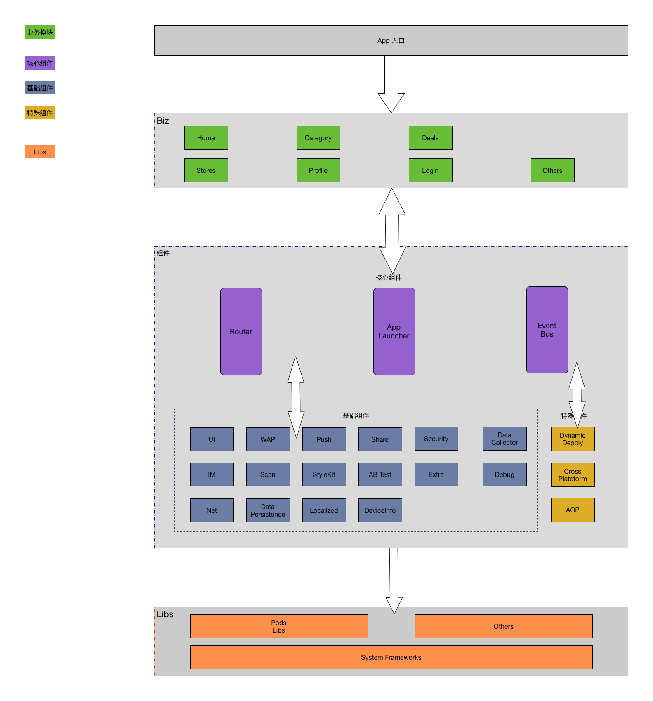
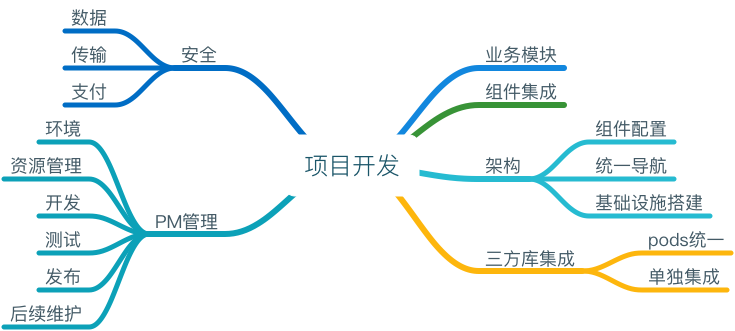

# 项目部署（初稿大纲）

## App架构

## 项目图谱

## 目录

1. 业务模块
2. 组件集成
3. 架构
4. 安全
5. 三方库
6. PM项目管理

## 业务模块

* **确立项目需求，拆分模块单元。该过程贯穿项目开发始终。**

### 模块细分（粒度较大，未完善）
1. 导航模块：商品导航（Home、category、stores等）
2. 订单模块：商品浏览-下单-付款-等
3. 用户模块：配合用户体系组件打造用户模块，包括profile等

	> 涵盖一系列用户登录注册流程

4. 基于模块开发中，有通用UI或者通用其它功能，也会逐步产出新的组件或者通用业务模块。

## 组件集成

* **依据业务模块需求，集成组件。在项目开发始终，增减组件以配合业务模块的完善。**

1. 安全组件配合路由、wap组件外，用户体系也需要该组件，但具体的安全配置，需要单独的安全组件完成。
2. 其它TODO：

## 架构

* **主要涵盖组件配置，项目统一导航，以及一系列基础设置搭建**

1. 启动：组件、模块启动文件配置

	> * 项目初始化需求
	
2. 导航搭建

	> * 如基于导航，基于tabbar建立项目基础框架
	
3. 统一文件配置：一般有相关组件完善约定

	> * 基于组件，构建项目相关的统一色值文件
	> * 基于组件，构建项目相关的统一字体文件
	> * 基于组件，构建项目相关的统一基类文件
	> * 基于组件，构建项目相关的统一全局宏文件
	> * 基于组件，构建项目相关的统一全局持久化文件
	> * 其它
	
	
## 安全

* **项目设置安全模块（可选），再配合安全组件，完善具体的安全要求**

1. 传输安全
2. 数据安全
3. 支付安全

## 三方库

## PM项目管理

### 1. 环境
1. IDE：Mac OS、Xcode8.x
2. 版本支持：iOS8及以上
3. 配置：TODO：

### 2. 资源管理
1. 代码管理：SVN（多用Git）
2. 文档管理：SVN

	> * 其中项目checklist根据具体项目不同而不同，故在代码中创建doc文件夹进行管理
	

### 3. 开发

1. 开发协同

	> * 注意开发过程中，随时变动的需求
2. 开发完成
3. 开发结束

	> * CodeReview

### 4. 测试

* **具体参见测试相关文档**

1. 测试

	> * Xcode性能测试、instruments等方式，建议贯穿整个项目开发始终
	
2. 集成测试
3. 混合测试
4. 单元测试
5. 回归测试
6. 其它

### 5. 发布

1. 项目checklist执行

	> * 位于项目doc文档中

2. 内灰

	> * 内部测试，定期CI集成测试
	
3. 外灰

	> * TestFlight分发（缺点：邮件邀请，且人数有限制）
	> * 蒲公英
	> * FIR
	
4. 发布AppStore

### 6. 后续维护

1. 重复文件梳理、统一
2. 业务模块梳理
3. 组件、模块重构：app包瘦身等