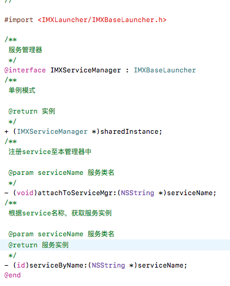
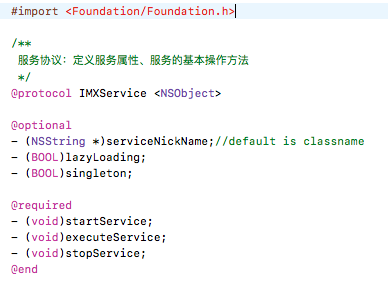
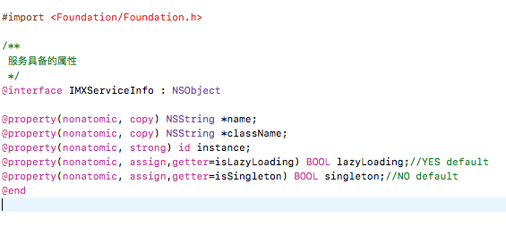

## 一、功能概述

* APP项目中有一些功能是全局性的，独立于业务逻辑、特定界面而存在。更确切来讲，它们是为业务逻辑、特定界面提供某项具体的服务。

	> 特点：在多个业务逻辑、多个界面中需要随时唤起服务、使用服务、结束服务
	>
	> 服务示例：如定位功能、拍照相册资源获取、分享、二维码扫描等等。

	
## 二、原理

#### 一、文件职能

1. `IMXServiceManager`：服务管理器。负责服务的注册、服务对象获取、唤起、结束等功能。
	> 服务对象获取时，会考虑是否懒加载，是否为单例模式等，并以此做出一定的操作

	
2. `IMXService`：服务协议。规范一些服务的基本属性和基本操作

	> * 基本属性：如服务名称、是否懒加载、是否单例模式
	> * 基本操作：唤起、执行、结束服务等
3. 特定服务协议：继承于基本协议`IMXService `,强化特定服务功能。

	> * 不同的服务，其服务方式会有差别。如定位服务除了基本操作外，还可能具有逆向地理解析的功能。故可以继承该协议，创建具体的定位协议文件，规范定位服务。

4. `IMXServiceInfo`:服务的基础属性定制文件

#### 二、技术点
1. service的注册：采用主动注册方案

	> * 在特定服务文件中`+(void)load`:实现本文件的注册，注册至管理器中，才能被执行。
	
2. 服务管理器初始化：将注册的services激活

	> 根据不同服务属性，选择是否懒加载、是否单例等。
	
#### 三、主要文件截图

1. IMXServiceManager头文件：

	
	
2. IMXService协议文件：

	
	
3. IMXServiceInfo头文件：

	