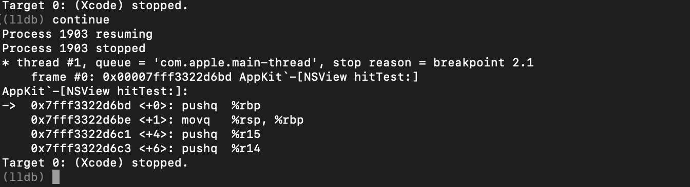

## Rootless

**Rootless**: 系统完整性保护（System Integrity Protection）。严格限制软件权限，避免恶意软件探入系统深处。（即使它们有根访问能力）

尽管Rootless是安全策略的重大改进，但它也限制了调试进程的附着。

#### 示例：尝试将LLDB附着于 Finder APP

开启终端，查询Finder进程：

```
lldb -n Finder
```

错误如下：


原因：Rootless使能状态。

#### 取消Rootless使能：

1. 重启Mac
2. 进入 Recovery模式：按住 `cmd+R` 至 apple logo 显示
3. 点击 Utilities 菜单，选择 Terminal 终端
4. 键入: `csrutil disable; reboot`
5. Mac将以Rootless 非使能状态自动重启。

建议：为安全考虑，使用虚拟器更合适。

取消附着：在lldb终端下，键入 quit 即可。或直接关掉该窗口。


## 附着LLDB 至 Xcode

### 1. 创建面板（2个）

1. 开启终端，按键 `cmd+shift+I`，更新面板标题为 `LLDB`。

	
	
2. 关闭运行的Xcode，否则执行期间会出现多个Xcode运行实例错误。
3. 执行脚本：`lldb`    启动 LLDB。
4. `cmd+T`，开启新终端面板，新面板标题为 `Xcode stderr`。
5. `Xcode stderr`中键入命令：`tty`，展示会话信息。

	> 新建窗口创建执行：`echo "hello debugger" 1>/dev/ttys***`，是否会接收信息。
	
### 2. 附着


1. 在LLDB面板中设置可执行目标APP为Xcode，即执行：`(lldb) file /Applications/Xcode.app/Contents/MacOS/Xcode`

2. 从LLDB 开启Xcode进程，即执行`process launch -e /dev/ttys*** --`

	

	> e:定位stderr，打印输出。如NSLog（Obj-C）或者print（Swift）信息。
	
	


### 3. 创建Swift项目

1. 创建Swift `HelloDebbuger`项目，将在stderr中看到部分输出，输出内容取决于Xcode作者的内容Log。

	


## Swift 前景

随着Swift的稳定，苹果现在更积极地在自己的应用程序中采用swift，比如iOS模拟器…甚至Xcode！xcode9中有40多个含swift的框架。
在LLDB中查询：

```
  (lldb) script print "\n".join([i.file.basename for i in lldb.target.modules if i.FindSection("__swift3_typeref")])
```
将展示出所有Xcode载入的动态加载模块，这些模块含有或链接有Swift代码。


## 点击查找`class`

1. 添加断点：
 
 
	
2. 恢复运行：

	```
	(lldb) continue
	```
	
3. Xcode将会被暂停，即LLDB提示断点被中靶

	


4. `hitTest:` 方法中靶，通过查看`RDI CPU`寄存器，确定具体中靶View:

	```
	//此命令使LLDB打印RDI寄存器中所指示的内容（即寄存器存储的内存地址，地址指向的对象的内容。）
	(lldb) po $rdi
	//此命令使LLDB打印RDI寄存器中的内容（即内存地址）
	(lldb) p $rdi
	//获取指针信息
	p/x $rdi
	```
	
	
	
## 过滤断点的重要内容（接上）

* 上述断点，会继续中靶 NSView的所有 subviews。
* 上述断点命令，会将构成Xcode的所有NSView实例均标记上。


1. 修改现有断点，实现条件过滤，即使用 `断点条件`（ breakpoint conditions）

	```
	//查找现存断点列表
	(lldb)br li
	```
	```
	//假使还存在上述断点，精确断点至编辑区
	 (lldb) breakpoint modify 0 -c '(BOOL)[$rdi isKindOfClass:(id)NSClassFromString(@"IDEPegasusSourceEditor.SourceCodeEditorView")]'
	```
	
	


2. 点击编辑区，中靶断点

	

3. 测试是否编辑区中靶：

	```
	//隐藏当前中靶对象
	 [$rdi setHidden:!(BOOL)[$rdi isHidden]]; [CATransaction flush]
	```
	
	
4. 打印寄存器所指对象的内容

	```
	po [$rdi string]
	```
	
5. 检索对象的所有方法（objc桥接并含有getter字符的所有方法）

	```
	 (lldb) image lookup -rn objc\sIDEPegasusSourceEditor.SourceCodeEditorView.*getter
	```
	
	结果：
	
	
	重点检索Summary部分，即为桥接的方法，使用：
	
	```
	(lldb) po [$rdi hostingEditor]
	```
	带有@objc，则可以以Obj-C语言调用。
	
	
## 执行 Swift 私有方法

LLDB与代码库交互，需要库映射信息（存在于后缀.modulemap文件中）。根据modulemaps确定Swift LLDB 执行编译器JIT与哪些方法交互。

在LLDB中执行Swift代码时，没有该模块modulemap将不会执行已知的代码。这与Objective-C（甚至纯C）中的编译器大不相同。


回到IDepigasusSourceEditor模块，若没有导入以访问此框架的Swift代码的.modulemap文件。将需找出要访问的swift函数名，然后使用c的extern声明并执行它。

用Swift实现，并以@objc桥接的方法，检索属性：

``
 (lldb) image lookup -rvn  objc\sSourceEditor.SourceEditorView.insertText\(Any\)
``


最后`mangled="$S12SourceEditor0aB4ViewC10insertTextyyypFTo"`,则为swift 方法名。

执行,告知LLDB，存在一个接收3个参数的方法的生命

```
(lldb) po extern void S12SourceEditor0aB4ViewC10insertTextyyypFTo(long,char *,id);

```
执行举例：

```
po S12SourceEditor0aB4ViewC10insertTextyyypFTo($rdi,0,@"haha")

```

OC语言只需要执行`[$rdi insertText:@"wahahahahah"]`即可，无需上述的声明并再执行。


**建议LLDB Debugger选择OC语法，一来简单；二则是LLDB执行OC较为稳定；三是OC传递self至函数中，swift则并非都是如此。**


