* 如何将LLDB挂载至进程的多种方法
* 挂载到进程时后台实现机制

1. `LLDB挂载`其实并不精确,实际负载挂载至目标进程的，是`debugserver程序`。
	> 路径：xcode.app/contents/sharedframeworks/lldb.framework/resources/。

2. 如果挂载的是远程进程，如iOS设备、watchOS、tvOS。则会在远程设备上启动`debugserver`。此时LLDB的工作则是负责启动、连接和协调远程`debugserver`，处理app调试工作的所有交互。


## 挂载至运行的进程

1. 方案一：

	```
lldb -n Xcode
```

2. 方案二：以进程id挂载

	```
//输出Xcode的进程号
pgrep -x Xcode

	```
	```
//以进程id挂载
lldb -p 12092
	```


## 挂载至未启动（待启动）的进程


若Xcode当下未运行，或Xcode已挂载至某debugger，上述命令将会执行失败。

**如何获取未运行的进程并挂载？**

1. 方案一

	使用`-w`参数实现：待进程启动时，-p或-n后的参数匹配时，执行挂载。

	```
//首先杀掉进程
pkill Xcode
	```
	```
lldb -n Xcode -w

	```

	此时若出现如下暂停，执行 ``(lldb) continue即可``


	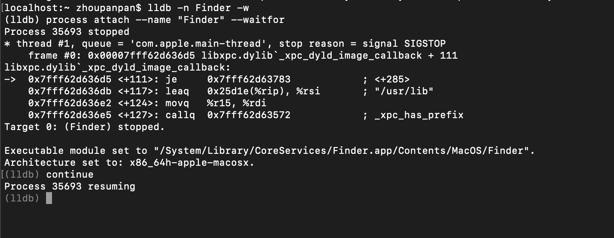

2. 方案二

	指定可执行文件（进程）的路径，手动决定启动时机：
	
	```
	lldb -f /System/Library/CoreServices/Finder.app/Contents/MacOS/Finder
	```
	
	```
	//手工启动
	 (lldb) process launch
	```

## process launch 的可选参数

查询细节：

```
help process launch
```

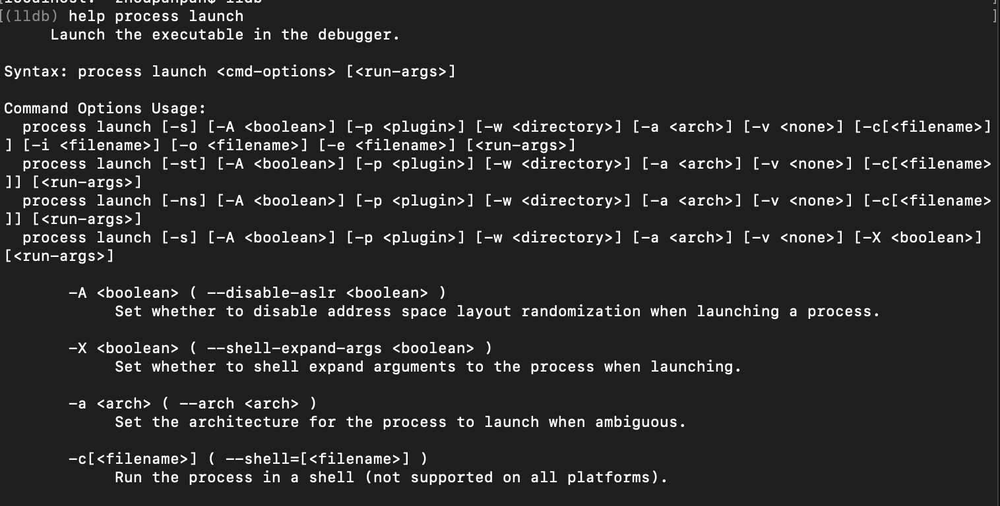


开启新终端窗口，执行挂载/bin/ls：


```
///bin/ls:文件列表命令
lldb -f /bin/ls
```


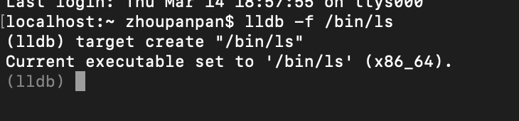
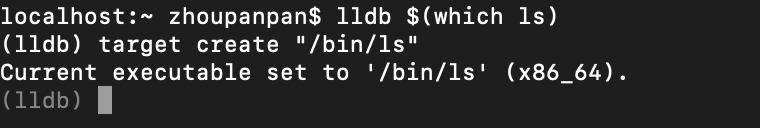


无参数启动/bin/ls

```
//开始时所在目录，即为此时的执行目录
(lldb) process launch
```

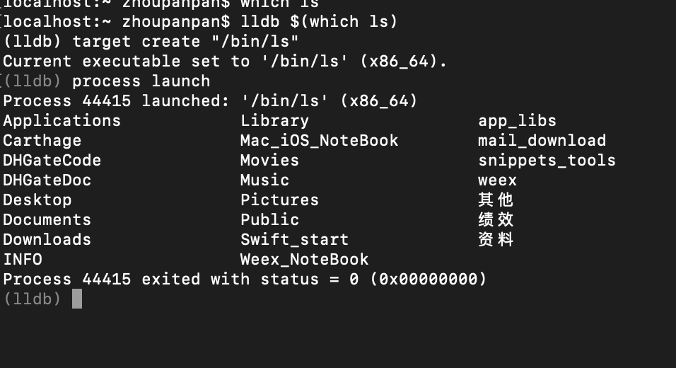


使用参数`-w`告知开启时的目录

```
(接上)
process launch -w Weex_NoteBook
//等价于
$ cd Weex_NoteBook
$ ls
```
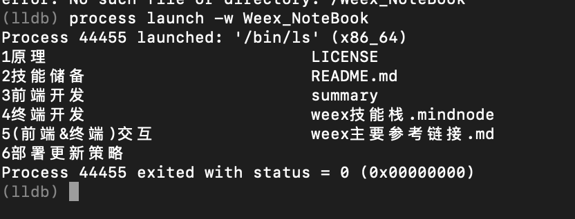


也可以直接以给定目录，执行ls

```
(lldb) process launch -- /Weex_NoteBook
//等价于
$ ls Weex_NoteBook
```

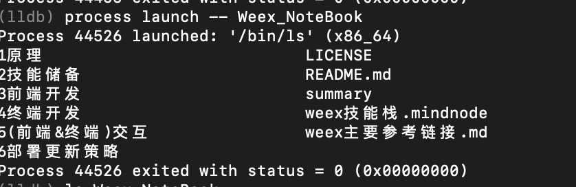
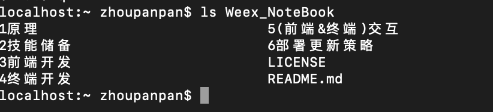


不是起始目录下的子目录时，通过`-x`更改：

```
//扩展shell命令。其缩写为`run`
//等价于：run ~/Desktop
(lldb) process launch -X true -- ~/Desktop
```

## stdout 输出

更改输出文本的位置，第一章中使用了`stderr`展示于不同的终端窗口，此时使用`stdout`。

```
//目录信息输出至桌面txt文件中
(lldb) process launch -o /Users/zhoupanpan/Desktop/tmp.txt Weex_NoteBook
```

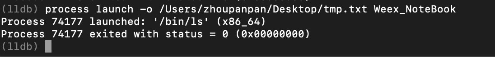

另开终端，执行命令，展示txt文件中具体内容

```
cat /Users/zhoupanpan/Desktop/tmp.txt 
```
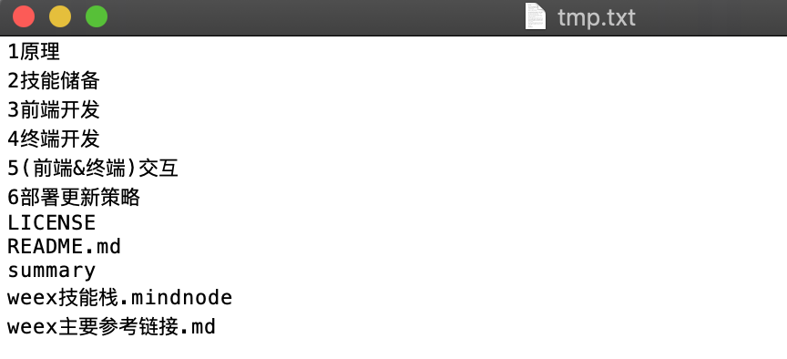


使用`-i` 标识 `stdin` 输入：略

## 切换 target

删除当前挂载的target

```
//移除ls
(lldb) target delete
```

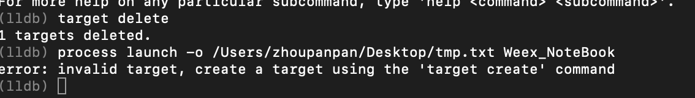

挂载新target

```
//设置新target：/usr/bin/wc
(lldb) target create /usr/bin/wc
```
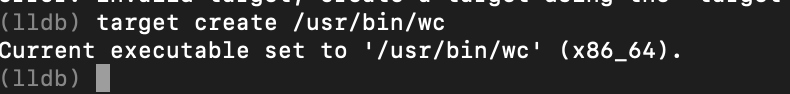

`/usr/bin/wc`:指定`-i(stdin)`,统计字符、单词、行数等信息。

```
(lldb) process launch -i /Users/zhoupanpan/Desktop/tmp.txt
//等价于
$ wc < /Users/zhoupanpan/Desktop/tmp.txt
```
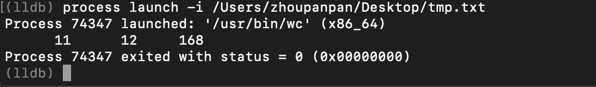

附：终端写入内容：

```
echo "hello world" > /tmp/wc_input.txt
```


