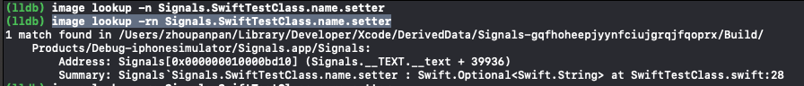

本章主要介绍关于断点（breakpoint）的所有知识点，以及如何使用LLDB操作它们。


## Unix信号

* Unix 信号处理
* 控制进程（LLDB）处理Unix信号传递到控制进程时会发生什么

Unix信号是进程间通信的基本形式。

**例如，信号sigstop**：用于保存进程的状态和暂停进程的执行。

其相对的**sigcont**：则被发送到程序以恢复执行。

这两个信号可以被调试器用来暂停和继续程序进程的执行。


#### 发起信号：


1. app内部发起

	> 1. app内部发起SIGSTOP信号，即可冻结app
	> 2. **Xcode启动运行时，LLDB是挂载到信号（Signs）程序的。**调用SIGSTOP可在Xcode中使用LLDB检查执行状态。
	
2. app外部发起，如使用终端


## Xcode 断点

Xcode 实现的断点功能

1. **符号断点（Symbolic Breakpoint）**：Xcode Debug功能。在app内部某个符号上设置断点。


	如`-[NSObject init]`：即将符号断点设置在NSObject实例执行init方法处。
	
	
	
	
	`$arg1`等同于$rdi，存放实例的值。
	
2. **异常断点（Exception Breakpoint）**：几种错误断点之一。启用该类型断点，当app遇到错误崩溃时，可以触发并记录大致问题行。
3. **Swift 错误断点（Swift Error Breakpoint）**：该断点会被设置在`swift_willThrow`方法上，任何时候，只要swift抛出错误，便会触发。


## LLDB 断点语法

使用LLDB控制台创建断点。并学习如何查询正在查找的内容，来设置必要的断点。

`image 命令`：帮助确定设置断点时的细节。

```
(lldb) image lookup -n "-[UIViewController viewDidLoad]"
```

该命令输出`[UIViewController viewDidLoad]`方法的的实现地址（该方法位于二进制库中的偏移地址）。`-n`参数告知LLDB查询符号或函数名。


```
(lldb) image lookup -rn test
```

针对`test`字符进行区分大小写的正则查找，在本执行文件中，无论在哪里（任何函数、任何模块UIKit&Foundation中））找到该字符，将显示结果。


> 1. `-n`:执行精确匹配。（后续参数若有空格，则加引号）
> 2. `-rn`:执行正则查找。


### Obj-C 属性


Objective-C和Swift在编译器创建它们时都有特定的属性签名，这在查找代码时会导致不同的查询策略。

如OC属性定义：

```
@interface TestClass : NSObject
@property (nonatomic, strong) NSString *name;
@end
```

编译器将为属性`name`生成`getter`和`setter`方法，如下：

```
 -[TestClass name]
```

```
-[TestClass setName:]
```

构建运行app，执行LLDB：

```
(lldb) image lookup -n "-[TestClass name]"
```


LLDB在可执行文件中找到该方法，在 `__text`section 中，偏移地址为`0x0000000100002130`。且在`TestClass.h`文件28行声明。

注：OC属性的点标记法等价于getter和setter方法的调用。


### Swift 属性

Swift属性定义(实际是成员变量)：

```
class SwiftTestClass: NSObject {
  var name: String!
}
```

执行正则查询：

```
(lldb) image lookup -rn Signals.SwiftTestClass.name.setter
```



注意setter函数名的长度，若要设置断点，则需要完整键入函数：

```
b Signals`Signals.SwiftTestClass.name.setter : Swift.Optional<Swift.String>
```


使用正则，一并检索处getter和setter方法：

```
ModuleName.Classname.PropertyName.(getter|setter)
```


**附：`cmd+k`:清空控制台log。**


## LLDB 断点创建

掌握了如何查询代码中函数和方法的存在性，便可以开始在它们上创建断点了。

###### 方法一：

```
(lldb) b -[UIViewController viewDidLoad]
```

* 适合于OC和C，因方法名较短且易于键入。
* 不适合C++和Swift，因编译器将函数转为较长名称的符号。


### 正则断点和范围


