本章主要介绍关于断点（breakpoint）的所有知识点，以及如何使用LLDB操作它们。

附： 正则表达式学习：[https://docs.python.org/2/library/re.html](https://docs.python.org/2/library/re.html)


## Unix信号

* Unix 信号处理
* 控制进程（LLDB）处理Unix信号传递到控制进程时会发生什么

Unix信号是进程间通信的基本形式。

**例如，信号sigstop**：用于保存进程的状态和暂停进程的执行。

其相对的**sigcont**：则被发送到程序以恢复执行。

这两个信号可以被调试器用来暂停和继续程序进程的执行。


#### 发起信号：


1. app内部发起

	> 1. app内部发起SIGSTOP信号，即可冻结app
	> 2. **Xcode启动运行时，LLDB是挂载到信号（Signs）程序的。**调用SIGSTOP可在Xcode中使用LLDB检查执行状态。
	
2. app外部发起，如使用终端


## Xcode 断点

Xcode 实现的断点功能

1. **符号断点（Symbolic Breakpoint）**：Xcode Debug功能。在app内部某个符号上设置断点。


	如`-[NSObject init]`：即将符号断点设置在NSObject实例执行init方法处。
	
	
	
	
	`$arg1`等同于$rdi，存放实例的值。
	
2. **异常断点（Exception Breakpoint）**：几种错误断点之一。启用该类型断点，当app遇到错误崩溃时，可以触发并记录大致问题行。
3. **Swift 错误断点（Swift Error Breakpoint）**：该断点会被设置在`swift_willThrow`方法上，任何时候，只要swift抛出错误，便会触发。


## LLDB 断点语法

使用LLDB控制台创建断点。并学习如何查询正在查找的内容，来设置必要的断点。

`image 命令`：帮助确定设置断点时的细节。

```
(lldb) image lookup -n "-[UIViewController viewDidLoad]"
```

该命令输出`[UIViewController viewDidLoad]`方法的的实现地址（该方法位于二进制库中的偏移地址）。`-n`参数告知LLDB查询符号或函数名。


```
(lldb) image lookup -rn test
```

针对`test`字符进行区分大小写的正则查找，在本执行文件中，无论在哪里（任何函数、任何模块UIKit&Foundation中））找到该字符，将显示结果。


> 1. `-n`:执行精确匹配。（后续参数若有空格，则加引号）
> 2. `-rn`:执行正则查找。


### Obj-C 属性


Objective-C和Swift在编译器创建它们时都有特定的属性签名，这在查找代码时会导致不同的查询策略。

如OC属性定义：

```
@interface TestClass : NSObject
@property (nonatomic, strong) NSString *name;
@end
```

编译器将为属性`name`生成`getter`和`setter`方法，如下：

```
 -[TestClass name]
```

```
-[TestClass setName:]
```

构建运行app，执行LLDB：

```
(lldb) image lookup -n "-[TestClass name]"
```


LLDB在可执行文件中找到该方法，在 `__text`section 中，偏移地址为`0x0000000100002130`。且在`TestClass.h`文件28行声明。

注：OC属性的点标记法等价于getter和setter方法的调用。


### Swift 属性

Swift属性定义(实际是成员变量)：

```
class SwiftTestClass: NSObject {
  var name: String!
}
```

执行正则查询：

```
(lldb) image lookup -rn Signals.SwiftTestClass.name.setter
```


注意setter函数名的长度，若要设置断点，则需要完整键入函数：

```
b Signals`Signals.SwiftTestClass.name.setter : Swift.Optional<Swift.String>
```


使用正则，一并检索处getter和setter方法：

```
ModuleName.Classname.PropertyName.(getter|setter)
```


**附：`cmd+k`:清空控制台log。**


## LLDB 断点创建

掌握了如何查询代码中函数和方法的存在性，便可以开始在它们上创建断点了。

###### 方法一：

```
(lldb) b -[UIViewController viewDidLoad]
```

* 适合于OC和C，因方法名较短且易于键入。
* 不适合C++和Swift，因编译器将函数转为较长名称的符号。


### 正则断点和范围


`rbreak`:正则表达式断点。使用智能正则快速创建多个断点，以在任何位置停止。

**示例：**

断点Swift属性方式时，需要键入以下：

```
b Signals`Signals.SwiftTestClass.name.setter : Swift.Optional<Swift.String>
```

现在可以替换如下：


```
(lldb) rb SwiftTestClass.name.setter
```

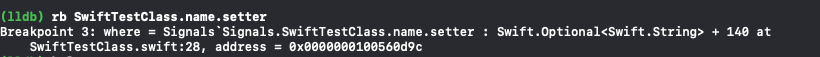

可以更加简化：


```
(lldb) rb name\.setter
```

该命令会在包含短语`name.setter`的任何位置上设置断点。除非其它类无该属性，否则将会在多个类中`name`属性上设置多个断点。


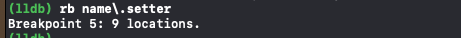


**复杂示例**


创建位置在UIViewController实例方法上的断点：

```
 (lldb) rb '\-\[UIViewController\ '
```

`\`转义字符：在正则搜索中使用文字字符。

该命令将断点含字符串`-[UIViewContrller `的每个方法(注意最后的空格)。

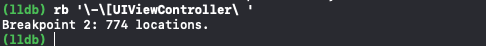


删除断点：

```
(lldb) breakpoint delete
```

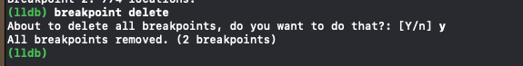


包含扩展的断点：

```
(lldb) rb '\-\[UIViewController(\(\w+\))?\ '
```

添加一个可选括号（含有`一个`或`多个`的`字母``数字`字符）。


**正则断点**允许使用单个断点表达式来捕获多个式样的断点。

可以使用-f可选项将断点范围限制为确定的文件：

```
(lldb) rb . -f DetailViewController.swift
```
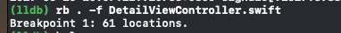

在debug 该文件时，比较有用。将会在该文件的所有属性方法、闭包、类别、方法函数中均设置断点。

`-f`理解为范围限制。


完全不受限制的断点设置：

```
(lldb) rb .
```

将在项目中、库中任何位置设置断点。


使用`-s`可选项，限制库范围:

```
(lldb) rb . -s Commons
```

在`Commons`库（动态库和静态库均可）中任何位置设置断点


使用`-o`可选项，则设置断点仅命中一次，然后该断点即被删除：

```
//实际操作，无效果
(lldb) rb . -s UIKit -o
```

### 其它断点可选项

1. -L：源语言过滤

	示例：断点仅设置于Commons模块中Swift语言的函数
	
	```
	breakpoint set -L swift -r . -s Commons
	```

	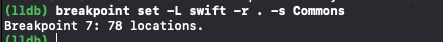
	
2. 源正则断点：仅依赖个别字符，来设置断点：

	```
	breakpoint set -A -p "if let"
	```
	
	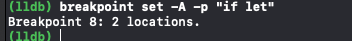

	* 将在含有if let 的每个源代码上设置断点。
	* -p：支持复杂的正则设置断点
	* -A：标识搜索项目为所有源文件


	```
	//过滤为：仅2个源文件设置断点
	 (lldb) breakpoint set -p "if let" -f MasterViewController.swift -f
DetailViewController.swift
	```

	```
	//断点仅设置于Signals项目所有文件中
	(lldb) breakpoint set -p "if let" -s Signals -A
	```

	* -A:所有源文件
	* -s：仅Signals模块，其它库不包含


### 条件断点 `-c`：

1. 您需要找出app可执行文件中代码在内存中的上下限(位于__TEXT段__text部分)。

	使用LLDB输出Mach-O文件所有Segment、Sections,确认上下限：

	```
	(lldb) image dump sections Signals	
		
	```
 
 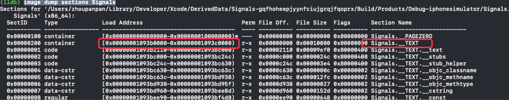
  		
  
2. 设置断点，使之只在app源码调用中触发。（库文件中不触发该断点） 

	```
	 (lldb) breakpoint set -n "-[UIView setTintColor:]" -c "*(uintptr_t*)$rsp
<= 0x00000001093c0000 && *(uintptr_t*)$rsp >= 0x00000001093b0000"
	```
	
	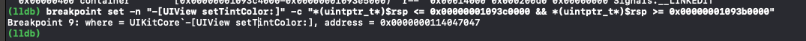
	
	使用`x86_64`调用约定。在`x86_64`程序集中，在调用函数之后，堆栈指针将包含一个指向调用函数的返回地址的指针。
	

3. 不使能函数序言（function prologue）

	```
	(lldb) settings set target.skip-prologue false
	```

	LLDB为设置序言逻辑（函数序言），将在函数的开头跳过一些汇编指令。发生这种情况时，堆栈指针的头将不再包含指向返回地址的指针（头将指向新的内容）。故需要设置LLDB在这些安装程序集指令出现之前立即停止。
	
	后续章节将会涉及保存配置到LLDB配置文件中（~/.lldbinit）
	
	
## 修改、删除断点


修改、删除、临时失效、修改下次触发的行为等。

### 唯一标识一个断点或一组断点：

1. 创建断点时使用`-N`命名断点，后续可使用`name`。
	
2. 使用breakpoint ID：

	```
	//在不同模块中的所有`main`函数位置设置断点
	(lldb) b main
	```
	
	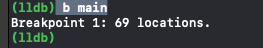
	
	此处`1`即为 breakpoint ID
	
	查看某断点详情，可使用ID查看：
	
	```
	(lldb) breakpoint list 1
	```

	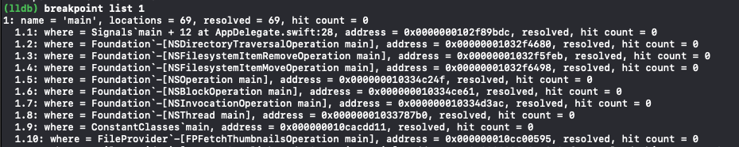


	简短查看模式：
	
	```
	breakpoint list 1 -b
	```
	
	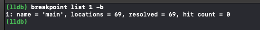

	
	查看所有断点（非单一ID）：

	```
	(lldb) breakpoint list
	```

	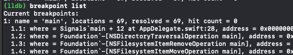

	
	使用ID范围查找：
	
	```
	(lldb) breakpoint list 1 3
	(lldb) breakpoint list 1-3
	```

### 删除断点

1. 暴力删除所有breakpoints：

	```
	 (lldb) breakpoint delete
	```
	
	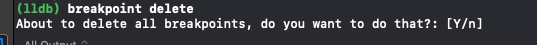

2. 根据ID 删除一个或者一组 断点 ：

	```
	 (lldb) breakpoint delete 1
	```
	
	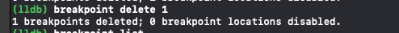
	
3. 根据细化的id删除一个具体的断点：

	```
	(lldb) breakpoint delete 1.1
	```

	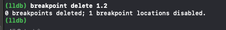


