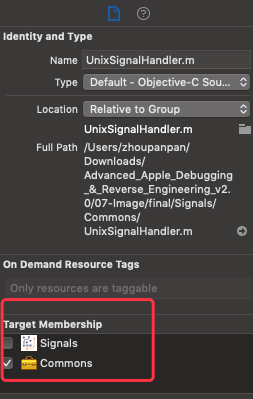

往期回顾：

1. 找到并将LLDB附载感兴趣的进程。
2. 利用正则表达式，创建命中范围更广的断点。
3. 导航堆栈追踪路径。
4. 利用`expression`修改变量。


**本章将深入探索`image`命令，通过LLDB，发现特定的代码。**

`image`命令是`target modules`命令的别名。

**`image`命令专门用于查询`模块信息`，即在进程中加载和执行的代码。**

**`image`命令支持查询任何`私有框架及其类`或`头文件中未公开的方法`等信息。**

**模块(modules)**：涵盖较多文件类型，诸如主要的可执行文件（ main executable）、frameworks或plugins。并且这些模块的大多数通常以动态库的形式出现。（如UIKit）


## 模块（modules）

运行项目，悬停项目，执行：


```
(lldb) image list
```

**展示当前项目加载的所有模块。**


* 模块1：主要二进制文件
* 模块2、模块3：动态链接编辑器（dyld）。负责将动态库以及进程中的主要可执行文件加载到内存中。


**过滤，仅查看特定库文件或集合：**

```
 (lldb) image list Foundation
```


1. 模块的UUID：UUID用于寻找`符号信息`；唯一标识模块。
2. 模块的加载地址：用以在可执行程序的进程空间中，确定该模块被加载的位置。
3. 模块路径：在磁盘中，该模块的完整路径。


**深化探究具体模块：**

```
(lldb) image dump symtab UIKit -s address
```


* dump模块UIKit所有可用的符号表信息。
* `-s address`：根据模块中实现函数的地址对输出进行排序。


**`image lookup`命令适用于过滤数据：**

```
(lldb) image lookup -n "-[UIViewController viewDidLoad]"
```


dump `UIViewController`中`viewDidLoad`实例方法相关的信息：该方法的符号名、在模块UIKit中实现的位置。缺点是该命令只能dump具体的案例。


**正则查询：**

```
(lldb) image lookup -rn UIViewController
```

该命令不仅dump所有的`UIViewController`实例方法，也会dump类似`UIViewControllerBuiltinTransitionViewAnimator`中的方法，因为字符串含有`UIViewController `。

为了仅过滤`UIViewController`方法，使用：


```
(lldb) image lookup -rn '\[UIViewController\ '
 
```

使用`\s`元字符指示空格，这样就不必转义实际的空格并用引号将其括起来,等价命令：

```
(lldb) image lookup -rn \[UIViewController\s
```


附件扩展，即搜索所有扩展方法。键入：

```
(lldb) image lookup -rn '\[UIViewController\(\w+\)\ '
```

* 开头的`\`标识转义的`[`。
* 文本`UIViewController`。
* 然后`(`后跟字母数字下划线字符（用`\w+`表示），然后`)`。
* 后跟空格。


**运用正则表达式，有利于查询加载到二进制文件中的任何模块中的任何公开、私有代码。当然还会提示方法是否从父类中重写。**


### 逐鹿代码

了解代码是如何生成的，有利于定位感兴趣的代码并创建断点。

示例：探索Obj-C block中的方法签名

搜索Objective-C block的方法签名的最佳方法是什么？由于不知道从哪里开始搜索，**一个好的开始方法是在block中放置一个断点，然后从那里进行检查。**


其堆栈追踪路径：


执行``frame info``:


**可得该函数全名为：`__34+[UnixSignalHandler sharedHandler]_block_invoke`。**

`_block_invoke`:可能是在Objective-C中唯一标识block的模式。

在该项目范围内搜索含有`_block_invok`字符的代码：

```
(lldb) image lookup -rn _block_invoke Signals
```

无任何输入时，检测类是否是因为编译Target不对。



执行：

```
 (lldb) image lookup -rn _block_invoke Commons
```


**如上，在`Commons`模块中，打印输出所有的`Obj-C block`信息。**


创建断点，定位于上述`block`块的某子集中：

```

  (lldb) rb appendSignal.*_block_invoke -s Commons
```

**这个断点将命中·AppendSignal·方法中的任意block。**

> 注：在模块中搜索代码和在模块中断点代码之间有微小差别，注意`-s`参数和空格。


