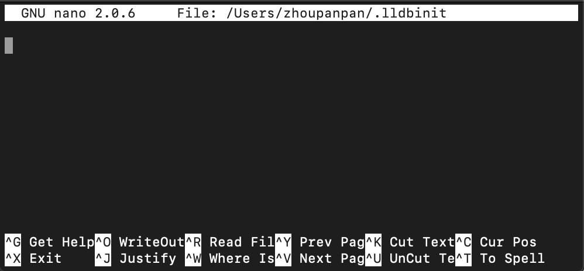
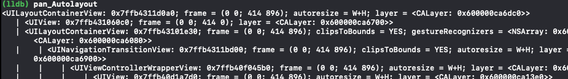
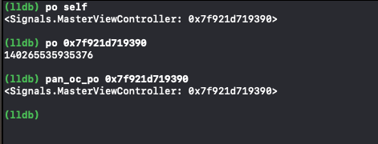

LLDB执行的一些命令、参数、设置或代码，较为复杂繁琐（如Swift函数全名参数）。

为了方便执行，方便多次重复输入，可以执行优化方案：

* 持久化命令
* 创建缩写形式

**通过文件`.lldbinit`执行相关操作配置。**


## 持久化配置文件

### 概念：

每当LLDB被调用，它都会搜索若干目录检索特定的初始化文件。
这些文件会在LLDB启动且未被挂载至某进程的时候加载进LLDB中。
**这些文件可用来做某些配置或创建定制命令，以备后续调试之用。**

### 搜索目录

LLDB搜索初始化文件位置及次序：

1. `~/.lldbinit-[context]`:若在Xcode中执行调试，则`[contect]`为`Xcode`；若使用`LLDB`命令行，则`[contect]`为`LLDB`。

	> * `~/.lldbinit-Xcode`:添加的命令内容只在Xcode中调试时可用
	> * `~/.lldbinit-lldb`:添加的命令内容仅在LLDB终端调试时可用
	
2. `~/.lldbinit.`:对于大多逻辑来说，这是理想的文件。因为添加至此的命令，在Xcode调试中和LLDB终端会话调试中都可以使用。
	
	
3. 最后，LLDB搜索调用它的目录。

	> 当`Xcode`启动`LLDB`时，它将在`/root`目录下启动`LLDB`。这不是放置`.lldbinit`文件的理想位置，因此在本书中会忽略这个特定的实现。
	

## 创建文件`.lldbinit`

###### 1. 开启终端，创建`.lldbinit`	:

```
nano ~/.lldbinit
```

* 启动nano文本编辑器编辑`.lldbinit`文件
* 当前路径若存在`.lldbinit`文件则打开，否则新建。
* 也可以使用vi可视编辑器




###### 2. 添加内容至文件

添加内容至文件尾部：


```
//命令别名创建
command alias -- pan_Autolayout expression -l objc -O --
[[[[[UIApplication sharedApplication] keyWindow] rootViewController]
view] recursiveDescription]
```
	
该缩写命令执行后面表达式：获取rootview并dump它和它subviews的所有位置布局。

ctr+o：执行保存操作。

启动app，手动悬停LLDB，键入：

```
(lldb) pan_Autolayout
```
	


完善help注释功能：

在命令中创建如下：

```
command alias -H "pan_Autolayout will get the root view and recursively dump all the subviews and their frames" -h "Recursively dump views"  -- pan_Autolayout exp....

```
	
ctr+o：执行保存操作。

	
启动app，手动悬停LLDB，键入：

```
(lldb) help pan_Autolayout
```

在底部将展示上述`-H`说明。

键入：

```
(lldb) help
```
展示`-h`说明。

**注意在说明字符之后，有`--`分割说明和命令。**

在`.lldbinit`文件中存在较多自定义命令时，帮助性说明会起到明显的作用。


## 定制含有参数的命令


创建含有参数的命令别名，保存至`.lldbinit`文件以下命令：

```
command alias pan_oc_po expression -l objc -O --
```

创建po的命令别名，但它将利用Obj-C上下文。

理想场景：在Swift上下文中，打印输出有效的Obj-C对象地址或寄存器。


**应用：断点在Swift代码种**

执行：``(lldb) po 0x7f921d719390``无有意义输出，因为代码悬停，且Swift是类型安全的语言，故简单打印输出地址无效。

**此时在Obj-C上下文中调试非常有用，特别是在汇编中只有引用地址时。**



	
	
	
	
	
	
	
	
	
	
	
	
	
	
	
	
	
	
	
	
	
	
	
	
	
	
	
	
	
	
	
	
	
	
	
	
	
	
	
	
	
	
	
	