现在已经了解了调试器的基本知识点，是时候探究下构成源代码的 1 和 0 了。本部分将聚焦于调试功能的低层级知识。

本章将介绍 CPU 使用的寄存器知识，并探索和修改传递到函数调用中的参数。你也将了解常见的 apple 计算机体系架构和通过在函数中如何使用它们的寄存器。这被称之为体系架构调用约定。

了解`汇编工作机制`和`特定体系架构调用规约`知识是非常重要的技能。它可以让你观察无源码的函数参数，并允许修改传给函数的参数。另外，在汇编级别修改可能效果更好。（因为源码中可能含有您未知的或不同命名的变量）

例如，假设您一直想知道函数调用的第二个参数，且忽略其命名。汇编知识为您提供了一个很好的基础层来操作和观察函数中的参数。


|x64参数寄存器|参数次序|
|:--:|:--:|
| RDI |第一个参数|
| RSI |第二个参数|
| RDX |第三个参数|
| RCX |第四个参数|
| R8 |第五个参数|
| R9 |第六个参数|

## 汇编 101

什么是汇编？

当你悬停(stop in)在一个未知源码的函数中时，看到内存地址的冲击，并紧跟着可怕、简短的命令。这些简短命令集便是汇编。

下图为一个 Xcode 的断点追踪，展示了一个函数的汇编：

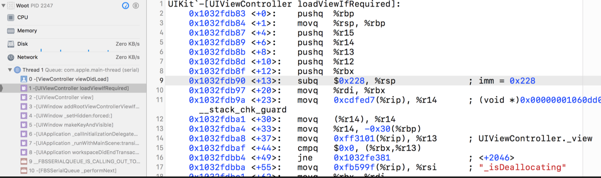

如上图示，汇编可以分为若干部分。汇编指令的每一行都包含一个操作码，可以认为是计算机的一个极其简单的指令。

操作码是什么样子的呢？操作码是是在计算机上执行一个简单任务的指令。

如以下程序片段：

```
pushq   %rbx
subq    $0x228, %rsp
movq    %rdi, %rbx
```

在上述汇编块中，有3个操作码： pushq、subq、movq。

将操作码项视为要执行的操作。操作码后面的内容是源和目标标签。也就是说，这些标签是操作码作用于的项目。

上述示例中，有部分寄存器：%rbx、%rsp、%rdi、%rbp等。

`%`前缀：标识着这是寄存器。

此外，还可以找到十六进制数字常量，如`$0x228`所示。

`$`前缀：告诉你它是一个绝对数。


现在你不需要知道这个代码在做什么的，因为您当下首先任务是了解寄存器和函数的调用约定。然后您将进一步了解操作码，并在以后的章节中编写自己的汇编程序。

> 附：在上面的例子中，请注意在寄存器和常量之前有一堆%、$。这就是反汇编器格式化程序集的方式。然而，有两种主要的汇编指令集。第一个是 Intel 指令集，第二个是 AT&T 指令集。
> 
> 默认情况下，Apple 的反汇编器工具附带了以 AT&T 格式显示的指令集，如上面的示例所示。虽然这是一个很好的工作格式，但对眼睛来说可能有点困难。在下一章中，您将把汇编格式改为 intel，并从那里开始专门使用 intel 汇编语法。


## x86_64 vs ARM64


#### x86_64

作为苹果平台的开发人员，在学习汇编时，您将处理两个主要的体系架构：x86_64体系架构和 ARM64 体系架构。

x86_64 与在 MacOS 上使用的架构极其相似，除非您运行的是“古老”的 Macintosh。


`x86_64`是 64 位体系架构，即每个地址可以容纳 64 个 1 或 0。

> 旧的 Mac 使用 32 位体系架构，但苹果在 2010 年底已停止生产 32 位Mac。
> 
> 在MacOS下运行的程序可能是 64 位兼容的，包括模拟器上的程序。也就是说，即使您的 MacOS 是 x86_64，它仍然可以运行 32 位的程序。

如果您对正在使用的硬件体系架构有任何疑问，可以通过在终端中运行以下命令来获取计算机的硬件体系架构信息：

```
uname -m
```

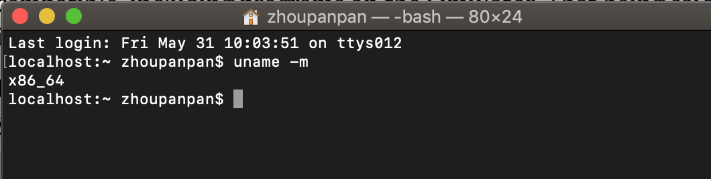


#### ARM64

ARM64 体系架构用于移动设备上（如iPhone），该类设备对限制能耗至为关注。

ARM 强调节能，因此它有一组减少的操作码，有助于在复杂的汇编指令上限制能耗。这对您来说是个好消息，因为您需要学习的 ARM 体系架构指令更少了。

这里是前面显示的相同方法的屏幕截图，只不过这次是在iPhone7上的 ARM64 汇编指令集中执行：

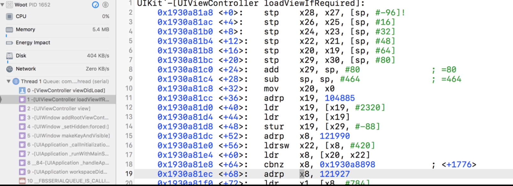


现在您可能无法区分这两种体系结构，但很快您就会了解它们。

苹果最初在其许多 iOS 设备中提供了 32 位 ARM 处理器，但后来又转向了 64 位 ARM 处理器。32 位 iOS 设备几乎全然废弃，因为苹果已经通过 iOS 版本的迭代升级逐步淘汰了它们。例如，iPhone5 是 iOS 11 不支持的最后一款 32 位 iOS 设备。支持iOS 11 的“最低” iPhone 是一款 64 位设备 iPhone5s。

近年来，32 位设备已经在其他苹果产品中得到了展示。苹果手表的前两代是 32 位设备，但第三代是 64 位设备了。此外，在较新的MacOS 设备上发现的（公认是花哨的）苹果触摸屏也是使用 32 位架构。

因为着重关注未来需要，所以本书主要关注的是两种体系架构的 64 位汇编集。此外，您将首先学习 x86_64 指令集，然后过渡到学习arm64 指令集，这样您就不会感到困惑。

## x86_64 寄存器调用规约

CPU 使用一组`寄存器`来操作正在运行的程序数据。

这些是数据存储持有者，就像计算机中的 RAM 一样。然而，它们位于CPU上，且非常靠近需要它们的 CPU 部分。所以 CPU 的这些部分可以非常快地访问这些寄存器。

大多数指令会涉及一个或多个寄存器，并执行诸如将寄存器内容写入存储器、将存储器内容读到寄存器、对两个寄存器执行算术运算（加、减等）等操作。

在 x64 中（从这里开始，x64 是 x86_64 的缩写），**有 16 个用来操作数据的通用寄存器（general purpose registers）**。

这些寄存器是RAX、RBX、RCX、RDX、RDI、RSI、RSP、RBP和R8到R15。这些名称对您目前来说意义不大，但就每个寄存器的重要性您将很快就会了解。

|通用寄存器|名称|作用|
|:--:|:--:|:--:|
| RAX |||
| RBX |||
| RCX |||
| RDX |||
| RDI |||
| RSI |||
| RSP |||
| RBP |||
| R8..R15 |||

当您在 x64 架构中调用函数时，寄存器的使用方式遵循一个非常具体的约定。如指示 函数的参数应该放在哪里，以及函数完成时的返回值将放在哪里。用一个编译器编译的代码与用另一个编译器编译的代码可以一起使用，这很重要。

例如，Obj-C代码示例：

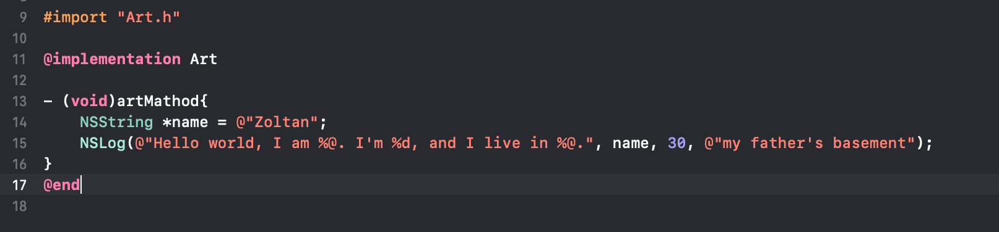

有 4 个参数传递给 NSLog 调用函数。

其中第一个参数存储在局部变量中，然后作为函数中的参数引用，其余一些值按原样传递。

然而，当通过汇编方式查看代码时，才发现计算机并不关心变量名，它只关心变量在内存中的位置。

**在 x64 汇编指令集中，当一个函数被调用时，下述寄存器将被作为参数调用，记住下述列表，后续将会频繁使用到：**

|参数寄存器|参数次序|
|:--:|:--:|
| RDI |第一个参数|
| RSI |第二个参数|
| RDX |第三个参数|
| RCX |第四个参数|
| R8 |第五个参数|
| R9 |第六个参数|


如果有 6 个以上的参数，那么程序堆栈将用于向函数传递附加参数。

回到这个简单的 Obj-C 代码，您可以重新想象寄存器被像下面的伪代码一样传递：

```
RDI = @"Hello world, I am %@. I'm %d, and I live in %@.";
RSI = @"Zoltan";
RDX = 30;
RCX = @"my father's basement";
NSLog(RDI, RSI, RDX, RCX);
```

一旦 NSLog 函数启动，给定的寄存器将包含如上所示的相关值。

然而事实是，一旦函数序言（准备堆栈和寄存器的函数开始部分）完成执行，这些寄存器中的值可能就会更改。生成的汇编代码可能会重写已存储在这些寄存器中的值，或者只是在代码不再需要这些引用时丢弃它们。

这意味着，一旦您离开函数的开始（通过 stepping over、stepping in 或 stepping out），您就不能再假定这些寄存器中仍保存有您想要观察的预期值，除非您实际查看汇编代码以了解它在做什么。

使用这种调用约定探索寄存器严重影响了调试（和断点）策略。如果您要自动执行任意类型的断点和探索，则必须在函数调用开始时停止，以便检查或修改参数，而不必实际深入到汇编代码中。

## Obj-C 和 寄存器


正如您在上一节中所学，寄存器使用特定的调用约定。你可以把同样的知识应用到其他语言中。

当 objective-c 执行一个方法时，会执行一个名为 objc_msgsend 的特殊 c 函数。实际上，该 c 函数有几种不同的类型，但详情稍后介绍。这是 Objective-C 动态消息调度的核心。

objc_msgsend参数说明：

第一个参数: 即发送消息对象的引用。
第二个参数：是一个选择器（Selector），它是一个用 char* 来指定的调用方法名。
最后一个参数：如果选择器指定应该有参数，则 objc_msgsend 接受其指定数量的参数。

以下为一个 iOS 环境中具体的例子：

```
[UIApplication sharedApplication];

```

编译器将生成如下伪代码：

```
 id UIApplicationClass = [UIApplication class];
objc_msgSend(UIApplicationClass, "sharedApplication");

```

第一个参数是对 UIApplication 类的引用，后面是sharedApplication 方法选择器。判断是否有参数的一个简单方法是简单地检查 Obj-C 选择器中的冒号。每个冒号将表示选择器中的一个参数。

示例2：

```
 NSString *helloWorldString = [@"Can't Sleep; "
stringByAppendingString:@"Clowns will eat me"];
```

编译器生成的伪代码：

```
NSString *helloWorldString;
helloWorldString = objc_msgSend(@"Can't Sleep; ",
"stringByAppendingString:", @"Clowns will eat me");
```

第一个参数是 NSString 的实例（@"Can't Sleep; "），后面是选择器，再后面是参数，该参数也是一个 NSString 实例。

使用 objc_msgSend 的这些知识，您可以使用 x64 中的寄存器来帮助探索内容，马上实践。

##  理论付诸实践


运行章节附带项目 Registers 。

这是一个相当简单的应用程序，只显示一些 x64 寄存器的内容。需要注意的是，这个应用程序在任何给定的时刻都无法显示寄存器的值；它只能在特定的函数调用期间显示寄存器的值。这意味着您不会看到这些寄存器的值太多的数值更改，因为调用获取寄存器值的函数时，它们可能具有相同（或类似）的值。

现在您已经了解了 registers macos 应用程序背后的功能，为NSViewController 的 viewDidLoad 方法创建一个符号断点。

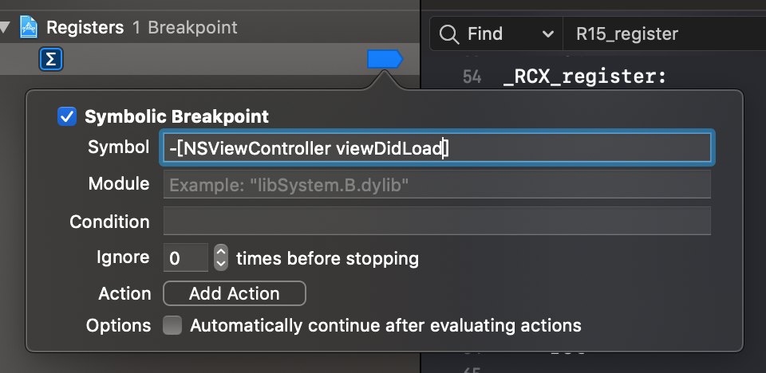


运行项目，当悬停后，在控制台执行：

```
 (lldb) register read
 
```

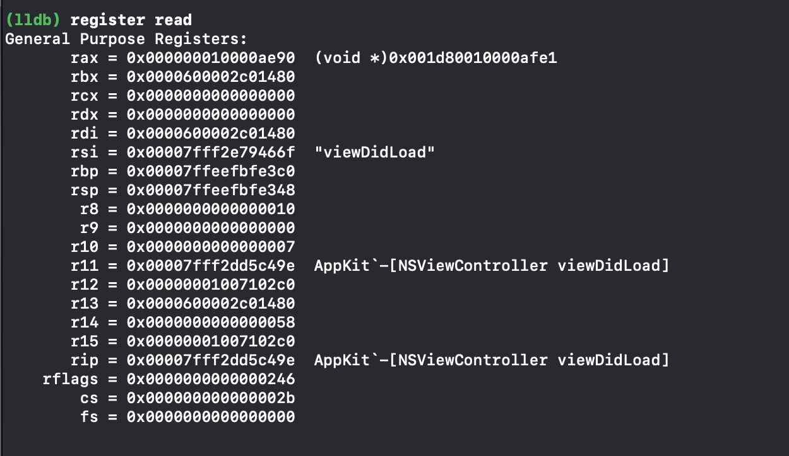

这将列出所有处于悬停执行状态时的主要寄存器。然而，有太多纷杂的信息。您应该有选择地打印出寄存器，并将它们作为 Obj-C 对象来处理。

伪代码：

```
RDI = UIViewControllerInstance
RSI = "viewDidLoad"
objc_msgSend(RDI, RSI)
```

时刻铭记 x64 调用约定，且知晓 objc_msgSend 运行机制，您便可以找到正在加载的特定 NSViewController。

键入如下命令：

```
(lldb) po $rdi
```

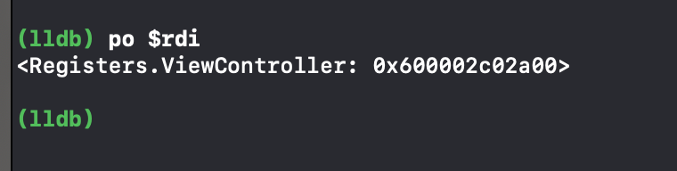

这将 dump out  RDI寄存器中保存的 NSViewController 引用，如您现在所知，它是该方法第一个参数的位置。

在 LLDB 中，用`$`字符作为寄存器的前缀是很重要的，因此 LLDB 知道您需要寄存器的值，而不是源代码中相关作用域的变量。是的，这与您在反向汇编视图中看到的汇编代码不同！

> 附：当您停止使用 obj-c 方法时，观察者可能会注意到，在 LLDB backtrace 中永远不会看到 objc_msgSend。这是因为 objc_msgSend 系列函数在汇编指令集中执行 jmp 或 jump opcode 命令。这意味着 objc_msgSend 充当一个蹦床函数，一旦obj-c 代码开始执行，objc_msgSend 的所有堆栈跟踪历史都将消失。这是一种称为`尾调用优化(tail call optimization)`的优化。


打印输出 RSI 寄存器，希望其中包含调用的选择器。在LLDB控制台中键入以下：

```
 (lldb) po $rsi
```

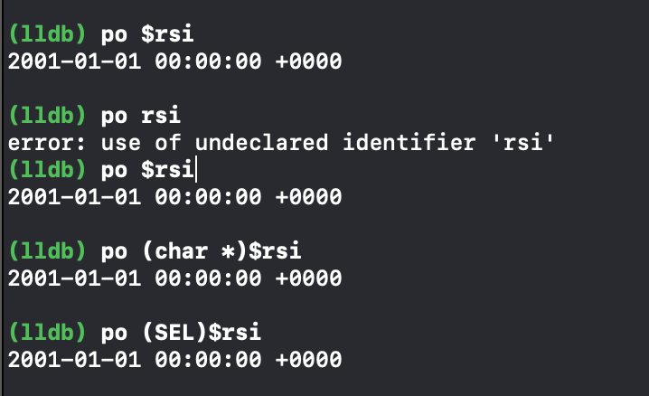

目前输出的情况与书上所述有差异，具体的 SEL 可通过上述 `register read` 命令读取。

现在，是时候探索一个带有参数的 Obj-C 方法了。因为您已经在viewDidLoad 上悬停，所以可以安全地假设 NSView 实例已经加载。感兴趣的方法是由 NSView 的父类 NSResponder 实现的mouseUp: 方法。

在 LLDB 中，在 NSResponder 的 mouseUp: 上创建一个断点，然后继续执行。如果你记不起怎么做，这里有你需要的命令：

```
 (lldb) b -[NSResponder mouseUp:]
(lldb) continue
```

鼠标操作，触发断点。

键入命令获取鼠标触发实例（第一个参数）：

```
(lldb) po $rdi
```

第二个参数为方法。

第三个参数则是 mouseUp: 方法的参数对象，即 NSEvent。

确定参数类型：

```
(lldb) po [$rdx class]
```

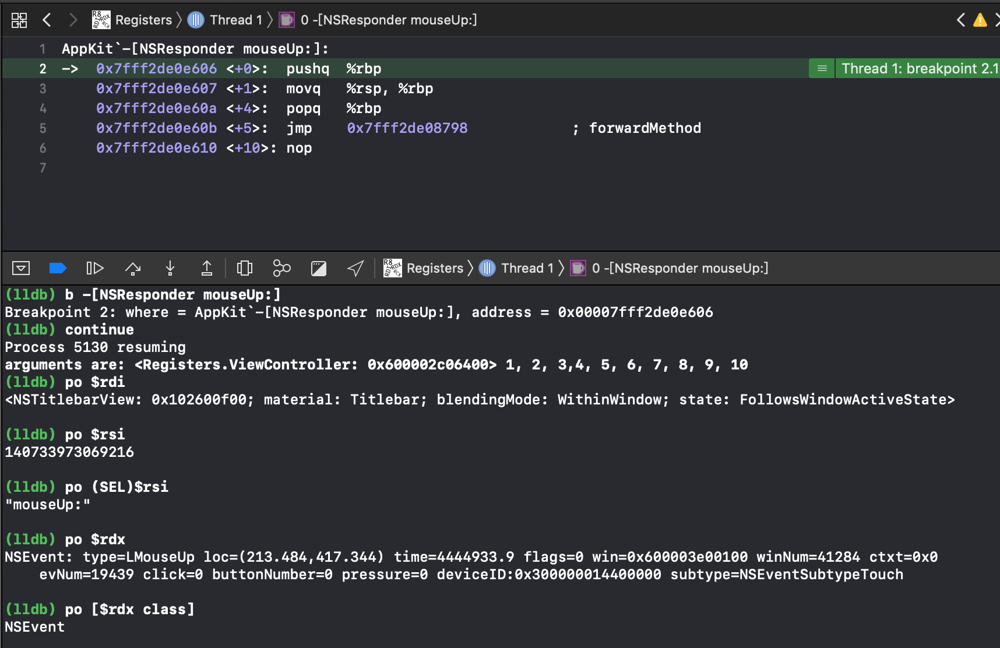


有时，使用`寄存器`和`断点`来获取内存中活动对象的`引用`是很有用的。

例如，如果您想将前置的 NSWindow 更改为红色，但代码中没有此视图的引用，并且不想改动代码进行重新编译，该怎么办？

您可以简单地创建一个断点，从寄存器中获取引用，并根据需要操作对象的实例。你现在试着把主窗口换成红色。

> 附：即使 NSResponder 实现了 mousedown:，NSWindow 也会重写此方法，因为它是 NSResponder 的子类。您可以 dump 实现mousedown: 的所有类，并确定哪些类继承自 NSResponder，以决定是否在不访问源代码的情况下重写该方法。dump 实现mousedown: 的所有 obj-c 类的一个示例是`image lookup -rn \smouseDown:`，或者使用在上一章中创建的rlook regex命令。

首先移除已存在的断点：

```
 (lldb) breakpoint delete
```

断点 mouseDown,并只被触发一次:

```
 (lldb) rb '\-\[NSWindow\ mouseDown:\]' -o
(lldb) continue
```

鼠标点击，断点在被触发之后，键入以下：

```
 (lldb) po [$rdi setBackgroundColor:[NSColor redColor]]
(lldb) continue
```

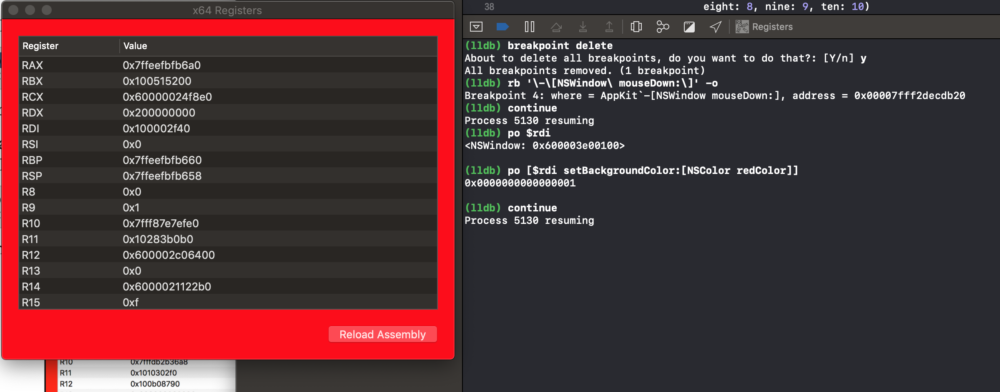


## Swift 和 寄存器

在 Swift 中研究寄存器时，您将遇到两个障碍，使汇编调试比在Obj-C 中更困难。

1. 首先，寄存器在 Swift LLDB 调试上下文中不可用。这意味着您必须获取所需的任何数据，然后使用 `Obj-C 调试上下文`打印传递给 Swift 函数的`寄存器`。记住，您可以使用表达式 `-l objc -O` --命令，或者使用第8章“持久化和定制命令”中的定制命令。幸运的是，register read 命令在 Swift 上下文中可用。

2. 第二，Swift 不像 Obj-C 那样动态。事实上，有时最好假设Swift 像 C，除了一个非常、非常古怪和专横的编译器。如果您有一个内存地址，那么您需要显式地将其强制转换为您期望的对象；否则，Swift 调试上下文就不知道如何解释内存地址。


也就是说，在 Swift 中使用相同的寄存器调用约定。然而，有一个非常重要的区别。**当 Swift 调用一个函数时，它不需要使用objc_msgSend**，当然除非您标记了一个使用dynamic的方法。这意味着当 Swift 调用函数时，分配给 SEL 的先前使用的 RSI 寄存器实际上将包含函数的第二个参数。

理论结束--开始实践。

在 Registers 项目中，导航到 viewcontroller.swift 并将以下函数添加到类中：

```
func executeLotsOfArguments(one: Int, two: Int, three: Int,
                              four: Int, five: Int, six: Int,
                              seven: Int, eight: Int, nine: Int,
                              ten: Int) -> String {
    print("arguments are: \(self) \(one), \(two), \(three),\(four), \(five), \(six), \(seven), \(eight), \(nine), \(ten)")
    return "Mom, what happened to the cat?"
  }
```

在 viewDidLoad 中调用该函数，并传入适当的参数：

```
override func viewDidLoad() {
    super.viewDidLoad()
    let _ = self.executeLotsOfArguments(one: 1, two: 2, three: 3, four: 4,
                                five: 5, six: 6, seven: 7,
                                eight: 8, nine: 9, ten: 10)
  }
```

将断点放在与 executeLotsOfArguments 声明相同的行上，这样调试器将在函数的最开始处悬停。这很重要，否则如果函数已经执行，寄存器可能会被删除。

运行项目，静态断点触发

同样，探究的一个好方法是 dump 所有寄存器。在 LLDB 中，键入以下：

```
//使用-f d选项:十进制显示格式输出
(lldb) register read -f d
```

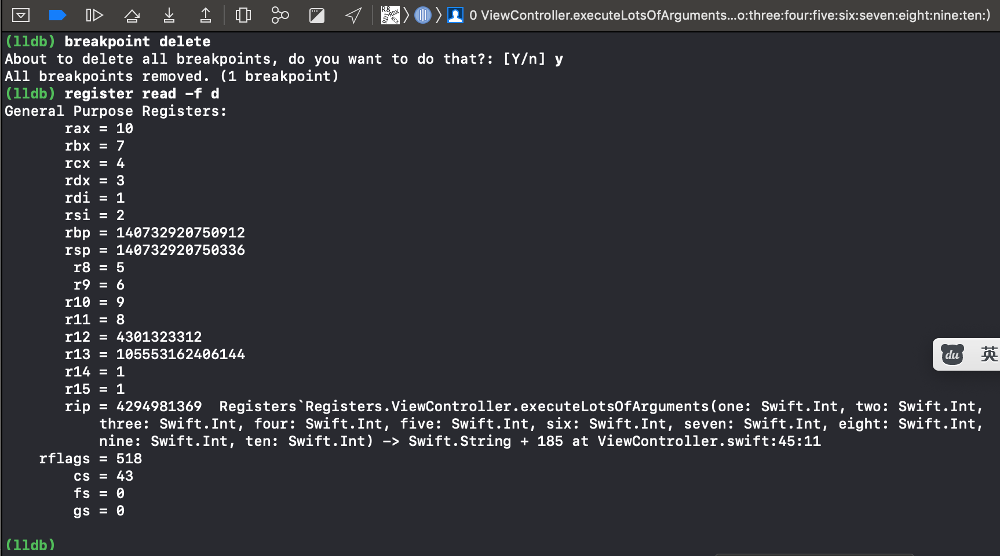

如上所见，寄存器遵循 x64调用约定。RDI、RSI、RDX、RCX、R8和R9包含前六个参数。

> 附：
> 
> * 到目前为止，我一直没有告诉您有关 LLDB 的一些事情，那就是 LLDB 有若干`方便变量( convenience variables)`来引用以 `$arg{X}`形式出现的汇编寄存器，其中 X 是参数号。
> 
> * 所以，记住RDI是怎样的第一个参数，而RSI是第二个参数？
> 
> * 在 LLDB 中，可以通过`$arg1`引用第一个参数（RDI）。随着示例的进行，您可以使用`$arg2`引用第二个参数（RSI）。
> 
> * 这些方便值也可以在 ARM64 调用约定中使用，即使 ARM64 使用不同的寄存器。您应该记住寄存器调用约定，这样本书可以最小化这些寄存器辅助变量的使用。


您还可能注意到其他参数存储在一些其他寄存器中。这是真的，但它只是代码中为剩余参数设置堆栈的剩余部分。记住，**第六个参数之后的参数将进入堆栈(stack)。**


## RAX ：返回寄存器

到目前为止，您已经了解了如何在函数中调用六个寄存器，但是返回值呢？

幸运的是，函数的返回值只有一个指定的寄存器：RAX。

将断点打在 executeLotsOfArguments 方法内部某处，重新运行项目，触发断点，执行：

```
 (lldb) finish
```

结束当前函数运行后，并悬停调试器。此时，该函数的返回值应该在 RAX中，执行：

```
(lldb) register read rax
```

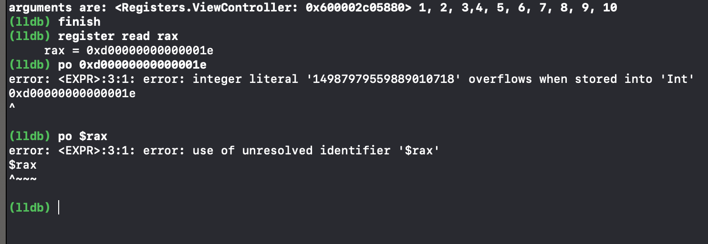

书上效果：

```
rax = 0x0000000100003760  "Mom, what happened to the cat?"
```

在 RAX 中获取返回值的知识非常重要，因为它将为您在以后的章节中编写脚本的调试奠定基础。


## 改变寄存器中的值


为了巩固您对寄存器的理解，您将在已经编译好的应用程序中修改寄存器。

打开终端窗口，启动 iPhoneX 模拟器。请键入以下内容：

```
xcrun simctl list | grep "iPhone X"
```

此命令列出所有设备，但只搜索其中包含短语`iPhone X`的设备。它看起来像这样：

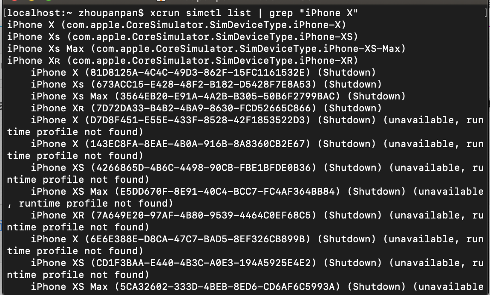

UUID 就是你想要的。使用它打开 iOS 模拟器，输入以下命令，根据需要替换uuid:

```
open /Applications/Xcode.app/Contents/Developer/Applications/Simulator.app --args -CurrentDeviceUDID (UUID)
```

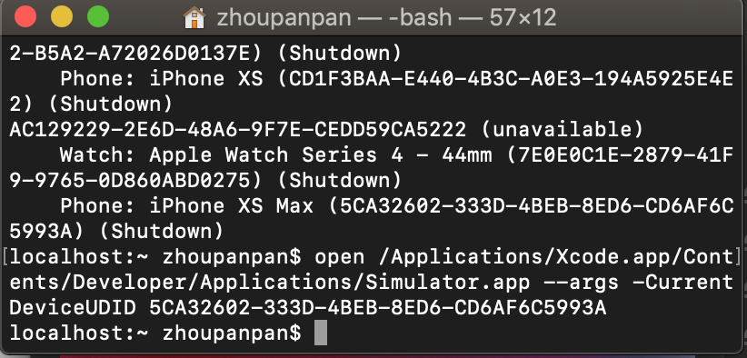

确保模拟器已启动并位于主屏幕上。您可以通过按`command+shift+h`进入主屏幕。一旦您的模拟器设置好，就可以转到终端窗口并将 LLDB 挂载到 SpringBoard 应用程序：

```
lldb -n SpringBoard
```

这会将 LLDB 挂载到 iOS 模拟器上运行的 SpringBoard 实例。SpringBoard 是控制 iOS 主屏幕的程序。

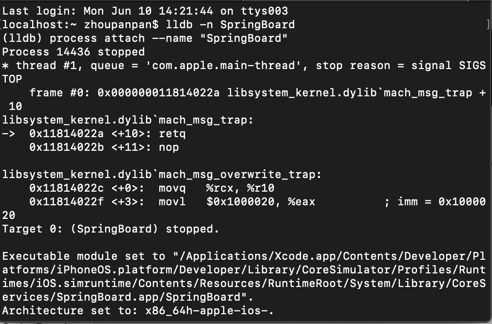


挂载成功后，在 LLDB 中键入：

```
(lldb) p/x @"Yay! Debugging"
```
并获取相关的输出：

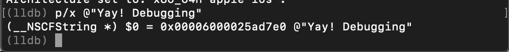

记下这个新创 NSString 实例的内存引用，因为您很快就会使用它。现在，在 LLDB 中 UILabel 的setText: 方法上创建一个断点：

```
(lldb) b -[UILabel setText:]
```

继续命令：

```
(lldb) breakpoint command add
```

LLDB 将释放一些输出并进入多行编辑模式。此命令允许您添加额外的命令，以便在命中刚添加断点时执行。键入以下内容，用上面的NSString 实例地址替换内存地址：

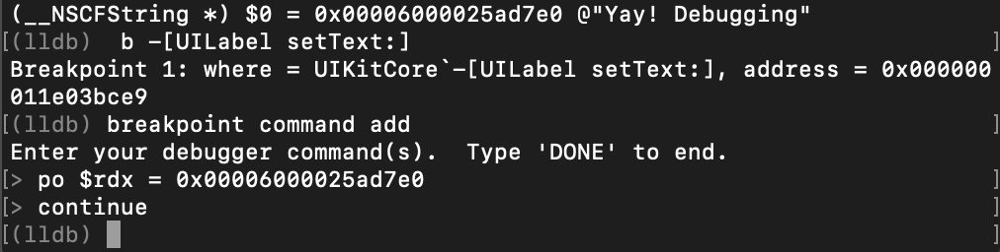

**当断点命中时，NSString 实例替换 RDX 中的内容（第三个参数）。**

继续调试：

```
continue
```

尝试探索 SpringBoard 模拟器应用程序，看看哪些内容发生了变化。从底部向上滑动以显示所有应用程序的切换器视图，并观察更改。

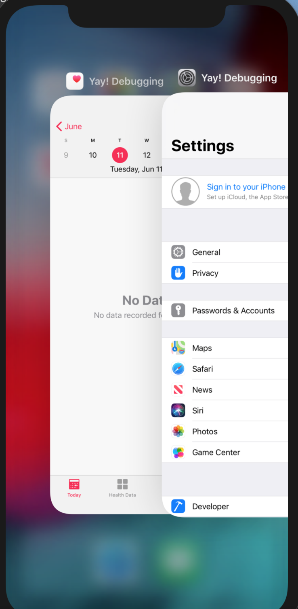

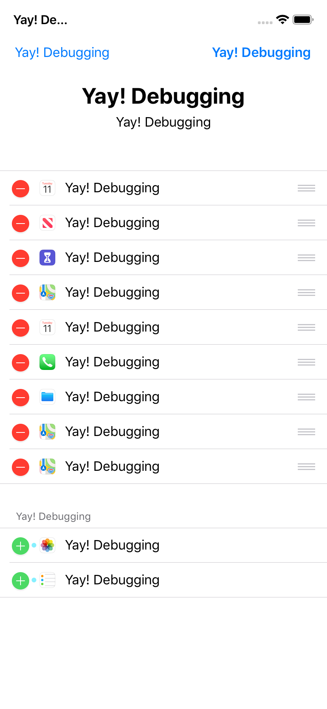

尝试探索其他可能出现模态展示的区域，因为这可能导致新的UIViewController（及其所有子视图）被延迟加载，从而导致命中断点操作。

虽然这看起来像是一个很酷的花招编程技巧，但它提供了一个深入的研究，了解有限的寄存器和汇编知识如何在没有源代码的应用程序中产生巨大作用。

从调试的角度来看，这也很有用，因为您可以快速直观地验证在SpringBoard 应用程序中执行`-[UILabel setText:]`的位置，并运行断点条件以找到设置特定 UILabel’s 文本的确切代码行。

## 寄存器和 SDK

了解寄存器如何工作以及应用程序如何工作可以快速帮助您找到感兴趣的条目。

下面是我在日常 iOS 开发中经常使用的一个例子：通常，我会遇到一个 UIButton，我想知道当我点击它时会发生什么（IBAction 和 receiver）。


**每当执行 IBAction 方法时，它必须通过 UIApplication 单例，在那里它将通过遍历响应链找到正确的 Receiver。为此，将调用UIControl 的` -sendAction:to:forEvent:`。**

我可以在这个方法上设置一个断点，并研究`sendAction:`和`to:`的参数，以找到 IBAction 正在执行的代码。

这个想法可以应用到你做的应用程序上，并且没有源代码。我经常发现使用这种方法更快，即使在我有源代码的应用程序中，然后在一个应用程序（看起来）数千个 IBActions 操作中抓取。

我们将其应用于iOS地图应用程序。我很好奇右上角按钮的名称和接收器，它将地图应用程序集中在用户的坐标位置上。


通过 LLDB 挂载到 Maps 应用程序并为`[UIControl sendAction:to:forEvent:]`设置断点后，很容易找到 UIButton 的名称和 receiver。

`sendAction:`参数（rdx）将存放一个 SEL，而`to:`参数将是IBAction 的 receiver（RCX）。


具体设置参见：[http://junch.github.io/debug/2016/09/19/original-lldb.html](http://junch.github.io/debug/2016/09/19/original-lldb.html)


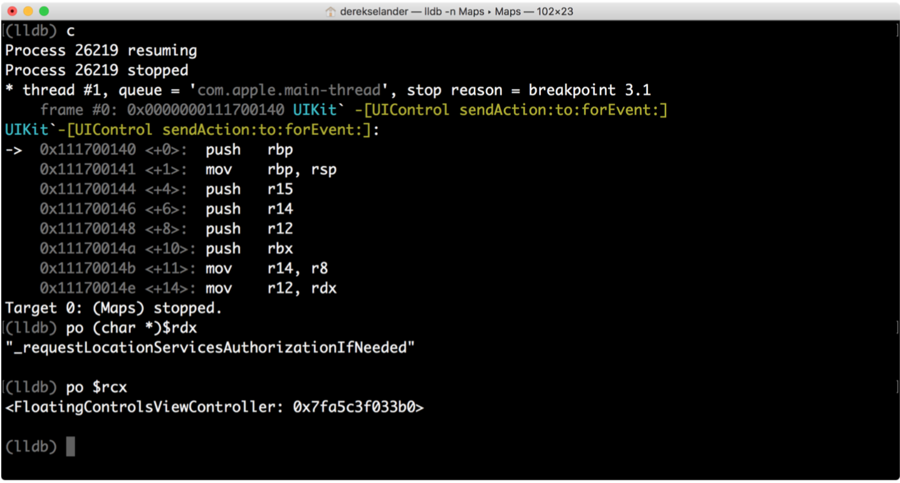


## 何去何从

我们已知：

* 体系架构定义了一个调用约定，该约定指示函数的参数及其返回值存储在哪里。

* 在 Obj-C 中，RDI 寄存器是调用 NSObject 的引用，RSI 是SEL，RDX 是第一个参数，等等。

* 在 Swift 中，RDI 是第一个参数，RSI 是第二个参数等等。前提是 Swift 方法不使用动态调度。

* RAX 寄存器用于储存函数中的返回值，无论您使用的是Obj-C 还是 Swift。

* 确保用`$`打印寄存器时使用的是 Obj-C 上下文。

你可以用寄存器做很多事情。尝试开发你没有源码的应用程序，这很有趣，而且会为解决棘手的调试问题打下良好的基础。

尝试将 LLDB 挂载到 iOS 模拟器上的应用程序，并使用汇编指令集、智能断点和其它命令映射出正显示的 UIViewControllers。


