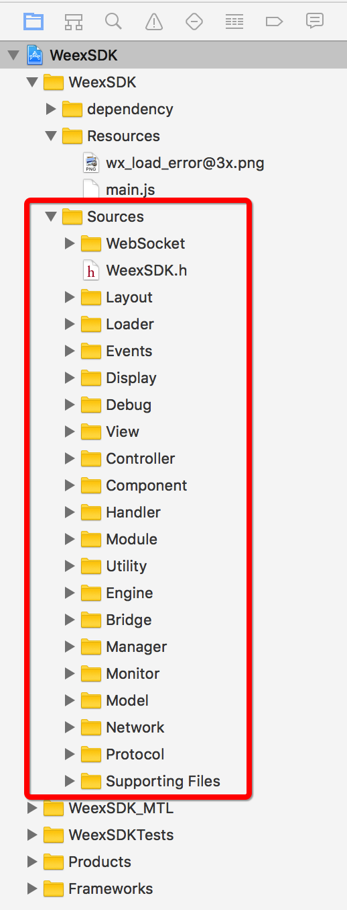

## 初探
### 一、链接
1. 源码地址：[https://github.com/alibaba/weex/tree/dev](https://github.com/alibaba/weex/tree/dev)

### 二、源码结构
1. 版本：0.11
2. 图解WeexSDK

	
	
### 三、结构详解

#### 1. WebSocket：WebSoket实施方案
1. SRWebSocket+Weex：SRWebSocket扩展，添加wx\_Identifier和wx\_WebSocketDelegate属性。
2. WXWebSocketHandler：包含wx\_WebSocketDelegate和WXWebSocketHandler协议方法
3. WXWebSocketDefaultImpl：

	> 1. 实现WXWebSocketHandler协议执行SRWebSoket请求
	> 2. SRWebSocketDelegate中调用wx_WebSocketDelegate的方法，实现自定义回调方法的执行。
	
#### 2. Layout:css与iOS布局映射，并以此扩展WXComponent布局功能
1. WXLayoutDefine:宏定义，所有css相关都添加前缀`wx_`避免冲突。
2. Layout:css_style的c语法实现
3. WXComponent+Layout：针对WXComponent组件布局计算和实施

#### 3. Loader：Socket和Network加载器
1. WXWebSocketLoader：WebSocket加载器,执行open、send、close等。

	> 1. 以`1. WebSocket`中IMP文件执行具体请求,工厂模式获取IMP：
	
	> 	```
	id<WXWebSocketHandler> requestHandler = [WXHandlerFactory handlerForProtocol:@protocol(WXWebSocketHandler)];
	if (requestHandler) {
        [requestHandler send:self.identifier data:data];
    } else {
        WXLogError(@"No resource request handler found!");
    }
	```
	
2. WXResourceLoader：网络请求加载器，执行请求并获取或执行回调

	> 1. 以Network中IMP文件执行具体请求,工厂模式获取IMP：
	
	> 	```
	id<WXResourceRequestHandler> requestHandler = [WXHandlerFactory handlerForProtocol:@protocol(WXResourceRequestHandler)];
    if ([requestHandler respondsToSelector:@selector(cancelRequest:)]) {
        [requestHandler cancelRequest:_request];
    } else if (error) {
        *error = [NSError errorWithDomain:WX_ERROR_DOMAIN code:WX_ERR_CANCEL userInfo:@{NSLocalizedDescriptionKey: @"handle:%@ not respond to cancelRequest"}];
    }
	```
	
#### 4. Events：组件的Event监听
1. WXComponent+Events：

	> 1. UITouch(WXTouchGestureRecognizer):添加wx_identifier属性。
	> 2. UIGestureRecognizer(WXGesture):添加并生成wx_identifier属性
	
	> 	```
	\- (NSNumber *)wx_identifier
{
    NSNumber *identifier = objc_getAssociatedObject(self, _cmd);
    if (!identifier) {
        static NSUInteger _gestureIdentifier;
        identifier = @(_gestureIdentifier++);
        self.wx_identifier = identifier;
    }
    return identifier;
}
	```
	> 3. WXTouchGestureRecognizer:UIGestureRecognizer:监听手势的state，联动Component
	> 4. WXComponent(Events):fireEvent事件添加时间戳以及各种事件
	
#### 5. Display：组件展示相关的扩展文件
1. WXComponent+BoxShadow：组件添加阴影
2. WXInnerLayer : CAGradientLayer：自定义Layer

	> 1. needsDisplayForKey:是否需要重绘Layer
	> 2. actionForKey:重绘时执行对应的动画效果
	> 3. drawInContext:绘制Layer具体content
3. WXDisplayQueue：并行队列，添加并执行队列中的blocks

	```
	+ (dispatch_queue_t)displayQueue
{
    static dispatch_queue_t displayQueue = NULL;
    static dispatch_once_t onceToken;
    dispatch_once(&onceToken, ^{
        displayQueue = dispatch_queue_create("com.taobao.weex.displayQueue", DISPATCH_QUEUE_CONCURRENT);
        dispatch_set_target_queue(displayQueue, dispatch_get_global_queue(DISPATCH_QUEUE_PRIORITY_HIGH, 0));
    });
    
    return displayQueue;
}
	```
	```
	+ (void)addBlock:(void(^)())block
{
    static dispatch_once_t onceToken;
    dispatch_once(&onceToken, ^{
        NSUInteger processorCount = [NSProcessInfo processInfo].activeProcessorCount;
        NSUInteger maxConcurrentCount = processorCount <= MAX_CONCURRENT_COUNT ? processorCount : MAX_CONCURRENT_COUNT;
        WXDisplayConcurrentSemaphore = dispatch_semaphore_create(maxConcurrentCount);
    });
    
    dispatch_async([self displayQueue], ^{
       //信号量使用demo dispatch_semaphore_wait(WXDisplayConcurrentSemaphore, DISPATCH_TIME_FOREVER);
        block();
        dispatch_semaphore_signal(WXDisplayConcurrentSemaphore);
    });
}
	```
4. WXLayer:CALayer子类。更新layer content，即component更新
5. WXComponent (Display)：组件展示，边框绘制等。在displayer中使用并行队列+block实现操作的异步执行（可选）
6. WXRoundedRect：圆角文件
7. UIBezierPath (Weex)：绘制四边圆角

#### 6. Debug：提供js进行debug
1. WXDebugTool：实现WXModuleProtocol协议，即Module功能组件

	> 保存js文件，执行网络请求js和本地bundle js文件
	
#### 7. View：view以及Component管理View文件
1. WXComponent (PseudoClassManagement)：更新以及其它针对pseudoClassStyles的操作。
2. WXView：

	> 1. Layer:WXLayer替换之
	> 2. hitTest:withEvent:子view的touch传递链

3. WXErrorView：加载错误提示view
4. WXComponent (ViewManagement)：

	> 1. loadView:返回WXView供Component管理
	> 2. insertSubView，remove等:即为对应view的操作
	> 3. viewWillLoad,viewDidLoad等各种周期方法
	> 4. viewStyle初始化以及更新重置等
5. WXRootView：引用WXSDKInstance实例，可监听其onLayoutChange事件

#### 8. Controller：模板实例，可做参考
1. WXBaseViewController：创建weex view的Controller模板
2. WXRootViewController：创建weex view的Controllers导航模板，含push、pop等方案。

#### 9. Component：
1. WXComponent：OC-->JS端解析

	> 1. WXCallback&WXKeepAliveCallback:data to JS,以及callback是否移除
	> 2. ref、type、styles、attributes、events、关联的weexInstance、等主要属性
	> 3. Layout:calculatedFrame、cssNode等属性。setNeedsLayout、measureBlock等方法。
	> 4. View Management：view、layer
	> 5. view周期：viewWillLoad->loadView->viewDidLoad->...->viewWillUnload->viewDidUnload
	> 6. Events:fireEvent:params:在JS中发送事件给cpt等
	> 7. styles:updateStyles:操作styles相关
	> 8. Display:setNeedsDisplay&displayBlock等
	> 9. UIView(WXComponent)和CALayer (WXComponent)：关联对应的cpt和ref。
2. 其它基于WXComponent的组件：暂略
3. Recycler：有关循环滚动组件

#### 10. Handler：实现一些功能模块
1. WXNavigationDefaultImpl：navi 样式默认实现

	> 实现WXNavigationProtocol，具体navi由用户来提供。
	> 根据协议传入的配置，定制navi item样式等，并产生回调block
	
2. WXURLRewriteDefaultImpl：

	> 1. 实现WXURLRewriteProtocol，具体rewrite由用户来提供。
	> 2. 针对本地文件添加正确的前缀，并返回
	
#### 11. Module：系统定义的通用Module功能模块
1. 待补充...

#### 12. Utility:工具类
1. 待补充...

#### 13. Engine：
1. WXSDKEngine：

	> 1. registerDefaults:注册默认的Modules、Components、HHandlers
	> 2. registerModule:withClass:注册Module(native+JS)
	> 3. registerComponent:withClass:注册Cpt(native+JS)
	> 4. registerService:withScript:withOptions:注册一段script。(以及解除注册方法)
	> 5.  registerHandler：withProtocol：注册Handlers（K—V：handler-Protocol string）。
	> 6. initSDKEnvironment:初始化sdk全局设置
		
	>		1. main.js：默认js framework加载
	>		2. 注册默认Modules、cpts、handlers
	> 		3. 执行上述js
	>		4. 模拟器配置
	> 7. Debug场景下的设置：unload、restart
	
#### 14. Bridge:
##### 1. WXBridgeMethod：
1. 初始化：methodname、arguments、WXSDKInstance属性
2. 依据target、selector产生NSInvocation（runtime运用详情略）
3. 私有：解析参数类型，转换为正确格式

#### 2. WXModuleMethod：
1. 基于WXBridgeMethod类
2. 添加ModuleName属性
3. invoke：通过基类方法获取modulename&selector对应的NSInvocation，并调用之（区分同异步的情况）。

#### 3. WXComponentMethod：
1. 基于WXBridgeMethod类
2. 添加ref属性
3. invoke：通过基类方法获取cpt&selector对应的NSInvocation，并调用之（在cpt线程之下执行）。

#### 4. WXCallJSMethod：
1. 基于WXBridgeMethod类
2. 添加ModuleName属性
3. 添加callJSTask方法：字典化参数并返回

#### 5. WXDebugLoggerBridge：略

#### 6. WXBridgeContext：
1. WXSDKInstance引用属性
2. createInstance：Native追加入栈insStack；JSCore生成Instance方法。
3. destroyInstance：Native栈中insStack删除此项instance；JSCore销毁Instance方法。
4. refreshInstance：JSCore执行
5. executeJsFramework：JSCore执行JS；执行JSserviceQueue中的js codes；执行methodQueue中的methods；
6. executeJsMethod：js方法执行（JSCore）
7. registerModules&registerComponents：JSCore具体执行细节
8. resetEnvironment：环境重置

#### 7. WXJSCoreBridge：JSCore具体实施文件
1. 通过实现WXBridgeProtocol协议实现规范化
2. JSContext属性
3. init：初始化方法

	> 1. JSContext初始化,初始参数配置

4. 实现WXBridgeProtocol协议方法

	> 1. executeJSFramework:执行JS（默认main.js）
	> 2. callJSMethod:args:执行JS方法
	> 3. registerCallNative:js-->Native的callback注册
	> 4. executeJavascript:执行js脚本
	> 5. registerCallAddElement:
	> 6. registerCallNativeModule:Native Module回调
	> 7. registerCallNativeComponent:Native Cpt回调
	> 8. exception:exception回执
	> 9. resetEnvironment
	
5. WXPolyfillSet：JSExport？方便JS直接调用OC的方法和属性？待研究
6. JSValue (Weex)：根据NSInvocation和JSContext产生对应的JSValue。

#### 15. Manager：
1. WXServiceFactory：将script解析为function(){}()

	> 1. registerServiceScript:注册脚本服务器
	> 2. unregisterServiceScript：取消注册脚本服务器

2. WXInvocationConfig:通过runtime将wx_export_method中公共方法提取出来，映射至同步、异步方法列表中。

	> 1. 属性：name、clazz名称类名，同步异步方法列表、初始化方法，注册方法。
	
3. WXDatePickerManager：时间选择器的封装，统一使用show、hide、update操作即可，不必关注内部实现。实际上属于component。
4. WXSDKManager：管理WXSDKInstances

	> 1. bridgeMgr属性、instanceDict属性存放WXSDKInstance
	> 2. 通过instanceID来增删WXSDKInstance
	
5. WXBridgeManager：管理一个WXBridgeContext属性，管理该context涵盖的js管理方法。

	> 1. WXSDKInstance引用
	> 2. createInstance:在js线程中创建实例方法，调用WXBridgeContext创建js方法
	> 3. 操作instanceID，实现一些控制
	> 4. executeJsFramework:脚本执行
	> 5. registerService&registerModules&registerComponents:
	> 6. fireEvent:
	> 7. callBack:
	
6. WXModuleFactory：处理Modules

	> 1. NSLock:存取map时使用lock案例
	> 2. 针对Module Name给出对应clazz，SEL等
	> 3. 注册Module、method列表更新
	
7. WXHandlerFactory：处理Handles（简单的map存放提取等）

	> 1. registerHandler:注册Handler
	> 2. handlerForProtocol:通过给定Protocol获取相关handler
	> 3. handlerConfigs:获取注册的handlers
	
8. WXComponentManager：操作cpts

	> 1. WXSDKInstance引用
	> 2. 初始化
	> 3. cpt线程获取、开启cpts任务、获取rootview的frame更改
	> 4. cpts root创建、删除cpt，移动获取等
	> 5. 更新cpt的style、attrobutes、事件添加移除等
	> 6. create、refresh、update等周期事件

9. WXComponentFactory：管理cpts，如注册、管理等

10. WXRuleManager：font和iconfont管理

#### 16. Monitor
1. WXMonitor

#### 17. Model
1. WXComponent (Navigation)：获取实现navi协议的navi handler，针对其操作
2. WXSDKInstance_private：将原本WXSDKInstance中的私有方法给提取出来，供外部调用（h文件添加方法名即可）
3. WXSDKInstance：初始化时联动，由WXSDKManager管理。负责执行rootview，view渲染、注册cpt、modules、handler、js执行、Event事件post等。

	> 1. viewCtrl引用、rootview属性、script脚本url
	> 2. parentInstance、parentNodeRef、instanceId，WXState等属性
	> 3. (^onCreate)、^onLayoutChange、^renderFinish等状态回调
	> 4. renderWithURL:weex view 渲染
	> 5. moduleForClass&componentForRef:获取module和cpts
	> 6. 事件相关：fireModuleEvent
4. WXJSExceptionInfo：JS异常信息封装
#### 18. Network
1. WXResourceRequest：基于NSMutableURLRequest，整合参数信息，实现请求。
2. WXResourceRequestHandler：协议文件
3. WXResourceRequestHandlerDefaultImpl：2中协议一个具体实现文件

	> URLSeesion技术、delegates运用
	
4. WXResourceResponse: 基于NSURLResponse，目前实现为空

#### 19. Protocol 
1. WXNavigationProtocol：规范navi的handler，通过WXHandlerFactory注册，使之得以运用在wx内部设置navi的事件中。
2. WXJSExceptionProtocol：js异常handler
3. WXEventModuleProtocol：同时实现WXModuleProtocol协议。module事件handler
4. WXTextComponentProtocol：textCpt
5. WXModuleProtocol：module的规范处理
6. WXBridgeProtocol：js桥接的默认协议
7. WXImgLoaderProtocol：图片加载协议
8. WXScrollerProtocol：scroll协议
9. WXNetworkProtocol：network
10. WXAppMonitorProtocol：appmonitor
11. WXURLRewriteProtocol：urlrewrite


---
1. WXJSCoreBridge：JSCore的直接操作者，实际上只要实现WXBridgeProtocol协议即可。目前包括WXJSCoreBridge和WXDebugLoggerBridge两类。并且两者由WXBridgeContext负责调配。
2. WXSDKEngine


---
1. 根据功能流程，绘制时序图
2. 注意整体库文件的组织结构
3. 从某一功能点：如渲染过程、添加Cpts等切入绘制
4. 组织结构绘制、类图、流程图绘制等
5. 最后综合起来，整体绘制出功能图谱