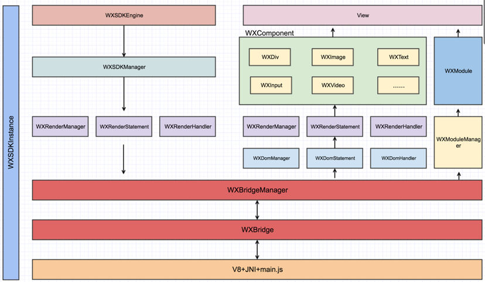

官方文档地址：[工作原理](https://weex.incubator.apache.org/cn/wiki/)

使开发者能基于当代先进的 Web 开发技术，使用同一套代码来构建 Android、iOS 和 Web 应用。

## 解析图谱

整个运行框架包括三大部分：JS Bridge、Render、Dom.
这三大部分都包含在 WXSDKManager 中。WXBridgeManager、WXRenderManager、WXDomManager 都可以通过WXSDKManager 获取。 

JS Bridge：主要用来和 JS Engine（V8）进行双向通信，运行在JSBridge线程中。Weex 的初始化，Component、Module、DomObject的注册与调用，JSBridge 线程管理最终都会由JS Bridge 的管理类 WXBridgeManager 完成。所有和 Dom 相关的操作都会通知到 Dom 线程，交由 WXDomModule 处理。 

Render：主要用来操作具体的Native View，包括管理Native View的各种操作（添加／删除Component，构造Component Tree等）、Native View的布局等，运行在UI线程中。由 WXRenderManager 统一管理，具体操作由 WXRenderStatement 管理，每一个weex instance 一一对应一个 WXRenderStatement。WXRenderStatement 具体就是操作 WXComponent。 

Dom：主要用来操作Dom结构，包括生成对应的Dom Tree，添加／删除Dom 节点（WXDomObject）等操作，运行在独立的 Dom 线程中。由 WXDomManager 统一管理，具体操作由 WXDomStatement 管理，每一个weex instance 一一对应一个 WXDomStatement。WXDomStatement 具体就是操作 WXDomObject。所有的 Dom 操作（包括CSSLayout的计算）都在 Dom 线程中，完成后会通知UI线程处理对应的Native Component View。 