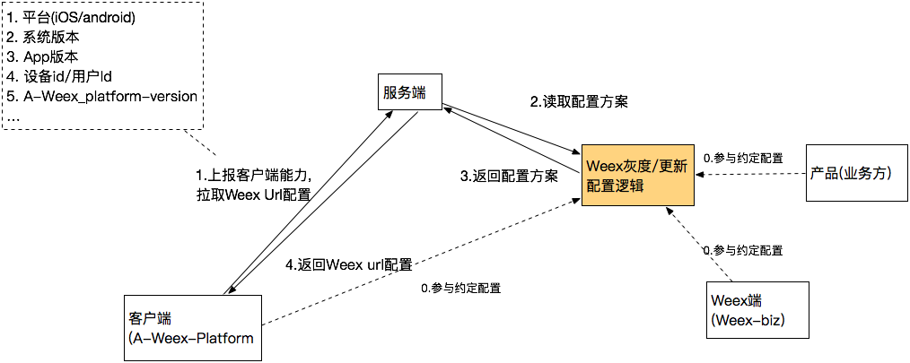
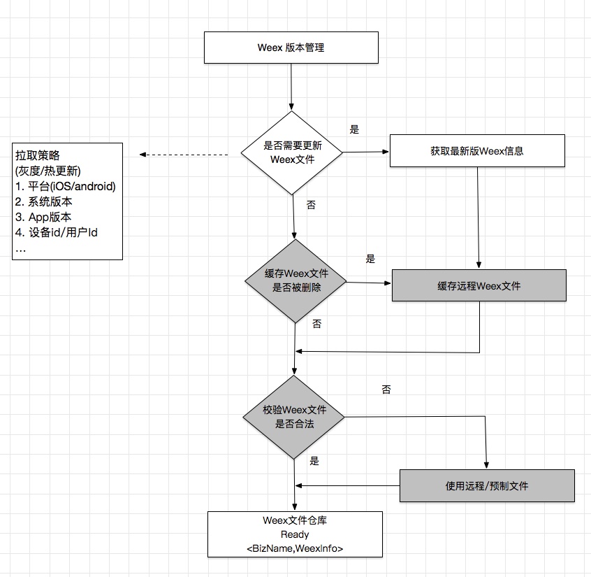
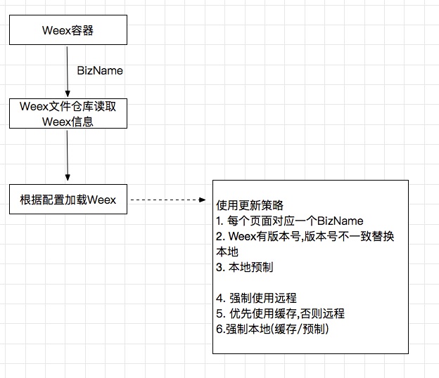
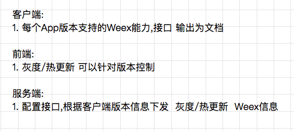

源自weex原理中的简述：

## 云端部署和分发
Weex 的 JS bundle 可以作为一段静态资源进行部署和下发，如同部署和下发 web 页面一样，几乎可以复用 HTML5 所有的工程体系和最佳实践。比如在本地开发环境通过部署工具将 JS bundle 部署到 CDN、通过 CMS 或搭建平台把业务数据和模块化的前端组件自动拼接生成 JS bundle、通过服务端 JS bundle 的流量和日志来统计页面的访问情况、通过 AppCache 或类似的方式对 JS bundle 在客户端进行缓存或预加载以降低网络通信的成本等。

## 版本信息

前端需要根据客户端版本号做降级处理.    

正式
版本: 1.1.0
版本号: 10100 

开发
版本: 1.0.99.build (build随着每次编译是变化的, ios和android可以不一致)
版本号: 10099 

版本号形成规则说明:

1.版本号

正式版本号: x.y.z
开发版本号: x.y.z.build 

版本号中

1. y和z支持两位数, 最大值是99
2. build用来标识每次build, Android目前取得是当前日期 

举例: 

正式版本 1.0.0
开发版本 1.0.99.0405
2. 版本号和VersionCode对应关系

版本号x.y.z.build 中的x.y.z 对version code有影响
Code是 x数值,y数值(两位不足前面补0),z数值(两位不足前面补0)拼接一起.
举例: 

1.0.0 是 1,00,00拼接, 对应的code是 10000
1.0.9 是 1,00,09拼接, 对应的code是 10009
1.10.9 是1,10,09拼接, 对应的code是 11009 
3. 开发版本-正式版本号对应关系

开发版本号 = 正式版本号 减去 1
举例: 

正式版本 1.0.0 -> 开发版本 0.99.99.build
正式版本 1.1.0 -> 开发版本 1.0.99.build

图谱：

