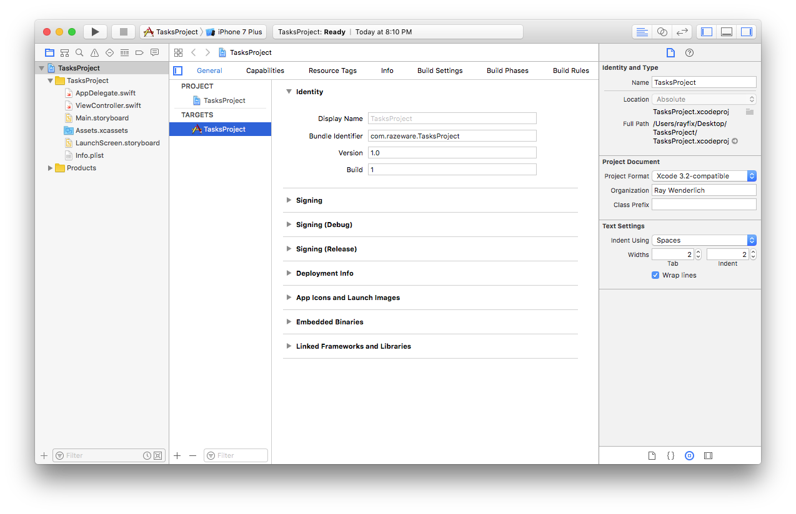

## raywenderlich.com官方Swift规范

**以Swift3为基准更新**

该规范指南可能不同于你所看到过的，因为它将着重聚焦于代码打印和web展示的可读性。

尽管我们有很多作者合作开发教程，但创建该规范，保证了我们书籍、教程、start代码的美观和一致性。

我们的目标即清晰、一致、简洁。

## 正确性

1. 努力保证代码编译无警告。该条规范影响了众多样式规范，诸如使用``#selector``而非字符别名。

## 命名

具有可描述性的、统一的命名方式可提高软件编码易读性。建议使用[ API Design Guidelines](https://swift.org/documentation/api-design-guidelines/)中列出的Swift代码规范。一些要点罗列如下：

1. 努力做到：代码无处不清晰可读。
2. 代码的清晰可读优先级大于简洁。
3. 使用驼峰命名法。
4. 类型（协议）使用大写命名方案（大写驼峰）、小写用于其它情境。
5. 涵盖所需单词而去掉不需要的单词。（额）
6. 基于功能命名，而非类型。
7. 有时会补偿弱类型信息。
8. 流利使用
9. 工厂方法以`make`开头。
10. 方法命名凸现其功能：

	> 1. 动态方法命名辅以`ed`、`ing`规则。（非变异版non-mutating）
	> 2. 名词方法命名辅以`formX `规则。（变异版mutating）
	> 3. 布尔类型需如断言，具有可读性。
	> 4. 协议用以描述事务的，应以名词修饰。
	> 5. 协议用以描述能力功能的，应以`-able`、`-ible`等修饰。
	
11. 使用不会让专家感到意外的术语或混淆初学者。
12. 一般情况下，禁用缩写。
13. 使用名称先例。
14. 优先使用方法和属性，而非函数。（preferring methods and properties to free functions）
15. 外壳首字母缩写词和首字母缩写词统一向上或向下。
16. 给共享相同含义的方法提供相同的基本名称。
17. 避免返回类型的重载。
18. 选择可以充当文档的参数名称。
19. 标记闭包和元组参数。
20. 充分利用默认参数。


## Prose

**在prose区提及方法时，明确性是至关重要的。要引用方法名称，请使用最简单的表单方式。**

1. 书写无参方法名。如：接下来，你需要调用方法：`addTarget `。
2. 书写有参并只含参数名的方法名。如：接下来，你需要调用方法：`addTarget(_:action:) `。
3. 书写完整方法名，含参数名和类型。如：接下来，你需要调用方法：`addTarget(_: Any?, action: Selector?) `。

**上述3种方式，若用在`UIGestureRecognizer `时，推荐使用方法1。**

附：你可以使用Xcode具备的jump bar功能查看具有参数的方法。


## 类前缀

Swift中的类型由包含它们的模块自动进行命名空间配置，不需要人为添加诸如RW之类的类前缀。 如果来自不同模块的两个名称发生冲突，则可以通过在类型名称前加上模块名称来消除歧义。 但是，只有在可能出现混淆时才指定模块名称，这种情况应该很少见。

```
import SomeModule

let myClass = MyModule.UsefulClass()
```

## Delegates委托代理

在创建自定义委托方法时，未命名的第一个参数应该是委托源。 （UIKit包含了很多这样的例子。）

```
//推荐
func namePickerView(_ namePickerView: NamePickerView, didSelectName name: String)
func namePickerViewShouldReload(_ namePickerView: NamePickerView) -> Bool
```

```
//不推荐
func didSelectName(namePicker: NamePickerViewController, name: String)
func namePickerShouldReload() -> Bool
```

## 使用上下文推断类型功能

使用编译器推断上下文的功能来编写较短，清晰的代码。（更多：类型推断Type Inference）

```
//Preferred
let selector = #selector(viewDidLoad)
view.backgroundColor = .red
let toView = context.view(forKey: .to)
let view = UIView(frame: .zero)
```

```
//Not Preferred
let selector = #selector(ViewController.viewDidLoad)
view.backgroundColor = UIColor.red
let toView = context.view(forKey: UITransitionContextViewKey.to)
let view = UIView(frame: CGRect.zero)
```

## 泛型

泛型类型参数应该是可描述性的，大写驼峰命名。 当类型名称没有有意义的关系或角色时，请使用传统的单个大写字母，例如T，U或V.

```
//Preferred

struct Stack<Element> { ... }
func write<Target: OutputStream>(to target: inout Target)
func swap<T>(_ a: inout T, _ b: inout T)
```

```
//Not Preferred

struct Stack<T> { ... }
func write<target: OutputStream>(to target: inout target)
func swap<Thing>(_ a: inout Thing, _ b: inout Thing)
```


## 语言

使用美式英语拼写来匹配Apple的API。

```
//Preferred

let color = "red"
```

```
//Not Preferred

let colour = "red"
```


## 代码组织

使用扩展（extensions）将代码组织到逻辑功能块中。 每个扩展应该用``// MARK标记： - ``注释以保持组织良好。

## 协议一致性

特别是，在向模型添加协议时，最好为协议方法添加一个单独的扩展（extensions）。 这将相关的协议方法分组在一起，并且可以方便将某协议相关的方法添加到类中。

由于编译器不允许您在派生类中重新声明协议一致性，因此并不总是需要复制基类的协议扩展组。 如果派生类是一个最终类，并且需覆盖少数几个方法，则尤其如此。何时保留扩展组由作者决定。

**对于UIKit视图控制器，考虑将生命周期，自定义访问器和IBAction分组在单独的类扩展中。**

```
//Preferred

class MyViewController: UIViewController {
  // class stuff here
}

// MARK: - UITableViewDataSource
extension MyViewController: UITableViewDataSource {
  // table view data source methods
}

// MARK: - UIScrollViewDelegate
extension MyViewController: UIScrollViewDelegate {
  // scroll view delegate methods
}
```

```
//Not Preferred

class MyViewController: UIViewController, UITableViewDataSource, UIScrollViewDelegate {
  // all methods
}
```

## 无用的代码

未使用（死）的代码，包括Xcode模板代码和占位符注释应该被删除。 一个例外情况是，当您的教程或书籍指示用户使用注释代码时。

与实现仅仅调用超类的教程没有直接关联的方法也应该被删除。 这包括任何空的/未使用的UIApplicationDelegate方法。

```
//Preferred

override func tableView(_ tableView: UITableView, numberOfRowsInSection section: Int) -> Int {
  return Database.contacts.count
}
```

```
//Not Preferred

override func didReceiveMemoryWarning() {
  super.didReceiveMemoryWarning()
  // Dispose of any resources that can be recreated.
}

override func numberOfSections(in tableView: UITableView) -> Int {
  // #warning Incomplete implementation, return the number of sections
  return 1
}

override func tableView(_ tableView: UITableView, numberOfRowsInSection section: Int) -> Int {
  // #warning Incomplete implementation, return the number of rows
  return Database.contacts.count
}
```

## 最小化引入模块

保持导入模块最小化。 例如，在导入Foundation时就不要导入UIKit。（不解？？？）


## 空格

* 缩进使用2个空格，而不是制表符来节省空间并有助于防止换行。 请确保在Xcode中和项目设置中设置此首选项，如下所示：

	


* 方法大括号和其他大括号（if / else / switch / while等）始终与语句在同一行打开，但在新行上关闭。
* 提示：可以通过选择一些代码（或`⌘+A`选择全部）,然后`Ctrl+I`（或菜单中的`Editor \ Structure \ Re-Indent`）来重新缩进。 一些Xcode模板代码将会有4个空格的标签硬编码，所以这是解决这个问题的好方法。

```
//Preferred

if user.isHappy {
  // Do something
} else {
  // Do something else
}
```

```
//Not Preferred

if user.isHappy
{
  // Do something
}
else {
  // Do something else
}
```

* 方法之间应该有一条空白线条，以帮助进行视觉清晰度和组织;方法中的空格应该分离功能，但在方法中有太多的部分通常意味着您应该将其重构为若干方法。
* `:`的左侧总是没有空间,右侧有一个空格。 例外是三元操作符？ ：，未命名参数（_ :)的`#selector`语法，空字典[：]。

```
//Preferred

class TestDatabase: Database {
  var data: [String: CGFloat] = ["A": 1.2, "B": 3.2]
}
```

```
//Not Preferred

class TestDatabase : Database {
  var data :[String:CGFloat] = ["A" : 1.2, "B":3.2]
}
```

* 一行代码应包裹大约70个字符。 硬性限制是故意不指定的。
* 避免在行末尾空白。
* 在每个文件的末尾添加一个换行符。


## 注释

需要时，使用注释来解释为什么特定的代码会执行某些操作。注释必须保持最新或删除。

避免注释块代码内嵌于代码内，因为代码应尽可能具备可读性。 例外情况：这不适用于用于生成文档的注释。


## 类和结构体

#### 如何在两者中进行选择，使用哪一个？

* 请记住，结构体具有价值语义(值)。 将结构体用于没有身份的事物。 

	> 包含[a，b，c]的数组与另一个包含[a，b，c]的数组完全相同，并且它们完全可以互换。 无论您使用第一个数组还是第二个数组都没关系，因为它们表示完全相同的东西。 这就是为什么数组是结构体的原因。


* 类具有引用语义（址）。 对具有身份标识或特定生命周期的事物使用类。
	> 你会将一个人建模为一个类，因为两个人对象是两个不同的东西。 仅仅因为两个人有相同的名字和出生日期，并不意味着他们是同一个人。 但是这个人的出生日期可以是一个结构体，因为1950年3月3日的日期与1950年3月3日的任何其他日期对象相同。日期本身没有身份。
	

有时候，应该是结构体，但需要符合AnyObject或者将已经相关模型建模为类了（NSDate，NSSet）。 尽可能严格遵循以下这些准则。


#### 示例：

###### 这是一个风格良好的类定义：

```
class Circle: Shape {
  var x: Int, y: Int
  var radius: Double
  var diameter: Double {
    get {
      return radius * 2
    }
    set {
      radius = newValue / 2
    }
  }

  init(x: Int, y: Int, radius: Double) {
    self.x = x
    self.y = y
    self.radius = radius
  }

  convenience init(x: Int, y: Int, diameter: Double) {
    self.init(x: x, y: y, radius: diameter / 2)
  }

  override func area() -> Double {
    return Double.pi * radius * radius
  }
}

extension Circle: CustomStringConvertible {
  var description: String {
    return "center = \(centerString) area = \(area())"
  }
  private var centerString: String {
    return "(\(x),\(y))"
  }
}
```

###### 上述代码演示了以下样式准则：

1. 指定属性，变量，常量，参数声明和其他语句的类型；在冒号后面有空格但不在之前，例如 x：Int和Circle：Shape。
2. 如果共享一个共同的目的/上下文，则可以在一行上定义多个变量和结构体。如x、y圆心坐标。
3. 缩进getter和setter定义和属性观察者。
4. 无需显式添加默认值，如internal。 同样，重写方法时不要重复访问修饰符。
5. 在扩展中组织额外的功能（例如打印输出）。
6. 一些非共享的实现细节需要隐藏，可使用private修饰符来修饰之。例如在扩展中的centerString。


## self 的使用


为了简洁起见，避免使用self，因为Swift不需要self，即可访问对象的属性或调用其方法。

仅在编译器要求时才使用self（在@escaping闭包中，或者在初始化程序中用于消除参数中的属性歧义）。 换句话说，如果它没有自我编译，那就省略它。


## 计算属性

为简明起见，如果计算属性是只读的，则省略get子句。 get子句仅在提供set子句时才是必需的。

```
//Preferred
var diameter: Double {
  return radius * 2
}
```

```
//Not Preferred
var diameter: Double {
  get {
    return radius * 2
  }
}
```


## Final

将`类`或`类成员`标记为教程中的`Final`选项可能会分散主题，因此不是必需的。 尽管如此，有时使用`Final`选项可以澄清你的意图，并且是值得的。 在下面的示例中，`Box`具有特定用途，其派生类中的定制不是意图所需的。 因此将`Box`标记为`Final`。

```
// 使用此Box类将任何泛型类型转换为引用类型。
final class Box<T> {
  let value: T
  init(_ value: T) {
    self.value = value
  }
}
```


## 函数声明

在一行上保持最短函数声明，包括左括号:

```
func reticulateSplines(spline: [Double]) -> Bool {
  // reticulate code goes here
}
```

对于具有长签名的函数，在适当的点添加换行符并在随后的行上添加一个额外的缩进:

```
func reticulateSplines(spline: [Double], adjustmentFactor: Double,
    translateConstant: Int, comment: String) -> Bool {
  // reticulate code goes here
}
```

## 闭包表达式

1. 只有在参数列表末尾 有一个闭包表达式的参数时 才使用尾随闭包语法。 给出闭包参数的描述性名称。

```
//Preferred
UIView.animate(withDuration: 1.0) {
  self.myView.alpha = 0
}

UIView.animate(withDuration: 1.0, animations: {
  self.myView.alpha = 0
}, completion: { finished in
  self.myView.removeFromSuperview()
})
```

```
//Not Preferred
UIView.animate(withDuration: 1.0, animations: {
  self.myView.alpha = 0
})

UIView.animate(withDuration: 1.0, animations: {
  self.myView.alpha = 0
}) { f in
  self.myView.removeFromSuperview()
}
```


2. 对于上下文清晰的单表达式闭包，使用隐式返回

```
attendeeList.sort { a, b in
  a > b
}
```

3. 使用尾随闭包的链接方法应该清晰易读并且在上下文中易于阅读。 关于间距，换行符以及何时使用命名与匿名参数的决定由作者决定。 例:

```
let value = numbers.map { $0 * 2 }.filter { $0 % 3 == 0 }.index(of: 90)

let value = numbers
  .map {$0 * 2}
  .filter {$0 > 50}
  .map {$0 + 10}
```


## 类型

若可以，始终优先使用Swift的自带类型。 Swift提供了与Objective-C的桥接方案，因此您仍然可以根据需要使用全套方法。

```
//Preferred
let width = 120.0                                    // Double
let widthString = (width as NSNumber).stringValue    // String
```

```
//Not Preferred
let width: NSNumber = 120.0                          // NSNumber
let widthString: NSString = width.stringValue        // NSString
```

在`Sprite Kit`代码中，使用`CGFloat`,以资避免太多转换使代码更加简洁。


## 常量

常量使用let关键字定义，变量使用var关键字来定义。 如果变量的值不会改变，请始终使用let而不是var。

提示：一个好的方法是使用let来定义所有的东西，如果编译器发出抱怨，将它改为var！

您可以使用类型定义常量，而不是在该类型的实例上定义常量。 要将类型属性声明为常量，只需使用static let即可。 以这种方式声明的类型属性通常优于全局常量，因为它们更容易与实例属性区分开来。 例：

```
//Preferred
enum Math {
  static let e = 2.718281828459045235360287
  static let root2 = 1.41421356237309504880168872
}

let hypotenuse = side * Math.root2
```

备注：使用无case枚举的优点是它不会意外地被实例化并作为纯名称空间运行。

```
//Not Preferred
let e = 2.718281828459045235360287  // pollutes global namespace
let root2 = 1.41421356237309504880168872

let hypotenuse = side * root2 // what is root2?
```


## 静态方法和变量类型属性

静态方法和类型属性的工作方式与全局函数和全局变量类似，应该谨慎使用。 当功能范围限定于特定类型或需要与Objective-C进行互操作时，它们非常有用。

## Optionals


将变量和函数返回类型声明为可选的`？`, 那么返回为`nil`可以接受的了。

只有当您知道的变量会在使用前进行初始化，才能使用用`！`声明的隐式解包类型进行对象的解包。例如将在viewDidLoad中设置的子视图。

当访问一个可选值`?`时，如果该值只被访问一次，或者链中有很多可选项`?`，则使用可选的链接：

```
self.textContainer?.textLabel?.setNeedsDisplay()
```

如果打开一次并执行多个操作更方便，请使用可选绑定:

```
if let textContainer = self.textContainer {
  // do many things with textContainer
}
```

命名可选变量和属性时，避免将它们命名为optionalString或mayView，因为它们的可选项已经在类型声明中。

对于可选绑定，在适当的时候使用原始名称，而不要使用像unwrappedView或actualLabel这样的名称。

```
//Preferred
var subview: UIView?
var volume: Double?

// later on...
if let subview = subview, let volume = volume {
  // do something with unwrapped subview and volume
}
```

```
//Not Preferred
var optionalSubview: UIView?
var volume: Double?

if let unwrappedSubview = optionalSubview {
  if let realVolume = volume {
    // do something with unwrappedSubview and realVolume
  }
}
```

## 延迟初始化

考虑使用延迟初始化对对象生命周期进行更精细的纹理控制。 对于延迟加载视图的UIViewController尤其如此。 您可以立即调用{}（）的闭包或调用私有工厂方法。 例：

```
lazy var locationManager: CLLocationManager = self.makeLocationManager()

private func makeLocationManager() -> CLLocationManager {
  let manager = CLLocationManager()
  manager.desiredAccuracy = kCLLocationAccuracyBest
  manager.delegate = self
  manager.requestAlwaysAuthorization()
  return manager
}
```

备注：

* `[unowned self]`此处不是必需的，没有造成循环引用问题。
* Location manager有一个弹出UI的副作用，要求用户获得许可。所以细粒度控制在这里很有意义。


## 类型推断

优先使用紧凑的代码，并让编译器推断单个实例类型（常量的或变量的）。 类型推断也适用于小型（非空）数组和字典。 如果需要，请指定特定类型，例如CGFloat或Int16。

```
//Preferred
let message = "Click the button"
let currentBounds = computeViewBounds()
var names = ["Mic", "Sam", "Christine"]
let maximumWidth: CGFloat = 106.5
```

```
//Not Preferred
let message: String = "Click the button"
let currentBounds: CGRect = computeViewBounds()
let names = [String]()
```

## 为空数组和词典键入类型注释


对于空数组和字典，请使用类型注释。 （对于分配给大型多行文字的数组或字典，请使用类型注释。）

```
//Preferred:
var names: [String] = []
var lookup: [String: Int] = [:]
```

```
//Not Preferred
var names = [String]()
var lookup = [String: Int]()
```

备注：遵循本指南意味着选择描述性名称比以前更重要。


## 语法糖

在整个泛型语法上使用类型声明的快捷版本。

```
//Preferred
var deviceModels: [String]
var employees: [Int: String]
var faxNumber: Int?
```

```
//Not Preferred
var deviceModels: Array<String>
var employees: Dictionary<Int, String>
var faxNumber: Optional<Int>
```

## 函数VS方法

自由函数，不附加到类或类型，应该谨慎使用。 如果可能，倾向于使用方法而不是自由函数。 这有助于可读性和可发现性。

自由函数在与任何特定类型或实例不相关时都是最合适的。

```
//Preferred

let sorted = items.mergeSorted()  // easily discoverable
rocket.launch()  // acts on the model
```

```
//Not Preferred

let sorted = mergeSort(items)  // hard to discover
launch(&rocket)
```

```
Free Function Exceptions

let tuples = zip(a, b)  // feels natural as a free function (symmetry)
let value = max(x, y, z)  // another free function that feels natural
```


## 内存管理

代码（甚至非生产，教程演示代码）不应产生引用循环。 分析您的对象并使用`weak`和`unowned`来防止强引用产生。 或者，使用值类型（结构，枚举）完全防止循环问题产生。


## 延长对象的生存期


使用`[weak self]`和`guardSelf = self else {return}`延长对象的生命周期. `[weak self]`比`[unowned self]`更受青睐，在self超越闭包并不是很明显的情况下， 显式延长寿命优于可选的展开。

```
//Preferred

resource.request().onComplete { [weak self] response in
  guard let strongSelf = self else {
    return
  }
  let model = strongSelf.updateModel(response)
  strongSelf.updateUI(model)
}
```

```
//Not Preferred

// might crash if self is released before response returns
resource.request().onComplete { [unowned self] response in
  let model = self.updateModel(response)
  self.updateUI(model)
}
```

```
//Not Preferred

// 在更新模型和更新UI之间可能会发生释放
resource.request().onComplete { [weak self] response in
  let model = self?.updateModel(response)
  self?.updateUI(model)
}
```


## Access Control

教程中的所有的访问控制会分散主题内容并且不是必需的。 但是，适当使用`private`和`fileprivate`可以增加清晰度并促进封装。 如果可能的话，更倾向于使用`private`而非`fileprivate`。 

使用扩展可能需要您使用`fileprivate`。

只有在需要完整的访问控制规范时才明确地使用`open`，`public`和`internal`。

使用访问控制作为主要属性说明符。 在访问控制之前唯一可添加的指定符是：`static `，或者属性：`@IBAction`、`@IBOutlet`、`@discardableResult`。

```
//Preferred:

private let message = "Great Scott!"

class TimeMachine {  
  fileprivate dynamic lazy var fluxCapacitor = FluxCapacitor()
}
```


```
//Not Preferred:

fileprivate let message = "Great Scott!"

class TimeMachine {  
  lazy dynamic fileprivate var fluxCapacitor = FluxCapacitor()
}
```


## Control Flow


优先使用`for-in`,而非`for`、`while`样式的循环。

```
//Preferred:

for _ in 0..<3 {
  print("Hello three times")
}

for (index, person) in attendeeList.enumerated() {
  print("\(person) is at position #\(index)")
}

for index in stride(from: 0, to: items.count, by: 2) {
  print(index)
}

for index in (0...3).reversed() {
  print(index)
}
```


```
//Not Preferred:

var i = 0
while i < 3 {
  print("Hello three times")
  i += 1
}


var i = 0
while i < attendeeList.count {
  let person = attendeeList[i]
  print("\(person) is at position #\(i)")
  i += 1
}
```

## Golden Path


使用条件编码时，代码的左边距应该是“golden”或“happy”的路径。 也就是说，不要嵌套if语句。多个返回语句都可以。 `guard `声明是为此而构建的。

```
//Preferred:

func computeFFT(context: Context?, inputData: InputData?) throws -> Frequencies {

  guard let context = context else {
    throw FFTError.noContext
  }
  guard let inputData = inputData else {
    throw FFTError.noInputData
  }

  // use context and input to compute the frequencies
  return frequencies
}
```


```
//Not Preferred:

func computeFFT(context: Context?, inputData: InputData?) throws -> Frequencies {

  if let context = context {
    if let inputData = inputData {
      // use context and input to compute the frequencies

      return frequencies
    } else {
      throw FFTError.noInputData
    }
  } else {
    throw FFTError.noContext
  }
}
```

如果有多个选项可以通过`guard let`或`if let`来解包，则尽可能使用复合版本尽量减少嵌套。 例：

```
//Preferred:

guard let number1 = number1,
      let number2 = number2,
      let number3 = number3 else {
  fatalError("impossible")
}
// do something with numbers
```


```
//Not Preferred:

if let number1 = number1 {
  if let number2 = number2 {
    if let number3 = number3 {
      // do something with numbers
    } else {
      fatalError("impossible")
    }
  } else {
    fatalError("impossible")
  }
} else {
  fatalError("impossible")
}
```

## Failing Guards

Guard语句需要以某种方式退出。 通常，这应该是简单的一行语句，如return，throw，break，continue和fatalError（）。 应该避免使用大的代码块。 如果多个退出点需要清理代码，请考虑使用`defer `代码块以避免清理代码重复。


## 分号

Swift在代码中的每个语句后均不强制要求分号。 只有在您希望将多条语句合并到一行时，才需要它们。

不要在一行上用分号分隔写多个语句。

```
//Preferred:

let swift = "not a scripting language"
```

```
//Not Preferred:

let swift = "not a scripting language";
```

备注：Swift与JavaScript非常不同，（JavaScript）忽略分号通常被认为是不安全的。


## 括号 

条件语句周围的括号不是必需的，应该省略。

```
//Preferred:

if name == "Hello" {
  print("World")
}
```

```
//Not Preferred:

if (name == "Hello") {
  print("World")
}
```

在较大的表达式中，可选的括号有时会使代码更清晰。

```
//Preferred:

let playerMark = (player == current ? "X" : "O")
```

## Organization and Bundle Identifier（作为参考）

如果涉及Xcode项目，应将Organization设置为Ray Wenderlich，并将Bundle Identifier设置为com.razeware.TutorialName，其中TutorialName是教程项目的名称。




## Copyright 声明（作为参考）

以下版权声明应包含在每个源文件的顶部：

```
/// Copyright (c) 2018 Razeware LLC
/// 
/// Permission is hereby granted, free of charge, to any person obtaining a copy
/// of this software and associated documentation files (the "Software"), to deal
/// in the Software without restriction, including without limitation the rights
/// to use, copy, modify, merge, publish, distribute, sublicense, and/or sell
/// copies of the Software, and to permit persons to whom the Software is
/// furnished to do so, subject to the following conditions:
/// 
/// The above copyright notice and this permission notice shall be included in
/// all copies or substantial portions of the Software.
/// 
/// Notwithstanding the foregoing, you may not use, copy, modify, merge, publish,
/// distribute, sublicense, create a derivative work, and/or sell copies of the
/// Software in any work that is designed, intended, or marketed for pedagogical or
/// instructional purposes related to programming, coding, application development,
/// or information technology.  Permission for such use, copying, modification,
/// merger, publication, distribution, sublicensing, creation of derivative works,
/// or sale is expressly withheld.
/// 
/// THE SOFTWARE IS PROVIDED "AS IS", WITHOUT WARRANTY OF ANY KIND, EXPRESS OR
/// IMPLIED, INCLUDING BUT NOT LIMITED TO THE WARRANTIES OF MERCHANTABILITY,
/// FITNESS FOR A PARTICULAR PURPOSE AND NONINFRINGEMENT. IN NO EVENT SHALL THE
/// AUTHORS OR COPYRIGHT HOLDERS BE LIABLE FOR ANY CLAIM, DAMAGES OR OTHER
/// LIABILITY, WHETHER IN AN ACTION OF CONTRACT, TORT OR OTHERWISE, ARISING FROM,
/// OUT OF OR IN CONNECTION WITH THE SOFTWARE OR THE USE OR OTHER DEALINGS IN
/// THE SOFTWARE.
```


## 笑脸（参考）

笑脸是raywenderlich.com网站非常突出的风格特征！ 正确的微笑表示编码主题的巨大快乐和兴奋是非常重要的。 因为它代表了使用ASCII艺术可以捕捉到的最大笑容，所以使用了方框括号。 一个右括号）创造一个半心半意的微笑，因此不是优选的。


## 参考链接：

* [The Swift API Design Guidelines](https://swift.org/documentation/api-design-guidelines/)
* [The Swift Programming Language](https://developer.apple.com/library/prerelease/ios/documentation/swift/conceptual/swift_programming_language/index.html)
* [Using Swift with Cocoa and Objective-C](https://developer.apple.com/library/prerelease/ios/documentation/Swift/Conceptual/BuildingCocoaApps/index.html)
* [Swift Standard Library Reference](https://developer.apple.com/library/prerelease/ios/documentation/General/Reference/SwiftStandardLibraryReference/index.html)

